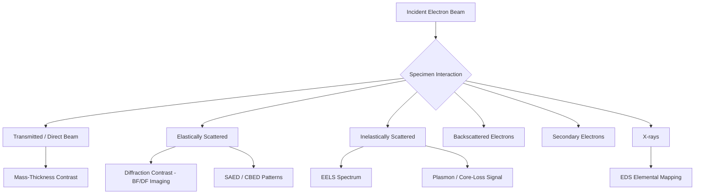

## Transmission Electron Microscopy

### Overview and Physical Principles

Transmission Electron Microscopy (TEM) is a characterization technique in which a high-energy electron beam (typically 80–300 kV) is transmitted through an ultra-thin specimen (generally <100 nm) to form a magnified image based on electron-matter interactions. Because electron wavelengths at these accelerating voltages are on the order of picometers ($\lambda \approx 2.5\text{ pm}$ at 200 kV, accounting for relativistic correction), TEM achieves sub-angstrom resolution in modern instruments, far surpassing the diffraction limit of visible-light microscopy.

The de Broglie wavelength governing resolution is:

$$\lambda = \frac{h}{\sqrt{2m_0eV\left(1 + \frac{eV}{2m_0c^2}\right)}}$$

where $V$ is the accelerating voltage, $m_0$ is electron rest mass, and the term in parentheses is the relativistic correction, significant above ~100 kV.

### Instrumentation

**Electron Gun**

- Thermionic sources (LaB6, W filament): lower brightness, lower cost
- Field emission guns (FEG), cold or Schottky: high brightness, high coherence, essential for high-resolution and analytical work

**Illumination System**

- Condenser lens system (C1, C2) controls beam convergence angle and spot size on the specimen
- Condenser aperture limits beam divergence, improving spatial coherence

**Objective Lens**

- Forms the primary image; the single most important lens for resolution
- Spherical aberration ($C_s$) and chromatic aberration ($C_c$) are the dominant resolution-limiting factors in conventional (non-aberration-corrected) instruments

**Imaging System**

- Intermediate and projector lenses magnify the image or diffraction pattern onto the viewing screen/detector
- Switching between image mode and diffraction mode is achieved by changing the intermediate lens strength (selecting either the image plane or the back focal plane of the objective lens as the object plane for subsequent lenses)

**Detectors**

- Traditional: fluorescent screen with CCD/CMOS camera (fiber-optic or lens-coupled)
- Modern: direct electron detectors (DEDs) with single-electron counting for cryo-EM and low-dose imaging

### Specimen Preparation

Sample thinness is the primary practical constraint in TEM, since electrons must be transmitted through the material.

- **Electropolishing / jet polishing**: for metals and conductive alloys, producing electron-transparent perforations
- **Ion milling (Ar+ ion beam thinning)**: final thinning step for ceramics, semiconductors, and multiphase materials
- **Focused Ion Beam (FIB) lift-out**: site-specific specimen preparation, standard for failure analysis and cross-sectional TEM of device structures; uses a Ga+ (or plasma Xe+) beam to mill a lamella, which is then attached to a grid via micromanipulator
- **Ultramicrotomy**: for polymers, biological, and soft materials, using a diamond knife to cut sections ~50–100 nm thick
- **Powder dispersion**: nanoparticles or powders dispersed onto a carbon-coated Cu grid, often the simplest preparation route

**Key Points**

- FIB introduces Ga+ ion implantation damage and an amorphized surface layer that must be considered when interpreting near-surface microstructure
- Electropolishing avoids mechanical damage but is restricted to conductive, chemically compatible materials
- Specimen thickness must be minimized for high-resolution work but sufficient thickness is needed for statistically meaningful diffraction contrast

### Imaging Modes

**Bright-Field (BF) Imaging**

The direct (unscattered) beam is selected by the objective aperture. Contrast arises from mass-thickness contrast (heavier/thicker regions scatter more electrons, appearing darker) and diffraction contrast (crystalline regions satisfying the Bragg condition scatter strongly out of the aperture, appearing dark).

**Dark-Field (DF) Imaging**

A diffracted beam is selected instead of the direct beam (via aperture shift or beam tilt), highlighting specific crystallographic features such as individual grains, precipitates, or defects that diffract into that specific spot.

**High-Resolution TEM (HRTEM)**

Phase-contrast imaging formed by interference between the direct beam and multiple diffracted beams, resolving crystal lattice fringes and atomic columns. Image interpretation is non-trivial and thickness/defocus dependent, requiring image simulation (e.g., multislice methods) for rigorous interpretation.

**Scanning TEM (STEM)**

A focused probe is rastered across the specimen; signal is collected point-by-point.

- **HAADF-STEM (High-Angle Annular Dark-Field)**: collects electrons scattered to high angles, producing "Z-contrast" images where intensity scales approximately as $Z^{1.7-2}$ (Z = atomic number), enabling direct atomic-number discrimination
- **ABF-STEM (Annular Bright-Field)**: sensitive to light elements (including hydrogen/lithium columns in favorable cases), complementary to HAADF

### Diffraction

**Selected Area Electron Diffraction (SAED)**

An aperture in the image plane selects a region of interest; the diffraction pattern reveals crystal structure, orientation, and phase identification. Single-crystal regions produce spot patterns; polycrystalline regions produce ring patterns; amorphous material produces diffuse halos.

**Convergent Beam Electron Diffraction (CBED)**

Uses a convergent probe, producing diffraction discs rather than spots. CBED patterns contain three-dimensional structural information and can determine crystal point group/space group symmetry and specimen thickness.

Diffraction spot spacing relates to interplanar spacing via the camera equation:

$$R \cdot d = \lambda L$$

where $R$ is the measured distance from the transmitted beam to a diffraction spot, $d$ is the interplanar spacing, $L$ is the camera length, and $\lambda$ is the electron wavelength.

### Analytical TEM: Spectroscopy

**Energy-Dispersive X-ray Spectroscopy (EDS/EDX)**

Detects characteristic X-rays emitted when the electron beam ionizes inner-shell electrons, enabling elemental identification and quantification (typically down to ~0.1–1 at.% depending on element and matrix). Spatial resolution in STEM-EDS mapping can approach the probe size (sub-nanometer on modern instruments), though beam broadening in thicker foils degrades this.

**Electron Energy Loss Spectroscopy (EELS)**

Measures the energy lost by transmitted electrons due to inelastic scattering (plasmon excitation, inner-shell ionization). Provides:

- Elemental composition, including light elements (Li, B, C, N, O) where EDS is weak
- Chemical bonding/oxidation state information via energy-loss near-edge structure (ELNES)
- Specimen thickness measurement via the low-loss/zero-loss ratio ($t/\lambda$ method)

**Key Points**

- EELS requires thinner specimens than EDS for reliable quantification due to plural scattering effects
- EDS is generally more straightforward for quantification in thicker or geometrically complex specimens

### Defect and Microstructural Characterization

TEM is the primary tool for direct imaging of crystallographic defects:

- **Dislocations**: imaged via diffraction contrast under two-beam conditions; Burgers vector determined using the $\mathbf{g} \cdot \mathbf{b} = 0$ invisibility criterion
- **Stacking faults**: produce characteristic fringe contrast in BF/DF images
- **Precipitates and second phases**: identified by combined imaging, SAED, and EDS/EELS
- **Grain boundaries and interfaces**: HRTEM/STEM resolves atomic structure of boundaries, relevant to segregation and boundary engineering
- **Radiation damage**: point defect clusters, dislocation loops, and voids in irradiated materials

### In Situ TEM

Modern holders enable dynamic observation during external stimuli:

- **Heating holders**: in situ phase transformations, sintering, precipitation kinetics
- **Straining holders**: direct observation of dislocation motion and fracture mechanisms
- **Liquid cell holders**: nucleation/growth in liquid environments, battery electrode reactions
- **Gas/environmental cell holders (ETEM)**: catalytic reactions, oxidation/reduction under controlled atmosphere

### Aberration Correction

Spherical aberration correctors (hexapole or quadrupole-octupole based) counteract $C_s$, pushing spatial resolution below 0.5 Å in optimized instruments and improving signal in STEM by allowing smaller, higher-current probes. Chromatic aberration ($C_c$) correctors further improve energy resolution and are particularly valuable for combining with EELS-based spectroscopy at high spatial resolution.

### Comparison: TEM vs. SEM

| Aspect | TEM | SEM |
| --- | --- | --- |
| Signal | Transmitted/diffracted electrons | Secondary/backscattered electrons |
| Resolution | Sub-angstrom (aberration-corrected) | ~1 nm (FEG-SEM) |
| Specimen | Electron-transparent (<100 nm) | Bulk, minimal preparation |
| Information | Internal structure, crystallography, atomic arrangement | Surface topography, composition |
| Preparation complexity | High (thinning required) | Low to moderate |

### Diagram: TEM Column Schematic (svg_diagram)

<svg xmlns="http://www.w3.org/2000/svg" viewBox="0 0 420 520">
\<style\>
.lbl{font-family:sans-serif;font-size:12px;fill:#222;}
.ttl{font-family:sans-serif;font-size:14px;fill:#000;font-weight:bold;}
.el{fill:#cbd5e1;stroke:#334155;stroke-width:1.5;}
.beam{stroke:#2563eb;stroke-width:2;}
\</style\>
<text x="210" y="20" class="ttl" text-anchor="middle">TEM Column (svg_diagram)</text>
<ellipse cx="210" cy="45" rx="18" ry="10" class="el" />
<text x="240" y="50" class="lbl">Electron Gun</text>
<line x1="210" y1="55" x2="210" y2="100" class="beam" />
<rect x="170" y="100" width="80" height="14" class="el" />
<text x="260" y="112" class="lbl">Condenser Lens 1</text>
<line x1="210" y1="114" x2="210" y2="140" class="beam" />
<rect x="170" y="140" width="80" height="14" class="el" />
<text x="260" y="152" class="lbl">Condenser Lens 2</text>
<line x1="210" y1="154" x2="210" y2="180" class="beam" />
<rect x="185" y="180" width="50" height="8" class="el" />
<text x="245" y="188" class="lbl">Condenser Aperture</text>
<line x1="210" y1="188" x2="210" y2="220" class="beam" />
<rect x="160" y="220" width="100" height="12" class="el" />
<text x="265" y="230" class="lbl">Specimen Stage</text>
<line x1="210" y1="232" x2="210" y2="260" class="beam" />
<rect x="170" y="260" width="80" height="16" class="el" />
<text x="260" y="272" class="lbl">Objective Lens</text>
<line x1="210" y1="276" x2="210" y2="300" class="beam" />
<rect x="185" y="300" width="50" height="8" class="el" />
<text x="245" y="308" class="lbl">Objective Aperture</text>
<line x1="210" y1="308" x2="210" y2="340" class="beam" />
<rect x="175" y="340" width="70" height="12" class="el" />
<text x="255" y="350" class="lbl">Intermediate Lens</text>
<line x1="210" y1="352" x2="210" y2="380" class="beam" />
<rect x="175" y="380" width="70" height="12" class="el" />
<text x="255" y="390" class="lbl">Projector Lens</text>
<line x1="210" y1="392" x2="210" y2="430" class="beam" />
<rect x="150" y="430" width="120" height="20" fill="#1e293b" />
<text x="210" y="444" text-anchor="middle" fill="#fff" class="lbl">Screen / Detector (CCD/DED)</text>
</svg>

### Beam-Specimen Interaction Signal Map

### Practical Considerations and Limitations

- **Field of view vs. resolution tradeoff**: atomic resolution imaging captures nanometer-scale fields of view; representative microstructural sampling at lower magnification requires many fields
- **Beam damage**: knock-on displacement damage (dose-dependent, worsens with higher accelerating voltage) and radiolysis (dominant in beam-sensitive materials, e.g., polymers, zeolites, biological specimens) can alter or destroy the structure being imaged
- **Sample statistics**: TEM examines an extremely small volume fraction of bulk material; results should be corroborated with bulk or SEM-scale characterization for statistical representativeness
- **Cost and accessibility**: aberration-corrected and analytical TEM instrumentation represents a significant capital and operational cost, and specimen preparation is often the rate-limiting step in a characterization workflow

**Related Topics**

- Scanning Electron Microscopy (SEM) and EBSD
- Focused Ion Beam (FIB) Sample Preparation
- X-ray Diffraction (XRD) for Bulk Crystallography
- Cryo-Electron Microscopy
- Atom Probe Tomography
- Electron Diffraction Pattern Indexing
- Dislocation Theory and Burgers Vector Analysis
- Precipitation Hardening Mechanisms