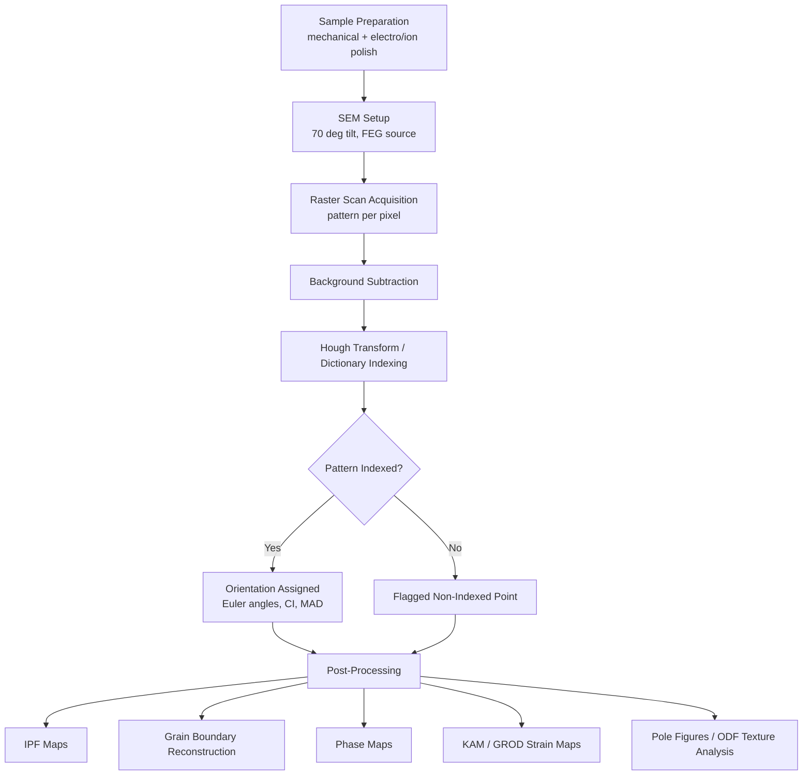

## Electron Backscatter Diffraction

### Overview and Physical Principle

Electron Backscatter Diffraction (EBSD) is a scanning electron microscope (SEM)-based technique that determines the crystallographic orientation of crystalline materials at the microscale to nanoscale. It relies on the diffraction of backscattered electrons that exit a tilted, flat sample surface and strike a phosphor detector, producing a pattern of intersecting bands known as Kikuchi bands.

When a focused electron beam strikes a crystalline sample tilted at a steep angle (typically 70° from horizontal), electrons undergo inelastic scattering that generates a divergent source of electrons within the material near the surface. Some of these electrons satisfy the Bragg diffraction condition,

$$n\lambda = 2d\sin\theta$$

as they encounter lattice planes, producing cones of diffracted electrons (Kossel cones) for each diffracting plane. These cones intersect a phosphor screen as nearly straight lines called Kikuchi bands, because the Bragg angle $\theta$ is very small (typically less than 1°) relative to the cone geometry. The width of each band is inversely related to the interplanar spacing $d$, and the geometric arrangement of bands directly encodes the crystal's orientation relative to the detector.

### Instrumentation

**Key Points**

- **SEM platform**: EBSD is a detector add-on for a conventional SEM, most commonly a field emission gun SEM (FEG-SEM) for the combination of high beam current and small probe size needed for good spatial resolution.
- **Sample stage tilt**: The specimen is tilted to approximately 70° from horizontal to maximize backscattered electron yield toward the phosphor screen and improve pattern contrast.
- **EBSD detector**: Consists of a phosphor screen, a lens system, and a low-light CCD or CMOS camera that captures the diffraction pattern. The screen is retractable and positioned close to the sample to maximize the detector's angular acceptance.
- **Camera speed**: Modern CMOS-based detectors acquire patterns at rates from several hundred to several thousand patterns per second, which enables large-area mapping in practical timeframes.
- **Software indexing pipeline**: Dedicated acquisition software performs background subtraction, band detection (commonly via a Hough or Radon transform), and pattern indexing against candidate crystal structures in real time or near-real time.

### Sample Preparation

Sample preparation is the most common source of poor EBSD data quality, since the diffracting volume originates from only the top 10–50 nm of the surface.

- **Surface requirement**: A near-perfect, deformation-free crystalline surface is required. Any residual mechanical deformation (from cutting, grinding) destroys the local crystal lattice coherence and prevents pattern formation.
- **Standard preparation sequence**: Mechanical grinding with progressively finer abrasive (SiC papers), followed by diamond polishing (down to 1 μm or finer), and finally a chemomechanical or colloidal silica polish (typically 0.02–0.06 μm) to remove the last remnants of the mechanically deformed layer.
- **Electropolishing**: Frequently used for metals as a final step, using an electrolyte-specific process to dissolve the deformed surface layer without introducing new mechanical damage.
- **Ion milling / broad ion beam (BIB) polishing**: Argon ion beam milling is used for materials that are difficult to electropolish (e.g., multiphase alloys, ceramics, geological samples) or for cross-sectional EBSD sample prep.
- **Focused Ion Beam (FIB) prep**: Used for site-specific EBSD, such as characterizing a specific feature identified in a failure analysis, often combined with a protective platinum cap layer to prevent curtaining artifacts.
- **Charging mitigation**: Non-conductive or poorly conductive samples require a thin conductive coating (carbon is preferred over metal coatings, which can obscure Kikuchi bands) or low-vacuum/variable-pressure SEM operation.

### Pattern Indexing and Orientation Determination

**Key Points**

- **Hough transform**: The raw Kikuchi pattern is converted into Hough space, where straight lines (bands) appear as intensity peaks, allowing automated band detection even under moderate noise.
- **Band matching**: Detected bands are compared against a look-up table of interplanar angles for a candidate crystal structure (defined by lattice parameters and space group, provided in a phase file).
- **Orientation output**: A successful match yields the crystal orientation at that point, typically expressed as a set of Euler angles ($\varphi_1, \Phi, \varphi_2$) relating the crystal reference frame to the sample reference frame, or equivalently as a rotation matrix or quaternion.
- **Confidence metrics**: Each indexed point is assigned quality metrics such as Image Quality (IQ), reflecting pattern sharpness/crystal perfection, and Confidence Index (CI) or Mean Angular Deviation (MAD), reflecting the goodness of fit of the indexing solution.
- **Dictionary indexing**: A more recent alternative to Hough-based indexing that directly cross-correlates the raw pattern against a dictionary of simulated patterns, offering improved robustness for deformed or low-quality patterns. [Inference: adoption varies by lab and software vendor, and results can be sensitive to dictionary resolution and simulation fidelity.]

### Data Products and Map Types

EBSD data is collected as a grid (raster) of points across the sample surface, with each point carrying an indexed orientation (or a "non-indexed" flag). This dataset supports several standard map outputs:

- **Orientation (Inverse Pole Figure, IPF) maps**: Color-code each pixel by crystallographic direction parallel to a chosen sample axis (commonly the normal direction), using a standard IPF color triangle/key specific to the crystal symmetry.
- **Phase maps**: Color-code pixels by identified crystal phase, useful for multiphase materials (e.g., ferrite/austenite in duplex stainless steel).
- **Grain boundary maps**: Boundaries are defined by a user-specified minimum misorientation angle threshold between adjacent pixels (commonly 2–5° for subgrain/low-angle boundaries and 15° for the low-angle/high-angle boundary convention).
- **Pole figures and Orientation Distribution Functions (ODFs)**: Statistical representations of crystallographic texture, showing preferred orientation populations across the mapped area.
- **Kernel Average Misorientation (KAM) maps**: Local misorientation between a pixel and its neighbors, used as a proxy for stored (plastic) strain.
- **Grain Reference Orientation Deviation (GROD) maps**: Misorientation of each pixel relative to the average orientation of its parent grain, another strain/deformation indicator.

### Grain and Boundary Analysis

**Key Points**

- **Grain definition**: A "grain" in EBSD post-processing is a contiguous region of points whose mutual misorientation stays below a user-defined threshold (commonly 2–15°), not a physically etched boundary.
- **Misorientation angle**: The minimum rotation angle required to bring two adjacent crystal lattices into coincidence, calculated from the orientation difference between neighboring pixels.
- **Special boundaries**: EBSD can identify coincidence site lattice (CSL) boundaries (e.g., $\Sigma 3$ twin boundaries in FCC metals) via the Brandon criterion, which permits an angular deviation tolerance that scales with $\Sigma^{-1/2}$.
- **Grain size statistics**: Automated grain reconstruction enables direct measurement of grain size distributions, aspect ratios, and grain orientation spread (GOS), often used as an automated recrystallization indicator (low GOS = recrystallized, high GOS = deformed).
- **Texture strength**: Quantified via texture index or the maximum multiple of uniform density (MUD) value from the ODF, describing how strongly grains cluster around preferred orientations relative to a random polycrystal.

### Applications in Materials Science

- **Recrystallization and grain growth studies**: Distinguishing recrystallized, recovered, and deformed grain populations via GOS/KAM thresholds during thermomechanical processing studies.
- **Texture evolution**: Tracking crystallographic texture development during rolling, forging, extrusion, or additive manufacturing solidification.
- **Phase identification and transformation**: Mapping phase distribution and orientation relationships in transformation products (e.g., martensite variant selection from parent austenite, using the Kurdjumov–Sachs or Nishiyama–Wassermann orientation relationships).
- **Deformation and strain mapping**: Using KAM, GROD, or high-resolution EBSD (HR-EBSD) cross-correlation techniques to map local elastic strain and geometrically necessary dislocation (GND) density.
- **Failure analysis**: Correlating fracture paths, cracks, or fatigue striations with grain boundary character and local misorientation.
- **Weldment characterization**: Mapping heat-affected zone microstructure evolution and grain orientation changes across fusion boundaries.

### Comparison with Complementary Techniques

| Technique | Spatial Resolution | Orientation Info | Typical Use Case |
| --- | --- | --- | --- |
| EBSD (SEM-based) | ~20–50 nm (FEG-SEM) | Yes, quantitative | Large-area orientation/phase mapping |
| Transmission Kikuchi Diffraction (TKD) | ~5–10 nm | Yes, quantitative | Nanocrystalline materials, thin foils in SEM |
| Electron diffraction in TEM (SAED/precession) | Sub-nm to nm | Yes, but smaller field of view | Nanoscale defects, precipitates |
| Optical microscopy with etching | ~1 μm | Qualitative (from etch contrast only) | Rapid grain size overview |
| X-ray diffraction (XRD) texture goniometry | Bulk-averaged | Yes, bulk statistical | Macroscopic texture, no spatial map |

### Common Artifacts and Limitations

- **Pseudosymmetry**: Certain crystal structures (e.g., some cubic and hexagonal phases) produce Kikuchi patterns that can be misindexed into a symmetrically related but incorrect orientation, appearing as "orientation noise" clustered around specific misorientation angles (e.g., 60° about $\langle 111 \rangle$ in FCC materials, which can be confused with true $\Sigma 3$ twins).
- **Pattern overlap at grain boundaries**: Interaction volume spanning two grains near a boundary produces mixed/low-quality patterns, causing systematic non-indexing or spurious orientations at boundaries.
- **Surface deformation artifacts**: Poor sample preparation manifests as low IQ values, elevated apparent KAM, and reduced indexing rate, which can be mistaken for genuine microstructural strain. [Inference: distinguishing genuine deformation-induced KAM from preparation-induced noise typically requires comparison against a well-prepared reference region or known strain-free area.]
- **Pattern center calibration**: Incorrect calibration of the pattern center (the geometric relationship between beam, sample, and detector) introduces systematic angular errors across a map, particularly problematic for absolute strain measurements.
- **Beam/sample drift**: Long acquisition times for large or high-resolution maps can be affected by thermal or mechanical drift, distorting map geometry.
- **Angular resolution limits**: Conventional Hough-based EBSD has an angular resolution of roughly 0.5°, insufficient for measuring small elastic strains; HR-EBSD cross-correlation approaches improve this to approximately $10^{-4}$ in elastic strain sensitivity but require higher pattern quality and computational post-processing.

### Illustration: EBSD Pattern Formation Geometry (svg_diagram)

<svg xmlns="http://www.w3.org/2000/svg" viewBox="0 0 700 420">
<text x="350" y="30" text-anchor="middle" font-size="18" font-weight="bold" fill="#222">EBSD Pattern Formation Geometry (svg_diagram)</text>

<rect x="300" y="50" width="40" height="60" fill="#888" stroke="#333" stroke-width="1.5" />
<text x="320" y="45" text-anchor="middle" font-size="12" fill="#333">Electron Beam</text>
<line x1="320" y1="110" x2="320" y2="180" stroke="#0077cc" stroke-width="3" />
<polygon points="313,175 327,175 320,190" fill="#0077cc" />

<g transform="translate(220,190) rotate(-20)">
<rect x="0" y="0" width="200" height="14" fill="#c99" stroke="#822" stroke-width="1.5" />
<text x="100" y="-8" text-anchor="middle" font-size="12" fill="#822">Sample (tilted 70°)</text>
</g>

<circle cx="320" cy="200" r="10" fill="#ffcc00" stroke="#996600" stroke-width="1" />
<text x="345" y="205" font-size="11" fill="#996600">Interaction volume</text>

<path d="M 320 200 L 480 100 A 180 180 0 0 1 600 260 Z" fill="none" stroke="#009966" stroke-width="1.5" stroke-dasharray="4,3" />
<text x="500" y="140" font-size="11" fill="#009966">Kossel cone (diffracted electrons)</text>

<rect x="540" y="90" width="14" height="220" fill="#333" stroke="#000" stroke-width="1.5" />
<text x="547" y="80" text-anchor="middle" font-size="12" fill="#333">Phosphor Screen</text>

<line x1="554" y1="130" x2="554" y2="230" stroke="#00cc44" stroke-width="6" opacity="0.6" />
<text x="575" y="185" font-size="11" fill="#00994d" transform="rotate(90 575 185)">Kikuchi band</text>

<rect x="590" y="150" width="50" height="50" fill="#555" stroke="#222" stroke-width="1.5" />
<text x="615" y="215" text-anchor="middle" font-size="11" fill="#333">CCD/CMOS</text>

<text x="30" y="380" font-size="11" fill="#555">1. Beam strikes tilted sample surface</text>

<text x="30" y="396" font-size="11" fill="#555">2. Electrons diffract off lattice planes forming Kossel cones</text>

<text x="30" y="412" font-size="11" fill="#555">3. Cone intersections with screen form Kikuchi bands, captured by camera</text>

</svg>

### Illustration: EBSD Data Processing Workflow

### Worked Example: Estimating Grain Size from an EBSD Map

Given an EBSD map covering an area of $A = 250{,}000\ \mu m^2$ containing $N = 640$ reconstructed grains (using a 15° high-angle boundary threshold), the mean grain area is:

$$\bar{A}_{grain} = \frac{A}{N} = \frac{250{,}000}{640} \approx 390.6\ \mu m^2$$

Assuming an equivalent circular diameter (ECD) approximation:

$$d_{ECD} = 2\sqrt{\frac{\bar{A}_{grain}}{\pi}} = 2\sqrt{\frac{390.6}{\pi}} \approx 22.3\ \mu m$$

This ECD value can be compared against ASTM E112 grain size numbers or against optical micrograph-derived linear intercept measurements for cross-validation. [Inference: agreement between EBSD-derived ECD and optical linear-intercept grain size depends on the boundary misorientation threshold chosen and etch sensitivity in the optical method, so a direct 1:1 correspondence is not guaranteed.]

### Related Topics

- Transmission Kikuchi Diffraction (TKD) for nanocrystalline materials
- High-Resolution EBSD (HR-EBSD) and cross-correlation strain mapping
- Coincidence Site Lattice (CSL) boundary theory and twin boundary engineering
- Electron channeling contrast imaging (ECCI)
- 3D EBSD via serial sectioning (FIB-SEM tomography)
- Orientation relationships in phase transformations (Kurdjumov–Sachs, Nishiyama–Wassermann, Bain)
- Texture representation: pole figures, ODFs, and Euler space
- Sample preparation techniques for EBSD (electropolishing parameters by alloy system)