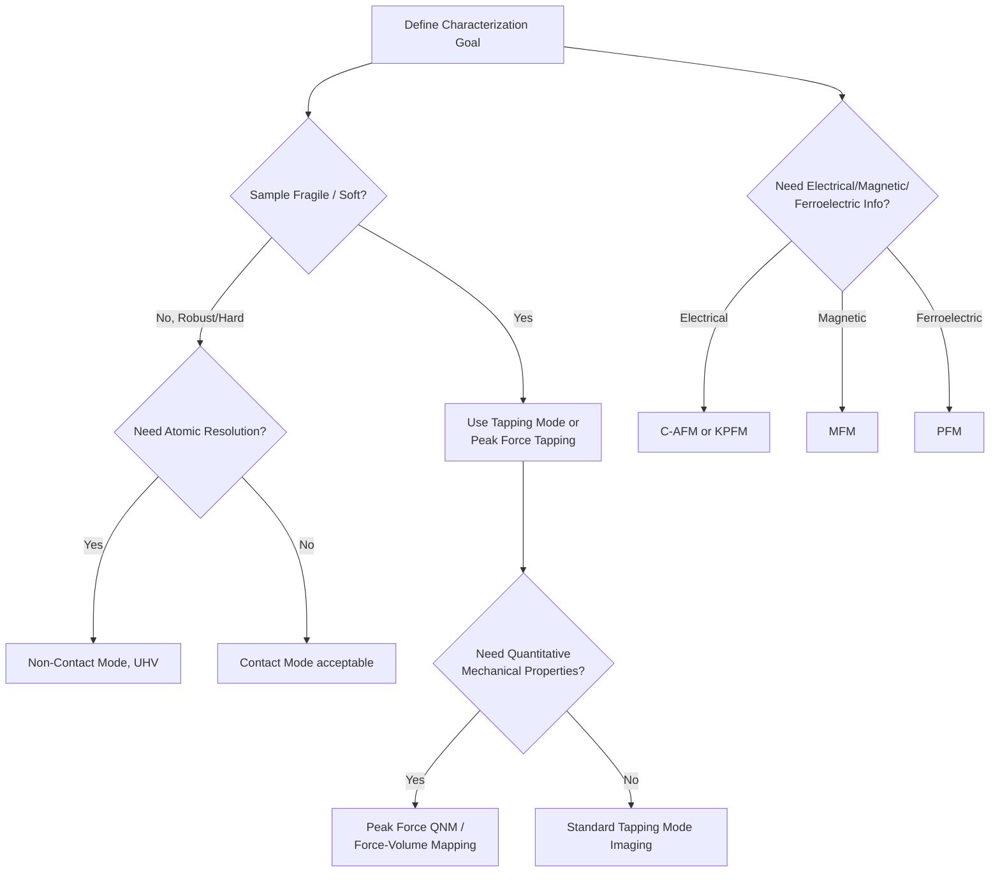

## Atomic Force Microscopy

### Overview and Physical Principle

Atomic Force Microscopy (AFM) is a scanning probe microscopy (SPM) technique that maps surface topography and various physical properties at resolutions ranging from micrometers down to the sub-nanometer/atomic scale. Unlike electron or optical microscopy, AFM does not rely on a lens system or a beam of radiation; instead, it physically raster-scans a sharp probe tip over a sample surface and measures tip-sample interaction forces to reconstruct a three-dimensional image.

The core sensing element is a **cantilever** with a sharp tip (radius typically 2–20 nm) mounted at its free end. As the tip approaches the surface, interatomic forces—Van der Waals forces, electrostatic forces, capillary forces, and short-range chemical bonding forces—cause the cantilever to deflect. This deflection is measured, most commonly via the **optical beam deflection method**, in which a laser is reflected off the back of the cantilever onto a position-sensitive photodiode (typically a four-quadrant detector). Changes in the reflected laser spot position are converted into a deflection signal, which a feedback loop uses to maintain a constant setpoint (force or amplitude) by adjusting the vertical position of the scanner (commonly a piezoelectric tube or stage).

The interaction force $F$ as a function of tip-sample separation $z$ is commonly approximated using a Lennard-Jones-type potential:

$$F(z) = -\frac{A}{6z^2} + B\left(\frac{\sigma^{12}}{z^{13}}\right)$$

where the first term represents long-range attractive Van der Waals forces (with Hamaker constant $A$) and the second represents short-range Pauli/electrostatic repulsion at close approach.

### Instrumentation

**Key Points**

- **Cantilever and tip**: Microfabricated from silicon or silicon nitride, characterized by spring constant $k$ (typically 0.01–100 N/m depending on mode) and resonant frequency $f_0$ (tens of kHz to ~1–2 MHz).
- **Optical lever system**: Laser diode, cantilever back-side reflective coating, and a segmented photodiode detector that converts nanometer-scale cantilever deflection into measurable voltage differences.
- **Piezoelectric scanner**: Provides sub-angstrom precision positioning in X, Y (raster scan) and Z (feedback/topography) directions; may be a tube scanner or a flexure-stage design, with scan ranges typically from a few μm up to ~100–150 μm.
- **Feedback electronics**: A proportional-integral (PI) control loop that adjusts the Z-piezo to maintain a constant deflection (contact mode) or oscillation amplitude/frequency (dynamic modes).
- **Environmental control**: AFM can operate in air, vacuum, or liquid environments without special sample preparation (e.g., conductive coating), unlike SEM/TEM.
- **Closed-loop vs. open-loop scanners**: Closed-loop systems use position sensors (e.g., capacitive or strain gauge) to correct for piezo nonlinearity, hysteresis, and creep, improving positional accuracy for quantitative measurements.

### Operating Modes

**Contact Mode**

The tip remains in continuous mechanical contact with the sample surface (in the repulsive regime of the force curve) while the feedback loop maintains constant cantilever deflection (constant force). Provides high scan speed and resolution on hard, robust samples but risks damaging soft samples (polymers, biological specimens) or dragging loose material, and can wear the tip more rapidly.

**Tapping Mode (Amplitude-Modulated Dynamic Mode / AC Mode)**

The cantilever is oscillated near its resonant frequency $f_0$, and the tip intermittently contacts the surface at the bottom of each oscillation cycle. The feedback loop maintains a constant oscillation amplitude (rather than constant deflection) by adjusting the Z-piezo. This substantially reduces lateral shear forces on the sample compared to contact mode, making it the most widely used general-purpose mode for a broad range of materials, including soft or loosely bound samples.

**Non-Contact Mode**

The cantilever oscillates at small amplitude above the surface entirely within the attractive force regime, with feedback based on shifts in resonant frequency or amplitude caused by the attractive force gradient. Offers minimal sample/tip wear but is more technically demanding and sensitive to the surface adsorbate layer (a thin water/contaminant film present under ambient conditions), and is typically performed under ultra-high vacuum (UHV) for atomic-resolution work.

**Peak Force Tapping / Force-Volume Mapping**

The tip is oscillated at a frequency well below resonance, and a full force-distance curve is recorded at every pixel, with feedback controlled on the peak force of each curve. This enables direct, quantitative mapping of mechanical properties (modulus, adhesion, deformation, dissipation) simultaneously with topography, at controlled and typically very low forces (piconewton to nanonewton range).

### Force Curve Analysis

A force-distance (force spectroscopy) curve records cantilever deflection as the tip approaches and retracts from the surface, providing quantitative mechanical information at a single point:

- **Approach curve**: Shows the tip snapping into contact (jump-to-contact) once attractive gradient forces exceed the cantilever's spring constant, followed by a linear repulsive contact regime.
- **Retract curve**: Typically shows adhesion (pull-off force), where the tip remains stuck to the surface beyond the initial contact point due to adhesive/capillary forces, until the restoring force of the cantilever overcomes adhesion.
- **Elastic modulus extraction**: The contact region of the force curve is fit to a contact mechanics model—commonly Hertz, Derjaguin-Muller-Toporov (DMT), or Johnson-Kendall-Roberts (JKR)—to extract the sample's reduced elastic modulus. The Hertz model for a spherical indenter gives:

$$F = \frac{4}{3}E^{*}\sqrt{R}\,\delta^{3/2}$$

where $E^{*}$ is the reduced modulus, $R$ is the tip radius, and $\delta$ is the indentation depth.

### Quantitative Measurements and Derived Data

**Key Points**

- **Topography**: Primary output; a height map $z(x,y)$ with vertical resolution down to ~0.1 nm and lateral resolution limited chiefly by tip radius and sample feature geometry (tip convolution effects).
- **Roughness parameters**: Standard statistical descriptors computed from the height map, including arithmetic mean roughness $R_a$ and root-mean-square roughness $R_q$ (or $S_a$, $S_q$ for areal analysis per ISO 25178):

$$R_q = \sqrt{\frac{1}{N}\sum_{i=1}^{N}(z_i - \bar{z})^2}$$

- **Phase imaging**: In tapping mode, the phase lag between the drive signal and the cantilever's actual oscillation is recorded simultaneously with topography, providing qualitative contrast related to local variations in viscoelasticity, adhesion, or composition (commonly used to distinguish phases in polymer blends or composites).
- **Mechanical property mapping**: Elastic modulus, adhesion force, and deformation, extracted point-by-point via force-volume or Peak Force Tapping modes.
- **Lateral Force Microscopy (LFM/Friction Mode)**: Measures cantilever torsion caused by lateral (frictional) forces during contact-mode scanning, providing a friction/compositional contrast map.

### Specialized AFM Modes for Materials Characterization

- **Conductive AFM (C-AFM)**: A conductive tip in contact with a biased sample measures local current, mapping electrical conductivity variations at the nanoscale (e.g., grain-to-grain conductivity in polycrystalline semiconductors or oxide films).
- **Kelvin Probe Force Microscopy (KPFM)**: Measures local surface potential/work function differences by nullifying the electrostatic force between tip and sample via an applied DC bias, useful for characterizing corrosion initiation sites, grain boundary potential differences, or dopant distribution.
- **Magnetic Force Microscopy (MFM)**: A magnetized tip detects magnetic force gradients above the sample surface (typically in a two-pass "lift mode," where topography is captured first, then a second pass at constant height senses long-range magnetic forces), used to image domain structures in magnetic materials.
- **Piezoresponse Force Microscopy (PFM)**: An AC voltage applied through a conductive tip induces local piezoelectric/ferroelectric strain, and the resulting cantilever displacement (via the converse piezoelectric effect) maps ferroelectric domain structure and polarization switching.
- **Scanning Thermal Microscopy (SThM)**: Uses a thermally sensitive probe to map local temperature or thermal conductivity variations.
- **Electrochemical AFM (EC-AFM)**: Combines AFM imaging with electrochemical cell control, enabling in-situ observation of corrosion, electrodeposition, and electrode surface evolution during controlled potential/current conditions.

### Sample Preparation

AFM sample preparation is comparatively minimal relative to electron microscopy techniques:

- **Surface requirement**: A relatively flat, clean surface is required; excessive macroscopic roughness (beyond the Z-range of the scanner, commonly a few to ~10–20 μm) cannot be imaged.
- **No conductive coating required**: Unlike SEM, AFM does not require sample conductivity (except for C-AFM, KPFM, or PFM, which require the sample or a thin conductive layer to establish electrical contact/field).
- **Mounting**: Samples are typically mounted flat on a metal disc/stub using conductive adhesive or double-sided tape, ensuring mechanical stability against drift and vibration during scanning.
- **Environment-specific prep**: For liquid-cell AFM (e.g., biological or electrochemical studies), samples must be compatible with immersion; for UHV non-contact work, samples may require in-situ cleaving or sputtering/annealing cycles to achieve atomically clean surfaces.

### Applications in Materials Science

- **Surface roughness and topography characterization**: Quantitative roughness metrics for coatings, thin films, and machined/polished surfaces, often complementing profilometry with much higher lateral resolution.
- **Grain and nanostructure imaging**: Direct 3D visualization of grain morphology, nanoparticle size/shape distributions, and thin-film growth morphology (e.g., island nucleation in epitaxial growth).
- **Corrosion studies**: In-situ or ex-situ tracking of pit initiation, film breakdown, and surface potential heterogeneity (via KPFM) at grain boundaries and inclusions.
- **Polymer and composite characterization**: Phase imaging and modulus mapping to resolve crystalline/amorphous domains, filler dispersion, and interfacial regions in polymer nanocomposites.
- **Thin film and coating mechanical properties**: Local elastic modulus and adhesion mapping via Peak Force QNM (Quantitative NanoMechanics) or force-volume techniques.
- **Semiconductor and electronic materials**: Dopant profiling, local conductivity, and work function mapping via C-AFM and KPFM.
- **Ferroelectric and piezoelectric materials**: Domain structure imaging and switching dynamics via PFM.
- **Nanoindentation cross-validation**: AFM-based nanoindentation (using stiff cantilevers) provides localized hardness/modulus data complementary to conventional nanoindenters, at finer spatial resolution.

### Comparison with Complementary Techniques

| Technique | Lateral Resolution | Vertical Resolution | Environment | Key Distinction |
| --- | --- | --- | --- | --- |
| AFM (Contact/Tapping) | ~1–10 nm | ~0.1 nm | Air, vacuum, liquid | True 3D topography; no vacuum required |
| SEM (Secondary Electron) | ~1–10 nm | Qualitative (shadow contrast) | High/low vacuum | Large depth of field; needs conductive/coated surface |
| Optical Profilometry | ~200–500 nm (diffraction-limited) | ~nm (interferometric) | Ambient | Fast, non-contact, large area |
| STM (Scanning Tunneling Microscopy) | Atomic | Atomic (sub-Å) | UHV, requires conductive sample | Tunneling current, not force-based |
| TEM | Sub-nm to atomic | N/A (2D projection) | High vacuum, thin samples required | Internal structure, not surface topography |

### Common Artifacts and Limitations

- **Tip convolution/dilation**: Because the probe has finite radius and cone angle, imaged features appear broadened and steep/re-entrant sidewalls are inaccurately reproduced; this is especially significant for high-aspect-ratio nanostructures.
- **Tip wear and contamination**: Progressive blunting or picking up of debris during scanning degrades resolution over the course of an image or a scan session, and can introduce streaking artifacts.
- **Scanner nonlinearity, hysteresis, and creep**: Open-loop piezo scanners exhibit non-linear response, particularly at scan edges and after large Z-range changes; closed-loop feedback substantially mitigates this. [Inference: the magnitude of residual distortion depends on the specific scanner design and calibration state, and is not a fixed, universal value.]
- **Thermal drift**: Gradual image distortion over long scan times due to thermal expansion/contraction of the instrument or sample stage.
- **Feedback loop artifacts ("ringing")**: Overshoot or oscillation in the topography signal at sharp step edges if PI gains are set too aggressively, or streaking/blurring if gains are set too conservatively relative to scan speed.
- **Cross-talk between phase and topography**: Rapid topographic changes can produce spurious phase signal artifacts unrelated to true material property variation, requiring careful interpretation.
- **Capillary forces in ambient air**: A thin adsorbed water layer on hydrophilic samples introduces a meniscus force that affects force curve interpretation and can be mitigated by operating in controlled humidity, dry nitrogen, or liquid environments.

### Illustration: AFM Optical Beam Deflection System (svg_diagram)

<svg xmlns="http://www.w3.org/2000/svg" viewBox="0 0 700 400">
<text x="350" y="28" text-anchor="middle" font-size="18" font-weight="bold" fill="#222">AFM Optical Beam Deflection System (svg_diagram)</text>

<rect x="60" y="80" width="50" height="24" fill="#cc3333" stroke="#661111" stroke-width="1.5" />
<text x="85" y="72" text-anchor="middle" font-size="11" fill="#661111">Laser Diode</text>

<line x1="110" y1="92" x2="330" y2="150" stroke="#ff3333" stroke-width="2" />

<g>
<rect x="330" y="145" width="120" height="8" fill="#999" stroke="#444" stroke-width="1.2" />
<polygon points="450,149 465,149 458,175" fill="#666" stroke="#333" stroke-width="1" />
<text x="390" y="135" text-anchor="middle" font-size="11" fill="#444">Cantilever + Tip</text>
</g>

<path d="M 250 220 Q 320 200 400 225 T 550 215" fill="none" stroke="#227722" stroke-width="3" />
<text x="400" y="245" text-anchor="middle" font-size="12" fill="#227722">Sample Surface</text>

<line x1="450" y1="149" x2="580" y2="110" stroke="#ff6666" stroke-width="2" />

<rect x="580" y="80" width="50" height="50" fill="#fff" stroke="#333" stroke-width="1.5" />
<line x1="605" y1="80" x2="605" y2="130" stroke="#333" stroke-width="1" />
<line x1="580" y1="105" x2="630" y2="105" stroke="#333" stroke-width="1" />
<circle cx="600" cy="98" r="4" fill="#ff3333" />
<text x="605" y="70" text-anchor="middle" font-size="11" fill="#333">4-Quadrant Photodiode</text>

<rect x="360" y="250" width="80" height="40" fill="#8888cc" stroke="#333" stroke-width="1.5" />
<text x="400" y="305" text-anchor="middle" font-size="11" fill="#333">Piezoelectric Scanner (X-Y-Z)</text>
<line x1="400" y1="250" x2="400" y2="225" stroke="#333" stroke-width="1" stroke-dasharray="3,2" />

<path d="M 605 130 C 605 340, 440 340, 440 290" fill="none" stroke="#0077cc" stroke-width="1.5" stroke-dasharray="5,3" />
<polygon points="435,285 445,285 440,295" fill="#0077cc" />
<text x="520" y="355" text-anchor="middle" font-size="11" fill="#0077cc">Feedback Loop (Z control)</text>
</svg>

### Illustration: AFM Mode Selection Logic

### Worked Example: Elastic Modulus from a Force Curve (Hertz Model)

Given a spherical AFM tip of radius $R = 20\ nm$ indenting a polymer sample to a depth $\delta = 5\ nm$, with a measured force at that indentation of $F = 15\ nN$, the reduced modulus $E^{*}$ from the Hertz model is:

$$E^{*} = \frac{3F}{4\sqrt{R}\,\delta^{3/2}}$$

Substituting values (in consistent SI units: $R = 20\times10^{-9}\ m$, $\delta = 5\times10^{-9}\ m$, $F = 15\times10^{-9}\ N$):

$$E^{*} = \frac{3 \times 15\times10^{-9}}{4\sqrt{20\times10^{-9}}\,(5\times10^{-9})^{3/2}} \approx 5.3\times10^{8}\ Pa \approx 530\ MPa$$

The true sample modulus $E_{sample}$ is then extracted from $E^{*}$ using the relation $\frac{1}{E^{*}} = \frac{1-\nu_{tip}^2}{E_{tip}} + \frac{1-\nu_{sample}^2}{E_{sample}}$, where $\nu$ denotes Poisson's ratio; for a rigid tip ($E_{tip} \gg E_{sample}$), $E_{sample} \approx E^{*}/(1-\nu_{sample}^2)$. [Inference: this Hertzian approximation assumes a purely elastic, non-adhesive, spherical contact geometry, so results on adhesive or viscoelastic materials require a DMT/JKR correction or a viscoelastic model for accurate quantification.]

### Related Topics

- Contact mechanics models: Hertz, DMT, and JKR frameworks
- Kelvin Probe Force Microscopy for corrosion and semiconductor work function mapping
- Piezoresponse Force Microscopy and ferroelectric domain engineering
- Nanoindentation and instrumented indentation testing
- Scanning Tunneling Microscopy (STM) as a related SPM technique
- Surface roughness standards (ISO 25178 areal parameters)
- In-situ liquid-cell AFM for electrochemistry and biomineralization studies
- Tip characterization and calibration (spring constant calibration methods: thermal tune, Sader method)