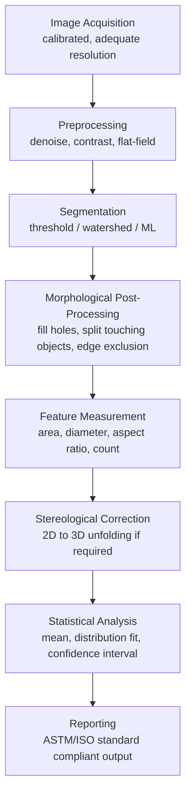

## Image Analysis for Microstructure Quantification

### Overview and Purpose

Image analysis for microstructure quantification is the systematic conversion of micrographs (optical, SEM, TEM, or EBSD-derived) into numerical descriptors of microstructural features—grain size, phase fraction, particle morphology, porosity, and spatial distribution. It transforms qualitative visual inspection into reproducible, statistically defensible data suitable for process control, materials qualification, and structure-property correlation. This discipline sits at the intersection of digital image processing, stereology (inferring 3D structure from 2D sections), and applied statistics.

### Image Acquisition Considerations

**Key Points**

- **Resolution adequacy**: The pixel size must be small enough (typically 5–10 pixels minimum across the smallest feature of interest) to avoid quantization error in size measurements.
- **Field of view vs. magnification trade-off**: Higher magnification improves measurement precision on small features but reduces the statistical sample size (fewer grains/particles per field), requiring more fields to achieve representative statistics.
- **Illumination/contrast uniformity**: Uneven illumination (vignetting, shading) in optical micrographs introduces systematic segmentation bias; flat-field correction is commonly applied to normalize background intensity before thresholding.
- **Calibration**: Every image must carry an accurate scale bar or pixel-to-physical-unit calibration factor (μm/pixel), typically established using a calibrated stage micrometer or known reference structure.
- **Bit depth and dynamic range**: 8-bit (256 gray levels) is standard for most segmentation tasks, though 12–16 bit acquisition preserves more contrast information for scenes with wide intensity ranges (e.g., BSE images with subtle Z-contrast differences).

### Preprocessing Techniques

- **Noise reduction**: Gaussian blur, median filtering, or non-local means denoising suppress acquisition noise while attempting to preserve genuine edge information; filter kernel size must be chosen conservatively to avoid blurring true microstructural boundaries.
- **Contrast enhancement**: Histogram equalization or contrast-limited adaptive histogram equalization (CLAHE) redistributes intensity values to improve feature visibility, particularly useful for low-contrast phase boundaries.
- **Background subtraction / flat-field correction**: Removes illumination gradients by dividing the image by a blank reference (background) image, or by rolling-ball background subtraction algorithms.
- **Sharpening**: Unsharp masking can enhance edge definition prior to segmentation, though aggressive sharpening risks amplifying noise and creating false edges.

### Segmentation Methods

Segmentation—partitioning an image into meaningful regions (phases, grains, particles, background)—is the pivotal step that determines the accuracy of all downstream quantification.

**Global and Adaptive Thresholding**

- **Manual/global thresholding**: A single gray-level cutoff separates foreground from background; simple and fast but sensitive to illumination non-uniformity and operator bias.
- **Otsu's method**: An automated global thresholding algorithm that selects the threshold minimizing intra-class intensity variance (equivalently, maximizing inter-class variance) between two classes, assuming a bimodal histogram.
- **Adaptive (local) thresholding**: Computes a locally varying threshold based on a neighborhood window around each pixel, better handling images with uneven illumination.

**Edge-Based and Region-Based Segmentation**

- **Edge detection**: Sobel, Canny, or Laplacian-of-Gaussian operators identify intensity gradient discontinuities corresponding to grain/phase boundaries, often followed by edge-linking to close incomplete boundaries.
- **Watershed segmentation**: Treats the (often inverted or gradient-transformed) image as a topographic surface and "floods" from local minima, producing closed boundaries useful for separating touching/overlapping particles or grains; commonly preceded by a distance transform and marker-controlled seeding to prevent oversegmentation.
- **Region growing**: Starts from seed points and iteratively merges neighboring pixels meeting a similarity criterion (intensity, texture) into a growing region.

**Machine Learning-Based Segmentation**

- **Pixel classification (Random Forest/trainable classifiers)**: Tools such as Weka Trainable Segmentation or Ilastik use hand-selected training pixels and a feature stack (local intensity statistics, edge filters, texture filters) to classify each pixel via a random forest or similar classifier.
- **Convolutional Neural Networks (CNNs)**: Deep learning architectures such as U-Net perform semantic segmentation trained on labeled micrograph datasets, offering strong performance on complex or low-contrast microstructures once adequately trained, at the cost of requiring substantial labeled training data and computational resources. [Inference: CNN segmentation quality is highly dependent on training set size, diversity, and similarity to the target dataset; generalization to unfamiliar microstructure classes without retraining is not guaranteed.]

### Morphological Post-Processing

After initial segmentation, binary morphological operations refine the mask to remove artifacts and prepare features for measurement:

- **Erosion and dilation**: Shrink or expand foreground regions by a structuring element, used to remove small noise objects (erosion) or close small gaps (dilation).
- **Opening and closing**: Erosion followed by dilation (opening) removes small protrusions and disconnects narrow bridges; dilation followed by erosion (closing) fills small holes and gaps without significantly altering overall feature size.
- **Hole filling**: Fills interior holes within segmented particles/grains that arise from internal contrast variation not representing true porosity.
- **Watershed splitting of touching objects**: Applied specifically to separate agglomerated or touching particles into individually measurable objects, typically via a distance-transform-based watershed.
- **Boundary/edge object exclusion**: Particles or grains intersecting the image frame edge are typically excluded from size statistics (or corrected via stereological edge-effect formulas) since their true size is truncated by the field of view.

### Quantitative Measurements

**Key Points**

- **Area fraction (phase fraction)**: The ratio of segmented feature area to total image area, serving as an unbiased estimator of volume fraction under the stereological principle that $A_A = V_V$ (area fraction equals volume fraction for a random planar section through an isotropic, homogeneous structure).
- **Grain/particle size**: Commonly reported as equivalent circular diameter (ECD), $d_{ECD} = 2\sqrt{A/\pi}$, Feret diameter (maximum caliper distance), or via the linear intercept method (ASTM E112) for grain size number conversion.
- **Aspect ratio and shape factors**: Ratio of major to minor axis of a best-fit ellipse, or circularity $= 4\pi A / P^2$ (where $A$ is area and $P$ is perimeter), quantifying deviation from a perfect circle.
- **Nearest-neighbor distance and spatial distribution**: Statistical descriptors of particle clustering versus dispersion, often compared against a Poisson (random) distribution baseline.
- **Number density**: Count of features per unit area (or per unit volume, via stereological correction), relevant for inclusion ratings, precipitate density, and porosity counts.
- **Perimeter and boundary length**: Used to compute grain boundary density/length per unit area, relevant to boundary-strengthening (Hall-Petch) calculations.

### Stereology and 2D-to-3D Inference

Because polished sections provide only a 2D cross-section through a 3D microstructure, several systematic biases must be corrected for using stereological principles:

- **Area fraction to volume fraction**: $A_A = V_V$ holds without correction for randomly oriented, homogeneously distributed features (Delesse's principle).
- **The "cut effect" / size bias**: A random planar section through a population of 3D particles (e.g., spheres) does not sample particles at their true maximum diameter; most sections through a sphere yield a smaller apparent circle. Unfolding techniques (e.g., the Schwartz-Saltykov method) are used to reconstruct the true 3D size distribution from 2D section diameters.
- **Grain size number (ASTM E112)**: Converts the mean linear intercept length $\bar{L}$ into a standardized grain size number $G$:

$$G = -3.288 + 6.6439\log_{10}(N_L)$$

where $N_L$ is the number of grain boundary intersections per unit test line length.

- **Anisotropic/non-random structures**: Elongated grains (e.g., from rolling) or preferentially oriented precipitates require multiple sections (longitudinal, transverse) or orientation-corrected stereological formulas, since Delesse's principle assumes isotropy.

### Statistical Treatment of Results

- **Sample size adequacy**: Sufficient fields of view and total feature counts (commonly several hundred features minimum per ASTM guidance) are required to achieve acceptable confidence intervals on mean size, area fraction, and distribution parameters.
- **Distribution fitting**: Grain/particle size data is frequently fit to a log-normal distribution (common for grain growth and precipitation processes) rather than assumed normal, given the typically right-skewed nature of size populations.
- **Reporting conventions**: Mean, median, standard deviation, and often the coefficient of variation (CV) are reported alongside the measurement basis (number-weighted vs. area-weighted average, since these can differ substantially for skewed distributions).
- **Uncertainty propagation**: Measurement uncertainty stems from segmentation threshold sensitivity, pixel quantization, and finite sampling; repeat measurements or bootstrap resampling can be used to establish confidence intervals. [Inference: the relative contribution of segmentation-threshold sensitivity versus finite-sampling error depends on the specific microstructure and imaging conditions, so neither source can be assumed dominant without case-specific evaluation.]

### Common Software and Standards

**Key Points**

- **ImageJ/Fiji**: Widely used open-source platform with extensive plugin ecosystem (Trainable Weka Segmentation, particle analysis, stereological plugins) for general-purpose quantitative microscopy.
- **Commercial metallography software**: Purpose-built packages (e.g., from major metallograph/microscope vendors) that implement ASTM/ISO standard routines directly (grain size, inclusion rating, coating thickness, porosity).
- **Python ecosystem**: scikit-image, OpenCV, and SciPy provide programmatic image processing pipelines suited to batch processing, reproducibility, and custom algorithm development; increasingly paired with scikit-learn or deep learning frameworks (PyTorch, TensorFlow) for ML-based segmentation.
- **Relevant standards**: ASTM E112 (grain size by intercept/planimetric methods), ASTM E1245 (inclusion/second-phase constituent rating by image analysis), ASTM E562 (volume fraction by systematic manual point counting), and ISO 13322 (particle size analysis by image analysis).

### Applications in Materials Science

- **Grain size determination**: Automated grain boundary detection and ASTM grain size number computation for process qualification and mechanical property correlation (Hall-Petch relationships).
- **Phase fraction quantification**: Measuring ferrite/pearlite, austenite/martensite, or reinforcement/matrix fractions in steels, cast irons, and composites.
- **Porosity and defect quantification**: Automated counting and sizing of pores in castings, additively manufactured parts, or welds, often correlated with fatigue life or density (percent theoretical density).
- **Inclusion rating**: Standardized inclusion content assessment (e.g., steel cleanliness per ASTM E45/E1245) via automated feature detection and classification by type and size.
- **Precipitate/second-phase characterization**: Size, number density, and spacing of strengthening precipitates (e.g., γ′ in Ni-superalloys, carbides in steels), directly informing precipitation-strengthening models.
- **Coating and case-depth measurement**: Automated thickness measurement of coatings, plating layers, or diffusion case depths from cross-sectional micrographs.
- **Fractography quantification**: Dimple size/density analysis on fracture surfaces to correlate with ductility and fracture mechanism.

### Comparison of Segmentation Approaches

| Method | Strengths | Weaknesses | Typical Use Case |
| --- | --- | --- | --- |
| Global thresholding (Otsu) | Fast, simple, reproducible | Fails on uneven illumination or overlapping intensity distributions | Well-contrasted, bimodal images |
| Adaptive thresholding | Handles illumination gradients | More parameters to tune; can fragment large uniform regions | Uneven-lit optical micrographs |
| Watershed | Separates touching/overlapping objects | Prone to oversegmentation without careful marker control | Clustered particles, grain boundary closure |
| Trainable pixel classifiers (RF) | Handles complex textures; moderate training data needs | Requires manual annotation; feature engineering sensitivity | Multiphase, textured microstructures |
| CNN-based (U-Net, etc.) | High accuracy on complex/low-contrast structures | Large labeled datasets, compute-intensive, generalization risk | Large-scale automated pipelines, complex phases |

### Illustration: Image Analysis Pipeline

### Illustration: Grain Boundary Segmentation Result (svg_diagram)

<svg xmlns="http://www.w3.org/2000/svg" viewBox="0 0 700 380">
<text x="350" y="26" text-anchor="middle" font-size="18" font-weight="bold" fill="#222">Grain Boundary Segmentation Result (svg_diagram)</text>

<rect x="30" y="50" width="290" height="260" fill="#ddd" stroke="#333" stroke-width="1.5" />
<text x="175" y="330" text-anchor="middle" font-size="12" fill="#333">Raw Micrograph (grayscale)</text>
<path d="M30,120 Q100,100 150,130 T320,110" stroke="#999" stroke-width="2" fill="none" />
<path d="M30,200 Q110,180 180,210 T320,190" stroke="#999" stroke-width="2" fill="none" />
<path d="M30,260 Q120,240 200,270 T320,255" stroke="#999" stroke-width="2" fill="none" />
<path d="M100,50 Q120,150 90,310" stroke="#999" stroke-width="2" fill="none" />
<path d="M230,50 Q210,150 250,310" stroke="#999" stroke-width="2" fill="none" />

<line x1="330" y1="180" x2="370" y2="180" stroke="#333" stroke-width="2" />
<polygon points="365,174 365,186 380,180" fill="#333" />
<text x="350" y="165" text-anchor="middle" font-size="11" fill="#333">Segment</text>

<rect x="380" y="50" width="290" height="260" fill="#fff" stroke="#333" stroke-width="1.5" />
<text x="525" y="330" text-anchor="middle" font-size="12" fill="#333">Segmented Grain Map</text>
<path d="M380,120 Q450,100 500,130 T670,110" stroke="#cc2222" stroke-width="2.5" fill="none" />
<path d="M380,200 Q460,180 530,210 T670,190" stroke="#cc2222" stroke-width="2.5" fill="none" />
<path d="M380,260 Q470,240 550,270 T670,255" stroke="#cc2222" stroke-width="2.5" fill="none" />
<path d="M450,50 Q470,150 440,310" stroke="#cc2222" stroke-width="2.5" fill="none" />
<path d="M580,50 Q560,150 600,310" stroke="#cc2222" stroke-width="2.5" fill="none" />
<rect x="382" y="52" width="65" height="65" fill="#ffe6b3" opacity="0.5" />
<rect x="452" y="52" width="125" height="65" fill="#b3d9ff" opacity="0.5" />
<rect x="382" y="122" width="55" height="75" fill="#c6e6b3" opacity="0.5" />
<text x="415" y="90" text-anchor="middle" font-size="10" fill="#555">Grain 1</text>
</svg>

### Worked Example: ASTM Grain Size Number from Intercept Count

A test line of length $L_T = 500\ \mu m$ is overlaid on a micrograph at 100x magnification and intersects $N = 42$ grain boundaries. The number of intersections per unit length (at true sample scale) is:

$$N_L = \frac{N}{L_T} = \frac{42}{500\ \mu m} = 0.084\ \mu m^{-1} = 84\ mm^{-1}$$

Applying the ASTM E112 formula:

$$G = -3.288 + 6.6439\log_{10}(N_L)$$

$$G = -3.288 + 6.6439\log_{10}(84) \approx -3.288 + 6.6439(1.924) \approx 9.5$$

This corresponds to an ASTM grain size number of approximately G ≈ 9.5, indicating a fine-grained microstructure with a mean linear intercept length of roughly 12 μm. [Inference: the precise numerical constants in the ASTM E112 formula are specific to that standard's calibration basis and should be verified against the current edition of the standard before use in formal reporting.]

### Related Topics

- Stereological unfolding methods (Schwartz-Saltykov, Wicksell's corpuscle problem)
- ASTM E112, E1245, E562 standard methodologies
- Machine learning segmentation architectures (U-Net, Mask R-CNN) for microstructure analysis
- Fractal dimension and texture-based microstructure descriptors
- 3D characterization via serial sectioning and X-ray computed tomography
- Correlative microscopy workflows (combining optical, SEM, and EBSD data)
- Digital image correlation (DIC) for strain field measurement
- Automated inclusion rating systems for steel cleanliness assessment