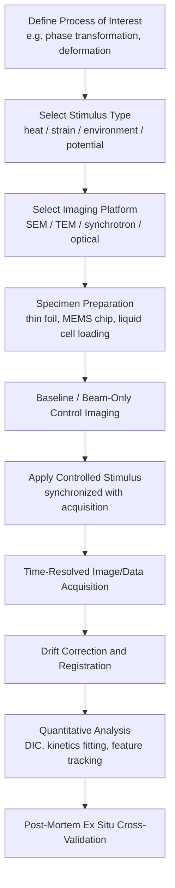

## In Situ Microscopy Techniques

### Overview and Purpose

In situ microscopy encompasses techniques that observe microstructural evolution in real time while a specimen is subjected to a controlled external stimulus—heat, mechanical load, electrochemical potential, gas/liquid environment, or irradiation—inside or in conjunction with the imaging instrument itself. This contrasts with conventional ex situ characterization, where a process is interrupted and the sample is removed, sectioned, and imaged post-mortem at discrete time points. In situ approaches enable direct, temporally resolved observation of dynamic processes such as phase transformation, deformation, crack propagation, sintering, corrosion, and diffusion, capturing transient states and mechanistic pathways that ex situ "snapshot" sampling can miss or misinterpret.

The core value proposition is establishing direct cause-and-effect relationships between an applied stimulus and the resulting microstructural response, at spatial and temporal resolutions matched to the underlying physical mechanism.

### General Requirements and Instrumentation Classes

**Key Points**

- **Specialized sample holders/stages**: The defining hardware element of in situ work—heating stages, straining stages, electrochemical cells, environmental cells, or cooling stages that integrate the stimulus delivery mechanism with the imaging platform's mechanical and vacuum constraints.
- **Compatibility with imaging vacuum/environment**: Techniques requiring high vacuum (SEM, TEM) demand specialized cell designs (e.g., electron-transparent membrane windows) to isolate liquid, gas, or ambient-pressure environments from the microscope column.
- **Temporal resolution vs. spatial resolution trade-off**: Faster dynamic processes require higher frame-rate acquisition, often at the cost of reduced spatial resolution, signal-to-noise ratio, or increased electron/photon dose to the sample.
- **Beam/radiation damage considerations**: Extended observation periods under electron or X-ray beams risk inducing artificial damage (knock-on displacement, radiolysis, heating) that can be mistaken for genuine process-driven microstructural change, requiring dose-controlled or low-dose imaging protocols.
- **Data volume management**: Continuous or high-frame-rate acquisition over extended in situ experiments generates large datasets requiring automated image registration, drift correction, and downstream analysis pipelines.

### In Situ Heating Microscopy

**Key Points**

- **SEM/TEM heating stages**: MEMS-based microheater chips (e.g., silicon nitride membrane heaters) enable rapid, precise, and spatially localized heating (up to 1000–1300°C or higher for some designs) with minimal thermal drift, superseding older furnace-style resistive heating holders.
- **Applications**: Direct observation of grain growth, recrystallization, precipitate dissolution/coarsening (Ostwald ripening), solid-state phase transformations (e.g., martensite reversion, order-disorder transitions), and sintering of powder compacts.
- **Hot-stage optical microscopy**: Lower-resolution but simpler and widely accessible; used for melting point determination, solid-state transformation temperature bracketing, and qualitative grain growth observation at magnifications up to ~1000x.
- **Thermal drift management**: Rapid temperature changes induce specimen and stage thermal expansion, requiring active drift correction (image registration/cross-correlation between frames) to maintain a fixed field of view during dynamic heating experiments.

### In Situ Mechanical Testing (Straining Stages)

- **SEM-based straining stages**: Miniaturized tensile/compression/bending rigs mounted on the SEM stage allow direct correlation of applied load-displacement data with real-time surface strain localization, slip band formation, crack initiation, and crack propagation path.
- **Digital Image Correlation (DIC) integration**: A speckle pattern applied to the sample surface (or a fiducial-tracked natural surface texture) enables full-field strain mapping by cross-correlating sequential images, providing quantitative strain fields correlated with observed microstructural features.
- **TEM in situ straining**: MEMS-based push-to-pull (PTP) devices or specialized straining holders enable direct atomic/dislocation-level observation of deformation mechanisms (dislocation nucleation, motion, interaction with grain boundaries and precipitates) during controlled loading, often synchronized with a piezo actuator for nanometer-scale displacement control.
- **In situ fatigue testing**: Cyclic loading stages combined with periodic or continuous imaging track fatigue crack initiation sites (commonly at inclusions, slip bands, or grain boundaries) and propagation rate as a function of cycle count.
- **In situ nanoindentation (SEM/TEM)**: Combines a nanoindenter tip integrated into the microscope chamber with direct visualization of the indentation event, correlating load-displacement data with observed pop-in events, pile-up, or crack nucleation.

### In Situ Environmental and Electrochemical Microscopy

**Key Points**

- **Environmental SEM (ESEM) / Variable Pressure SEM (VPSEM)**: Permits imaging at elevated chamber pressures (up to several torr) using a gaseous secondary electron detector, enabling observation of hydrated, outgassing, or non-conductive samples without a conductive coating, and supporting controlled humidity or reactive gas environments (oxidation, reduction studies).
- **Environmental TEM (E-TEM)**: Uses differential pumping apertures or closed gas-cell holders with electron-transparent windows to expose the sample to a controlled gas environment at near-ambient pressure while maintaining the high vacuum required in the electron column, enabling atomic-resolution observation of catalytic reactions, oxidation, and reduction processes.
- **Liquid cell TEM/SEM**: Sandwiches a thin liquid layer between electron-transparent membrane windows (commonly silicon nitride), enabling direct observation of processes in a native liquid environment—nanoparticle nucleation/growth, electrodeposition, corrosion, and battery electrode dynamics.
- **In situ electrochemical cells**: Integrate working, counter, and reference electrode configurations within a liquid cell or environmental chamber, enabling direct correlation of applied potential/current with observed microstructural evolution (corrosion pit initiation, dendrite growth in battery electrodes, electrodeposition morphology).
- **Beam-induced artifacts in liquid cell work**: Electron beam radiolysis of the liquid medium (particularly aqueous solutions) can generate reactive species that alter local chemistry, a critical confound requiring careful dose-rate control and appropriate control experiments. [Inference: the extent to which radiolysis products influence observed nucleation/growth behavior depends strongly on the specific liquid chemistry, dose rate, and process under study, so this cannot be treated as a fixed, universally quantifiable correction.]

### Synchrotron and X-ray-Based In Situ Techniques

- **In situ X-ray diffraction (XRD)**: Time-resolved diffraction during heating, cooling, or mechanical loading tracks phase fraction evolution, lattice strain, and texture development, often at synchrotron sources for the high flux and fast acquisition rates needed for kinetic studies.
- **In situ X-ray computed tomography (CT)**: Time-lapse 3D tomographic imaging during mechanical loading or thermal cycling captures internal void/crack evolution, damage accumulation, and fracture path in 3D, particularly valuable for internal defects inaccessible to surface-only techniques.
- **Diffraction Contrast Tomography (DCT) / 3D-XRD**: Synchrotron techniques that reconstruct grain-resolved 3D crystallographic orientation maps and track grain boundary migration, recrystallization, or deformation-induced substructure evolution non-destructively in the bulk.
- **In situ small-angle X-ray scattering (SAXS)**: Tracks nanoscale precipitate/particle size and volume fraction evolution during heat treatment in real time, particularly suited to age-hardening and precipitation kinetics studies.

### Applications in Materials Science

- **Phase transformation kinetics**: Direct observation of nucleation and growth mechanisms, transformation rates, and morphological evolution during solidification, solid-state transformations, or precipitation, enabling direct validation of Johnson-Mehl-Avrami-Kolmogorov (JMAK) kinetic models.
- **Deformation mechanism studies**: Direct visualization of dislocation-obstacle interactions, twinning, shear band formation, and grain boundary sliding as a function of applied stress/strain and temperature.
- **Fracture and fatigue mechanism elucidation**: Real-time observation of crack initiation sites, crack path selection (transgranular vs. intergranular), and crack-tip microstructural interaction.
- **Sintering and powder metallurgy/additive manufacturing process studies**: Direct observation of particle necking, densification, and grain growth during sintering, or melt pool dynamics and solidification microstructure formation during additive manufacturing (via high-speed synchrotron imaging).
- **Corrosion mechanism studies**: Real-time pit initiation and propagation, passive film breakdown, and dealloying observed via liquid cell or environmental techniques.
- **Battery and energy materials research**: In situ/operando observation of electrode microstructural evolution, SEI (solid electrolyte interphase) formation, and dendrite growth during charge/discharge cycling.
- **Catalysis studies**: E-TEM observation of nanoparticle catalyst restructuring, sintering, and active site evolution under reactive gas atmospheres at operating temperatures.

### Comparison of In Situ Platforms

| Platform | Spatial Resolution | Typical Stimulus | Key Advantage | Key Limitation |
| --- | --- | --- | --- | --- |
| In situ SEM (heating/straining) | ~1–10 nm | Heat, mechanical load | Large field of view, surface strain mapping (DIC) | Surface-only information |
| In situ TEM (heating/straining/liquid) | Atomic to ~nm | Heat, mechanical load, liquid environment | Atomic-resolution mechanism observation | Extremely thin samples; strong beam-sample interaction |
| Environmental SEM/TEM | ~nm to atomic | Gas environment, humidity | Native/reactive atmosphere compatibility | Reduced resolution vs. high-vacuum mode |
| In situ synchrotron XRD/CT | Bulk-averaged (XRD) to ~μm (CT) | Heat, mechanical load, atmosphere | Bulk/3D, non-destructive, fast kinetics | Requires synchrotron beamtime access |
| Hot-stage optical microscopy | ~1 μm | Heat | Simple, widely accessible, large field of view | Limited resolution, surface-only |

### Experimental Design Considerations

- **Stimulus rate matching**: The rate of the applied stimulus (heating rate, strain rate) must be matched to the acquisition frame rate and the intrinsic kinetics of the process under study; excessively fast stimulus rates relative to imaging capability will undersample transient events.
- **Representative volume concerns**: The small sample volumes accessible in TEM-based in situ techniques (electron-transparent thin foils, MEMS chip windows) raise questions about whether the observed behavior is representative of bulk material response, particularly for foil thicknesses approaching the scale of the microstructural feature of interest (e.g., grain size).
- **Control/baseline experiments**: Distinguishing genuine stimulus-driven evolution from beam-induced artifacts (heating, damage, radiolysis, charging) requires baseline "beam-only" control observations without the applied stimulus.
- **Post-mortem correlation**: In situ observations are frequently cross-validated against ex situ characterization of the same or comparably processed sample to confirm that microscope-confined conditions did not artificially alter the observed mechanism. [Inference: the degree of correlation required for confident validation is study-specific and depends on the sensitivity of the mechanism under investigation to sample geometry and beam exposure.]

### Illustration: In Situ Experiment Workflow

### Illustration: In Situ TEM Liquid Cell Configuration (svg_diagram)

<svg xmlns="http://www.w3.org/2000/svg" viewBox="0 0 700 380">
<text x="350" y="26" text-anchor="middle" font-size="18" font-weight="bold" fill="#222">In Situ TEM Liquid Cell Configuration (svg_diagram)</text>

<text x="350" y="55" text-anchor="middle" font-size="11" fill="`#0077cc`">Electron Beam</text>

<line x1="350" y1="65" x2="350" y2="110" stroke="`#0077cc`" stroke-width="3" />

<polygon points="343,105 357,105 350,120" fill="`#0077cc`" />

<rect x="250" y="120" width="200" height="18" fill="#999" stroke="#333" stroke-width="1.2" />
<rect x="330" y="120" width="40" height="18" fill="#a3d9a5" stroke="#227722" stroke-width="1" />
<text x="480" y="132" font-size="11" fill="#333">Top chip (SiN membrane window)</text>

<rect x="250" y="138" width="200" height="30" fill="#cde8ff" stroke="#3399cc" stroke-width="1" />
<text x="480" y="158" font-size="11" fill="#3399cc">Liquid layer (electrolyte / solvent)</text>

<circle cx="320" cy="153" r="4" fill="#663300" />
<circle cx="360" cy="150" r="5" fill="#663300" />
<circle cx="390" cy="156" r="3" fill="#663300" />

<rect x="250" y="168" width="200" height="30" fill="#cde8ff" stroke="#3399cc" stroke-width="1" opacity="0" />
<rect x="250" y="168" width="200" height="18" fill="#999" stroke="#333" stroke-width="1.2" />
<rect x="330" y="168" width="40" height="18" fill="#a3d9a5" stroke="#227722" stroke-width="1" />
<text x="480" y="180" font-size="11" fill="#333">Bottom chip (SiN membrane window)</text>

<line x1="270" y1="138" x2="270" y2="186" stroke="#cc2222" stroke-width="2.5" />
<text x="270" y="205" text-anchor="middle" font-size="10" fill="#cc2222">Working electrode</text>
<line x1="430" y1="138" x2="430" y2="186" stroke="#666666" stroke-width="2.5" />
<text x="430" y="222" text-anchor="middle" font-size="10" fill="#666">Counter electrode</text>

<line x1="350" y1="198" x2="350" y2="250" stroke="#0077cc" stroke-width="3" stroke-dasharray="4,3" />
<text x="350" y="270" text-anchor="middle" font-size="11" fill="#0077cc">Transmitted electrons to camera</text>

<rect x="200" y="100" width="300" height="120" fill="none" stroke="#333" stroke-width="1" stroke-dasharray="3,2" />
<text x="350" y="345" text-anchor="middle" font-size="11" fill="#333">Sealed liquid cell holder body (vacuum-isolating)</text>
</svg>

### Worked Example: Frame Rate Requirement for Observing a Dynamic Process

A grain boundary is observed migrating at an estimated velocity of $v = 0.5\ \mu m/s$ during an in situ annealing experiment. To resolve the migration with a minimum of 5 distinct position samples per micrometer of travel (to adequately capture the migration trajectory), the required frame interval $\Delta t$ is:

$$\Delta t \leq \frac{1}{5v} = \frac{1}{5 \times 0.5\ \mu m/s} = 0.4\ s/\mu m^{-1}\text{ per sample interval}$$

More directly, for 5 samples per micrometer of boundary displacement:

$$\Delta t \leq \frac{1\ \mu m / 5}{v} = \frac{0.2\ \mu m}{0.5\ \mu m/s} = 0.4\ s$$

This implies a minimum frame rate of $1/\Delta t = 2.5\ fps$. In practice, a safety margin (commonly 2–5x) is applied to account for velocity variability during the experiment, suggesting a target acquisition rate of roughly 5–12 fps for this specific migration rate. [Inference: the appropriate safety margin is dependent on how uniform the migration rate is expected to be over the observation window, which is process- and material-specific.]

### Related Topics

- Johnson-Mehl-Avrami-Kolmogorov (JMAK) transformation kinetics modeling
- Digital Image Correlation (DIC) for full-field strain measurement
- MEMS-based heating and straining chip technology
- Synchrotron 3D-XRD and Diffraction Contrast Tomography (DCT)
- Radiolysis effects and dose-rate control in liquid cell electron microscopy
- Operando characterization methods for battery and catalysis research
- Representative volume element (RVE) considerations in thin-foil TEM studies
- Correlative in situ/ex situ characterization workflow design