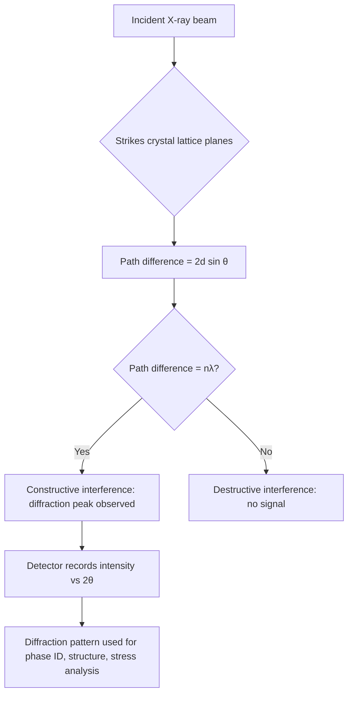
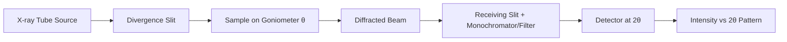

## Principles of X-Ray Diffraction

### Introduction and Physical Basis

X-ray diffraction (XRD) is a non-destructive analytical technique used to determine the crystallographic structure, phase composition, crystallite size, and residual stress of crystalline materials. The technique exploits the wave nature of X-rays and their interaction with the periodic atomic arrangement in crystals.

X-rays used for diffraction typically have wavelengths in the range of 0.5–2.5 Å, comparable to interatomic spacing in crystals (~1–3 Å). This similarity in scale is what makes diffraction phenomena observable, analogous to how visible light diffracts through a grating with spacings on the order of the light's wavelength.

### Generation of X-Rays

**Key Points**

- X-rays for laboratory diffraction are typically generated in a sealed X-ray tube.
- A tungsten filament (cathode) is heated to emit electrons via thermionic emission.
- Electrons are accelerated through a high voltage (typically 20–50 kV) toward a metal target (anode), commonly copper (Cu), cobalt (Co), or molybdenum (Mo).
- Two types of radiation result from electron-target interaction:
  - **Bremsstrahlung (continuous spectrum)**: produced when electrons decelerate in the target's electric field, emitting a continuous range of photon energies.
  - **Characteristic radiation (line spectrum)**: produced when incident electrons eject inner-shell (K-shell) electrons from target atoms; outer-shell electrons (L or M shell) fall in to fill the vacancy, emitting a photon of sharply defined energy corresponding to the energy difference between shells.

The characteristic lines relevant to diffraction are:

- $K_{\alpha}$: transition from L-shell to K-shell (further split into $K_{\alpha1}$ and $K_{\alpha2}$ due to slightly different L sub-shell energies)
- $K_{\beta}$: transition from M-shell to K-shell

For Cu targets, $K_{\alpha}$ radiation has a weighted average wavelength of approximately 1.5418 Å, the most commonly used wavelength in laboratory XRD. A $\beta$-filter (commonly nickel foil for Cu radiation) or a monochromator is used to suppress the $K_{\beta}$ line, since a monochromatic beam is required for unambiguous diffraction analysis.

### Bragg's Law

The foundational relationship governing diffraction is Bragg's Law, formulated by W.H. Bragg and W.L. Bragg in 1913. It treats diffraction as if X-rays are "reflected" from parallel planes of atoms (lattice planes), with constructive interference occurring only when the path difference between waves reflected from successive planes equals an integer number of wavelengths.

$$n\lambda = 2d\sin\theta$$

Where:

- $n$ = order of reflection (a positive integer, usually taken as 1 by absorbing higher orders into the plane indexing)
- $\lambda$ = wavelength of incident X-rays
- $d$ = interplanar spacing between the set of parallel lattice planes (hkl)
- $\theta$ = angle of incidence (and reflection) measured from the plane, known as the Bragg angle

**Derivation logic**: Consider two parallel atomic planes separated by spacing $d$. An incident beam strikes both planes at angle $\theta$. The wave reflecting from the lower plane travels an extra path length equal to $2d\sin\theta$ compared to the wave reflecting from the upper plane. Constructive interference (a detectable diffracted beam) occurs only when this path difference is an integer multiple of $\lambda$; otherwise, destructive interference cancels the signal.

Bragg's Law imposes a strict geometric condition: for a given $d$-spacing and wavelength $\lambda$, diffraction (a peak) is only observed at one specific angle $\theta$. This is the basis for using XRD to determine unknown $d$-spacings from measured angles, since $\lambda$ is known and $\theta$ is measured experimentally.

### Interplanar Spacing and Crystal Systems

The value of $d$ depends on the crystal system and the Miller indices $(hkl)$ of the diffracting plane. For a **cubic system**:

$$d_{hkl} = \frac{a}{\sqrt{h^2+k^2+l^2}}$$

where $a$ is the cubic lattice parameter. Combining this with Bragg's Law for cubic crystals gives:

$$\sin^2\theta = \frac{\lambda^2}{4a^2}(h^2+k^2+l^2)$$

This relationship allows indexing of diffraction peaks (assigning $hkl$ values) purely from the ratios of $\sin^2\theta$ values, which is a standard method for phase identification in cubic metals (e.g., distinguishing FCC austenite from BCC ferrite).

For non-cubic systems (tetragonal, orthorhombic, hexagonal, monoclinic, triclinic), the $d$-spacing formulas are more complex and involve multiple lattice parameters ($a$, $b$, $c$) and angles ($\alpha$, $\beta$, $\gamma$).

### The Reciprocal Lattice and Diffraction Condition

A more rigorous treatment of diffraction uses the **reciprocal lattice** and the **Laue condition**, which is mathematically equivalent to Bragg's Law but more general and better suited to describing diffraction in terms of scattering vectors.

The scattering (or momentum transfer) vector is defined as:

$$\vec{Q} = \vec{k}_{out} - \vec{k}_{in}$$

Diffraction occurs when $\vec{Q}$ coincides with a reciprocal lattice vector $\vec{G}_{hkl}$. This is the **Laue condition**, and it is visualized geometrically using the **Ewald sphere construction**: a sphere of radius $1/\lambda$ constructed in reciprocal space; diffraction occurs whenever a reciprocal lattice point intersects the surface of this sphere.

### Structure Factor and Diffraction Intensity

While Bragg's Law predicts the **angles** at which diffraction can occur, it does not predict the **intensity** of a given reflection. Intensity is governed by the **structure factor**, $F_{hkl}$, which accounts for the arrangement and scattering power of atoms within the unit cell:

$$F_{hkl} = \sum_{j=1}^{N} f_j \, e^{2\pi i (h x_j + k y_j + l z_j)}$$

Where:

- $f_j$ = atomic scattering factor of atom $j$ (dependent on atomic number and scattering angle)
- $(x_j, y_j, z_j)$ = fractional coordinates of atom $j$ within the unit cell
- Sum is taken over all atoms $N$ in the unit cell

The measured diffracted intensity is proportional to $|F_{hkl}|^2$.

**Systematic absences**: For certain crystal structures, the structure factor becomes zero for specific $(hkl)$ combinations, causing those reflections to vanish entirely. These absences are diagnostic of lattice centering:

- **BCC lattices**: reflections are absent unless $h+k+l$ = even
- **FCC lattices**: reflections are absent unless $h, k, l$ are all even or all odd

This is a key practical tool in metallurgy: the pattern of allowed/forbidden reflections directly reveals whether an unknown metal or alloy phase is BCC, FCC, or HCP.

### Other Factors Affecting Peak Intensity

**Key Points**

- **Multiplicity factor ($p$)**: number of equivalent $(hkl)$ planes with the same $d$-spacing; higher multiplicity increases integrated intensity.
- **Lorentz-polarization factor**: a geometric/angular correction combining polarization of scattered X-rays with the diffraction geometry, angle-dependent.
- **Temperature factor (Debye-Waller factor)**: accounts for thermal vibration of atoms, which reduces intensity (especially at high $2\theta$) and slightly modifies effective atomic scattering.
- **Absorption factor**: depends on sample geometry and linear absorption coefficient of the material.

### Instrumentation Overview

A typical laboratory diffractometer (Bragg-Brentano geometry) consists of:

1. **X-ray source**: sealed tube or rotating anode generator
2. **Divergence slit**: controls the beam divergence hitting the sample
3. **Sample stage**: goniometer that rotates the sample by $\theta$ while the detector rotates by $2\theta$ (coupled $\theta$–$2\theta$ scan)
4. **Receiving slit and monochromator/filter**: removes $K_{\beta}$ and fluorescent radiation
5. **Detector**: scintillation counter, position-sensitive detector, or modern solid-state (silicon strip) detectors that record intensity vs. angle

### The Diffraction Pattern

The output of an XRD experiment is a plot of diffracted intensity versus $2\theta$ (the diffraction angle, since both incident and diffracted beams deviate from the transmitted direction by $\theta$ each). Each peak corresponds to a specific $(hkl)$ reflection satisfying Bragg's Law for the given wavelength.

**Example**

For $\alpha$-iron (BCC, $a = 2.866$ Å) using Cu $K_{\alpha}$ radiation ($\lambda = 1.5418$ Å), the (110) reflection:

$$d_{110} = \frac{2.866}{\sqrt{1^2+1^2+0^2}} = 2.027 \text{ Å}$$

$$\sin\theta = \frac{\lambda}{2d} = \frac{1.5418}{2(2.027)} = 0.3804 \Rightarrow \theta \approx 22.36^\circ \Rightarrow 2\theta \approx 44.7^\circ$$

This matches the well-known $\alpha$-Fe (110) peak position observed experimentally near $2\theta \approx 44.7^\circ$ with Cu $K_{\alpha}$ radiation.

### Applications in Materials Science and Metallurgy

- **Phase identification**: comparing measured $d$-spacings and relative intensities against reference databases (e.g., ICDD/PDF cards) to identify crystalline phases present.
- **Quantitative phase analysis**: using integrated peak intensities (e.g., Rietveld refinement) to determine phase fractions, such as retained austenite content in heat-treated steels.
- **Lattice parameter determination**: precise measurement of peak positions, especially at high $2\theta$ where sensitivity to $d$-spacing is greatest.
- **Crystallite size and microstrain**: peak broadening analysis via the Scherrer equation, $\tau = \dfrac{K\lambda}{\beta\cos\theta}$, where $\tau$ is mean crystallite size, $K$ is a shape factor (~0.9), and $\beta$ is the peak's full width at half maximum (FWHM) in radians. [Inference: this simplified form neglects instrumental broadening, which must be deconvoluted for accurate results.]
- **Residual stress measurement**: using the $\sin^2\psi$ method, correlating shifts in peak position with applied/residual strain in the lattice.
- **Texture (preferred orientation) analysis**: via pole figures, revealing non-random crystallographic orientation distributions from rolling, forging, or other deformation processing.

### Limitations and Practical Considerations

- XRD is primarily sensitive to **crystalline** phases; amorphous materials produce broad, diffuse humps rather than sharp peaks.
- Minimum detectable phase fraction is typically on the order of 1–5 wt%, depending on the phase's scattering power and instrument sensitivity. [Unverified: exact detection limits vary significantly with instrument, phase contrast, and data collection time.]
- Sample preparation (surface flatness, particle size, randomness of orientation for powder samples) strongly affects data quality; preferred orientation in an improperly prepared sample can distort relative peak intensities and mislead quantitative analysis.
- Penetration depth of X-rays is limited (typically microns to tens of microns for metals), meaning conventional XRD is primarily a near-surface characterization technique unless specialized transmission or synchrotron methods are used.

**Related Topics**

- Scherrer Equation and Crystallite Size Broadening Analysis
- Rietveld Refinement for Quantitative Phase Analysis
- Residual Stress Measurement via $\sin^2\psi$ Method
- Electron Diffraction (SAED) in Transmission Electron Microscopy
- Texture Analysis and Pole Figures
- Synchrotron and Neutron Diffraction Techniques
- Miller Indices and Crystal Systems