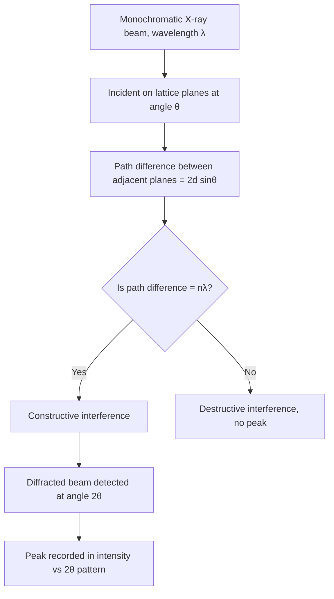
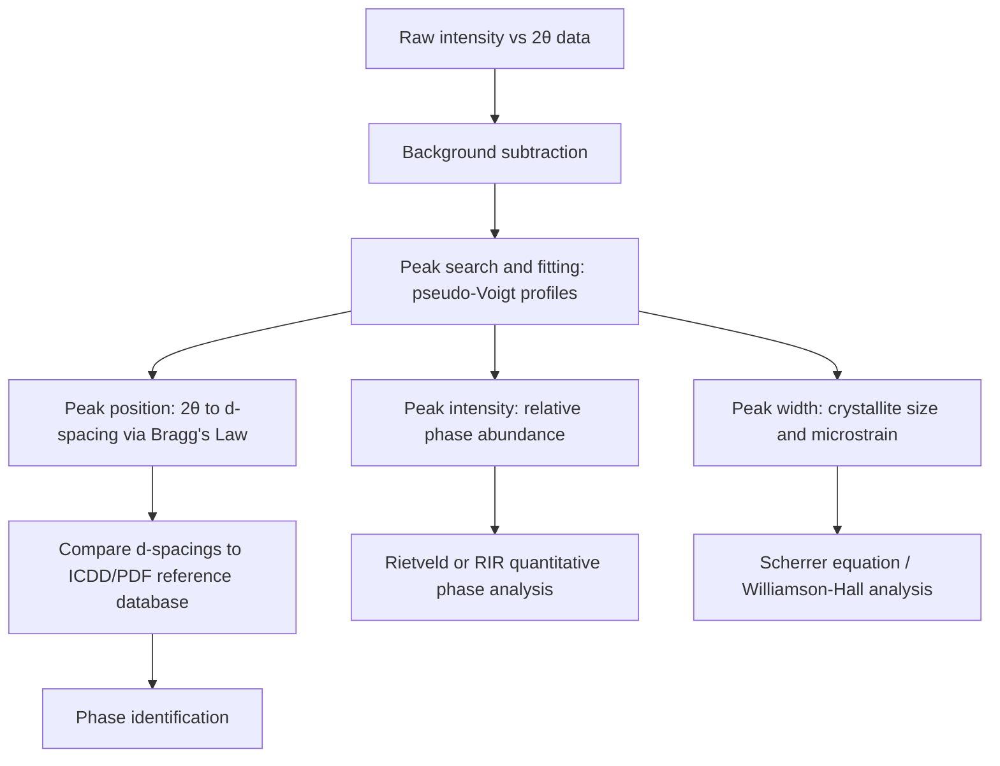

## Bragg's Law and Diffraction Patterns

### Conceptual Foundation

Bragg's Law is the fundamental geometric relationship connecting X-ray wavelength, interplanar atomic spacing, and the angles at which constructive interference (diffraction) occurs. Formulated by W.H. Bragg and W.L. Bragg in 1913, it provides a simplified but powerful "reflection" model: X-rays incident on a crystal are treated as if partially reflecting from successive parallel atomic planes, with a diffracted beam observed only when reflections from all planes interfere constructively.

### Derivation of Bragg's Law

Consider a set of parallel lattice planes separated by a perpendicular spacing $d$. A monochromatic X-ray beam strikes these planes at a glancing angle $\theta$ (measured from the plane, not the normal).

**Geometric setup**:

- Two parallel rays strike two adjacent planes at angle $\theta$.
- The ray striking the lower plane travels an additional path length compared to the ray reflecting off the upper plane.
- This extra path length consists of two segments, each equal to $d\sin\theta$, giving a total path difference of $2d\sin\theta$.

Constructive interference occurs only when this path difference equals an integer number of wavelengths:

$$n\lambda = 2d\sin\theta$$

Where:

- $n$ = integer order of reflection (1, 2, 3, ...)
- $\lambda$ = X-ray wavelength
- $d$ = interplanar spacing of the diffracting $(hkl)$ planes
- $\theta$ = Bragg angle (angle of incidence/reflection from the plane)

In modern crystallographic convention, higher orders $n > 1$ from a plane $(hkl)$ are typically reindexed as first-order reflections from the plane $(nh, nk, nl)$, so Bragg's Law is commonly written with $n=1$ absorbed into the indexing:

$$\lambda = 2d_{hkl}\sin\theta$$

### Conditions for Diffraction

**Key Points**

- Diffraction is only observed when $\sin\theta = \dfrac{n\lambda}{2d} \le 1$; if $\lambda > 2d$, no solution exists and that plane cannot diffract the given wavelength.
- This is why $\lambda$ must be comparable to or smaller than typical interplanar spacings (angstrom-scale), which is why X-rays (not visible light) are used for crystal structure analysis.
- For a fixed $\lambda$, each unique $d$-spacing produces diffraction at one and only one specific angle $\theta$, forming the basis for identifying phases from the angular positions of diffraction peaks.

### The Diffractometer Angle Convention: $2\theta$

In practice, diffractometers measure the angle between the incident and diffracted beams, called $2\theta$, because the sample is rotated by $\theta$ while the detector is rotated by $2\theta$ in coupled $\theta$–$2\theta$ scanning geometry (Bragg-Brentano configuration). The resulting diffraction pattern is plotted as **intensity vs. $2\theta$**.

### Anatomy of a Diffraction Pattern

A diffraction pattern (diffractogram) is the primary experimental output of an XRD measurement: a plot of diffracted X-ray intensity (counts) as a function of $2\theta$. Each feature of the pattern encodes specific structural information.

**Key Points**

- **Peak position ($2\theta$)**: determined by $d$-spacing via Bragg's Law; used for phase identification and lattice parameter refinement.
- **Peak intensity**: governed by the structure factor $|F_{hkl}|^2$, multiplicity, Lorentz-polarization factor, and temperature (Debye-Waller) factor; used for quantitative phase analysis and texture determination.
- **Peak width (FWHM)**: broadened by instrumental effects, small crystallite size, and microstrain; used in Scherrer analysis and Williamson-Hall plots.
- **Peak shape**: often modeled as pseudo-Voigt (a mix of Gaussian and Lorentzian profiles) to fit both the sharp core and extended tails of real diffraction peaks.
- **Background**: arises from air scattering, sample fluorescence, Compton (incoherent) scattering, and amorphous content; must be subtracted or modeled before quantitative analysis.

### Indexing a Diffraction Pattern

Indexing assigns Miller indices $(hkl)$ to each observed peak. For a **cubic system**, combining Bragg's Law with the cubic $d$-spacing formula gives:

$$\sin^2\theta = \frac{\lambda^2}{4a^2}(h^2+k^2+l^2)$$

Since $\lambda$ and $a$ are constants for a given experiment, $\sin^2\theta$ values are proportional to integers $(h^2+k^2+l^2)$. Indexing therefore proceeds by:

1. Measuring $2\theta$ for each peak and calculating $\sin^2\theta$.
2. Computing ratios of $\sin^2\theta$ values relative to the lowest-angle peak.
3. Matching these ratios against allowed $(h^2+k^2+l^2)$ integer sequences for candidate Bravais lattices:
   - **Simple cubic (SC)**: 1, 2, 3, 4, 5, 6, 8, 9, ... (all integers except those requiring $h=k=l=0$)
   - **BCC**: 2, 4, 6, 8, 10, 12, 14, 16, ... (only even $h+k+l$ sums survive)
   - **FCC**: 3, 4, 8, 11, 12, 16, 19, 20, ... (only all-even or all-odd $hkl$ survive)

This ratio method is a standard manual technique for distinguishing BCC vs. FCC metals (e.g., ferrite vs. austenite in steels) directly from raw peak angle data.

**Example**

For an unknown cubic metal measured with Cu $K_{\alpha}$ ($\lambda = 1.5418$ Å), suppose the first four peaks occur at $2\theta = 44.7^\circ, 65.1^\circ, 82.4^\circ, 98.9^\circ$.

Calculating $\sin^2\theta$ for each and normalizing to the smallest value yields a ratio sequence of approximately 1 : 2 : 3 : 4, consistent with the BCC sequence (2, 4, 6, 8 scaled down by 2), identifying the material as BCC (consistent with $\alpha$-iron/ferrite).

### Systematic Absences and Structure Factor Effects

Not all $(hkl)$ combinations permitted by Bragg's Law geometry actually produce an observable peak. The **structure factor**:

$$F_{hkl} = \sum_j f_j \, e^{2\pi i(hx_j+ky_j+lz_j)}$$

can evaluate to zero for specific index combinations depending on lattice centering, causing **systematic absences**:

- **Body-centered cubic (BCC)**: only reflections with $h+k+l$ = even are present (e.g., (110), (200), (211) are allowed; (100), (111) are absent).
- **Face-centered cubic (FCC)**: only reflections with $h,k,l$ all even or all odd are present (e.g., (111), (200), (220) allowed; (100), (110) absent).
- **Primitive/simple cubic**: no systematic absences; all integer $(hkl)$ combinations are allowed.

These absence rules are diagnostic fingerprints used routinely in metallurgical phase identification, since the *pattern* of missing peaks (not just peak positions) confirms lattice type.

### Multiple Wavelength Components ($K_{\alpha1}/K_{\alpha2}$ Splitting)

Laboratory Cu sources emit both $K_{\alpha1}$ ($\lambda = 1.5406$ Å) and $K_{\alpha2}$ ($\lambda = 1.5444$ Å) as an unresolved doublet at low angles. At higher $2\theta$, the small wavelength difference causes visible **peak splitting** into two closely spaced components, since Bragg's Law maps the wavelength difference to an increasingly resolvable angular difference as $\theta$ increases. This is a normal instrumental feature, not a separate phase, and is often corrected computationally (stripping $K_{\alpha2}$) during data processing.

### Full-Pattern Interpretation Workflow

### Peak Broadening and the Scherrer Equation

Real diffraction peaks are never infinitely sharp delta functions; finite crystallite size and lattice strain broaden them beyond the instrumental resolution limit. The **Scherrer equation** relates crystallite size to peak width:

$$\tau = \frac{K\lambda}{\beta\cos\theta}$$

Where:

- $\tau$ = mean crystallite size (often the volume-weighted domain size)
- $K$ = shape factor, commonly taken as 0.9 (dependent on crystallite geometry assumptions)
- $\beta$ = FWHM of the peak in radians, corrected for instrumental broadening
- $\theta$ = Bragg angle of the peak

[Inference: The Scherrer equation strictly applies only to broadening from finite crystallite size in the sub-100 nm to 200 nm range; beyond this, instrumental resolution typically dominates and the equation loses sensitivity.] Separating size broadening from microstrain broadening (which increases with $\tan\theta$ rather than $1/\cos\theta$) generally requires a **Williamson-Hall plot**, which analyzes broadening trends across multiple peaks at different angles.

### Applications Summary

- **Phase identification**: matching $d$-spacing and intensity patterns to reference databases (ICDD PDF cards).
- **Lattice parameter refinement**: precise fitting of high-angle peak positions.
- **Quantitative phase fraction analysis**: via reference intensity ratio (RIR) or Rietveld whole-pattern refinement.
- **Crystallite size and strain**: via Scherrer analysis and Williamson-Hall methods.
- **Residual stress**: via peak position shifts under the $\sin^2\psi$ method.
- **Preferred orientation (texture)**: via relative intensity deviations from randomly-oriented reference patterns, and pole figure measurements.

### Limitations

- Bragg's Law describes only the **kinematic** (single-scattering) diffraction condition; it does not by itself account for dynamical diffraction effects that can be significant in large, highly perfect single crystals. [Unverified: the magnitude of dynamical effects is highly material- and sample-dependent and generally negligible for typical polycrystalline powder metallurgy samples.]
- Peak overlap in complex, multi-phase, or low-symmetry (e.g., monoclinic, triclinic) systems can make indexing and quantitative analysis substantially more difficult than in the cubic case illustrated here.
- Preferred orientation in the sample (e.g., from rolling or machining) can distort relative peak intensities relative to a random powder reference, potentially leading to misidentification or inaccurate phase quantification if not accounted for.

**Related Topics**

- Structure Factor and Systematic Absence Rules
- Scherrer Equation and Williamson-Hall Analysis
- Rietveld Refinement Methodology
- $\sin^2\psi$ Residual Stress Method
- Reciprocal Lattice and the Ewald Sphere Construction
- Powder XRD Sample Preparation and Preferred Orientation Effects
- ICDD/PDF Database Phase Matching