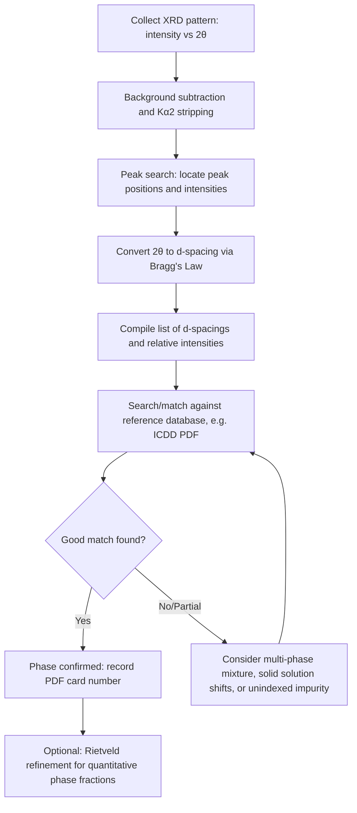

## Phase Identification via X-Ray Diffraction

### Overview and Rationale

Phase identification is the most widely used application of X-ray diffraction in materials science and metallurgy. Because every crystalline phase produces a unique diffraction pattern — a specific set of $d$-spacings and relative intensities dictated by its crystal structure, unit cell dimensions, and atomic arrangement — a measured pattern effectively acts as a structural "fingerprint" that can be matched against known references to determine which phase(s) are present in a sample.

This technique underlies critical metallurgical tasks such as distinguishing ferrite from austenite in steels, detecting intermetallic compounds, identifying oxide scales and corrosion products, confirming carbide or nitride precipitates, and verifying whether a heat treatment produced the intended phase assemblage.

### Physical Basis: Why Each Phase Has a Unique Pattern

**Key Points**

- The angular position of each diffraction peak is fixed by Bragg's Law, $\lambda = 2d_{hkl}\sin\theta$, so peak positions directly encode the interplanar spacings $d_{hkl}$, which depend on the crystal system and lattice parameters ($a$, $b$, $c$, $\alpha$, $\beta$, $\gamma$).
- Relative peak intensities are governed by the structure factor $|F_{hkl}|^2$, which depends on atomic positions within the unit cell and atomic scattering power (roughly proportional to atomic number).
- Because both $d$-spacings and intensity distributions differ between phases (even between polymorphs of the same chemical composition, such as $\alpha$-Fe vs. $\gamma$-Fe), the full pattern — not any single peak — serves as the identifying signature.

### The Standard Workflow

### Step 1: Data Collection and Preprocessing

Before matching can occur, the raw diffractogram must be cleaned:

- **Background subtraction**: removes contributions from air scattering, sample fluorescence, and incoherent (Compton) scattering, which would otherwise distort intensity ratios.
- **$K_{\alpha2}$ stripping**: removes the secondary $K_{\alpha2}$ contribution present in most laboratory Cu-source patterns, since unresolved peaks at low angle can otherwise be miscounted as broadened single peaks.
- **Peak search algorithms**: locate peak maxima and fit profile functions (commonly pseudo-Voigt) to extract precise peak positions ($2\theta$), integrated intensities, and FWHM values.

### Step 2: Converting Peak Positions to $d$-Spacings

Each peak's $2\theta$ position is converted to an interplanar spacing using Bragg's Law:

$$d_{hkl} = \frac{\lambda}{2\sin\theta}$$

This produces a table of experimental $(d, I/I_0)$ pairs — spacing and relative intensity (normalized so the strongest peak = 100) — which forms the basis for comparison against reference data.

### Step 3: Database Matching

**Key Points**

- The primary reference resource is the **ICDD (International Centre for Diffraction Data) Powder Diffraction File (PDF)**, a database of tens of thousands of reference patterns for known crystalline materials, each assigned a unique PDF card number.
- Search-match software (e.g., Jade, HighScore, DIFFRAC.EVA, or open-source tools such as GSAS-II) automatically compares experimental $(d, I)$ lists against the database, ranking candidate matches by a figure-of-merit score.
- A good match requires agreement in both **peak positions** (usually within a small tolerance, since real lattice parameters can deviate slightly from ideal reference values due to solid solution effects, residual stress, or temperature) and **relative intensity pattern** (though intensities are more sensitive to preferred orientation and can show larger discrepancies).

**Example**

An unknown steel sample shows major peaks at $d \approx 2.03$ Å (100 relative intensity), $1.43$ Å (20), and $1.17$ Å (30). These values correspond closely to the (110), (200), and (211) reflections of BCC $\alpha$-iron (ferrite), matching ICDD PDF card 00-006-0696 (or equivalent), confirming the ferritic phase.

### Distinguishing Similar or Overlapping Phases

Some phase identification challenges require particular care:

- **Polymorphs of the same composition**: e.g., $\alpha$-Fe (BCC, ferrite/martensite matrix) vs. $\gamma$-Fe (FCC, austenite) — distinguished by their entirely different systematic absence rules and $d$-spacing sequences (see Bragg's Law/structure factor material), even though both are pure iron.
- **Solid solutions**: alloying elements dissolved in the lattice shift peak positions slightly (via lattice parameter changes) without introducing new peaks; distinguishing this from a genuine new phase requires checking whether the entire pattern shifts uniformly (solid solution) or whether new independent peaks appear (second phase).
- **Overlapping peaks from multiple phases**: in multi-phase samples (e.g., retained austenite + martensite + carbides in hardened steel), peaks from different phases can overlap at similar $2\theta$ values, requiring peak deconvolution or full-pattern (Rietveld) fitting rather than simple peak-matching.
- **Preferred orientation effects**: textured samples (e.g., cold-rolled sheet) can show intensity ratios that deviate substantially from the randomly-oriented reference pattern, potentially causing a correct phase to be under-weighted or misjudged in simple search-match routines.

### Quantitative Phase Analysis

Once phases are identified, their relative proportions can be estimated:

- **Reference Intensity Ratio (RIR) method**: uses tabulated RIR values (relative to a corundum standard) for each phase's strongest peak to estimate weight fractions from measured intensity ratios. Simpler but less accurate than full-pattern methods.
- **Rietveld refinement**: a full-pattern least-squares fitting method that models the entire diffractogram (peak positions, intensities, shapes, and background) simultaneously for all phases present, using their known crystal structures. Provides more accurate quantitative phase fractions, refined lattice parameters, and can extract crystallite size/microstrain information as byproducts. [Inference: Rietveld accuracy depends heavily on data quality (counting statistics, angular range) and the completeness/correctness of the structural models used for each phase.]

### Common Metallurgical Applications

**Key Points**

- **Steel phase analysis**: identifying ferrite, austenite, martensite, bainite (note: martensite and bainite are often not distinguished by XRD alone due to similar/overlapping BCC or BCT patterns; complementary techniques like optical/electron microscopy are typically needed), and retained austenite quantification (critical for TRIP/TWIP steel quality control).
- **Carbide and precipitate identification**: detecting $\text{Fe}_3\text{C}$ (cementite), $\text{Cr}_{23}\text{C}_6$, $\text{M}_2\text{C}$, or other alloy carbides that affect hardness and creep resistance.
- **Corrosion product analysis**: identifying oxide/hydroxide phases such as hematite ($\text{Fe}_2\text{O}_3$), magnetite ($\text{Fe}_3\text{O}_4$), or goethite (FeOOH) on corroded surfaces.
- **Intermetallic compound detection**: identifying brittle intermetallic phases (e.g., Fe-Al or Ti-Al intermetallics) that can form during welding, casting, or diffusion bonding and affect mechanical performance.
- **Weld and heat-affected zone analysis**: confirming whether intended transformation products formed after specific thermal cycles.

### Sources of Ambiguity and Error

- **Amorphous or nanocrystalline content**: does not produce sharp peaks and can be missed entirely by standard search-match routines, potentially requiring complementary techniques (e.g., pair distribution function analysis, TEM) for full characterization.
- **Low-symmetry systems**: monoclinic and triclinic phases produce many closely spaced peaks, increasing the risk of misindexing or overlap with other phases.
- **Trace phases**: phases present below roughly 1–5 wt% may not produce peaks distinguishable from background noise, depending on instrument sensitivity and data collection time. [Unverified: exact detection limits are highly dependent on scattering power, instrument configuration, and counting statistics.]
- **Database quality**: incorrect, outdated, or incomplete reference patterns in the search database can lead to false matches or missed identifications; cross-checking against multiple independent reference entries is good practice.

### Complementary Techniques

Phase identification via XRD is often supplemented by:

- **Energy-dispersive X-ray spectroscopy (EDS)**: provides elemental composition to narrow candidate phases before/during database matching.
- **Electron backscatter diffraction (EBSD)**: provides spatially resolved crystallographic phase and orientation mapping at the microstructural scale, complementing the bulk-averaged information from conventional XRD.
- **Optical and electron microscopy**: confirms morphological features (e.g., lath martensite, pearlite colonies) that XRD alone cannot resolve.

**Related Topics**

- ICDD/PDF Database Structure and Search-Match Algorithms
- Rietveld Refinement for Quantitative Phase Analysis
- Retained Austenite Quantification in Steels
- Reference Intensity Ratio (RIR) Method
- Structure Factor and Systematic Absences
- EBSD-Based Phase Mapping
- Solid Solution Lattice Parameter Shifts (Vegard's Law)