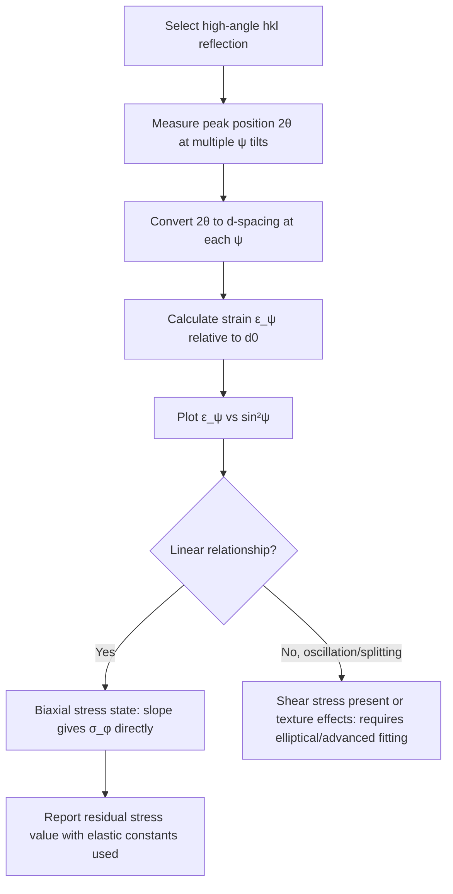

## Residual Stress Measurement by Diffraction

### Overview and Physical Principle

Residual stress measurement by X-ray diffraction (XRD) exploits the fact that elastic strain in a crystal lattice causes measurable changes in interplanar spacing $d$. Since Bragg's Law directly relates $d$-spacing to diffraction angle, any strain-induced change in $d$ produces a corresponding shift in peak position $2\theta$. By precisely measuring these peak shifts, the elastic lattice strain — and from it, the residual stress — can be calculated using known elastic constants of the material.

This technique is non-destructive (or minimally destructive when combined with layer removal for depth profiling) and is widely used in metallurgy to evaluate the effects of manufacturing processes such as machining, grinding, shot peening, welding, and heat treatment on near-surface stress states.

### Strain-Peak Shift Relationship

For a lattice plane $(hkl)$ with unstressed spacing $d_0$, an applied or residual strain $\varepsilon$ produces a new spacing $d$:

$$\varepsilon = \frac{d - d_0}{d_0}$$

Differentiating Bragg's Law ($\lambda = 2d\sin\theta$, with $\lambda$ fixed) gives the relationship between strain and the resulting shift in Bragg angle:

$$\varepsilon = -\cot\theta_0 \, \Delta\theta$$

Where $\Delta\theta$ is the shift in Bragg angle relative to the unstressed reference angle $\theta_0$. This shows that strain sensitivity improves at high $\theta$ (angles approaching $90^\circ$), which is why residual stress measurements are typically performed using high-angle diffraction peaks (commonly $2\theta > 120^\circ$) to maximize angular sensitivity to small strains.

### The $\sin^2\psi$ Method

**Key Points**

- The most widely used technique for XRD residual stress measurement is the **$\sin^2\psi$ method**, which measures lattice strain along multiple sample orientations, tilted by angle $\psi$ relative to the sample surface normal.
- The method relies on measuring the same $(hkl)$ diffraction peak's position at several tilt angles $\psi$ (commonly $\psi = 0°, \pm15°, \pm30°, \pm45°$, etc.) and plotting $d_{\psi}$ or strain $\varepsilon_\psi$ against $\sin^2\psi$.
- For a biaxial (plane) stress state typical of surface treatments, this plot is **linear**, and the slope is directly proportional to the in-plane residual stress $\sigma_\phi$.

The governing equation for the biaxial stress case is:

$$\varepsilon_{\phi\psi} = \frac{1+\nu}{E}\sigma_\phi \sin^2\psi - \frac{2\nu}{E}\sigma_{avg}$$

Or, expressed via the diffraction elastic constants directly:

$$\sigma_\phi = \left(\frac{E}{1+\nu}\right)_{hkl} \cdot \frac{1}{\sin^2\psi} \cdot \frac{\partial d_{\phi\psi}}{\partial(\sin^2\psi)} \cdot \frac{1}{d_0}$$

Where:

- $E$ = Young's modulus (or the diffraction-specific elastic constant for that $(hkl)$ reflection)
- $\nu$ = Poisson's ratio (or diffraction elastic constant equivalent)
- $\phi$ = azimuthal angle defining the measurement direction in the sample plane
- $\psi$ = tilt angle of the sample/detector geometry relative to the surface normal
- $d_0$ = stress-free lattice spacing reference

### Diffraction Elastic Constants (DEC)

**Key Points**

- Unlike bulk mechanical elastic constants, XRD stress analysis requires **diffraction elastic constants**, which are specific to the particular $(hkl)$ reflection used, because elastic anisotropy at the grain/crystallite level means different crystallographic planes respond differently to applied stress (especially in materials with pronounced elastic anisotropy).
- DEC values ($\left(\frac{1+\nu}{E}\right)_{hkl}$ and $\left(\frac{\nu}{E}\right)_{hkl}$, often called $\frac{1}{2}s_2$ and $s_1$ respectively) are tabulated for common metals and reflections, or can be calculated from single-crystal elastic constants using models such as Voigt, Reuss, or Kröner averaging schemes.
- Using bulk (macroscopic) elastic constants instead of the correct diffraction-specific values for a given $(hkl)$ can introduce systematic errors in the calculated stress. [Inference: the magnitude of this error depends strongly on the material's elastic anisotropy factor; it is most significant in elastically anisotropic metals like austenitic stainless steels and less significant in more elastically isotropic materials like tungsten.]

### Types of Stress States and Analysis Complications

- **Biaxial (plane) stress**: the standard assumption for surface-treated components; produces the simple linear $\sin^2\psi$ relationship described above.
- **Triaxial stress with shear components**: produces "$\psi$-splitting," where the $d$ vs. $\sin^2\psi$ plot splits into two branches for $+\psi$ and $-\psi$ tilts, indicating the presence of shear stress components ($\sigma_{13}, \sigma_{23}$); requires more advanced analysis than the simple linear model.
- **Oscillatory (non-linear) $\sin^2\psi$ plots**: can arise from strong crystallographic texture, coarse grain size (poor grain statistics), or steep stress gradients within the X-ray penetration depth; may require texture-corrected models or restrict analysis to specific $\phi$ orientations.
- **Stress gradients with depth**: since XRD only probes a shallow surface layer, steep near-surface stress gradients (common after shot peening or grinding) can bias results unless depth-resolved measurements are performed.

### Depth Profiling

Because conventional XRD penetration depth is limited (typically a few microns to tens of microns for common metals with Cu radiation, though it varies with material absorption and photon energy), depth-resolved residual stress profiles require either:

- **Electropolishing/layer removal**: successive thin layers are chemically or electrochemically removed, and stress is remeasured after each removal step (with correction applied for stress relaxation caused by material removal itself).
- **Variable penetration depth methods**: using different X-ray wavelengths or grazing-incidence geometries to probe different average depths without physically removing material.
- **Synchrotron or neutron diffraction**: neutrons penetrate much deeper (millimeters to centimeters) than laboratory X-rays, enabling non-destructive bulk residual stress mapping; synchrotron X-rays offer high energy resolution and can also probe greater depths than lab sources depending on photon energy selected.

### Instrumentation Considerations

- **Portable/field XRD stress analyzers**: used for in-situ measurement on large components (e.g., pipelines, rail, welded structures) without sectioning.
- **Point-focus vs. line-focus optics**: point-focus geometries are generally preferred for stress measurement to maintain consistent gauge volume across tilt angles.
- **Position-sensitive detectors (PSDs)**: allow simultaneous capture of the full peak profile, improving measurement speed and precision of peak position determination compared to older point-detector step-scanning methods.
- **Peak fitting method**: precise determination of peak centroid (commonly via cross-correlation, parabolic fitting, or full-profile fitting) is critical, since residual stress measurement accuracy is fundamentally limited by how precisely the peak position shift can be resolved.

### Applications in Metallurgy

**Key Points**

- **Shot peening and surface treatment verification**: confirming compressive residual stress depth profiles intended to improve fatigue life.
- **Weld residual stress assessment**: characterizing tensile residual stresses near weld fusion zones and heat-affected zones that can promote stress corrosion cracking or fatigue failure.
- **Grinding burn detection**: identifying abnormal tensile residual stress patterns indicative of thermal damage during grinding operations.
- **Heat treatment and quenching stress evaluation**: assessing stress states resulting from differential cooling rates in quenched components.
- **Fatigue life prediction support**: residual stress measurements feed into fatigue models, since compressive surface stresses generally retard crack initiation while tensile stresses promote it.

### Limitations

- XRD residual stress measurement determines only the **elastic** component of strain in the diffracting crystallites; it does not directly measure plastic strain or dislocation density (though peak broadening can provide indirect microstrain information).
- Results represent a spatially averaged value over the X-ray beam's footprint and penetration depth; steep local gradients smaller than this gauge volume cannot be resolved without additional techniques.
- Coarse-grained materials can violate the assumption of good crystallographic averaging (sufficient grain statistics within the beam footprint), leading to scatter or non-linear $\sin^2\psi$ behavior.
- Accuracy depends on correct selection of diffraction elastic constants and precise $d_0$ (stress-free reference) determination; errors in either propagate directly into the calculated stress value. [Unverified: the precision achievable in practice varies considerably with material, instrument, and measurement geometry, and is generally reported by instrument manufacturers and standards bodies such as ASTM E915 and SAE HS-784 for specific conditions.]

**Related Topics**

- Diffraction Elastic Constants and Anisotropy Models (Voigt, Reuss, Kröner)
- Shot Peening and Compressive Stress Depth Profiling
- Neutron Diffraction for Bulk Residual Stress Mapping
- Peak Profile Fitting Methods (Pseudo-Voigt, Pearson VII)
- Weld Residual Stress and Stress Corrosion Cracking
- Electropolishing Layer-Removal Depth Profiling
- ASTM E915 Standard Test Method for Residual Stress Measurement