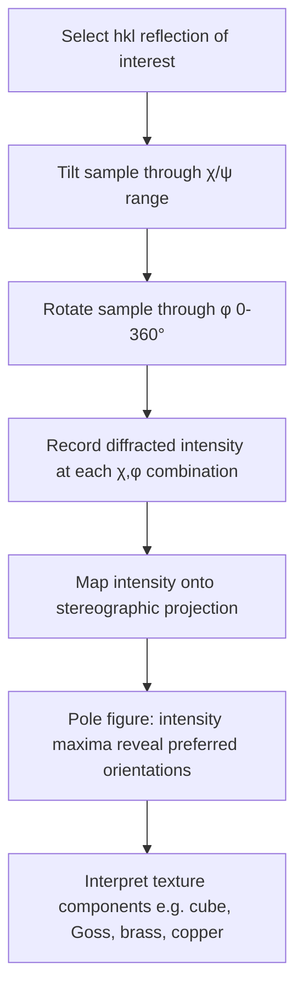

## Texture Analysis via Diffraction

### Overview and Significance

Crystallographic texture refers to the non-random distribution of grain orientations within a polycrystalline material. Texture analysis via diffraction quantifies this preferred orientation, which directly influences anisotropic mechanical, magnetic, and electrical properties. Texture commonly arises from processing operations such as rolling, drawing, extrusion, forging, solidification, and recrystallization annealing, making texture analysis essential for understanding and controlling the directional behavior of formed metal products.

Unlike a randomly oriented polycrystalline sample — where grains are equally likely to be oriented in any direction, producing diffraction peak intensities matching standard powder reference ratios — a textured material exhibits systematic deviations in relative peak intensities, since certain crystallographic planes are preferentially aligned parallel or perpendicular to specific sample directions (e.g., rolling direction, normal direction).

### Physical Basis: Why Texture Affects Diffraction Intensity

**Key Points**

- In a diffraction experiment, only grains oriented such that a given $(hkl)$ plane satisfies the Bragg condition for the current $2\theta$ and sample tilt contribute to that peak's measured intensity.
- In a randomly oriented (untextured) sample, the number of grains satisfying this condition for each $(hkl)$ family matches the statistically expected multiplicity-weighted value, producing the "ideal" powder intensity ratios found in reference databases.
- In a textured sample, grains cluster around specific orientations, so certain $(hkl)$ reflections become anomalously strong (over-represented orientations) while others become anomalously weak or vanish (under-represented orientations) relative to the random reference pattern.

### Describing Texture: Pole Figures

A **pole figure** is the standard graphical representation of texture, showing the distribution of poles (normals) to a specific crystallographic plane $(hkl)$ projected onto a stereographic projection relative to the sample's external reference frame (typically rolling direction RD, transverse direction TD, and normal direction ND for rolled sheet).

- The pole figure is measured by tilting the sample through a range of tilt angles $\chi$ (or $\psi$) and rotating it through azimuthal angles $\phi$ (typically 0° to 360°), recording the diffracted intensity of a fixed $(hkl)$ reflection at each orientation.
- Regions of high intensity ("poles" or intensity maxima) on the pole figure indicate orientations in which that crystallographic plane normal is preferentially aligned with the corresponding sample direction.
- Common texture components in rolled metals are often labeled using Miller index notation $\{hkl\}\langle uvw \rangle$, indicating the plane parallel to the rolling plane and the direction parallel to the rolling direction (e.g., the "cube texture" $\{001\}\langle100\rangle$ common in annealed FCC metals, or the "Goss texture" $\{110\}\langle001\rangle$ relevant to electrical steels).

### Orientation Distribution Function (ODF)

**Key Points**

- A single pole figure provides an incomplete, 2D projection of the full 3D orientation information, since multiple distinct orientation distributions can, in principle, produce similar individual pole figures.
- The **Orientation Distribution Function (ODF)** is a mathematical function, typically expressed in Euler angle space ($\varphi_1, \Phi, \varphi_2$, using Bunge convention), describing the volume fraction of crystallites having a specific orientation.
- The ODF is calculated from a set of several (typically 3 or more) measured incomplete pole figures for different $(hkl)$ reflections, using methods such as spherical harmonic series expansion or discrete/direct methods (e.g., WIMV algorithm).
- Once calculated, the ODF can be used to recompute complete pole figures (including low-angle regions inaccessible in direct measurement due to geometric limitations), extract volume fractions of specific named texture components, and predict anisotropic property tensors.

### Measurement Geometries

- **Reflection (Schulz) geometry**: standard laboratory diffractometer configuration for measuring pole figures over the tilt range $\chi = 0°$ to approximately $75$–$85°$; cannot access the outer rim of the pole figure due to geometric shadowing/defocusing effects at high tilt angles.
- **Transmission geometry**: used to fill in the high-tilt-angle region inaccessible in reflection geometry, typically requiring thin samples due to X-ray absorption; combined reflection + transmission data produces a complete pole figure.
- **Texture goniometer/Eulerian cradle**: the mechanical stage providing the $\chi$ (tilt) and $\phi$ (rotation) degrees of freedom required for pole figure mapping, in addition to the standard $\theta$–$2\theta$ diffractometer axes.

### Quantitative Texture Descriptors

- **Texture index (J-index)**: a scalar measure of the "sharpness" of the texture derived by integrating the squared ODF over orientation space; $J=1$ for a perfectly random (untextured) sample, with higher values indicating stronger texture.
- **Volume fraction of specific components**: the ODF can be integrated over defined orientation ranges (e.g., a tolerance angle around an ideal texture component such as brass $\{110\}\langle112\rangle$ or copper $\{112\}\langle111\rangle$) to quantify how much material adopts that specific orientation.
- **Rolling texture components in FCC metals**: commonly described using the "$\beta$-fiber" (copper, S, brass orientations), a well-established framework in deformation texture studies of FCC metals like aluminum, copper, and austenitic stainless steels.

### Related Diffraction-Based Texture Techniques

**Key Points**

- **Electron Backscatter Diffraction (EBSD)**: performed in a scanning electron microscope, EBSD measures individual grain orientations directly at each scan point, providing spatially resolved orientation maps that can be aggregated into pole figures or ODFs — offering complementary spatial resolution that bulk XRD texture measurements cannot provide, though generally with more limited statistical sampling per unit area/time compared to bulk XRD.
- **Neutron diffraction texture measurement**: due to greater penetration depth, neutron diffraction can characterize bulk texture averaged over much larger sample volumes than laboratory XRD, useful for thick or heterogeneous components.
- **Synchrotron XRD texture mapping**: high-flux, tunable-energy synchrotron sources enable rapid full pole figure acquisition and can probe greater depths than conventional laboratory sources, useful for in-situ texture evolution studies during deformation or annealing.

### Applications in Metallurgy

- **Deep-drawing formability prediction**: texture-derived anisotropy parameters (e.g., the plastic strain ratio $r$-value and its planar variation $\Delta r$) are used to predict sheet metal formability and earing behavior during deep drawing.
- **Electrical steel optimization**: Goss texture $\{110\}\langle001\rangle$ is deliberately engineered in grain-oriented electrical steels to align the easy magnetization direction with the rolling direction, minimizing core losses in transformers.
- **Recrystallization texture control**: texture measurements track how deformation textures transform into distinct recrystallization textures (e.g., cube texture in annealed aluminum and copper) during thermomechanical processing.
- **Anisotropic property prediction**: texture data feeds into crystal plasticity models to predict directional variation in yield strength, Young's modulus, and other properties in textured components.
- **Weldability and cracking susceptibility**: texture in weld heat-affected zones can influence local anisotropic behavior relevant to cracking susceptibility.

### Limitations and Practical Considerations

- Bulk XRD pole figure measurement provides orientation statistics averaged over the beam footprint and sample volume, without preserving spatial/grain-level correlation information (unlike EBSD, which retains spatial mapping at the cost of typically longer acquisition times for equivalent statistical sampling).
- Coarse-grained samples may produce insufficient grain statistics within the X-ray beam footprint, leading to spotty, non-representative pole figures; sample rotation/oscillation during measurement or larger beam areas can improve grain sampling.
- Defocusing and absorption effects at high tilt angles in reflection geometry require intensity corrections before quantitative ODF calculation; uncorrected data can bias texture severity estimates.
- Full pole figure and ODF measurement is considerably more time-intensive than a standard phase-identification scan, since multiple reflections must each be mapped over a 2D tilt/rotation grid. [Unverified: measurement times vary substantially depending on instrument automation, detector type, and desired angular resolution.]

**Related Topics**

- Orientation Distribution Function Calculation Methods (WIMV, Harmonic Series)
- EBSD-Based Orientation Mapping and Grain Statistics
- Deep Drawing Anisotropy and the Lankford ($r$-value) Parameter
- Goss and Cube Texture in Electrical Steels and Aluminum
- Recrystallization Texture Evolution
- Neutron and Synchrotron Texture Measurement Techniques
- Crystal Plasticity Modeling of Anisotropic Properties