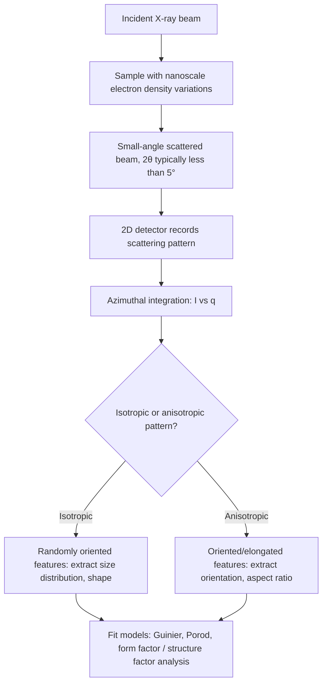

## Small Angle X-Ray Scattering

### Overview and Physical Basis

Small Angle X-ray Scattering (SAXS) is a diffraction-based technique that probes structural features on the nanometer scale (typically ~1–100 nm, extending in some cases up to several hundred nm) by measuring X-ray intensity scattered at small angles (typically $2\theta < 5°$) relative to the incident beam. Unlike conventional wide-angle XRD, which probes atomic-scale periodicity (interplanar spacings of a few angstroms), SAXS is sensitive to **electron density fluctuations** occurring over much larger length scales — such as precipitates, pores, voids, nanoparticles, and phase-separated domains — regardless of whether those features are themselves crystalline.

The inverse relationship between real-space feature size and scattering angle (a consequence of Fourier/reciprocal-space relationships in scattering theory) means that small angular measurements probe large real-space structures, while large angular measurements (as in conventional XRD) probe small real-space (atomic-scale) structures.

### The Scattering Vector and Reciprocal Space

SAXS data is typically presented as scattered intensity $I(q)$ as a function of the **scattering vector magnitude** $q$:

$$q = \frac{4\pi\sin\theta}{\lambda}$$

Where:

- $\theta$ = half the scattering angle ($2\theta/2$)
- $\lambda$ = X-ray wavelength

The scattering vector $q$ has units of inverse length (commonly nm$^{-1}$ or Å$^{-1}$) and directly corresponds to a real-space length scale $d \approx 2\pi/q$, analogous to the $d$-spacing concept in Bragg's Law but applied to much larger structural features rather than atomic lattice planes.

### Origin of Scattering Contrast

**Key Points**

- SAXS intensity arises from spatial variations in **electron density** ($\Delta\rho$) between a structural feature (e.g., a precipitate, pore, or nanoparticle) and its surrounding matrix.
- Greater electron density contrast between the feature and matrix produces stronger scattering signal; features with electron density very close to the matrix (low contrast) are difficult to detect regardless of size.
- Because SAXS is sensitive to electron density contrast rather than crystallinity, it can characterize **amorphous, nanocrystalline, or even non-crystalline** structural features (e.g., voids, polymer domains, or amorphous precipitates) that produce no discrete peaks in conventional XRD.

### Key Analytical Regimes and Models

**Guinier Approximation (low-$q$ region)**

For dilute, non-interacting particles at low $q$ (specifically $qR_g < 1$), the scattering intensity follows the Guinier approximation:

$$I(q) \approx I(0)\exp\left(-\frac{q^2 R_g^2}{3}\right)$$

Where $R_g$ is the **radius of gyration** of the scattering particle, extracted from the slope of a plot of $\ln I(q)$ versus $q^2$ (a "Guinier plot"). This provides a model-independent estimate of average particle size without assuming a specific particle shape.

**Porod Law (high-$q$ region)**

At sufficiently high $q$, for particles with smooth, sharp interfaces, scattering intensity follows a power-law decay:

$$I(q) \propto q^{-4}$$

known as **Porod's law**. Deviations from this $q^{-4}$ scaling can indicate diffuse (non-sharp) interfaces, fractal surface roughness (in which case $I(q) \propto q^{-\alpha}$ with $\alpha$ related to the fractal dimension), or other interfacial characteristics. [Inference: precise interpretation of Porod deviations requires care, as multiple physical origins (surface fractality, interfacial diffuseness, or instrumental resolution effects) can produce similar apparent power-law exponents.]

**Form Factor and Structure Factor**

For more detailed shape and size-distribution analysis, the full scattering curve is often modeled as:

$$I(q) = N \cdot P(q) \cdot S(q)$$

Where:

- $N$ = number density of scattering particles
- $P(q)$ = **form factor**, describing scattering from an individual particle's shape and size (analytical form factors exist for spheres, cylinders, ellipsoids, lamellae, and other standard geometries)
- $S(q)$ = **structure factor**, accounting for inter-particle interference effects when particle concentration is high enough that particle-particle spatial correlations become significant (approaches 1 for dilute, non-interacting systems)

### Instrumentation

**Key Points**

- SAXS requires precise, well-collimated, low-divergence X-ray beams and long sample-to-detector distances (often 1–5 meters or more) to resolve the small scattering angles involved.
- Laboratory SAXS instruments typically use sealed-tube or rotating-anode Cu sources with specialized collimation optics (e.g., multilayer mirrors, pinhole collimation) to achieve the required beam quality.
- 2D area detectors (CCD, CMOS, or photon-counting pixel detectors) capture the full scattering pattern simultaneously, which is then azimuthally integrated (if the pattern is isotropic) to produce a 1D $I(q)$ curve.
- **Synchrotron SAXS beamlines** provide much higher photon flux and better collimation than laboratory sources, enabling faster data collection, smaller effective beam sizes, and time-resolved (in-situ) measurements of structural evolution during processes like phase transformation or annealing.
- Vacuum or helium-purged flight paths are commonly used to minimize air scattering, which would otherwise significantly contribute to background at small angles.

### Combined Techniques

- **USAXS (Ultra-Small-Angle X-ray Scattering)**: extends the accessible size range to larger structures (up to microns) by achieving even smaller scattering angles, typically using specialized Bonse-Hart camera geometries with crystal analyzers for extremely high angular resolution.
- **SAXS/WAXS combined measurement**: many modern instruments and synchrotron beamlines simultaneously collect small-angle (SAXS) and wide-angle (WAXS/conventional XRD) data, allowing correlation of nanoscale morphology (SAXS) with atomic-scale crystal structure information (WAXS) from the same sample volume in a single measurement.
- **GISAXS (Grazing-Incidence SAXS)**: a surface-sensitive variant using grazing-incidence geometry, useful for characterizing thin films, coatings, and near-surface nanostructures.

### Applications in Materials Science and Metallurgy

**Key Points**

- **Precipitate size and volume fraction analysis**: characterizing nanoscale precipitates in age-hardenable alloys (e.g., Al-Cu, Al-Zn-Mg, Ni-based superalloy $\gamma'$ precipitates), including their evolution during aging heat treatments.
- **Porosity characterization**: quantifying nanoscale porosity in sintered materials, additively manufactured (3D-printed) metals, and ceramics.
- **Nanoparticle characterization**: determining size, size distribution, and shape of metallic or oxide nanoparticles in nanocomposite materials.
- **Phase separation studies**: tracking spinodal decomposition or other nanoscale phase separation phenomena in alloys and glasses.
- **In-situ processing studies**: synchrotron SAXS enables real-time tracking of precipitate nucleation and growth kinetics during heat treatment, providing quantitative input for process-property models.

### Limitations and Practical Considerations

- SAXS provides **statistically averaged** structural information (size, shape, volume fraction) over the illuminated sample volume; it does not provide direct spatial imaging of individual features the way electron microscopy does.
- Interpretation of complex, non-dilute, or polydisperse systems (multiple overlapping populations of feature sizes/shapes) can be ambiguous without complementary information (e.g., from TEM) to constrain the modeling assumptions.
- Strong multiple scattering or significant absorption in thick/dense samples can distort the measured intensity profile, generally requiring careful sample thickness optimization.
- Low electron density contrast between features and matrix (e.g., certain polymer-polymer systems, or metallurgical phases with similar atomic number and packing) can result in weak signal that is difficult to distinguish from background, regardless of feature size. [Unverified: the practical contrast threshold for reliable detection depends on the specific instrument's flux, detector sensitivity, and achievable counting statistics.]

**Related Topics**

- Guinier and Porod Analysis Methods
- WAXS/SAXS Combined Beamline Techniques
- Precipitate Evolution in Age-Hardenable Aluminum Alloys
- Grazing-Incidence SAXS (GISAXS) for Thin Film Characterization
- Ultra-Small-Angle X-ray Scattering (USAXS)
- Synchrotron In-Situ Structural Characterization
- Form Factor Models for Particle Shape Analysis