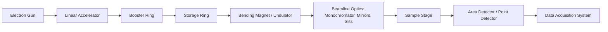
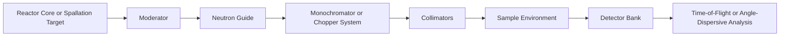

## Synchrotron and Neutron Diffraction Techniques

### Overview

Synchrotron X-ray diffraction (SXRD) and neutron diffraction (ND) are advanced diffraction techniques that extend beyond conventional laboratory X-ray diffraction (XRD) by exploiting high-brilliance photon sources and neutron beams, respectively. Both techniques probe crystal structure, phase composition, residual stress, texture, and microstructural evolution, but each interacts with matter through fundamentally different physical mechanisms, giving them complementary strengths in materials characterization.

### Fundamental Physics of Interaction

**X-rays (Synchrotron):**

- Interact with the electron cloud surrounding atomic nuclei.
- Scattering power (atomic form factor) scales approximately with atomic number $Z$, making X-rays relatively insensitive to light elements (H, Li, C) in the presence of heavy elements.
- Synchrotron sources generate X-rays via relativistic electron acceleration around a storage ring, using bending magnets, wigglers, or undulators.

**Neutrons:**

- Interact with atomic nuclei via the strong nuclear force, and possess a magnetic moment allowing interaction with unpaired electron spins.
- Scattering length ($b$) does not scale monotonically with $Z$; it varies unpredictably across the periodic table and even between isotopes of the same element.
- This allows neutrons to distinguish neighboring elements (e.g., Fe and Mn) and detect light elements (H, Li, O) even in heavy-element matrices.
- Neutrons are highly penetrating due to weak interaction with matter (small absorption cross-section for most elements), enabling bulk (not just surface) measurements through centimeters of steel.

### Key Points

- **Synchrotron radiation** offers extremely high flux and brilliance (orders of magnitude greater than lab X-ray tubes), enabling rapid data collection, high angular resolution, and access to small sample volumes or thin films.
- **Tunable wavelength**: Synchrotrons allow selection of specific photon energies, enabling anomalous scattering (resonant diffraction) to enhance chemical sensitivity near absorption edges.
- **Neutron sources** are either reactor-based (continuous beam, e.g., ILL Grenoble, HFIR at ORNL) or spallation-based (pulsed beam via proton bombardment of a heavy metal target, e.g., ISIS, SNS, J-PARC).
- **Penetration depth**: Neutrons routinely probe several centimeters into steel or aluminum, versus micrometers for conventional lab X-rays and tens to hundreds of micrometers for high-energy synchrotron X-rays.
- **Isotopic sensitivity**: Neutron scattering lengths differ between isotopes (e.g., $^{1}H$ vs. $^{2}H$/deuterium), enabling contrast variation techniques (e.g., in polymer and biological studies).
- **Magnetic structure determination**: Neutron diffraction uniquely resolves magnetic ordering (ferromagnetic, antiferromagnetic spin arrangements) because neutrons couple to unpaired electron spins — inaccessible to conventional XRD.

### Instrumentation and Beamline Architecture

#### Synchrotron Diffraction Setup

Key beamline components:

- **Monochromator**: Typically a Si(111) or Si(311) double-crystal monochromator selects a narrow energy bandwidth from the polychromatic ("white") beam.
- **Focusing optics**: Kirkpatrick-Baez (K-B) mirrors focus the beam to micrometer or sub-micrometer spot sizes for micro-diffraction.
- **Detectors**: Hybrid pixel array detectors (e.g., Pilatus, Eiger) offer single-photon counting with negligible readout noise and fast frame rates for in-situ studies.

#### Neutron Diffraction Setup

- **Reactor-based instruments** use a fixed-wavelength monochromatic beam (angle-dispersive diffraction, similar geometry to conventional XRD).
- **Spallation-based instruments** use pulsed, polychromatic beams analyzed via **time-of-flight (TOF)** diffraction: since neutron velocity $v$ relates to wavelength via the de Broglie relation, wavelength is calculated from measured flight time.

$$\lambda = \frac{h}{m_n v} = \frac{h t}{m_n L}$$

where $h$ is Planck's constant, $m_n$ is neutron mass, $t$ is time-of-flight, and $L$ is the flight path length.

### Comparison Table: Synchrotron XRD vs. Neutron Diffraction vs. Lab XRD

| Property | Lab XRD | Synchrotron XRD | Neutron Diffraction |
| --- | --- | --- | --- |
| Interaction | Electron cloud | Electron cloud | Atomic nucleus / spin |
| Flux | Low | Very high | Moderate to high (source-dependent) |
| Penetration depth | Micrometers | Tens–hundreds of μm (energy-dependent) | Centimeters |
| Light element sensitivity | Poor | Poor | Excellent (H, Li, O, C) |
| Isotope sensitivity | None | None | Yes |
| Magnetic structure | No | Limited (resonant scattering) | Yes |
| Sample size required | mg–g | μg–mg | g (bulk, due to weak interaction) |
| Time resolution | Minutes–hours | Milliseconds–seconds | Seconds–minutes (TOF) or longer |
| Typical sources | Sealed tube, rotating anode | Storage ring (e.g., APS, ESRF, Diamond) | Reactor / spallation (e.g., ILL, SNS, ISIS) |

### Applications in Materials Science & Metallurgy

**1. Residual Stress Analysis**

Both techniques measure lattice strain via peak shift, from which residual stress is calculated using the elastic constants and $\sin^2\psi$ or full diffraction-pattern (Rietveld) methods:

$$\sigma = \frac{E}{1+\nu}\varepsilon_{\phi\psi}\sin^2\psi + \dots$$

Neutron diffraction is preferred for **through-thickness, bulk residual stress mapping** in welds, thick forgings, and railway components because the beam penetrates several centimeters, whereas synchrotron high-energy X-rays are preferred for **near-surface** or **spatially resolved (sub-mm gauge volume)** stress mapping in thin components.

**2. In-Situ and Operando Studies**

- Synchrotron sources' high flux enables millisecond-scale time-resolved diffraction during rapid processes: solidification, phase transformations during welding, additive manufacturing melt-pool solidification, and dynamic compression (shock loading).
- Neutron diffraction is used for **in-situ mechanical testing** (tensile/compressive loading rigs inside the beamline) to track lattice strain evolution and load partitioning between phases in multiphase alloys (e.g., ferrite/austenite in duplex stainless steel, or matrix/precipitate in superalloys).

**3. Phase Identification and Quantification**

- Rietveld refinement of both synchrotron and neutron powder diffraction patterns yields precise phase fractions, lattice parameters, and atomic site occupancies.
- Neutron diffraction is particularly effective for quantifying **retained austenite** in steels and for materials containing hydrogen (e.g., metal hydrides), which is nearly invisible to X-rays.

**4. Texture (Crystallographic Preferred Orientation) Analysis**

- Neutron diffraction's large penetration depth allows **bulk texture measurement** representative of the entire sample volume, avoiding surface-preparation artifacts common in lab XRD pole figure measurements.

**5. Magnetic Structure Determination**

- Neutron diffraction resolves magnetic unit cells and spin configurations (ferromagnetic, antiferromagnetic, helimagnetic ordering), critical for functional magnetic materials, spintronics, and understanding magnetostructural coupling in alloys.

**6. Small-Angle Scattering (Complementary Techniques)**

- Small-Angle Neutron Scattering (SANS) and Small-Angle X-ray Scattering (SAXS) at synchrotrons probe nanoscale precipitates, voids, and second-phase particles (e.g., $\gamma'$ precipitates in Ni-superalloys), with SANS offering contrast variation via isotopic substitution (e.g., $H_2O$/$D_2O$).

### Worked Example: Determining Retained Austenite Fraction

**Scenario**: A quenched and tempered low-alloy steel is suspected to contain retained austenite (FCC, $\gamma$) alongside martensite (BCT, $\alpha'$).

**Procedure using Neutron Diffraction:**

1. Collect a full diffraction pattern (TOF or angle-dispersive) covering multiple $\alpha'$ and $\gamma$ reflections (e.g., $\gamma$(111), $\gamma$(200), $\gamma$(220) and $\alpha'$(110), $\alpha'$(200), $\alpha'$(211)).
2. Perform Rietveld refinement using software such as GSAS-II or FullProf, refining scale factors, lattice parameters, and phase fractions simultaneously.
3. Because neutrons sample the full bulk volume (grams of material, cm penetration), the result reflects true bulk retained austenite content, avoiding the surface-sensitivity bias of lab XRD (which may under- or over-represent austenite due to near-surface transformation from grinding/polishing).

**Output**: Phase fraction table, e.g., $\alpha'$: 92.3 wt%, $\gamma$: 7.7 wt%, with associated uncertainty from refinement statistics ($R_{wp}$, $\chi^2$ goodness-of-fit).

### Illustrative Diagram: Diffraction Geometry Comparison (svg_diagram)

<svg xmlns="http://www.w3.org/2000/svg" viewBox="0 0 760 320">
\<style\>
text { font-family: Arial, sans-serif; font-size: 13px; fill: #222; }
.title { font-size: 15px; font-weight: bold; }
.beam { stroke: #d1495b; stroke-width: 2; marker-end: url(#arrow); }
.beam2 { stroke: #1b6ca8; stroke-width: 2; marker-end: url(#arrow2); }
.sample { fill: #cbd5e1; stroke: #334155; stroke-width: 1.5; }
.detector { fill: #f4d35e; stroke: #333; stroke-width: 1.5; }
\</style\>
<text x="20" y="25" class="title">Synchrotron X-ray Diffraction (svg_diagram)</text>

<line x1="30" y1="90" x2="150" y2="90" class="beam" />

<text x="30" y="80">Incident X-ray beam</text>

<circle cx="170" cy="90" r="18" class="sample" />

<text x="145" y="120">Sample</text>

<line x1="188" y1="80" x2="300" y2="30" class="beam" />

<line x1="188" y1="100" x2="300" y2="150" class="beam" />

<rect x="300" y="10" width="60" height="30" class="detector" />

<rect x="300" y="140" width="60" height="30" class="detector" />

<text x="310" y="30">Area Det.</text>

<text x="310" y="160">Area Det.</text>

<text x="30" y="180" font-size="11" fill="#555">Shallow penetration; high angular resolution</text>

<text x="420" y="25" class="title">Neutron Diffraction (svg_diagram)</text>

<line x1="430" y1="90" x2="550" y2="90" class="beam2" />

<text x="430" y="80">Incident neutron beam</text>

<circle cx="570" cy="90" r="18" class="sample" />

<text x="545" y="120">Sample (bulk)</text>

<line x1="588" y1="80" x2="700" y2="30" class="beam2" />

<line x1="588" y1="100" x2="700" y2="150" class="beam2" />

<rect x="700" y="10" width="50" height="30" class="detector" />

<rect x="700" y="140" width="50" height="30" class="detector" />

<text x="705" y="30" font-size="11">Det.</text>

<text x="705" y="160" font-size="11">Det.</text>

<text x="430" y="180" font-size="11" fill="#555">Deep penetration (cm-scale); bulk-averaged signal</text>

<line x1="20" y1="230" x2="740" y2="230" stroke="#999" stroke-width="1" />
<text x="20" y="255">Note: Detector banks at multiple 2θ angles are common in both techniques;</text>
<text x="20" y="272">neutron TOF instruments additionally resolve wavelength via flight time at fixed angle.</text>
</svg>

### Data Analysis Methods

- **Rietveld Refinement**: Whole-pattern fitting against a structural model; standard software includes GSAS-II, FullProf, TOPAS, and MAUD.
- **Pawley/Le Bail Fitting**: Whole-pattern fitting without a full structural model, used for lattice parameter extraction and peak-shape analysis.
- **Single-peak fitting**: Used for rapid strain/stress evaluation (e.g., pseudo-Voigt fits to individual $hkl$ reflections) in engineering diffraction studies.
- **Pair Distribution Function (PDF) analysis**: Total scattering data (synchrotron or neutron) transformed via Fourier methods to reveal local/short-range atomic ordering, useful for amorphous and nanocrystalline materials.

### Major Facilities

| Facility Type | Examples |
| --- | --- |
| Synchrotron | APS (USA), ESRF (France), Diamond Light Source (UK), PETRA III (Germany), SPring-8 (Japan) |
| Reactor Neutron Source | ILL (France), HFIR (USA), FRM II (Germany) |
| Spallation Neutron Source | SNS (USA), ISIS (UK), J-PARC (Japan), European Spallation Source (Sweden, under commissioning) |

[Inference] Facility-specific beamline availability, flux values, and access modes change over time with upgrades (e.g., APS-U, ESRF-EBS); users should verify current specifications and proposal/beamtime application procedures directly with the facility before designing an experiment.

### Practical Considerations and Limitations

- **Access and cost**: Both synchrotron and neutron facilities are large-scale, oversubscribed user facilities requiring competitive beamtime proposals; unlike lab XRD, experiments are typically scheduled in discrete beamtime allocations (days), necessitating careful pre-planning.
- **Sample size**: Neutron diffraction typically requires larger sample volumes (grams) due to weaker scattering cross-sections, which can be a limitation for small or precious samples.
- **Radiation safety**: Both techniques involve ionizing radiation (X-ray) or activation (neutron-induced sample activation for certain elements), requiring appropriate handling protocols and, for neutron-irradiated samples, potential cool-down periods before removal.
- **Complementarity, not competition**: Best practice in advanced characterization often combines lab XRD (routine screening), synchrotron XRD (high-resolution, fast, surface/thin-film sensitive), and neutron diffraction (bulk, light-element, magnetic) for a complete structural picture.

### Related Topics

- Rietveld Refinement Methodology and Software Tools (GSAS-II, FullProf, TOPAS)
- Residual Stress Measurement Techniques ($\sin^2\psi$ Method, hole-drilling, contour method)
- Small-Angle X-ray and Neutron Scattering (SAXS/SANS)
- Time-of-Flight Neutron Diffraction Instrumentation
- In-Situ Diffraction During Additive Manufacturing
- Texture Analysis and Pole Figure Measurement
- Pair Distribution Function (PDF) Analysis for Amorphous Materials
- Anomalous (Resonant) X-ray Scattering
- Magnetic Structure Determination via Neutron Diffraction