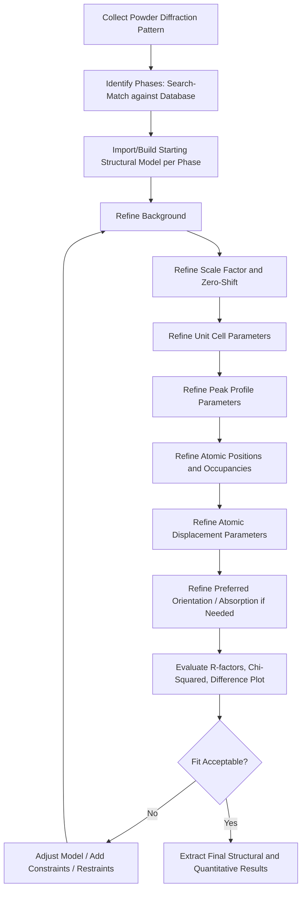

## Rietveld Refinement

### Overview

Rietveld refinement is a whole-pattern-fitting method used to extract quantitative structural and microstructural information from powder diffraction data (X-ray, synchrotron, or neutron). Rather than analyzing individual peaks in isolation, the method fits a calculated diffraction pattern—generated from a structural model—to the entire observed pattern via least-squares minimization, refining structural, microstructural, and instrumental parameters simultaneously.

### Fundamental Principle

The method minimizes a weighted sum of squared residuals between observed and calculated intensities at every measured point in the pattern:

$$S_y = \sum_i w_i \left(y_{i,\text{obs}} - y_{i,\text{calc}}\right)^2$$

where $w_i = 1/y_{i,\text{obs}}$ is the statistical weight (assuming Poisson counting statistics), $y_{i,\text{obs}}$ is the observed intensity at step $i$, and $y_{i,\text{calc}}$ is the model-calculated intensity at the same step.

The calculated intensity at each point is a superposition of contributions from all Bragg reflections that overlap at that $2\theta$ (or $d$-spacing/TOF) position, plus a background function:

$$y_{i,\text{calc}} = s\sum_{k} L_k \left|F_k\right|^2 \phi(2\theta_i - 2\theta_k) P_k A + y_{i,\text{bkg}}$$

where:

- $s$ = scale factor (relates to phase fraction/absolute quantity)
- $L_k$ = Lorentz-polarization and multiplicity factor for reflection $k$
- $F_k$ = structure factor for reflection $k$ (depends on atomic positions, occupancies, thermal parameters)
- $\phi$ = peak profile (shape) function
- $P_k$ = preferred orientation correction
- $A$ = absorption correction
- $y_{i,\text{bkg}}$ = background intensity at point $i$

### Key Points

- Rietveld refinement requires a **starting structural model** (space group, approximate atomic coordinates, cell parameters) for every phase present; it refines the model, it does not solve the structure from scratch (structure solution is a separate, prior step).
- The method is used for **quantitative phase analysis (QPA)**, **crystal structure refinement**, **lattice parameter determination**, **crystallite size/microstrain analysis**, and **preferred orientation (texture) correction**.
- Refinable parameters are grouped into categories: **global** (background, zero-shift, scale factors), **profile** (peak shape/width parameters), and **structural** (unit cell, atomic positions, site occupancies, atomic displacement/thermal parameters).
- Refinement proceeds by **nonlinear least-squares** (typically Gauss-Newton or Levenberg-Marquardt algorithms), requiring careful sequential introduction of parameters to avoid divergence or correlation-driven instability.
- Goodness-of-fit is judged by numerical indicators (R-factors, $\chi^2$) **and** visual inspection of the difference curve (observed − calculated); numerical indicators alone are insufficient and can be misleading.

### Refinement Workflow

### Peak Profile Functions

Common peak shape functions used to model $\phi(2\theta_i - 2\theta_k)$:

| Function | Characteristics |
| --- | --- |
| Gaussian | Symmetric; often insufficient alone for lab XRD |
| Lorentzian | Symmetric, longer tails; models strain broadening |
| Pseudo-Voigt | Linear combination of Gaussian and Lorentzian; most widely used |
| Pearson VII | Similar to pseudo-Voigt with adjustable tail exponent |
| Thompson-Cox-Hastings pseudo-Voigt | Physically-based convolution model separating size and strain contributions |

Peak width variation with angle is typically modeled by the **Caglioti equation**:

$$H^2 = U\tan^2\theta + V\tan\theta + W$$

where $H$ is the full width at half maximum (FWHM), and $U$, $V$, $W$ are refinable instrumental/sample broadening parameters.

### Quantitative Phase Analysis (QPA)

The weight fraction of phase $p$ in a multiphase mixture is calculated from refined scale factors using the **Hill-Howard formula**:

$$W_p = \frac{s_p (ZMV)_p}{\sum_{j=1}^{n} s_j (ZMV)_j}$$

where $s_p$ is the refined scale factor, $Z$ is the number of formula units per unit cell, $M$ is the formula weight, and $V$ is the unit cell volume, for phase $p$ summed over all $n$ phases present.

**Important limitation**: This formula assumes all phases present in the sample are included in the model and accounted for. Undetected amorphous content or unidentified crystalline phases will bias reported weight fractions; an internal standard (e.g., known wt% corundum or fluorite spike) is required for absolute amorphous content quantification.

### Goodness-of-Fit Indicators

| Indicator | Formula | Interpretation |
| --- | --- | --- |
| Profile R-factor ($R_p$) | $R_p = \dfrac{\sum \lvert y_{i,\text{obs}} - y_{i,\text{calc}} \rvert}{\sum y_{i,\text{obs}}}$ | Sensitive to background fit quality |
| Weighted profile R-factor ($R_{wp}$) | $R_{wp} = \sqrt{\dfrac{\sum w_i (y_{i,\text{obs}} - y_{i,\text{calc}})^2}{\sum w_i y_{i,\text{obs}}^2}}$ | Primary indicator; matches the minimized quantity |
| Expected R-factor ($R_{exp}$) | $R_{exp} = \sqrt{\dfrac{N-P}{\sum w_i y_{i,\text{obs}}^2}}$ | Statistically expected $R_{wp}$ given counting statistics |
| Goodness-of-fit ($\chi^2$ / GoF) | $\chi^2 = \left(\dfrac{R_{wp}}{R_{exp}}\right)^2$ | Should approach 1 for a statistically ideal fit |
| Bragg R-factor ($R_B$) | Based on integrated intensities | Reflects quality of the structural model specifically |

[Inference] In practice, $\chi^2$ values noticeably above 1 are common even for visually excellent fits, particularly with high-count-rate synchrotron data where $R_{exp}$ becomes very small; this is a widely recognized characteristic of the statistic rather than necessarily indicating a poor model, so the difference plot remains the more reliable diagnostic.

### Worked Example: Two-Phase Quantitative Analysis

**Scenario**: A duplex stainless steel sample contains ferrite ($\alpha$, BCC) and austenite ($\gamma$, FCC). Neutron diffraction data is collected to determine bulk phase fractions.

**Steps**:

1. **Model setup**: Import BCC Fe structure (space group $Im\bar{3}m$) and FCC Fe-based structure (space group $Fm\bar{3}m$) with appropriate lattice parameters as starting points.
2. **Background**: Fit with a Chebyshev polynomial (typically 6–12 terms) or linear interpolation between fixed background points.
3. **Scale and cell**: Refine scale factors and lattice parameters for both phases sequentially, not simultaneously with profile parameters initially.
4. **Profile**: Refine pseudo-Voigt (or TCH pseudo-Voigt) profile parameters, often constrained to be phase-dependent if crystallite sizes differ.
5. **Texture correction**: Duplex steels frequently show preferred orientation from rolling; apply a March-Dollase or spherical harmonics correction if peak intensity mismatches persist after profile refinement.
6. **Final refinement**: Refine atomic displacement parameters (isotropic $B_{iso}$ typically sufficient for metals) and site occupancies if substitutional disorder is suspected (e.g., Cr/Ni partitioning).

**Output**: 

$\alpha$ (ferrite): 48.2 wt%, $\gamma$ (austenite): 51.8 wt%, with lattice parameters $a_\alpha = 2.8760$ Å and $a_\gamma = 3.5980$ Å, $R_{wp} = 4.8\%$, $\chi^2 = 1.6$.

### Constraints and Restraints

- **Constraints**: Exact mathematical relationships fixed between parameters (e.g., site occupancy of two elements on one site summing to 1.0; symmetry-equivalent atomic positions linked automatically by space group symmetry).
- **Restraints (soft constraints)**: Statistically weighted "soft" conditions (e.g., expected bond lengths/angles from known chemistry) added to the minimization function to stabilize refinement of complex structures with many correlated parameters, common in refining organic or framework structures from powder data where the peak-to-parameter ratio is low.
- Proper use of constraints/restraints prevents **parameter correlation** instabilities, particularly between thermal parameters and occupancies, or between scale factor and site occupancy.

### Microstructural Analysis: Size-Strain Analysis

Peak broadening beyond the instrumental resolution function contains information on crystallite size and microstrain:

$$\beta_{hkl} = \beta_{\text{size}} + \beta_{\text{strain}}$$

Using the Scherrer equation for size broadening:

$$\beta_{\text{size}} = \frac{K\lambda}{D\cos\theta}$$

and strain broadening scaling as $\beta_{\text{strain}} = 4\varepsilon\tan\theta$, where $D$ is the volume-weighted crystallite size, $K$ is the Scherrer shape constant (~0.9), $\lambda$ is wavelength, and $\varepsilon$ is the microstrain. Modern Rietveld software separates these via their differing angular ($\theta$) dependence, often implemented through the Thompson-Cox-Hastings model or double-Voigt approach (e.g., as in the software MAUD).

### Common Software Packages

| Software | Notes |
| --- | --- |
| GSAS / GSAS-II | Widely used, open-source, handles X-ray, neutron (CW and TOF), and combined refinements |
| FullProf | Long-established, strong for magnetic structure refinement |
| TOPAS (Bruker) | Commercial, fast, macro-scripting language for custom models |
| MAUD | Java-based, strong microstructure (size-strain) and texture analysis capabilities |
| Jana2006/2020 | Specializes in complex/modulated/incommensurate structures |

[Inference] Specific software feature sets and version capabilities evolve continuously; users should consult current documentation for the version in use, particularly regarding newly added profile functions or automation/scripting features.

### Illustrative Diagram: Rietveld Fit Anatomy (svg_diagram)

<svg xmlns="http://www.w3.org/2000/svg" viewBox="0 0 700 340">
\<style\>
text { font-family: Arial, sans-serif; font-size: 12px; fill: #222; }
.title { font-size: 15px; font-weight: bold; }
.obs { stroke: #1b1b1b; stroke-width: 1; fill: none; }
.calc { stroke: #d1495b; stroke-width: 1.5; fill: none; }
.diff { stroke: #1b6ca8; stroke-width: 1; fill: none; }
.tick { stroke: #2a9d8f; stroke-width: 2; }
\</style\>
<text x="20" y="22" class="title">Rietveld Refinement Plot Components (svg_diagram)</text>

<text x="20" y="45">Observed (dots) vs. Calculated (line) vs. Difference (bottom)</text>

<line x1="50" y1="200" x2="650" y2="200" stroke="#999" />
<line x1="50" y1="200" x2="50" y2="60" stroke="#999" />
<text x="30" y="130" transform="rotate(-90,30,130)">Intensity</text>
<text x="330" y="220">2θ (or d-spacing)</text>
<path class="calc" d="M50,190 Q120,60 150,190 T250,190 Q320,90 350,190 T450,190 Q520,150 550,190 T650,190" />
<g fill="#1b1b1b">
<circle cx="90" cy="150" r="1.5" /><circle cx="100" cy="110" r="1.5" /><circle cx="110" cy="80" r="1.5" />
<circle cx="120" cy="70" r="1.5" /><circle cx="130" cy="95" r="1.5" /><circle cx="140" cy="150" r="1.5" />
<circle cx="220" cy="150" r="1.5" /><circle cx="230" cy="110" r="1.5" /><circle cx="240" cy="90" r="1.5" />
<circle cx="320" cy="140" r="1.5" /><circle cx="330" cy="100" r="1.5" /><circle cx="340" cy="95" r="1.5" />
<circle cx="420" cy="160" r="1.5" /><circle cx="430" cy="150" r="1.5" /><circle cx="440" cy="155" r="1.5" />
</g>
<line x1="80" y1="245" x2="80" y2="245" class="tick" />
<g stroke="#2a9d8f" stroke-width="2">
<line x1="120" y1="240" x2="120" y2="250" />
<line x1="240" y1="240" x2="240" y2="250" />
<line x1="335" y1="240" x2="335" y2="250" />
<line x1="430" y1="240" x2="430" y2="250" />
<line x1="520" y1="240" x2="520" y2="250" />
</g>
<text x="20" y="245" font-size="11">Bragg positions (hkl)</text>
<path class="diff" d="M50,290 L650,290" />
<path class="diff" d="M60,290 Q90,285 120,292 T200,288 T300,291 T400,289 T500,290 T600,290" />
<text x="20" y="300" font-size="11">Difference (Obs − Calc)</text>

<text x="450" y="45" font-size="11" fill="`#d1495b`">— Calculated pattern</text>

<text x="450" y="60" font-size="11" fill="`#1b1b1b`">• Observed data points</text>

<text x="450" y="75" font-size="11" fill="`#1b6ca8`">— Difference curve</text>

</svg>

### Practical Pitfalls

- **Overparameterization**: Refining too many parameters relative to the information content of the data leads to unstable, physically meaningless results; parameter-to-reflection ratio should be monitored.
- **False minima**: Poor starting values (especially zero-shift, background, or cell parameters) can trap the least-squares algorithm in a local minimum; sequential refinement strategy and reasonable chemical/crystallographic judgment mitigate this.
- **Preferred orientation**: Uncorrected texture in the sample causes systematic intensity mismatches that can bias both structural parameters and quantitative phase fractions if not modeled.
- **Amorphous/nanocrystalline content**: Standard Rietveld QPA implicitly assumes 100% crystallinity is accounted for by the modeled phases; amorphous background contributions require specialized approaches (e.g., PONKCS method, internal standard method).

### Related Topics

- Le Bail and Pawley Whole-Pattern Fitting Methods
- Quantitative Phase Analysis and the PONKCS Method
- Peak Profile Functions and Instrumental Resolution Functions
- Size-Strain Analysis via Williamson-Hall and Warren-Averbach Methods
- Preferred Orientation Correction Models (March-Dollase, Spherical Harmonics)
- Structure Solution from Powder Diffraction Data
- Combined/Simultaneous Refinement of X-ray and Neutron Datasets
- Pair Distribution Function (PDF) Analysis for Local Structure