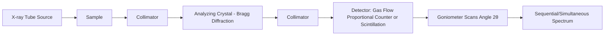
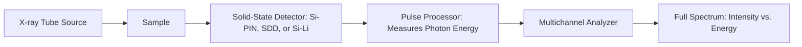

## X-Ray Fluorescence Spectroscopy

### Overview

X-ray fluorescence (XRF) spectroscopy is a non-destructive elemental analysis technique that determines the chemical composition of materials by measuring the characteristic secondary (fluorescent) X-rays emitted from a sample after excitation by a primary X-ray or gamma-ray source. XRF is widely used in metallurgy for alloy identification, quality control, compositional verification, coating thickness measurement, and trace element analysis.

### Fundamental Physics

**Excitation and Emission Process**:

1. A high-energy primary X-ray photon (or electron beam, in electron-probe variants) strikes an atom in the sample, ejecting an inner-shell electron (typically K or L shell) via the photoelectric effect, provided the photon energy exceeds the shell's binding energy.
2. This creates a vacancy in the inner shell, leaving the atom in an excited, unstable ionized state.
3. An electron from a higher-energy outer shell falls to fill the vacancy, releasing energy equal to the difference in binding energies between the two shells.
4. This energy is released either as a **characteristic fluorescent X-ray photon** (the basis of XRF) or transferred to another electron, ejecting it as an **Auger electron** (a competing, non-radiative process).

The emitted photon energy is element-specific and follows **Moseley's Law**:

$$\sqrt{\nu} = k_1(Z - k_2)$$

where $\nu$ is the frequency of the emitted radiation, $Z$ is the atomic number, and $k_1$, $k_2$ are constants specific to the spectral line series (K, L, M), making each element's emission lines a unique fingerprint.

### Key Points

- XRF is **non-destructive** and typically requires minimal sample preparation compared to wet-chemical or combustion methods.
- Characteristic lines are labeled using **Siegbahn notation** (e.g., $K_{\alpha 1}$, $K_{\beta 1}$, $L_{\alpha 1}$), denoting the shell of the vacancy (K, L, M) and the shell from which the filling electron originated.
- **Fluorescence yield** ($\omega$) — the probability that a vacancy is filled with photon emission rather than Auger emission — increases with atomic number, making XRF less sensitive for light elements (Z < 11, i.e., below Na) where Auger emission dominates.
- Two principal detection architectures exist: **Wavelength-Dispersive XRF (WDXRF)** and **Energy-Dispersive XRF (EDXRF)**, differing in how the emitted photons are separated and measured.
- XRF provides **elemental** composition (not molecular/phase information); it cannot directly distinguish oxidation states or crystal structure, unlike XRD.
- Quantification requires **matrix effects** (absorption and secondary fluorescence enhancement between elements) to be corrected via calibration standards or fundamental parameter (FP) methods.

### Instrumentation

#### Wavelength-Dispersive XRF (WDXRF)

- Uses **Bragg diffraction** from an analyzing crystal (e.g., LiF, PET, TAP) to disperse fluorescent X-rays by wavelength, following $n\lambda = 2d\sin\theta$.
- Offers **high spectral resolution** (better peak separation, fewer line overlaps) and excellent sensitivity for light elements when combined with vacuum/helium paths.
- Sequential (single goniometer, scans angle over time) or simultaneous (multiple fixed detectors) configurations exist; sequential is slower but more flexible, simultaneous is faster but less flexible.

#### Energy-Dispersive XRF (EDXRF)

- Uses a **solid-state semiconductor detector** (commonly a Silicon Drift Detector, SDD) that directly measures the energy of each incoming photon via the charge pulse it generates.
- Collects the **entire spectrum simultaneously**, offering faster analysis and a more compact, portable instrument design (basis of handheld XRF analyzers).
- Generally lower spectral resolution than WDXRF, making peak overlap deconvolution (e.g., $S K_\alpha$ / $Pb L_\alpha$ overlaps) more software-dependent.

### Comparison: WDXRF vs. EDXRF

| Property | WDXRF | EDXRF |
| --- | --- | --- |
| Dispersion method | Bragg diffraction (crystal) | Direct energy measurement (detector) |
| Resolution | High (~5–20 eV) | Moderate (~120–150 eV, SDD) |
| Analysis speed | Slower (sequential) unless simultaneous | Fast (full spectrum at once) |
| Light element (Z<11) sensitivity | Better (with vacuum path) | Limited |
| Portability | Bulky, lab-based | Compact; handheld units available |
| Typical cost | Higher | Lower to moderate |
| Common use case | High-precision lab QA/QC, certification | Field screening, alloy sorting, scrap sorting |

### Quantification Methods

**1. Fundamental Parameter (FP) Method**: Calculates elemental concentrations directly from measured intensities using physical constants (mass absorption coefficients, fluorescence yields, absorption jump ratios) without requiring matrix-matched standards; useful for unknown or variable matrices.

**2. Empirical Calibration Curves**: Uses a set of certified reference materials (CRMs) with known composition, similar matrix to the unknowns, to build intensity-vs-concentration calibration curves; offers high accuracy when well-matched standards are available.

**3. Matrix Correction Algorithms**: Corrects for **absorption effects** (an element's emitted X-rays being absorbed by other elements in the matrix before escaping) and **enhancement effects** (secondary fluorescence, where one element's emission excites another element's fluorescence), commonly via algorithms such as the **de Jongh model** or **Lachance-Traill/Claisse-Quintin** equations.

$$C_i = R_i \left(1 + \sum_j \alpha_{ij} C_j\right)$$

where $C_i$ is the concentration of analyte $i$, $R_i$ is the relative intensity, and $\alpha_{ij}$ are empirically or theoretically derived influence coefficients capturing matrix effects from element $j$.

### Worked Example: Alloy Grade Verification (Handheld EDXRF)

**Scenario**: Positive Material Identification (PMI) of an unknown stainless steel component suspected to be either 304 or 316 grade, distinguished primarily by molybdenum content.

**Procedure**:

1. Surface preparation: Light grinding or cleaning to remove oxide scale/paint, since surface contamination biases results (a known limitation for near-surface-sensitive XRF).
2. Position handheld EDXRF probe flush against the flat, clean surface; ensure adequate measurement time (typically 5–30 seconds) for statistically reliable counts, particularly for low-concentration elements.
3. Instrument applies onboard FP calibration (typically factory-calibrated with alloy-grade libraries) to compute elemental wt%.
4. **Output**: Fe (balance), Cr 17.2%, Ni 10.1%, Mo 2.3%, Mn 1.4% — the presence of ~2% Mo confirms **316 stainless steel** (versus 304, which contains negligible Mo).

[Inference] Handheld XRF alloy-grade identification is generally reliable for distinguishing grades with clearly differing key alloying elements (e.g., Mo in 316 vs. 304), but precise quantification of light elements (e.g., carbon, which determines "L" low-carbon variants) is not achievable by XRF and requires complementary techniques such as combustion analysis (LECO) or optical emission spectroscopy (OES).

### Detection Limits and Elemental Range

- Typical elemental range: sodium (Z=11) through uranium (Z=92) for most conventional instruments; specialized vacuum or helium-purged WDXRF systems can extend down to beryllium (Z=4) or boron (Z=5).
- Detection limits vary widely by element and matrix, generally ranging from **single-digit ppm** (for mid-Z elements in a light matrix using WDXRF) to **hundreds of ppm** (for light elements or EDXRF systems).
- Elements lighter than Na are difficult due to low fluorescence yield and strong self-absorption of their low-energy characteristic X-rays within the sample and air path.

### Sample Preparation Considerations

| Sample Type | Preparation Method | Notes |
| --- | --- | --- |
| Solid metal | Flat, clean, ground surface | Surface roughness and oxidation affect accuracy |
| Powder | Pressed pellet (with binder) or fused bead | Fused beads (borate flux fusion) eliminate particle-size and mineralogical effects |
| Liquid | Direct cup with thin film window | Requires appropriate window material (e.g., Mylar, polypropylene) |
| Thin films/coatings | Direct measurement | Basis of coating thickness/composition gauges via layer-specific intensity modeling |

**Fused bead preparation** (lithium borate fusion) is considered a gold-standard preparation method for eliminating mineralogical and particle-size effects, particularly important for geological and cementitious materials, though less commonly needed for homogeneous metal alloys.

### Illustrative Diagram: XRF Excitation-Emission Process (svg_diagram)

<svg xmlns="http://www.w3.org/2000/svg" viewBox="0 0 700 320">
\<style\>
text { font-family: Arial, sans-serif; font-size: 12px; fill: #222; }
.title { font-size: 15px; font-weight: bold; }
.shell { fill: none; stroke: #555; stroke-width: 1; }
.nucleus { fill: #d1495b; }
.electron { fill: #1b6ca8; }
.photon-in { stroke: #f4a300; stroke-width: 2; marker-end: url(#arrowY); }
.photon-out { stroke: #2a9d8f; stroke-width: 2; marker-end: url(#arrowG); }
.ejected { stroke: #d1495b; stroke-width: 1.5; marker-end: url(#arrowR); stroke-dasharray: 4,2; }
\</style\>
<text x="20" y="25" class="title">Step 1: Primary Excitation (svg_diagram)</text>

<circle cx="150" cy="150" r="8" class="nucleus" />

<circle cx="150" cy="150" r="40" class="shell" />

<circle cx="150" cy="150" r="75" class="shell" />

<circle cx="150" cy="150" r="105" class="shell" />

<circle cx="110" cy="150" r="4" class="electron" />

<text x="60" y="120">K-shell electron</text>

<line x1="20" y1="60" x2="105" y2="147" class="photon-in" />

<text x="20" y="50">Incident X-ray photon</text>

<line x1="110" y1="150" x2="60" y2="100" class="ejected" />

<text x="20" y="90" font-size="11" fill="`#d1495b`">Ejected photoelectron</text>

<text x="400" y="25" class="title">Step 2: Fluorescent Emission (svg_diagram)</text>

<circle cx="550" cy="150" r="8" class="nucleus" />

<circle cx="550" cy="150" r="40" class="shell" />

<circle cx="550" cy="150" r="75" class="shell" />

<circle cx="550" cy="150" r="105" class="shell" />

<circle cx="625" cy="150" r="4" class="electron" />

<circle cx="510" cy="150" r="4" class="electron" opacity="0.3" />

<line x1="620" y1="148" x2="515" y2="150" stroke="`#1b6ca8`" stroke-width="1.5" stroke-dasharray="3,2" />

<text x="580" y="130" font-size="11">L→K transition</text>

<line x1="510" y1="150" x2="650" y2="230" class="photon-out" />

<text x="600" y="250">Characteristic X-ray (Kα)</text>

<text x="20" y="300" font-size="11" fill="#555">Vacancy created in inner shell is filled by outer-shell electron, releasing element-specific energy</text>

</svg>

### Applications in Metallurgy

- **Positive Material Identification (PMI)**: Rapid alloy grade verification for incoming material inspection, preventing mix-ups in critical applications (pressure vessels, piping, aerospace components).
- **Scrap sorting and recycling**: Handheld/benchtop EDXRF rapidly sorts scrap metal by alloy family for efficient recycling stream separation.
- **Coating thickness and composition**: Multilayer coating analysis (e.g., Zn coating on galvanized steel, precious metal plating thickness) via calibrated intensity-thickness relationships.
- **Process/quality control**: In-line or at-line composition verification during steelmaking, foundry operations, and alloy production.
- **Failure analysis**: Identifying contamination, unexpected elemental segregation, or off-spec composition contributing to component failure.
- **Environmental and regulatory compliance**: RoHS/hazardous substance screening (Pb, Cd, Hg, Cr) in manufactured components.

### Limitations

- **Surface sensitivity**: Signal originates primarily from a shallow depth (micrometers to tens of micrometers depending on element and matrix energy), so results may not represent bulk composition if surface contamination, coatings, or heterogeneity exist.
- **Light element weakness**: Poor sensitivity/accuracy below Na (Z=11); critically, **carbon cannot be measured by XRF**, a significant limitation for steel grade classification where carbon content is often definitive.
- **Matrix effects**: Requires careful correction; uncorrected matrix effects are a primary source of quantification error.
- **Cannot provide phase/structural information**: Complementary techniques (XRD) are required to determine crystal structure, phase identity, or oxidation state.
- **Geometry sensitivity**: Sample surface curvature, roughness, and measurement distance/angle affect handheld XRF accuracy; results are less reliable on irregular or rough-cast surfaces.

### Related Topics

- Positive Material Identification (PMI) Standards and Procedures
- Optical Emission Spectroscopy (OES) for Metals
- LECO Combustion Analysis for Carbon/Sulfur Determination
- Electron Probe Microanalysis (EPMA) and Energy-Dispersive X-ray Spectroscopy (EDS) in SEM
- Total Reflection X-Ray Fluorescence (TXRF) for Trace Analysis
- X-Ray Diffraction (XRD) for Phase Identification
- Fundamental Parameter Calibration Methods
- Coating Thickness Gauging via XRF