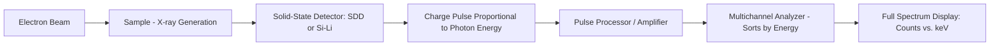
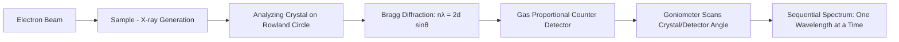

## Energy Dispersive and Wavelength Dispersive Spectroscopy

### Overview

Energy Dispersive Spectroscopy (EDS, also EDX) and Wavelength Dispersive Spectroscopy (WDS) are complementary X-ray microanalysis techniques most commonly implemented as detector attachments on electron-beam instruments—scanning electron microscopes (SEM) and electron probe microanalyzers (EPMA). Both techniques identify and quantify elemental composition by detecting characteristic X-rays generated when a focused electron beam interacts with a sample, but they differ fundamentally in how the emitted X-rays are discriminated and measured, leading to distinct trade-offs in resolution, sensitivity, and speed.

### Fundamental Physics

When a high-energy electron beam (typically 5–30 kV in SEM/EPMA) strikes a sample, it can eject an inner-shell electron from an atom via inelastic scattering, creating a vacancy. As in XRF, this vacancy is filled by an outer-shell electron, releasing energy as a characteristic X-ray photon whose energy is element-specific (governed by Moseley's Law, as in XRF). The key distinction from XRF is the **excitation source**: a focused electron beam rather than a photon beam, enabling **spatially resolved microanalysis** at micrometer to sub-micrometer scale, correlated directly with SEM imaging.

The **interaction volume** (teardrop-shaped region within the sample where X-rays are generated) depends on beam energy, sample density, and average atomic number, described approximately by the Kanaya-Okayama range equation, and determines the spatial resolution of the analysis (typically ~1–3 μm for standard SEM-EDS conditions).

### Key Points

- **EDS** uses a solid-state semiconductor detector that measures the **energy** of each incoming X-ray photon directly via the charge pulse it produces; it collects the full spectrum simultaneously.
- **WDS** uses **Bragg diffraction** from an analyzing crystal to separate X-rays by **wavelength**, measuring one wavelength (element) at a time via goniometer positioning.
- WDS offers substantially **higher spectral resolution** (5–20 eV) compared to EDS (~120–140 eV for modern SDD detectors), critically important for resolving overlapping peaks (e.g., $S K_\alpha$/$Pb M_\alpha$, $Ti K_\alpha$/$Ba L_\alpha$).
- EDS is significantly **faster** for full-spectrum qualitative survey and elemental mapping; WDS requires sequential wavelength scanning, making full elemental mapping much slower.
- WDS provides **lower detection limits** (typically 100s of ppm vs. EDS's ~0.1 wt%) and better **quantitative accuracy**, particularly for trace elements and light elements.
- EPMA instruments typically combine **multiple WDS spectrometers** (each with different analyzing crystals) with an EDS detector for comprehensive analysis capability.

### EDS Architecture and Working Principle

- Modern EDS systems predominantly use **Silicon Drift Detectors (SDD)**, which offer higher count-rate capability and better resolution than legacy Si(Li) detectors, and operate without liquid nitrogen cooling (Peltier-cooled).
- **Energy resolution** is typically specified at the Mn $K_\alpha$ line (5.9 keV), with modern SDDs achieving ~123–129 eV FWHM.
- Dead time and pulse pile-up must be managed at high count rates; pulse processing electronics reject overlapping/piled-up pulses to maintain spectral accuracy.

### WDS Architecture and Working Principle

- Operates on the **Rowland circle geometry**, where sample, analyzing crystal, and detector maintain a fixed geometric relationship as the crystal/detector assembly rotates to satisfy the Bragg condition for different wavelengths.
- Multiple analyzing crystals (e.g., LiF, PET, TAP, LDE for light elements) with different **2d spacings** are used to cover the full elemental range, each crystal optimized for a specific wavelength/energy band.
- Detection via **gas-flow proportional counters** (P-10 gas: Ar/CH₄ mixture) or sealed proportional counters, providing high count-rate linearity important for quantitative work.

### Comparison Table: EDS vs. WDS

| Property | EDS | WDS |
| --- | --- | --- |
| Dispersion mechanism | Direct energy measurement (detector) | Bragg diffraction (analyzing crystal) |
| Energy resolution | ~120–140 eV (at Mn Kα) | ~5–20 eV |
| Spectrum acquisition | Simultaneous (full spectrum at once) | Sequential (one wavelength at a time) |
| Detection limits | ~0.1–1 wt% typical | ~100–500 ppm typical |
| Analysis speed | Fast (seconds for survey spectrum) | Slower (minutes per element) |
| Peak overlap resolution | Limited; requires deconvolution software | Excellent; physically resolved |
| Light element sensitivity | Moderate (windowless/thin-window detectors) | Better (dedicated LDE crystals) |
| Elemental mapping speed | Fast, routine | Slow; typically limited to select elements |
| Beam current tolerance | Lower (pulse pile-up at high current) | Higher (enables better counting statistics) |
| Typical instrument cost | Lower; standard SEM accessory | Higher; primarily EPMA or high-end SEM |
| Quantitative accuracy | Good (ZAF/PB-ZAF correction) | Excellent (gold standard for point analysis) |

### Quantification: The ZAF and Phi-Rho-Z Correction Methods

Raw X-ray intensities from EDS or WDS require **matrix correction** before conversion to accurate elemental concentrations, since factors beyond concentration affect measured intensity:

**ZAF Correction** accounts for three effects:

- **Z (Atomic Number)**: Corrects for differences in electron backscattering and stopping power between standard and unknown.
- **A (Absorption)**: Corrects for reabsorption of generated X-rays as they travel through the sample before escaping.
- **F (Fluorescence)**: Corrects for secondary fluorescence, where one element's characteristic X-rays excite additional fluorescence from another element.

$$C_i^{\text{unk}} = \frac{I_i^{\text{unk}}}{I_i^{\text{std}}} \times ZAF \times C_i^{\text{std}}$$

**Phi-Rho-Z ($\phi(\rho z)$) Method**: A more physically rigorous approach modeling the depth distribution of X-ray generation directly, generally considered more accurate than classical ZAF, especially for low beam energies or light elements, and implemented in most modern quantification software (e.g., STRATAGem, PAP method).

[Inference] Modern commercial software packages increasingly default to Phi-Rho-Z-based algorithms over classical ZAF, though both remain in use and terminology varies by manufacturer; consult the specific instrument's software documentation for the exact algorithm implemented.

### Worked Example: Quantitative Point Analysis on a Ni-based Superalloy

**Scenario**: Determining composition of a $\gamma'$ precipitate versus $\gamma$ matrix in a Ni-based superalloy using EPMA (WDS).

**Procedure**:

1. **Standards calibration**: Measure pure element or well-characterized compound standards (pure Ni, pure Al, pure Ti, NiAl compound) under identical beam conditions (accelerating voltage, beam current) as the unknown.
2. **Beam conditions**: Select accelerating voltage (e.g., 15–20 kV) sufficient to excite characteristic lines of interest (Ni $K_\alpha$, Al $K_\alpha$, Ti $K_\alpha$) while balancing spatial resolution against overvoltage ratio.
3. **WDS spectrometer assignment**: Assign each element to an appropriate analyzing crystal (e.g., PET for Ni $K_\alpha$, TAP for Al $K_\alpha$) and peak-position each spectrometer via wavelength scan.
4. **Point analysis**: Position beam on $\gamma'$ precipitate (typically 0.1–1 μm scale, requiring careful beam positioning and consideration of interaction volume relative to precipitate size) and on $\gamma$ matrix; count for sufficient time (e.g., 20–30 s per element) for good counting statistics.
5. **Background correction**: Measure background intensity at off-peak positions on either side of each characteristic line, subtracted from peak intensity.
6. **Matrix correction**: Apply Phi-Rho-Z or ZAF correction to convert corrected intensities to wt% composition.

**Output**: $\gamma'$ precipitate: Ni 3Al(Ti) stoichiometry approximately Ni-73Al-15Ti-12(bal) at%; confirms $\gamma'$ (Ni₃(Al,Ti)) ordered intermetallic phase, distinct from $\gamma$ matrix solid solution composition.

**Caveat**: [Inference] If the precipitate size approaches or is smaller than the electron beam interaction volume, matrix contribution from surrounding $\gamma$ phase will contaminate the measured composition; this is a well-recognized spatial resolution limitation requiring either lower beam energy (reducing interaction volume) or acknowledgment of averaging effects in the reported result.

### Elemental Mapping

Both EDS and WDS can generate 2D compositional maps by rastering the electron beam and recording X-ray intensity (or full spectra, for EDS) at each pixel:

- **EDS mapping**: Modern systems collect the **full spectrum at every pixel** ("spectral imaging"), allowing post-acquisition extraction of any element's map, quantitative point reprocessing, and phase mapping—all from a single dataset.
- **WDS mapping**: Limited to one (or as many spectrometers as available, typically 2–5) elements per pass due to sequential wavelength measurement; slower but offers superior sensitivity for trace-level distribution mapping (e.g., minor alloying element segregation).

### Light Element Analysis Considerations

- Light elements (B, C, N, O, F) present challenges for both techniques due to low fluorescence yield, long wavelength X-rays that are easily absorbed, and low overvoltage ratios at typical beam energies.
- **EDS**: Requires thin-window or windowless detectors to allow low-energy photon transmission; peak overlaps and low count rates for light elements remain challenging.
- **WDS**: Requires specialized large-2d-spacing crystals (e.g., layered synthetic microstructures, LDE) and is generally the preferred method for accurate light element quantification.

### Illustrative Diagram: EDS vs WDS Detection Pathway (svg_diagram)

<svg xmlns="http://www.w3.org/2000/svg" viewBox="0 0 720 320">
\<style\>
text { font-family: Arial, sans-serif; font-size: 12px; fill: #222; }
.title { font-size: 15px; font-weight: bold; }
.beam { stroke: #333; stroke-width: 2; marker-end: url(#arrowK); }
.xray { stroke: #f4a300; stroke-width: 1.5; marker-end: url(#arrowY2); }
.box { fill: #e2e8f0; stroke: #334155; stroke-width: 1.2; }
\</style\>
<text x="20" y="22" class="title">EDS Pathway (svg_diagram)</text>

<line x1="60" y1="40" x2="60" y2="100" class="beam" />

<text x="15" y="35">e⁻ beam</text>

<circle cx="60" cy="105" r="6" fill="#555" />

<text x="20" y="125">Sample</text>

<line x1="66" y1="105" x2="150" y2="150" class="xray" />

<rect x="150" y="135" width="70" height="30" class="box" />

<text x="155" y="155" font-size="10">SDD Detector</text>

<rect x="150" y="185" width="70" height="30" class="box" />

<text x="155" y="205" font-size="10">Full Spectrum</text>

<line x1="185" y1="165" x2="185" y2="185" class="beam" />

<text x="20" y="240" font-size="11" fill="#555">Simultaneous energy measurement</text>

<text x="400" y="22" class="title">WDS Pathway (svg_diagram)</text>

<line x1="440" y1="40" x2="440" y2="100" class="beam" />

<text x="395" y="35">e⁻ beam</text>

<circle cx="440" cy="105" r="6" fill="#555" />

<text x="400" y="125">Sample</text>

<line x1="446" y1="105" x2="530" y2="80" class="xray" />

<rect x="530" y="60" width="90" height="30" class="box" />

<text x="535" y="80" font-size="10">Analyzing Crystal</text>

<line x1="575" y1="90" x2="575" y2="140" class="xray" />

<rect x="530" y="140" width="90" height="30" class="box" />

<text x="540" y="160" font-size="10">Proportional Counter</text>

<line x1="575" y1="170" x2="575" y2="200" class="beam" />

<rect x="530" y="200" width="90" height="30" class="box" />

<text x="540" y="220" font-size="10">One λ at a time</text>

<text x="400" y="260" font-size="11" fill="#555">Sequential goniometer scan (Rowland circle)</text>

</svg>

### Selection Criteria: When to Use Which

| Analytical Need | Preferred Technique |
| --- | --- |
| Rapid qualitative survey / unknown identification | EDS |
| Elemental mapping (large area, many elements) | EDS |
| Trace element quantification (<0.5 wt%) | WDS |
| Resolving overlapping peaks (e.g., S/Pb, Ti/Ba) | WDS |
| High-accuracy quantitative point analysis | WDS (EPMA) |
| Light element quantification (B, C, N, O) | WDS (with LDE crystals) |
| Routine SEM-based failure analysis / QC | EDS |
| Small precipitate/phase composition (research-grade) | WDS (EPMA), given superior spatial/compositional precision |

### Related Topics

- Electron Probe Microanalysis (EPMA) Instrumentation and Standards
- ZAF and Phi-Rho-Z Matrix Correction Methods
- Scanning Electron Microscopy (SEM) Imaging Modes (SE, BSE)
- X-Ray Fluorescence Spectroscopy (XRF)
- Electron Backscatter Diffraction (EBSD) for Crystallographic Mapping
- Interaction Volume and Spatial Resolution in Electron Microanalysis
- Standards-Based vs. Standardless Quantification in EDS
- Elemental Mapping and Spectral Imaging Techniques