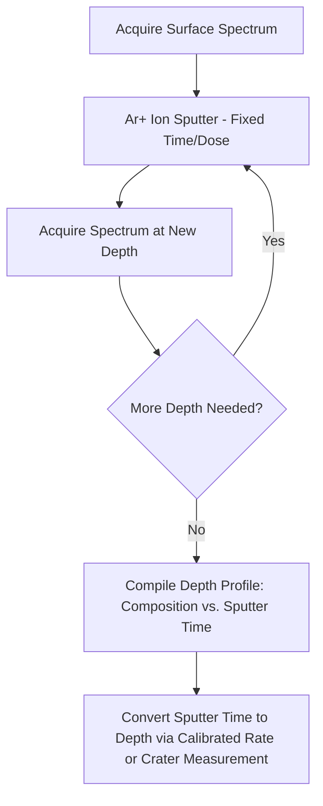

## Auger and X-Ray Photoelectron Spectroscopy


### Overview

Auger Electron Spectroscopy (AES) and X-Ray Photoelectron Spectroscopy (XPS, also historically ESCA — Electron Spectroscopy for Chemical Analysis) are surface-sensitive analytical techniques that probe the outermost atomic layers (typically 1–10 nm) of a material. Both techniques measure the kinetic energy of emitted electrons to determine elemental composition and, critically, chemical bonding state — a capability distinguishing them from bulk-sensitive techniques like XRF or EDS/WDS.

### Fundamental Physics

**Photoemission (basis of XPS)**:

When a sample is irradiated with monochromatic X-rays (commonly Al $K_\alpha$ = 1486.6 eV or Mg $K_\alpha$ = 1253.6 eV), core-level electrons are ejected via the photoelectric effect. The kinetic energy of the ejected photoelectron is measured, and the electron's original binding energy is calculated:

$$E_B = h\nu - E_K - \phi_{sp}$$

where $E_B$ is binding energy, $h\nu$ is the incident photon energy, $E_K$ is the measured kinetic energy, and $\phi_{sp}$ is the spectrometer work function (an instrumental calibration constant).

**Auger Emission (basis of AES)**:

The Auger process is a two-electron relaxation mechanism competing with fluorescent X-ray emission: after an inner-shell vacancy is created (by electron beam or X-ray excitation), an outer-shell electron fills the vacancy, and the released energy is transferred directly to a third electron (rather than emitted as a photon), which is then ejected as an **Auger electron**. Critically, the Auger electron's kinetic energy is **independent of the excitation source energy**, depending only on the three atomic energy levels involved:

$$E_{KLL} = E_K - E_L - E_L' - \phi$$

(for a KLL Auger transition, as an illustrative example, where $E_K$, $E_L$, $E_L'$ are the binding energies of the shells involved).

### Key Points

- Both techniques are **extremely surface-sensitive** because the escape depth of electrons at these kinetic energies (typically tens to a few thousand eV) is limited by inelastic mean free path to roughly **1–10 nm**, regardless of X-ray penetration depth (which is much larger).
- **XPS** provides quantitative elemental composition **and chemical state information** (oxidation state, bonding environment) via **chemical shifts** in binding energy.
- **AES** offers **superior spatial resolution** (down to ~10–20 nm with field-emission electron sources) because it is typically excited by a focused electron beam, enabling Auger microprobe mapping — unlike XPS, where X-ray beam spot size (traditionally hundreds of μm, though modern monochromated micro-XPS achieves ~10 μm) limits lateral resolution.
- Both require **ultra-high vacuum (UHV)** conditions (typically <10⁻⁹ mbar) to prevent surface contamination during analysis and to allow unimpeded electron travel to the detector.
- **Depth profiling** is achieved in both techniques by combining surface analysis with **ion sputtering** (typically Ar⁺ ion beam) to progressively remove surface layers between measurements.
- Auger emission and X-ray fluorescence are **competing de-excitation pathways**; fluorescence yield increases with atomic number, meaning AES is relatively more efficient (higher signal) for **light-to-medium Z elements**, while XPS efficiency is less strongly Z-dependent for photoemission cross-sections in the ranges typically used.

### XPS Instrumentation and Workflow


- **Hemispherical sector analyzer (HSA)** is the standard energy analyzer, dispersing electrons by kinetic energy via an electrostatic field between concentric hemispheres, operated typically in "constant analyzer energy" (CAE) mode for consistent resolution across the spectrum.
- **Monochromatization** (using a quartz crystal to diffract the Al $K_\alpha$ line) narrows the X-ray linewidth, improving spectral resolution and eliminating satellite peaks and Bremsstrahlung background.
- **Charge neutralization** (low-energy electron flood gun) is required for insulating/non-conductive samples, which otherwise develop a positive surface charge during analysis that shifts the entire spectrum.

### AES Instrumentation and Workflow

```mermaid
flowchart LR
    A[Focused Electron Beam: 3-25 keV] --> B[Sample in UHV Chamber]
    B --> C[Emitted Auger Electrons plus Backscattered/Secondary Electrons]
    C --> D[Electron Energy Analyzer: CMA or HSA]
    D --> E[Electron Detector]
    E --> F[Derivative Spectrum dN(E)/dE or Direct N(E)]
    F --> G[Elemental ID via Auger Peak Positions]
```

- **Cylindrical Mirror Analyzer (CMA)** is traditionally favored for AES due to high transmission and rapid scanning, though modern systems increasingly use CHA/HSA analyzers shared with XPS in combined instruments.
- Because Auger peaks sit atop a large, sloping secondary-electron background, spectra are often displayed as the **derivative** $dN(E)/dE$ to enhance peak visibility, though modern digital systems can also present direct $N(E)$ spectra with digital background subtraction.
- Focused electron beam (similar to SEM column) enables **Scanning Auger Microscopy (SAM)**, producing elemental maps with high spatial resolution.

### Comparison Table: XPS vs. AES

| Property | XPS | AES |
| --- | --- | --- |
| Excitation source | Monochromatic X-rays | Focused electron beam |
| Information depth | ~1–10 nm | ~1–10 nm (similar) |
| Spatial resolution | ~10 μm (micro-XPS) to mm (standard) | ~10–20 nm (field-emission AES) |
| Chemical state (bonding) info | Excellent (binding energy shifts) | Limited (Auger parameter can assist, but less direct) |
| Elemental range | Li (Z=3) and above | Li (Z=3) and above (H, He not detectable by either) |
| Quantification accuracy | Good, with sensitivity factors | Good, with sensitivity factors; more matrix-sensitive |
| Beam damage risk | Lower (X-ray excitation gentler) | Higher (electron beam can damage sensitive/insulating materials) |
| Insulator compatibility | Good (with charge neutralization) | More challenging (charging effects more severe) |
| Best-suited application | Chemical state/bonding analysis, thin films | High-resolution spatial elemental mapping |

### Chemical Shift Analysis in XPS

The binding energy of a core-level electron is sensitive to the local chemical environment of the atom, shifting measurably with oxidation state, coordination, and bonding partners. This **chemical shift** is central to XPS's analytical power:

**Example**: Metallic iron (Fe⁰) vs. iron oxide — the Fe $2p_{3/2}$ peak position and satellite structure differ characteristically between Fe⁰ (~706.8 eV), Fe²⁺ (as in FeO, ~709.5 eV with satellite), and Fe³⁺ (as in Fe₂O₃, ~710.9 eV with distinct satellite structure), allowing direct identification of oxidation state and, with careful peak fitting, relative proportions of each species present on the surface.

**Peak fitting considerations**:

- Spin-orbit splitting (e.g., $2p_{3/2}$/$2p_{1/2}$ doublets) must be accounted for with fixed intensity ratios and known energy separations specific to each element.
- Background subtraction (commonly **Shirley** or **Tougaard** background models) is applied before quantitative peak area analysis.
- Charge referencing (commonly to adventitious carbon C 1s at 284.8 eV) corrects for any residual charging-induced binding energy shift.

### Worked Example: Passive Oxide Layer Characterization on Stainless Steel

**Scenario**: Characterizing the native passive oxide film on 316L stainless steel to understand its protective Cr-enrichment behavior.

**Procedure (XPS)**:

1. Load sample into UHV chamber; achieve base pressure (<10⁻⁹ mbar) before analysis.
2. Acquire a **survey scan** (wide binding energy range, e.g., 0–1200 eV) to identify all elements present at the surface (Fe, Cr, Ni, O, C, possibly Mo).
3. Acquire **high-resolution narrow scans** over Fe 2p, Cr 2p, Ni 2p, and O 1s regions with sufficient energy resolution to resolve chemical states.
4. Peak-fit the Cr 2p region to deconvolute metallic Cr⁰ from Cr³⁺ (as Cr₂O₃), quantifying the oxide-to-metal ratio.
5. Optionally, perform **Ar⁺ sputter depth profiling**, alternating short sputter cycles with XPS acquisition, to map the Cr/Fe/Ni oxide composition as a function of depth through the passive film.

**Output**: Confirms **Cr-enrichment** in the outer passive film (a higher Cr:Fe ratio in the oxide compared to the bulk alloy composition), consistent with the selective oxidation mechanism responsible for stainless steel's corrosion resistance; depth profile reveals oxide film thickness typically in the 1–5 nm range transitioning to metallic substrate.

[Inference] Sputter depth profiling with Ar⁺ ions can induce **preferential sputtering** (differential removal rates between elements) and possible **reduction artifacts** (e.g., apparent reduction of higher oxidation states), a well-documented limitation; results should be interpreted with awareness of potential sputter-induced chemical state alteration, particularly for oxide films.

### Depth Profiling Methodology



- Sputter rate calibration (via profilometry of a known standard, e.g., Ta₂O₅ or SiO₂) converts sputter time to approximate depth.
- **Angle-resolved XPS (ARXPS)** offers a non-destructive alternative for very thin films (<10 nm), varying the electron take-off angle relative to the surface to probe different effective depths without sputtering, avoiding sputter-induced artifacts.

### Illustrative Diagram: XPS vs. AES Emission Comparison (svg_diagram)

<svg xmlns="http://www.w3.org/2000/svg" viewBox="0 0 700 300">
\<style\>
text { font-family: Arial, sans-serif; font-size: 12px; fill: #222; }
.title { font-size: 15px; font-weight: bold; }
.shell { fill: none; stroke: #555; stroke-width: 1; }
.nucleus { fill: #d1495b; }
.electron { fill: #1b6ca8; }
.in { stroke: #f4a300; stroke-width: 2; marker-end: url(#a1); }
.out { stroke: #2a9d8f; stroke-width: 2; marker-end: url(#a2); }
\</style\>
<text x="20" y="22" class="title">XPS: Direct Photoemission (svg_diagram)</text>

<circle cx="150" cy="140" r="7" class="nucleus" />

<circle cx="150" cy="140" r="35" class="shell" />

<circle cx="150" cy="140" r="65" class="shell" />

<line x1="30" y1="60" x2="118" y2="137" class="in" />

<text x="20" y="50">Incident X-ray (hν)</text>

<circle cx="118" cy="138" r="3" class="electron" />

<line x1="120" y1="135" x2="220" y2="70" class="out" />

<text x="180" y="60">Photoelectron (E_K measured)</text>

<text x="20" y="230" font-size="11" fill="#555">Single-step process; one electron ejected directly</text>

<text x="400" y="22" class="title">AES: Two-Electron Relaxation (svg_diagram)</text>

<circle cx="530" cy="140" r="7" class="nucleus" />

<circle cx="530" cy="140" r="35" class="shell" />

<circle cx="530" cy="140" r="65" class="shell" />

<circle cx="530" cy="140" r="90" class="shell" />

<text x="400" y="55">1: Vacancy created (beam/X-ray)</text>

<circle cx="498" cy="140" r="3" class="electron" opacity="0.3" />

<text x="400" y="180" font-size="11">2: Outer electron fills vacancy</text>

<line x1="595" y1="140" x2="500" y2="140" stroke="`#1b6ca8`" stroke-width="1.2" stroke-dasharray="3,2" />

<text x="400" y="200" font-size="11">3: Energy ejects 3rd electron (Auger e⁻)</text>

<line x1="620" y1="145" x2="670" y2="90" class="out" />

<text x="580" y="80" font-size="11">Auger electron</text>

<text x="400" y="240" font-size="11" fill="#555">Three-body process; KE independent of excitation energy</text>

</svg>

### Applications in Metallurgy and Materials Science

- **Passivation and corrosion studies**: Characterizing native oxide films, passive layers, and corrosion product chemistry on stainless steels, aluminum alloys, and other corrosion-resistant metals.
- **Thin film and coating analysis**: Composition and chemical state verification of PVD/CVD coatings, diffusion barriers, and multilayer stacks.
- **Grain boundary segregation (AES)**: In-situ fracture within the UHV chamber followed by AES analysis of the freshly exposed fracture surface reveals segregated species (e.g., P, S, Sb at grain boundaries), a classical application in temper embrittlement and intergranular fracture studies.
- **Surface contamination identification**: Diagnosing adhesion failures, weld defects, or bonding issues caused by trace surface contaminants (organic residues, oxide layers) invisible to bulk techniques.
- **Catalyst characterization**: Determining active-site oxidation states and surface composition in heterogeneous catalysts.
- **Semiconductor and electronic materials**: Interface chemistry, oxide stoichiometry, and dopant chemical state in thin-film device structures.

### Limitations

- **UHV requirement**: Both techniques require complex, expensive vacuum systems and cannot analyze volatile, high-vapor-pressure, or "wet" samples without specialized sample handling (e.g., freeze-fracture, near-ambient-pressure XPS variants).
- **Extreme surface sensitivity**: A double-edged characteristic — highly informative for surface chemistry, but results can be dominated by adventitious contamination (airborne hydrocarbons, adsorbed moisture) if surfaces are not properly prepared or analyzed promptly after exposure.
- **Insulator charging**: Non-conductive samples require charge compensation; imperfect neutralization introduces binding energy referencing uncertainty in XPS and more severe distortion in AES.
- **Electron beam damage (AES)**: Sensitive materials (some polymers, certain oxides, hydrated compounds) can be damaged or chemically altered by the electron beam during analysis.
- **Quantification uncertainty**: Both rely on empirically or theoretically derived sensitivity factors that carry inherent uncertainty (~10–20% relative accuracy is typical for standardless quantification), and surface roughness affects both techniques' quantitative accuracy.

### Related Topics

- Secondary Ion Mass Spectrometry (SIMS) for Depth Profiling
- Angle-Resolved XPS for Non-Destructive Depth Analysis
- Passivation and Oxide Film Characterization in Corrosion Science
- Grain Boundary Segregation and Temper Embrittlement Analysis
- Scanning Auger Microscopy (SAM) for High-Resolution Elemental Mapping
- Peak Fitting and Background Subtraction Methods (Shirley, Tougaard)
- Ultra-High Vacuum (UHV) System Design and Surface Preparation
- Near-Ambient-Pressure XPS (NAP-XPS)