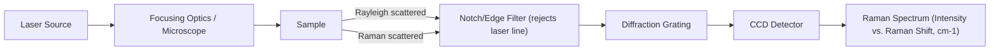

## Raman and Infrared Spectroscopy

### Physical Basis of Vibrational Spectroscopy

Both techniques probe molecular and lattice vibrations, but through different physical mechanisms.

**Infrared (IR) absorption** occurs when incident photon energy matches a vibrational transition energy and that vibration produces a change in the molecule's or bond's dipole moment. The selection rule is:

$$\frac{\partial \mu}{\partial Q} \neq 0$$

where $\mu$ is the dipole moment and $Q$ is the normal coordinate of vibration. Absorption removes photons of specific wavenumber from the transmitted/reflected beam.

**Raman scattering** is an inelastic light-scattering process. A monochromatic laser photon interacts with the sample; most photons scatter elastically (Rayleigh scattering), but a small fraction (~1 in $10^6$–$10^8$) exchange energy with a vibrational mode, emerging red-shifted (Stokes) or blue-shifted (anti-Stokes) in energy. The selection rule requires a change in polarizability:

$$\frac{\partial \alpha}{\partial Q} \neq 0$$

where $\alpha$ is the polarizability tensor.

**Key Points**

- IR-active and Raman-active modes are governed by different selection rules; in centrosymmetric structures they are mutually exclusive (rule of mutual exclusion).
- Symmetric, non-polar vibrations (e.g., homonuclear bonds, symmetric stretches) tend to be Raman-active but IR-inactive.
- Asymmetric, polar vibrations tend to be IR-active but weak or forbidden in Raman.
- Both techniques report the same underlying vibrational energy levels (typically 400–4000 cm⁻¹ for molecular modes; down to <100 cm⁻¹ for lattice/phonon modes), but with complementary intensity patterns.

### Instrumentation

#### FTIR Spectrometer

- **Source**: Globar (SiC) or Nernst glow rod for mid-IR
- **Interferometer**: Michelson-type beamsplitter/moving-mirror assembly; interferogram is Fourier-transformed to yield the spectrum
- **Detector**: DTGS (deuterated triglycine sulfate, room temperature) or MCT (mercury cadmium telluride, liquid-N₂ cooled, higher sensitivity)
- **Sampling modes**:
  - Transmission (thin films, KBr pellets)
  - ATR (Attenuated Total Reflectance) — sample pressed against a high-refractive-index crystal (diamond, ZnSe, Ge); evanescent wave penetrates ~0.5–2 µm into sample. Dominant mode for solid metallurgical samples since it requires minimal preparation.
  - DRIFTS (Diffuse Reflectance) — for powders

#### Raman Spectrometer

- **Excitation source**: Laser, commonly 532 nm (green), 633 nm (HeNe), 785 nm, or 1064 nm (NIR, reduces fluorescence)
- **Filtering**: Notch or edge filter to reject the dominant Rayleigh-scattered light (~$10^6$–$10^8$× more intense than Raman signal)
- **Dispersive element**: Diffraction grating
- **Detector**: CCD (charge-coupled device), often cooled
- **Confocal microscopy coupling**: Enables spatial resolution down to ~1 µm laterally and depth profiling via confocal aperture — critical for phase mapping in heterogeneous microstructures

### Application to Materials Science and Metallurgy

While both techniques originate in molecular spectroscopy, their metallurgical relevance centers on **non-metallic phases** associated with metals and alloys, since pure metallic bonding produces no dipole-moment or polarizability change from lattice vibrations in the simple sense — bulk metals are largely IR/Raman "silent" in the classical vibrational sense (their optical response is dominated by free-electron/plasma behavior instead).

**Raman spectroscopy is used for:**

- **Oxide scale and corrosion product identification**: distinguishing hematite (Fe₂O₃), magnetite (Fe₃O₄), goethite (FeOOH), and wüstite (FeO) on steel surfaces via characteristic peak positions (e.g., hematite ~225, 245, 291, 411, 611 cm⁻¹; magnetite ~670 cm⁻¹)
- **Carbon speciation**: distinguishing graphite (G-band ~1580 cm⁻¹, D-band ~1350 cm⁻¹), diamond (1332 cm⁻¹), and amorphous carbon in cast irons, coatings, and carburized layers; D/G intensity ratio quantifies disorder
- **Residual stress mapping** in ceramics, coatings, and semiconductor/metal interfaces via peak shift (stress-induced phonon frequency shift)
- **Sulfide and nitride inclusion characterization** in steels (MnS, TiN, etc.)
- **Phase identification in thermal barrier coatings** (yttria-stabilized zirconia tetragonal vs. monoclinic phase content — critical for coating degradation assessment)

**IR spectroscopy (particularly FTIR) is used for:**

- **Organic contamination and lubricant residue analysis** on metal surfaces prior to welding, coating, or bonding
- **Polymer and composite matrix characterization** in metal-matrix and polymer-matrix composites
- **Corrosion inhibitor film characterization** (adsorbed organic inhibitor layers on metal surfaces)
- **Hydrogen-related defects**: O-H and related stretching modes in hydrated corrosion products
- **Refractory and slag mineralogy**: Si-O, Al-O stretching bands used to characterize silicate/aluminate network structure in slags and refractories, informing viscosity and reactivity behavior

**Example**

A failure analyst investigating red-brown scale on a failed carbon steel pipeline section acquires a Raman spectrum using a 532 nm laser at low power (<1 mW, to avoid laser-induced heating/oxidation artifacts). Peaks at 225, 245, 291, 411, and 611 cm⁻¹ confirm hematite (α-Fe₂O₃), while a shoulder near 660–670 cm⁻¹ suggests coexisting magnetite, consistent with a mixed-valence oxide scale formed under cyclic wet/dry atmospheric corrosion rather than uniform high-temperature oxidation (which would favor a more magnetite/wüstite-dominated layered scale).

### Comparative Summary

| Attribute | Raman | FTIR |
| --- | --- | --- |
| Physical mechanism | Inelastic scattering | Resonant absorption |
| Selection rule | $\partial \alpha / \partial Q \neq 0$ | $\partial \mu / \partial Q \neq 0$ |
| Sample prep | Minimal; works through glass/transparent media | Often needs ATR contact or transmission prep |
| Water sensitivity | Low (water is weak Raman scatterer) | High (water strongly IR-absorbing) |
| Spatial resolution | ~1 µm (confocal) | ~10–20 µm (micro-ATR) typical |
| Metals/opaque samples | Directly probes surface oxides/inclusions | Surface-limited (ATR) or requires reflection accessories |
| Fluorescence interference | Significant issue, mitigated by NIR excitation | Not applicable |
| Typical metallurgical use | Oxide/carbon/inclusion phase ID, stress mapping | Organic residue, polymer/composite, slag network analysis |

### Data Interpretation Considerations

- **Peak position** → vibrational mode energy → bond strength/force constant; shifts indicate strain, stoichiometry change, or phase transformation
- **Peak width (FWHM)** → crystallinity/disorder; broader peaks indicate amorphous or nanocrystalline character, or compositional inhomogeneity
- **Peak intensity ratios** (e.g., Raman D/G ratio) → quantitative disorder/defect metrics
- **Baseline and fluorescence background** in Raman must be subtracted (polynomial fitting) before quantitative peak analysis; this is [Inference] often the largest source of measurement uncertainty in Raman analysis of real-world corroded or contaminated metallurgical samples, as fluorescence intensity depends strongly on unpredictable trace organic/impurity content.

[Unverified] Exact peak positions cited above are representative literature values; small shifts (a few cm⁻¹) commonly occur due to instrument calibration, sample stress state, or particle size effects, so reference standards should be run alongside unknowns for quantitative work.

### SVG: Complementary Selection Rules (svg_diagram)

<svg xmlns="http://www.w3.org/2000/svg" viewBox="0 0 640 300">
<rect x="0" y="0" width="640" height="300" fill="#ffffff" />
<text x="320" y="28" text-anchor="middle" font-size="16" font-weight="bold" fill="#111">Vibrational Mode Activity (svg_diagram)</text>
<circle cx="180" cy="160" r="110" fill="#cfe8ff" fill-opacity="0.6" stroke="#2b6cb0" stroke-width="2" />
<text x="120" y="90" font-size="14" fill="#1a4971" font-weight="bold">IR-Active</text>
<text x="80" y="110" font-size="11" fill="#1a4971">∂μ/∂Q ≠ 0</text>
<circle cx="380" cy="160" r="110" fill="#ffe0cc" fill-opacity="0.6" stroke="#c05621" stroke-width="2" />
<text x="420" y="90" font-size="14" fill="#7c2d12" font-weight="bold">Raman-Active</text>
<text x="410" y="110" font-size="11" fill="#7c2d12">∂α/∂Q ≠ 0</text>

<text x="100" y="200" font-size="11" fill="`#1a4971`">Asymmetric stretches</text>

<text x="100" y="216" font-size="11" fill="`#1a4971`">Polar bonds (O-H, C=O)</text>

<text x="405" y="200" font-size="11" fill="`#7c2d12`">Symmetric stretches</text>

<text x="405" y="216" font-size="11" fill="`#7c2d12`">Homonuclear bonds</text>

<text x="245" y="150" font-size="11" fill="#333" text-anchor="middle">Overlap region</text>

<text x="245" y="165" font-size="11" fill="#333" text-anchor="middle">(non-centrosymmetric</text>

<text x="245" y="180" font-size="11" fill="#333" text-anchor="middle">molecules/lattices)</text>

</svg>

**Related Topics**

- X-ray Diffraction (XRD) for crystalline phase identification
- Energy-Dispersive X-ray Spectroscopy (EDS) for elemental microanalysis
- Differential Scanning Calorimetry (DSC) and Thermogravimetric Analysis (TGA)
- X-ray Photoelectron Spectroscopy (XPS) for surface oxidation state analysis
- Electron Backscatter Diffraction (EBSD) for crystallographic orientation mapping
- Surface-Enhanced Raman Spectroscopy (SERS) for trace corrosion inhibitor detection