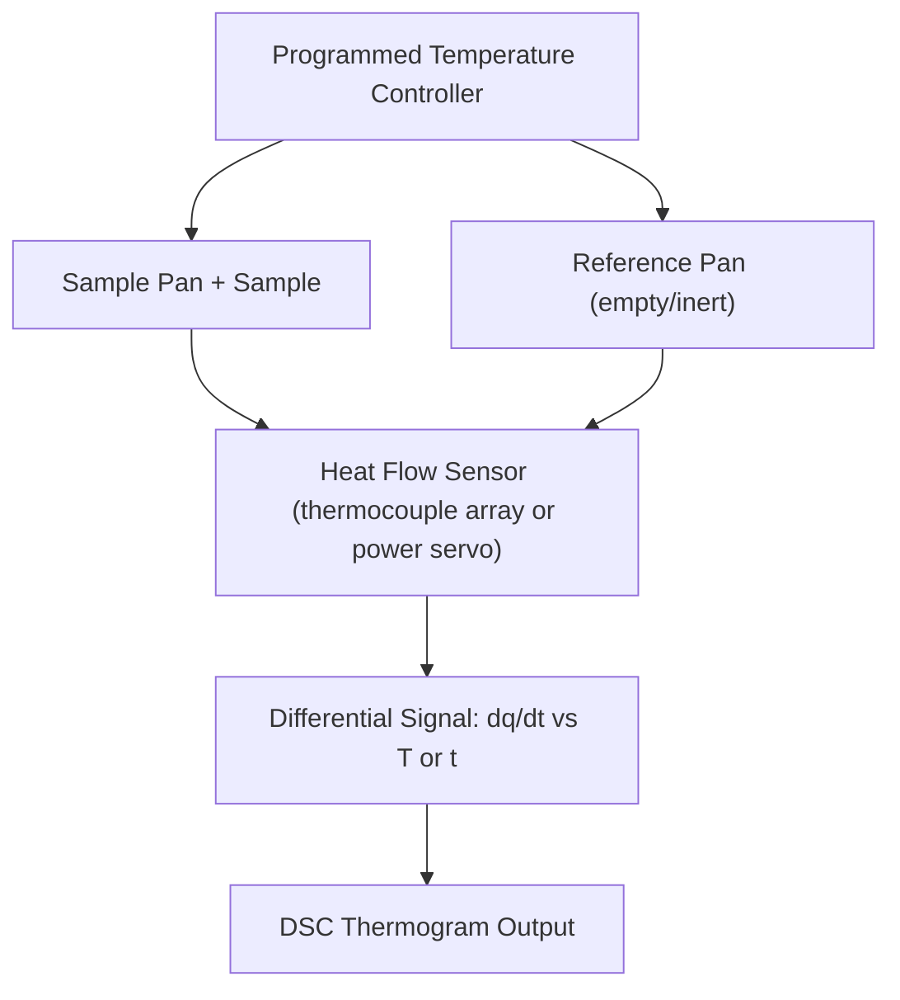

## Differential Scanning Calorimetry

### Operating Principle

Differential Scanning Calorimetry (DSC) measures the heat flow difference between a sample and an inert reference as both are subjected to a controlled temperature program (heating, cooling, or isothermal hold). Any thermal event in the sample — melting, crystallization, glass transition, solid-state phase transformation, curing, or reaction — produces a deviation in heat flow relative to the reference, recorded as a peak or step in the DSC curve.

Two principal instrument designs exist:

**Heat-flux DSC**: Sample and reference sit on a single thermally conductive disk inside one furnace. Temperature difference between sample and reference is measured via thermocouples and converted to heat flow using the calibrated thermal resistance of the disk:

$$\dot{q} = -K \cdot \Delta T$$

where $K$ is the calorimetric sensitivity (calibration constant) and $\Delta T = T_{sample} - T_{reference}$.

**Power-compensation DSC**: Sample and reference are held in separate, individually heated micro-furnaces. A control loop adjusts electrical power to each furnace to keep both at the same temperature; the differential power required is the direct heat flow signal.

**Key Points**

- Heat-flux DSC: simpler, lower cost, good for standard metallurgical/polymer characterization; slightly slower thermal response.
- Power-compensation DSC: faster response, better suited to kinetic studies and fast scanning rates, generally higher cost.
- Output convention: exothermic peaks are commonly plotted upward in materials science literature (opposite to some biochemistry conventions) — always check the instrument/software default before interpreting peak direction.

### Instrumentation and Experimental Setup

- **Sample pans**: Aluminum (routine, up to ~600 °C), gold, platinum, or alumina crucibles for high-temperature metallurgical work (up to 1500–1700 °C in specialized high-temperature DSC)
- **Reference**: Empty pan of matched mass/material, or an inert standard
- **Purge gas**: Inert (N₂, Ar) to prevent oxidation, or reactive (O₂, air) when oxidation behavior is deliberately studied; flow rate typically 20–50 mL/min
- **Sample mass**: Typically 5–20 mg for metals; smaller masses reduce thermal lag and improve peak resolution but reduce signal-to-noise
- **Heating/cooling rates**: Common range 5–20 °C/min; slower rates improve resolution and reduce thermal lag, faster rates improve sensitivity but broaden/shift peaks
- **Calibration**: Temperature calibration using melting points of certified reference metals (In: 156.6 °C, Sn: 231.9 °C, Zn: 419.5 °C, Al: 660.3 °C, Au: 1064.2 °C); enthalpy calibration using the known heat of fusion of the same standards

### Interpreting the DSC Thermogram

| Feature | Thermal Event | Signature |
| --- | --- | --- |
| Step change in baseline | Glass transition ($T_g$) | Change in specific heat capacity, no latent heat |
| Sharp endothermic peak | Melting | Peak area = enthalpy of fusion $\Delta H_f$ |
| Sharp exothermic peak | Crystallization/solidification | Peak area = enthalpy of crystallization |
| Broad exothermic peak | Solid-state precipitation, ordering reaction, curing | Onset/peak temperature marks reaction kinetics |
| Sharp endothermic peak (solid-state) | Solid-solid phase transformation (e.g., allotropic transition) | Smaller enthalpy than melting typically |
| Multiple overlapping peaks | Multi-stage transformation, eutectic/peritectic reactions in alloys | Deconvolution required |

Quantitative enthalpy is obtained by integrating peak area (heat flow vs. time, or heat flow vs. temperature divided by scan rate) relative to a stable baseline:

$$\Delta H = \int \dot{q}\, dt$$

Onset temperature is conventionally determined via the intersection of the extrapolated baseline and the steepest tangent line on the leading edge of the peak — this is generally the more thermodynamically meaningful transformation temperature compared to the peak temperature, which is influenced more strongly by sample mass and scan rate.

### Application to Materials Science and Metallurgy

- **Phase diagram construction and validation**: Locating solidus, liquidus, solvus, and invariant reaction temperatures (eutectic, peritectic, eutectoid) in binary and multicomponent alloy systems by combining onset temperatures from multiple compositions
- **Precipitation and dissolution kinetics**: Tracking exothermic precipitation peaks (e.g., GP zones, θ′, S′ phases in Al alloys) and endothermic dissolution peaks during controlled heating of aged alloys
- **Solidification range determination**: Measuring liquidus/solidus for casting and welding process design, and calculating the freezing range relevant to hot-tearing susceptibility
- **Specific heat capacity measurement**: Via the sapphire (or other reference standard) ratio method, comparing sample heat-flow deviation to that of a known-$C_p$ reference run under identical conditions
- **Curie temperature determination**: Magnetic-to-paramagnetic transition in ferromagnetic alloys appears as a subtle baseline shift, occasionally requiring specialized magnetic DSC configurations for clear resolution
- **Polymer matrix composite cure monitoring**: $T_g$, cure exotherm, and degree of cure calculation in metal-polymer hybrid and composite systems
- **Purity determination**: Using the Van't Hoff equation on the melting endotherm shape for high-purity metal characterization

**Example**

An Al-Si-Cu casting alloy sample is heated at 10 °C/min from 25 °C to 700 °C under argon. The thermogram shows a small endothermic event near 500–520 °C (dissolution of Al₂Cu-based intermetallics), followed by a large endothermic peak beginning near 570 °C (eutectic melting, Al-Si eutectic reaction) with onset extrapolated at 577 °C, consistent with the known Al-Si eutectic temperature, and a final endotherm completing near 620 °C marking the liquidus. Integration of the primary melting peak gives $\Delta H_f \approx 380$ J/g, from which the fraction of eutectic constituent can be [Inference] estimated by comparison against a reference value for the fully eutectic composition, assuming similar solidification microstructure.

### Common Complications in Metallurgical DSC

- **Baseline curvature**: Differing heat capacities between sample and pan/reference can produce a sloped or curved baseline, complicating peak integration; running a blank (pan vs. pan) subtraction improves accuracy
- **Thermal lag**: At higher heating rates, actual sample temperature lags the programmed furnace temperature, shifting apparent transformation temperatures to higher values on heating (and lower on cooling) — extrapolation to zero scan rate is used for rate-independent transformation temperatures
- **Sample-pan reactions**: Reactive alloys (e.g., Ti, some Mg alloys) can react with aluminum pans at high temperature; platinum, alumina, or graphite crucibles are substituted accordingly
- **Supercooling on cooling scans**: Nucleation-limited transformations (solidification, some solid-state transformations) can show significant undercooling relative to the equilibrium transformation temperature; this is a genuine kinetic effect, not necessarily an instrument artifact, and must be distinguished from thermal lag

[Unverified] Reported onset/enthalpy values from any single DSC run carry uncertainty typically on the order of ±1–2 °C for temperature and several percent for enthalpy depending on calibration quality, sample mass, and scan rate; replicate measurements and standard calibration checks are standard practice for quantitative metallurgical reporting.

### SVG: Idealized Alloy DSC Heating Curve (svg_diagram)

<svg xmlns="http://www.w3.org/2000/svg" viewBox="0 0 640 320">
<rect x="0" y="0" width="640" height="320" fill="#ffffff" />
<text x="320" y="24" text-anchor="middle" font-size="16" font-weight="bold" fill="#111">Idealized Alloy DSC Heating Curve (svg_diagram)</text>
<line x1="60" y1="270" x2="600" y2="270" stroke="#333" stroke-width="1.5" />
<line x1="60" y1="270" x2="60" y2="50" stroke="#333" stroke-width="1.5" />
<text x="330" y="300" text-anchor="middle" font-size="12" fill="#333">Temperature (°C) →</text>
<text x="30" y="160" text-anchor="middle" font-size="12" fill="#333" transform="rotate(-90,30,160)">Heat Flow (exo up)</text>

<path d="M 60 240 L 200 240 Q 230 240 245 180 Q 260 240 280 240 L 380 240 Q 410 240 430 100 Q 450 240 470 240 L 600 240" fill="none" stroke="`#c05621`" stroke-width="2.5" />

<line x1="245" y1="240" x2="245" y2="180" stroke="#888" stroke-dasharray="3,3" />
<text x="215" y="255" font-size="10" fill="#7c2d12">Precipitate</text>
<text x="215" y="267" font-size="10" fill="#7c2d12">dissolution</text>
<line x1="430" y1="240" x2="430" y2="100" stroke="#888" stroke-dasharray="3,3" />
<text x="400" y="262" font-size="10" fill="#7c2d12">Eutectic</text>
<text x="410" y="274" font-size="10" fill="#7c2d12">melting</text>

<text x="500" y="255" font-size="10" fill="#333">Liquidus →</text>

</svg>

**Related Topics**

- Raman and Infrared Spectroscopy (complementary phase/chemistry identification)
- Thermogravimetric Analysis (TGA) and simultaneous TGA-DSC
- Dilatometry for phase transformation and CTE measurement
- Differential Thermal Analysis (DTA) for high-temperature alloy/ceramic systems
- Phase diagram construction methodology
- Kinetic analysis (Kissinger method, JMAK modeling) from non-isothermal DSC data