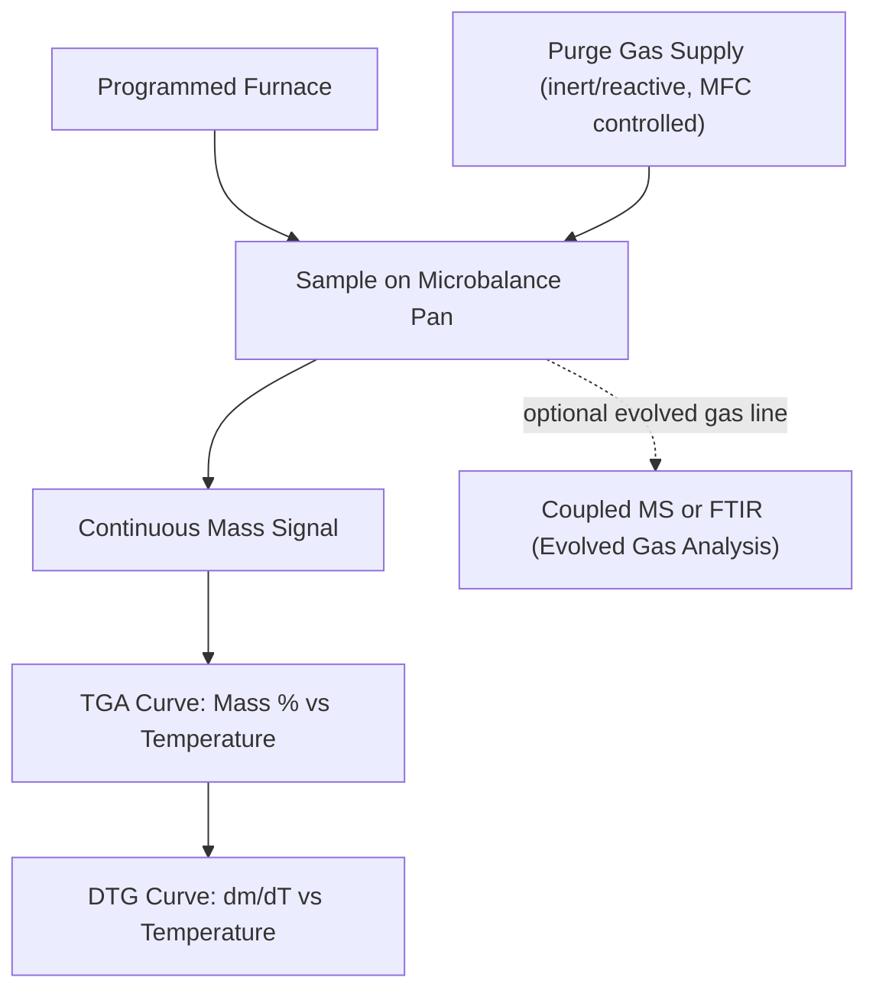

## Thermogravimetric Analysis

### Operating Principle

Thermogravimetric Analysis (TGA) measures the mass of a sample continuously as a function of temperature or time under a controlled thermal program and atmosphere. Any process that adds or removes mass — desorption, dehydration, decomposition, oxidation, reduction, or combustion — produces a measurable change on the TGA curve. Unlike DSC, TGA responds only to mass-changing processes; events such as melting or glass transition (which do not change mass) are invisible to TGA, making the two techniques strongly complementary.

The core measurement is performed with a microbalance (typically sensitive to 0.1 µg) housed in a furnace, with the sample suspended from or resting on the balance mechanism, isolated as much as possible from convective and buoyancy effects.

**Key Points**

- Primary output: mass (or mass %) vs. temperature/time — the **TGA curve**.
- First derivative of mass with respect to temperature (**DTG curve**, $d m/dT$) resolves overlapping mass-loss events into distinct peaks and pinpoints the temperature of maximum rate of mass change.
- Atmosphere control is the single most important experimental variable: identical samples can show entirely different curves under inert (N₂, Ar) vs. oxidizing (air, O₂) vs. reducing (H₂/Ar) atmospheres.

### Instrumentation

- **Microbalance**: Null-balance (restoring force) design is standard for high accuracy; horizontal or vertical furnace configurations both used
- **Sample holders**: Alumina, platinum, or quartz crucibles depending on temperature range and chemical compatibility with the sample and atmosphere
- **Furnace**: Resistance-heated, typically usable from ambient to 1000–1600 °C depending on instrument class; some high-temperature units reach beyond 2000 °C
- **Atmosphere/gas control**: Mass flow controllers deliver purge gas (inert or reactive) at controlled flow rate (typically 20–100 mL/min); gas switching mid-run is common (e.g., inert during heating, then switch to air to combust residual carbon)
- **Coupled/hyphenated techniques**:
  - **TGA-DSC (simultaneous thermal analysis, STA)**: Combines mass and heat-flow measurement on the same sample in a single run
  - **TGA-MS**: Evolved gas analysis via mass spectrometry, identifying species released during mass-loss events
  - **TGA-FTIR**: Evolved gas analysis via IR absorption of gaseous decomposition/combustion products

### Interpreting the TGA/DTG Curve

| Feature | Interpretation |
| --- | --- |
| Flat baseline | No mass change; thermally stable in current atmosphere |
| Gradual mass loss, low temperature (<150 °C) | Adsorbed moisture or volatile solvent loss |
| Step mass loss at defined temperature range | Decomposition, dehydration of hydrates, or outgassing of a specific phase |
| Mass gain | Oxidation (oxygen uptake forming oxide scale) — significant in metallurgical samples under oxidizing atmosphere |
| Mass loss under oxidizing atmosphere at high T | Combustion of carbon/organic content, or volatilization of oxide species (e.g., MoO₃ sublimation) |
| Residual mass at end of run | Ash content, remaining oxide, or unreacted inorganic fraction |
| DTG peak | Marks temperature of maximum rate of mass change for a given process; used to separate overlapping decomposition steps |

Mass-loss percentages are calculated relative to the initial (or a defined reference) mass:

$$\% \text{mass loss} = \frac{m_0 - m_T}{m_0} \times 100$$

Onset temperature for a given mass-loss step is typically defined by tangent-line intersection on the TGA curve, analogous to DSC onset determination, or directly from the DTG peak onset.

### Application to Materials Science and Metallurgy

- **Oxidation kinetics of metals and alloys**: Isothermal or non-isothermal TGA under air/O₂ quantifies mass gain due to scale formation, allowing determination of oxidation rate laws (parabolic, linear, logarithmic):

$$\left(\frac{\Delta m}{A}\right)^n = k_p \cdot t$$

where parabolic behavior ($n=2$) indicates diffusion-controlled scale growth, commonly seen in well-adherent protective oxide scales (e.g., Cr₂O₃, Al₂O₃ formers).

- **Decarburization and carbide/carbon content analysis**: Combustion of carbon under controlled oxidizing atmosphere, used alongside combustion analysis for carbon content verification in steels and cast irons
- **Reduction behavior of oxide ores and pellets**: Mass loss under H₂ or CO atmosphere quantifies reducibility, relevant to ironmaking/steelmaking feedstock characterization
- **Binder burnout in powder metallurgy and metal injection molding (MIM)**: Tracking organic binder decomposition prior to sintering, used to optimize debinding thermal schedules and avoid defects (blistering, cracking) from too-rapid gas evolution
- **Hydrate and moisture content in refractories, fluxes, and powder feedstocks**: Quantifying bound water or crystallization water prior to high-temperature processing
- **Coating and composite thermal stability**: Degradation onset temperature of polymer matrices or organic coatings on metal substrates
- **Compositional analysis of mixed-phase materials**: Sequential decomposition steps (e.g., calcium carbonate → CaO + CO₂ near 700–900 °C) allow quantification of specific mineral/compound fractions in slags, refractories, or contaminated scrap

**Example**

A Fe-Cr alloy coupon is subjected to isothermal TGA at 900 °C in flowing dry air for 24 hours to assess oxidation resistance. The mass gain curve follows an approximately parabolic trend, and plotting $(\Delta m/A)^2$ against time yields a linear relationship, from which $k_p$ is extracted via linear regression. A lower $k_p$ relative to a reference low-chromium alloy run under identical conditions is consistent with formation of a more protective, slower-growing Cr₂O₃ scale — a conclusion that would [Inference] benefit from confirmation via post-test SEM/EDS or Raman identification of the scale phase, since TGA alone reports mass change without direct chemical/structural confirmation of the scale composition.

### Common Complications in Metallurgical TGA

- **Buoyancy effects**: Gas density changes with temperature alter the apparent buoyant force on the sample/pan, producing a small apparent mass change even with no real reaction; corrected via a **blank run** (empty pan, identical program) subtracted from the sample run
- **Gas flow turbulence**: Excessive or unstable purge flow can cause balance noise or apparent mass fluctuations
- **Sample geometry and packing**: Powder bed thickness affects gas diffusion to/from the reacting surface, influencing apparent kinetics — thin, well-dispersed samples are preferred for kinetic studies
- **Crucible-sample reactions**: At high temperature, some metal/oxide samples can react with alumina or platinum crucibles, altering both true sample mass and chemistry
- **Balance drift**: Long isothermal oxidation runs (many hours) are sensitive to long-term balance drift; periodic calibration checks are standard practice

[Unverified] Absolute mass-change sensitivity and long-term baseline stability specifications vary meaningfully between instrument models and manufacturers; users should consult the specific instrument's calibration documentation rather than assume a universal sensitivity figure for quantitative kinetic work.

### SVG: Comparative TGA Curves — Inert vs. Oxidizing Atmosphere (svg_diagram)

<svg xmlns="http://www.w3.org/2000/svg" viewBox="0 0 640 320">
<rect x="0" y="0" width="640" height="320" fill="#ffffff" />
<text x="320" y="24" text-anchor="middle" font-size="16" font-weight="bold" fill="#111">TGA Curves: Inert vs. Oxidizing Atmosphere (svg_diagram)</text>
<line x1="60" y1="270" x2="600" y2="270" stroke="#333" stroke-width="1.5" />
<line x1="60" y1="270" x2="60" y2="50" stroke="#333" stroke-width="1.5" />
<text x="330" y="300" text-anchor="middle" font-size="12" fill="#333">Temperature (°C) →</text>
<text x="25" y="160" text-anchor="middle" font-size="12" fill="#333" transform="rotate(-90,25,160)">Mass (%)</text>
<line x1="60" y1="100" x2="600" y2="100" stroke="#2b6cb0" stroke-width="2.5" />
<text x="500" y="90" font-size="11" fill="#1a4971">Inert (N2): stable mass</text>
<path d="M 60 100 L 250 100 Q 350 100 450 40 L 600 40" fill="none" stroke="#c05621" stroke-width="2.5" />
<text x="440" y="30" font-size="11" fill="#7c2d12">Oxidizing (air): mass gain</text>
<line x1="250" y1="270" x2="250" y2="50" stroke="#aaa" stroke-dasharray="2,2" />
<text x="255" y="260" font-size="10" fill="#555">Oxidation onset</text>
</svg>

**Related Topics**

- Differential Scanning Calorimetry (complementary thermal event detection)
- Simultaneous Thermal Analysis (STA / TGA-DSC)
- Evolved Gas Analysis (TGA-MS, TGA-FTIR)
- Oxidation kinetics and rate-law determination in high-temperature alloys
- Dilatometry
- Powder metallurgy debinding and sintering process design