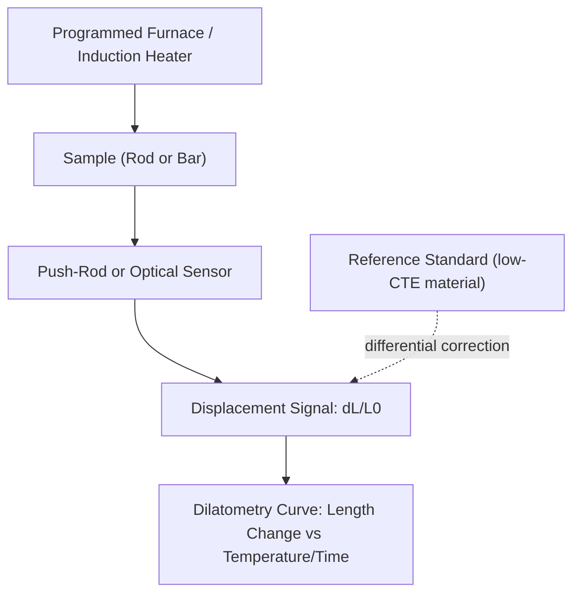

## Dilatometry

### Operating Principle

Dilatometry measures the dimensional change (typically linear length change, $\Delta L / L_0$) of a sample as a function of temperature or time under a controlled thermal program. Because thermal expansion is a continuous, largely reversible process while phase transformations (melting excepted, since dilatometry requires a coherent solid) produce distinct volume changes from atomic rearrangement, dilatometry is one of the most sensitive techniques for detecting and characterizing solid-state phase transformations in metals and alloys.

The measured quantity is the coefficient of linear thermal expansion (CTE):

$$\alpha = \frac{1}{L_0}\frac{dL}{dT}$$

Any solid-state transformation that changes crystal structure (and therefore density/molar volume) — such as austenite-to-martensite, austenite-to-ferrite/pearlite, or precipitation reactions — produces a deviation from the smooth thermal-expansion baseline, appearing as a step, kink, or reversal in the length-vs-temperature curve.

**Key Points**

- Dilatometry directly probes volume/density change, making it highly sensitive to transformations that DSC may detect only weakly (small enthalpy, large volume change, or vice versa) — the two techniques are strongly complementary.
- Transformation start ($A_{c1}$, $A_{c3}$, $M_s$, $M_f$, etc. in steels) and finish temperatures are extracted via tangent-line deviation from the linear expansion baseline, analogous to onset determination in DSC/TGA.
- Because transformations are often diffusional and rate-dependent, dilatometric transformation temperatures are heating/cooling-rate dependent — critical for constructing CCT and TTT diagrams.

### Instrumentation

- **Push-rod dilatometer**: Sample sits between a fixed reference and a movable push-rod (typically fused silica or alumina for low-CTE stability); rod displacement is measured by an LVDT (linear variable differential transformer) or optical encoder. Most common configuration for routine metallurgical work.
- **Optical (non-contact) dilatometer**: Uses a camera/laser system to track sample edge position without physical contact — eliminates push-rod friction/inertia artifacts, enables measurement on samples during rapid heating/cooling or under load, common in quenching dilatometry.
- **Differential dilatometer**: Sample and a low-expansion reference material (e.g., fused silica, sapphire) are measured simultaneously to cancel systematic instrument expansion.
- **Quenching dilatometers**: Combine induction heating with rapid gas or liquid quenching capability, enabling controlled cooling rates from very slow (furnace cooling) to very fast (>100 °C/s), essential for CCT diagram construction in steels.
- **Atmosphere control**: Inert (Ar, He) or vacuum to prevent oxidation/decarburization during high-temperature runs, since surface reactions can introduce spurious dimensional artifacts

### Interpreting the Dilatometric Curve

| Feature | Interpretation |
| --- | --- |
| Smooth, near-linear slope | Simple thermal expansion of a single, stable phase |
| Change in slope (no discontinuity) | Change in CTE without a discrete transformation (e.g., magnetic ordering effects near Curie point) |
| Sharp contraction on heating | Phase transformation to a denser structure (e.g., $\alpha \to \gamma$ transformation in steel, FCC austenite is denser than BCC ferrite) |
| Sharp expansion on cooling | Transformation to a less dense structure (e.g., austenite-to-martensite transformation, associated with the characteristic volume expansion used to define $M_s$/$M_f$) |
| Two-stage deviation | Onset and completion of a transformation, e.g., $A_{c1}$ (start) and $A_{c3}$ (finish) for ferrite-to-austenite transformation in hypoeutectoid steel |

Transformation start temperature is determined by the point where the curve first deviates from the extrapolated linear baseline; finish temperature is where it rejoins a new linear trend corresponding to the product phase.

### Application to Materials Science and Metallurgy

- **CCT and TTT diagram construction**: Systematic dilatometric runs at multiple constant cooling rates (for CCT) or isothermal holds (for TTT) after austenitization, tracking transformation start/finish via the length-change signature, are the standard experimental method for building these diagrams for steels and other transforming alloys
- **Critical temperature determination in steels**: $A_{c1}$, $A_{c3}$, $A_{r1}$, $A_{r3}$ (heating/cooling equilibrium-approximating critical points), $M_s$ and $M_f$ (martensite start/finish) — foundational inputs for heat treatment process design
- **Thermal expansion coefficient measurement**: Direct CTE determination for design applications (thermal stress calculation, fit tolerances, bimetallic assembly design)
- **Sintering shrinkage tracking**: In powder metallurgy, dilatometry monitors densification shrinkage during sintering, distinguishing stages of neck growth, pore elimination, and grain growth
- **Recrystallization and recovery kinetics**: Subtle slope changes during isothermal holds can indicate stored-energy release in cold-worked metals
- **Weld heat-affected zone (HAZ) simulation**: Combined with rapid thermal cycling (e.g., Gleeble-type systems), dilatometry characterizes phase transformations under weld-representative thermal cycles for HAZ microstructure prediction
- **Validation input for transformation kinetics models**: JMAK (Johnson-Mehl-Avrami-Kolmogorov) and similar transformation-kinetics models are commonly parameterized against dilatometric transformation-fraction data, using the lever-rule-like relationship between measured length change and transformed fraction:

$$X(t) = \frac{L(t) - L_{start}}{L_{finish} - L_{start}}$$

**Example**

A medium-carbon steel cylindrical specimen is austenitized at 900 °C, held to homogenize, then cooled at a constant rate of 5 °C/s in a quenching dilatometer. The length-vs-temperature curve on cooling follows the austenite thermal-contraction baseline until approximately 380 °C, where a distinct expansion begins ($M_s$), continuing until the curve rejoins a new, steeper linear trend near 220 °C ($M_f$), consistent with martensitic transformation. Applying the fractional transformation relationship to the intermediate curve shape allows [Inference] estimation of the transformed martensite fraction as a function of temperature between $M_s$ and $M_f$, though this assumes a simple linear relationship between length change and transformed volume fraction that may require correction for tetragonality-related expansion contributions specific to the carbon content of the steel.

### Common Complications in Metallurgical Dilatometry

- **Push-rod friction and inertia**: Contact-type dilatometers can introduce lag or noise at high heating/cooling rates; optical/non-contact systems mitigate this for quenching studies
- **Sample geometry effects**: Non-uniform temperature distribution across sample length/diameter during rapid heating or quenching can cause apparent transformation broadening; thin, small-diameter specimens minimize thermal gradients
- **Anisotropic expansion**: Textured or non-cubic materials may show direction-dependent CTE; measured dilation along one axis may not represent volumetric behavior
- **Transformation strain vs. thermal strain separation**: At high cooling rates, transformation-induced plasticity (TRIP) and stress effects can convolve with the pure transformation-volume signal, particularly under applied load during simulation testing

[Unverified] Reported transformation temperatures from dilatometry are rate-dependent by nature (not an artifact) and will differ from equilibrium values found in binary phase diagrams; equilibrium-diagram values should not be used interchangeably with dilatometrically measured $A_{c1}/A_{c3}$ without accounting for the actual heating rate used.

### SVG: Steel Dilatometric Cooling Curve Showing Martensitic Transformation (svg_diagram)

<svg xmlns="http://www.w3.org/2000/svg" viewBox="0 0 640 320">
<rect x="0" y="0" width="640" height="320" fill="#ffffff" />
<text x="320" y="24" text-anchor="middle" font-size="16" font-weight="bold" fill="#111">Dilatometric Cooling Curve (svg_diagram)</text>
<line x1="60" y1="270" x2="600" y2="270" stroke="#333" stroke-width="1.5" />
<line x1="60" y1="270" x2="60" y2="50" stroke="#333" stroke-width="1.5" />
<text x="330" y="300" text-anchor="middle" font-size="12" fill="#333">Temperature (decreasing →)</text>
<text x="25" y="160" text-anchor="middle" font-size="12" fill="#333" transform="rotate(-90,25,160)">ΔL/L0</text>
<path d="M 600 90 L 380 130 L 340 130 Q 300 130 260 60 L 60 60" fill="none" stroke="#2b6cb0" stroke-width="2.5" />
<line x1="340" y1="270" x2="340" y2="130" stroke="#aaa" stroke-dasharray="2,2" />
<text x="300" y="260" font-size="10" fill="#555">Ms</text>
<line x1="260" y1="270" x2="260" y2="60" stroke="#aaa" stroke-dasharray="2,2" />
<text x="215" y="260" font-size="10" fill="#555">Mf</text>

<text x="450" y="80" font-size="11" fill="`#1a4971`">Austenite contraction</text>

<text x="100" y="45" font-size="11" fill="`#1a4971`">Martensite baseline</text>

<text x="330" y="115" font-size="10" fill="`#7c2d12`">Transformation</text>

<text x="330" y="127" font-size="10" fill="`#7c2d12`">expansion</text>

</svg>

**Related Topics**

- Differential Scanning Calorimetry (complementary transformation enthalpy detection)
- CCT and TTT diagram construction methodology
- Martensitic transformation crystallography
- Gleeble physical simulation of weld thermal cycles
- Coefficient of thermal expansion in alloy design
- JMAK kinetic modeling of phase transformations