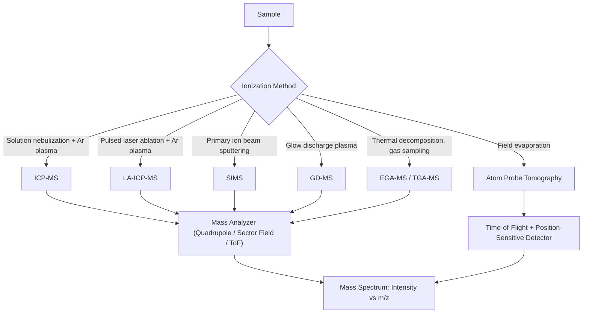

## Mass Spectrometry for Materials Analysis

### Operating Principle

Mass spectrometry (MS) identifies and quantifies chemical species by ionizing sample material, separating the resulting ions by their mass-to-charge ratio ($m/z$), and measuring ion abundance. The generalized workflow is:

$$\text{Sample} \rightarrow \text{Ionization} \rightarrow \text{Mass Analysis (m/z separation)} \rightarrow \text{Detection} \rightarrow \text{Mass Spectrum}$$

In materials science, MS is applied both to **bulk/trace elemental and isotopic analysis** and to **surface and evolved-gas chemical analysis**, with the ionization and mass-analysis method chosen according to the sample form (solid, gas, surface) and the information required (elemental composition, isotope ratio, molecular/compound identity, spatial distribution).

**Key Points**

- No single MS configuration serves all materials applications; technique choice is driven by required detection limit, spatial/depth resolution, and whether elemental or molecular information is needed.
- Ionization method and mass analyzer are largely independent choices, combined according to application needs (e.g., ICP ionization can be paired with quadrupole, sector-field, or time-of-flight analyzers).
- Isotope ratio measurements (critical for provenance, tracer, and nuclear-materials work) require high mass resolution and precision beyond routine elemental quantification.

### Major Techniques Relevant to Metallurgy and Materials

#### Inductively Coupled Plasma Mass Spectrometry (ICP-MS)

- Sample (typically dissolved in acid) is nebulized into an argon plasma (~6000–10,000 K), which atomizes and ionizes essentially all elements
- Ions are extracted through a differentially pumped interface into the mass analyzer (commonly quadrupole; sector-field for higher resolution/sensitivity)
- **Detection limits**: sub-ppb (parts per billion) for most elements — among the most sensitive elemental techniques available
- **Application**: Trace and ultra-trace elemental analysis of alloys, ores, process solutions; impurity/tramp element quantification (e.g., trace Pb, Bi, As in steel affecting hot-shortness); alloy certification and compliance testing

#### Laser Ablation ICP-MS (LA-ICP-MS)

- A pulsed laser (commonly 193 or 213 nm) ablates a small volume of solid sample directly, generating an aerosol carried by inert gas into the ICP-MS
- Enables **direct solid analysis** without acid digestion, with spatial resolution down to ~5–50 µm depending on laser spot size
- **Application**: Spatially resolved trace-element mapping across microstructural features (grain boundaries, inclusions, segregation bands); depth-resolved analysis via repeated ablation

#### Secondary Ion Mass Spectrometry (SIMS)

- A primary ion beam (Cs⁺, O₂⁺, Ga⁺, or cluster ions) sputters the sample surface; a fraction of sputtered atoms/clusters are ionized ("secondary ions") and mass-analyzed
- **Dynamic SIMS**: Continuous sputtering for depth profiling, extremely sensitive (ppb-level) to elements including light elements (H, B, C, N, O) that are difficult for other techniques
- **Static SIMS (ToF-SIMS)**: Very low primary ion dose preserves surface molecular information, used for surface chemistry/organic contamination mapping
- **Application**: Hydrogen embrittlement studies (H is essentially invisible to EDS/WDS but readily detected by SIMS), dopant/impurity depth profiling in semiconductor and coated metal systems, grain boundary segregation analysis

#### Glow Discharge Mass Spectrometry (GD-MS)

- Sample serves as the cathode in a low-pressure argon glow discharge; sputtered atoms are ionized in the plasma and mass-analyzed
- Provides direct solid bulk and depth-profiled elemental analysis with minimal sample preparation
- **Application**: High-purity metals characterization, coating/substrate interface analysis, semiconductor-grade material certification

#### Atom Probe Tomography (APT)

- Field evaporation of individual atoms from a needle-shaped specimen tip under high electric field, combined with time-of-flight mass spectrometry and position-sensitive detection
- Reconstructs a **three-dimensional atom-by-atom map** with near-atomic spatial resolution and full elemental sensitivity including light elements
- **Application**: Nanoscale segregation and clustering analysis (grain boundary segregation, early-stage precipitation, solute clustering) in advanced alloys — a technique of particular importance in modern physical metallurgy research

#### Evolved Gas Analysis (TGA-MS, EGA-MS)

- Gaseous decomposition/reaction products released during controlled heating (often coupled directly to a TGA furnace) are continuously sampled into a mass spectrometer
- **Application**: Identification of gas species evolved during binder burnout, oxidation, or decomposition reactions; distinguishing overlapping mass-loss events in TGA by their chemical signature

### Mass Analyzer Types

| Analyzer | Principle | Resolution | Typical Use |
| --- | --- | --- | --- |
| Quadrupole | Stable ion trajectories through oscillating RF/DC fields filter by m/z | Low-moderate (unit mass) | Routine elemental quantification (ICP-MS) |
| Sector-field (magnetic/electric) | Ion trajectory curvature in magnetic/electric field depends on m/z and energy | High | Ultra-trace and isotope ratio work |
| Time-of-Flight (ToF) | Ion flight time over a fixed distance is proportional to $\sqrt{m/z}$ | High, simultaneous full-spectrum | ToF-SIMS, atom probe, fast transient analysis |

### Application to Materials Science and Metallurgy

- **Trace and tramp element control**: Quantifying residual elements (Cu, Sn, Sb, As, Pb) in recycled steel feedstock that cause hot-shortness or embrittlement, at concentrations below the detection limit of OES (optical emission spectroscopy) or EDS
- **Alloy and raw material provenance/certification**: Isotope ratio analysis (e.g., Pb isotope ratios) for sourcing verification of ores and scrap
- **Hydrogen and light-element analysis**: SIMS depth profiling of hydrogen content near crack surfaces or weld HAZs to correlate with hydrogen-induced cracking susceptibility
- **Grain boundary and interface segregation**: APT and SIMS reveal nanoscale solute segregation (e.g., B, P segregation to prior austenite grain boundaries affecting temper embrittlement) invisible to conventional SEM/EDS due to spatial resolution limits
- **Coating and diffusion layer characterization**: Depth profiling of nitrided, carburized, or coated layers (e.g., PVD/CVD coatings) via GD-MS or SIMS to map composition gradients through the layer thickness
- **Failure analysis**: Identifying trace contaminant elements at fracture surfaces or corrosion sites that may correlate with embrittlement or preferential corrosion mechanisms
- **Process gas and off-gas analysis**: Real-time MS monitoring of furnace off-gases (e.g., during vacuum induction melting or heat treatment) for process control and contamination detection

**Example**

A batch of recycled steel scrap is suspected of containing elevated tramp copper, which segregates to grain boundaries during hot working and causes surface cracking (hot-shortness) via preferential liquid-phase copper penetration above ~1100 °C. ICP-MS analysis of a dissolved sample quantifies bulk copper at 0.35 wt%, above the typical specification limit for the intended product grade (commonly held below ~0.20 wt% for applications sensitive to hot-shortness, though [Unverified] exact specification limits vary by standard and end-use application). Given the bulk concentration is confirmed, targeted LA-ICP-MS mapping across a polished cross-section could further [Inference] reveal whether copper is homogeneously distributed or preferentially enriched at prior grain boundaries, which would provide additional mechanistic support for the hot-shortness failure hypothesis beyond bulk composition alone.

### Comparative Summary

| Technique | Sample Form | Detection Limit | Spatial/Depth Resolution | Key Strength |
| --- | --- | --- | --- | --- |
| ICP-MS | Solution | Sub-ppb | Bulk (no spatial resolution) | Ultra-trace bulk sensitivity |
| LA-ICP-MS | Solid | ppb-ppm | ~5–50 µm lateral | Direct solid analysis, mapping |
| SIMS | Solid surface | ppb-ppm (element dependent) | nm–µm lateral, nm depth | Light elements, depth profiling |
| GD-MS | Solid (conductive) | ppb-ppm | Bulk/depth profile | Minimal prep, full periodic table |
| Atom Probe Tomography | Needle-shaped solid tip | Single-atom sensitivity | Sub-nm, 3D | Atomic-scale 3D composition |
| EGA-MS | Gas (evolved) | Trace gas species | N/A (temporal) | Chemical ID of decomposition products |

[Unverified] Specific detection-limit figures cited above are representative order-of-magnitude values drawn from typical instrument specifications; actual limits are strongly matrix- and element-dependent and should be confirmed against the specific instrument configuration and calibration standards used for a given analysis.

### SVG: Mass Spectrometry Technique Selection by Information Need (svg_diagram)

<svg xmlns="http://www.w3.org/2000/svg" viewBox="0 0 640 300">
<rect x="0" y="0" width="640" height="300" fill="#ffffff" />
<text x="320" y="24" text-anchor="middle" font-size="16" font-weight="bold" fill="#111">MS Technique Selection (svg_diagram)</text>
<line x1="80" y1="150" x2="580" y2="150" stroke="#333" stroke-width="1.5" />
<text x="80" y="175" font-size="11" fill="#333" text-anchor="middle">Bulk</text>
<text x="580" y="175" font-size="11" fill="#333" text-anchor="middle">Atomic-scale</text>
<text x="330" y="195" font-size="12" fill="#333" text-anchor="middle">Spatial Resolution →</text>
<circle cx="150" cy="150" r="8" fill="#2b6cb0" />
<text x="150" y="130" font-size="11" fill="#1a4971" text-anchor="middle">ICP-MS</text>
<circle cx="280" cy="150" r="8" fill="#c05621" />
<text x="280" y="130" font-size="11" fill="#7c2d12" text-anchor="middle">GD-MS</text>
<circle cx="400" cy="150" r="8" fill="#2f855a" />
<text x="400" y="130" font-size="11" fill="#22543d" text-anchor="middle">LA-ICP-MS</text>
<circle cx="480" cy="150" r="8" fill="#805ad5" />
<text x="480" y="130" font-size="11" fill="#553c9a" text-anchor="middle">SIMS</text>
<circle cx="560" cy="150" r="8" fill="#b83280" />
<text x="560" y="130" font-size="11" fill="#702459" text-anchor="middle">Atom Probe</text>
</svg>

**Related Topics**

- Optical Emission Spectroscopy (OES) for routine alloy composition verification
- Atom Probe Tomography sample preparation via focused ion beam (FIB)
- X-ray Photoelectron Spectroscopy (XPS) for surface chemical state analysis
- Hydrogen embrittlement mechanisms and detection methods
- Grain boundary segregation and temper embrittlement
- Evolved Gas Analysis coupling with TGA and DSC