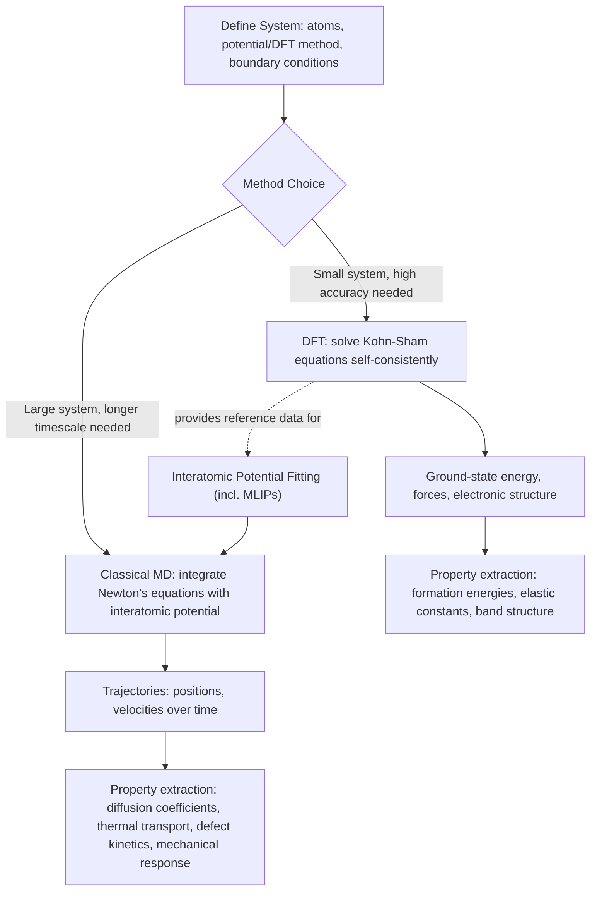

## Atomistic Simulation: Density Functional Theory and Molecular Dynamics

### Overview and Scope

Atomistic simulation methods compute material properties and behavior directly from a description of atoms and their interactions, without relying on empirical continuum-scale constitutive laws. The two dominant approaches — Density Functional Theory (DFT) and classical Molecular Dynamics (MD) — occupy different points on the accuracy-vs-length/time-scale spectrum and are frequently used together in a hierarchical modeling workflow.

$$\text{DFT (electrons, ~100s of atoms, ps)} \rightarrow \text{Interatomic Potential Fitting} \rightarrow \text{MD (atoms, ~10}^6\text{–10}^9\text{ atoms, ns–µs)}$$

**Key Points**

- DFT solves the electronic structure problem explicitly (quantum mechanically), giving high accuracy but limited to small systems (hundreds to low thousands of atoms) and short timescales (picoseconds at most for ab initio MD).
- Classical MD uses pre-parameterized interatomic potentials (no explicit electrons), enabling simulation of millions to billions of atoms over nanoseconds to microseconds, at the cost of accuracy being bounded by potential quality.
- Neither method alone spans the full length/time scale of most engineering-relevant metallurgical phenomena (e.g., creep, fatigue crack growth); atomistic results typically feed upward into mesoscale (phase-field, dislocation dynamics) and continuum (finite element, CALPHAD-coupled) models.

### Density Functional Theory (DFT)

#### Theoretical Foundation

DFT is grounded in the Hohenberg-Kohn theorems, which establish that the ground-state energy of a many-electron system is a unique functional of the electron density $n(\mathbf{r})$ rather than the full many-body wavefunction. The practical implementation uses the **Kohn-Sham formulation**, mapping the interacting electron problem onto a fictitious system of non-interacting electrons in an effective potential, solved self-consistently:

$$\left[-\frac{\hbar^2}{2m}\nabla^2 + V_{eff}(\mathbf{r})\right]\psi_i(\mathbf{r}) = \epsilon_i \psi_i(\mathbf{r})$$

$$V_{eff}(\mathbf{r}) = V_{ext}(\mathbf{r}) + V_{Hartree}[n](%5Cmathbf%7Br%7D) + V_{xc}[n](%5Cmathbf%7Br%7D)$$

The **exchange-correlation functional** $V_{xc}$ contains all many-body quantum effects and is the primary source of approximation error, since its exact form is unknown.

#### Common Exchange-Correlation Approximations

- **LDA (Local Density Approximation)**: Depends only on local electron density; computationally cheap, tends to overbind (underestimate lattice parameters, overestimate cohesive energies)
- **GGA (Generalized Gradient Approximation)**: Includes local density gradient (e.g., PBE functional); generally more accurate for metals and covers most routine metallurgical DFT work
- **Hybrid functionals** (e.g., HSE06): Mix exact Hartree-Fock exchange with GGA; improved band-gap accuracy for semiconductors/insulators, substantially higher computational cost
- **DFT+U**: Adds a Hubbard-U correction for strongly correlated electron systems (important for transition-metal oxides, some magnetic materials) where standard GGA/LDA fail to capture localized d/f-electron behavior correctly

#### Practical Considerations

- **Basis sets**: Plane-wave basis sets (common in periodic solid-state codes) or localized atomic-orbital basis sets, each with distinct convergence behavior
- **Pseudopotentials/PAW method**: Core electrons are replaced by an effective potential (pseudopotential) or treated via the Projector Augmented-Wave (PAW) method, avoiding the need to explicitly resolve rapidly oscillating core wavefunctions
- **k-point sampling**: Brillouin zone integration requires a converged mesh of k-points (Monkhorst-Pack scheme is standard); metals require denser k-point meshes than insulators due to Fermi-surface effects
- **Convergence testing**: Energy cutoff, k-point density, and supercell size must each be independently converged before results are considered reliable — a step [Inference] frequently under-reported in less rigorous published work, making convergence parameters an important detail to check when evaluating literature DFT results

### Classical Molecular Dynamics (MD)

#### Governing Equations

MD numerically integrates Newton's equations of motion for a system of atoms interacting via a prescribed interatomic potential $U(\mathbf{r}_1, ..., \mathbf{r}_N)$:

$$m_i \frac{d^2\mathbf{r}_i}{dt^2} = -\nabla_i U$$

Common integration algorithms (Velocity Verlet is standard for its good energy conservation and time-reversibility) advance atomic positions and velocities over discrete timesteps, typically 0.5–2 femtoseconds for metallic systems (constrained by the fastest vibrational period present).

#### Interatomic Potentials

| Potential Type | Basis | Typical Use |
| --- | --- | --- |
| Embedded Atom Method (EAM) | Electron density embedding + pairwise core repulsion | FCC/BCC metals, well-established for many pure metals and some alloys |
| Modified EAM (MEAM) | EAM extended with angular dependence | Covalent-character and HCP metals |
| Bond-Order Potentials (BOP/ReaxFF) | Bond-order dependent terms | Covalent systems, reactive chemistry |
| Machine-Learning Interatomic Potentials (MLIPs, e.g., GAP, MTP, NequIP) | Fitted directly to DFT reference data via ML regression | Near-DFT accuracy at classical-MD cost; increasingly used for complex alloys |

Potential quality is the single largest source of uncertainty in classical MD results — a potential fitted primarily to elastic constants and lattice parameters may perform poorly for defect energetics (vacancy formation energy, stacking fault energy) unless those properties were included in the fitting/validation set.

#### Ensembles and Thermostats/Barostats

- **NVE** (microcanonical): constant number, volume, energy — pure Newtonian dynamics
- **NVT** (canonical): constant temperature via thermostat (Nosé-Hoover, Langevin, Berendsen)
- **NPT** (isothermal-isobaric): constant temperature and pressure via combined thermostat/barostat — most relevant for simulating realistic experimental conditions

### Application to Materials Science and Metallurgy

**DFT applications:**

- **Alloy formation energetics**: Predicting formation enthalpies of intermetallic compounds and solid solutions, informing phase stability and CALPHAD database development
- **Point defect properties**: Vacancy and interstitial formation/migration energies, critical inputs for diffusion and creep models
- **Surface and interface energetics**: Surface energy anisotropy (informing equilibrium crystal shape and faceting), grain boundary energy and segregation tendency
- **Elastic constants**: First-principles prediction of single-crystal elastic tensors, especially valuable for novel alloys lacking experimental data
- **Stacking fault energy (SFE) calculation**: Critical parameter controlling deformation mechanism (twinning vs. dislocation glide) in FCC alloys such as austenitic stainless steels and high-entropy alloys
- **Hydrogen trapping energetics**: Binding energy of hydrogen to defects (vacancies, dislocations, grain boundaries), informing hydrogen embrittlement mechanisms

**MD applications:**

- **Dislocation core structure and mobility**: Direct atomistic resolution of dislocation core spreading, Peierls stress, and interaction with obstacles (precipitates, grain boundaries)
- **Radiation damage simulation**: Displacement cascade evolution following primary knock-on atom events, relevant to nuclear reactor structural materials
- **Grain boundary sliding and migration**: Mechanisms underlying superplasticity and grain growth
- **Melting point and solidification simulation**: Nucleation and dendritic growth mechanisms at the atomic scale
- **Mechanical property prediction under extreme strain rates**: Shock loading response, spallation, relevant to impact and ballistic applications
- **Thermal transport**: Phonon-mediated thermal conductivity calculation via equilibrium or non-equilibrium MD

**Example**

A researcher investigates whether adding a minor alloying addition lowers the stacking fault energy of an austenitic stainless steel, a change expected to promote twinning-induced plasticity (TWIP) behavior. DFT calculations using a GGA-PBE functional on supercells with and without the alloying addition, employing the axial-next-nearest-neighbor (ANNNI)-based or direct supercell SFE calculation method, indicate a reduction in SFE consistent with a shift toward twinning-dominated deformation. Because DFT captures only 0 K electronic-structure energetics, [Inference] finite-temperature effects (thermal expansion, magnetic disordering in the case of paramagnetic austenite) are not directly included and may shift the predicted SFE value relative to room-temperature experimental behavior, making complementary experimental SFE measurement (e.g., via TEM dislocation dissociation width analysis) advisable for validation.

### Method Selection Guidance

| Consideration | Favors DFT | Favors Classical MD |
| --- | --- | --- |
| System size needed | Small (10²–10³ atoms) | Large (10⁶–10⁹ atoms) |
| Timescale needed | fs–ps (ab initio MD) | ns–µs |
| Electronic structure detail required | Yes (magnetism, bonding, charge transfer) | No |
| Established, validated potential available | N/A | Required for reliable results |
| New/unusual chemistry without existing potential | Necessary starting point | Not directly applicable until potential is fit |
| Computational budget | Higher cost per atom | Lower cost per atom |

[Unverified] Practical system-size and timescale limits vary substantially with available computational resources (HPC allocation, GPU acceleration) and the specific DFT code or MD engine used; the ranges above represent typical academic/industrial practice rather than fixed technical ceilings.

### SVG: Length and Time Scale Coverage of Atomistic Methods (svg_diagram)

<svg xmlns="http://www.w3.org/2000/svg" viewBox="0 0 640 320">
<rect x="0" y="0" width="640" height="320" fill="#ffffff" />
<text x="320" y="24" text-anchor="middle" font-size="16" font-weight="bold" fill="#111">Atomistic Method Scale Coverage (svg_diagram)</text>
<line x1="80" y1="270" x2="580" y2="270" stroke="#333" stroke-width="1.5" />
<line x1="80" y1="270" x2="80" y2="50" stroke="#333" stroke-width="1.5" />
<text x="330" y="300" text-anchor="middle" font-size="12" fill="#333">Length Scale (atoms) →</text>
<text x="30" y="160" text-anchor="middle" font-size="12" fill="#333" transform="rotate(-90,30,160)">Time Scale →</text>
<rect x="90" y="200" width="120" height="60" fill="#cfe8ff" fill-opacity="0.7" stroke="#2b6cb0" />
<text x="150" y="235" text-anchor="middle" font-size="12" fill="#1a4971">DFT</text>
<text x="150" y="250" text-anchor="middle" font-size="9" fill="#1a4971">10²-10³ atoms, fs-ps</text>
<rect x="250" y="70" width="300" height="150" fill="#ffe0cc" fill-opacity="0.6" stroke="#c05621" />
<text x="400" y="150" text-anchor="middle" font-size="12" fill="#7c2d12">Classical MD</text>
<text x="400" y="165" text-anchor="middle" font-size="9" fill="#7c2d12">10^6-10^9 atoms, ns-µs</text>
<rect x="480" y="60" width="80" height="40" fill="#d6f5d6" fill-opacity="0.7" stroke="#2f855a" />
<text x="520" y="83" text-anchor="middle" font-size="10" fill="#22543d">Mesoscale/</text>
<text x="520" y="93" text-anchor="middle" font-size="10" fill="#22543d">Continuum →</text>
</svg>

**Related Topics**

- Phase-field modeling of microstructural evolution
- CALPHAD thermodynamic database development from DFT-derived data
- Dislocation dynamics simulation
- Machine-learning interatomic potentials (MLIPs)
- Crystal plasticity finite element modeling (CPFEM)
- Radiation damage and displacement cascade simulation