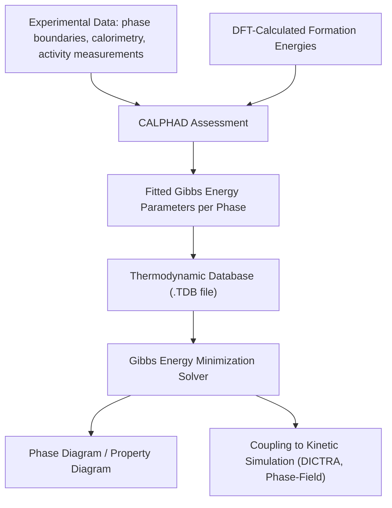

## CALPHAD Based Thermodynamic Simulation

### Fundamental Concept

CALPHAD (CALculation of PHAse Diagrams) is a methodology for computing multicomponent phase equilibria, phase diagrams, and thermodynamic properties by combining physically-based mathematical models of the Gibbs free energy of each phase with a self-consistent, critically assessed database of model parameters. Rather than solving phase equilibrium from first principles for every composition and temperature, CALPHAD relies on parametric free energy models fitted to a comprehensive body of experimental and (increasingly) first-principles data, then extrapolates reliably to unmeasured compositions, temperatures, and higher-order (multicomponent) systems via well-established mixing rules.

The core computational task is **Gibbs free energy minimization** at fixed temperature, pressure, and overall composition, across all candidate phases, to determine the stable phase assemblage, phase fractions, and phase compositions:

$$G_{system} = \sum_{\phi} n^\phi G_m^\phi(T, x^\phi) \rightarrow \text{minimize subject to mass balance}$$

where the sum runs over all phases $\phi$ present, $n^\phi$ is the amount of phase $\phi$, and $G_m^\phi$ is its molar Gibbs energy as a function of temperature and composition.

**Key Points**

- CALPHAD is not a predictive first-principles method in the ab initio sense — it is a semi-empirical framework whose reliability depends entirely on the quality and coverage of the underlying assessed database for the system of interest.
- The key strength enabling practical use is **extrapolation via consistent physical models**: binary and ternary parameter sets, once assessed, combine according to defined mixing models to predict higher-order multicomponent systems reasonably well, though extrapolation reliability decreases as compositional/temperature ranges move further from assessed data.
- Modern CALPHAD assessments increasingly incorporate DFT-calculated formation energies (particularly for intermetallic compounds and metastable phases lacking experimental data) alongside experimental thermodynamic and phase-boundary data.

### Gibbs Free Energy Models by Phase Type

| Phase Type | Model | Key Parameters |
| --- | --- | --- |
| Pure element / stoichiometric compound | Polynomial in T (SGTE unary format) | $G = a + bT + cT\ln T + dT^2 + ...$ |
| Disordered solution (substitutional) | Redlich-Kister polynomial for excess Gibbs energy | Binary/ternary interaction parameters $L^0, L^1, L^2...$ |
| Ordered intermetallic / sublattice phases | Compound Energy Formalism (CEF) | Sublattice occupancies, end-member energies, interaction parameters |
| Magnetic contribution | Inden-Hillert-Jarl model | Curie/Néel temperature, magnetic moment |

The **Redlich-Kister polynomial** for a binary substitutional solution's excess Gibbs energy is the most fundamental building block:

$$G_m^{xs} = x_A x_B \sum_{j=0}^{n} L^j (x_A - x_B)^j$$

with the interaction parameters $L^j$ (often temperature-dependent: $L^j = a_j + b_j T$) fitted during assessment to reproduce experimental phase-boundary and thermodynamic data.

The **Compound Energy Formalism (CEF)** extends this to phases with multiple crystallographic sublattices (e.g., ordered intermetallics, interstitial solutions like austenite with carbon on octahedral sites), representing the phase as $(A,B)_a(C,D)_b$ with species mixing independently on each sublattice — this formalism underlies most modern descriptions of ordered and interstitial phases in steels and superalloys.

### Database Assessment Workflow

1. **Data collection**: Gather experimental phase-boundary data (from metallography, XRD, DSC), thermodynamic activity/enthalpy data, and DFT-calculated energetics for the binary/ternary systems of interest
2. **Model selection**: Choose appropriate Gibbs energy models for each phase based on its crystal structure and known ordering behavior
3. **Parameter optimization**: Fit model parameters (typically via least-squares optimization, e.g., using PARROT or similar assessment software) to simultaneously reproduce all available experimental and computed data
4. **Consistency validation**: Verify the assessed system reproduces known invariant reactions (eutectic, peritectic points), known intermetallic stability ranges, and extrapolates sensibly into unmeasured regions
5. **Extension to higher-order systems**: Combine validated binary and ternary assessments into multicomponent databases using established combination/extrapolation models (Muggianu, Kohler, Toop), enabling calculations for real commercial alloys with many elements

### Application to Materials Science and Metallurgy

- **Phase diagram calculation**: Generating binary, ternary, and isopleth (constant-composition section through a multicomponent system) phase diagrams for alloy systems, including systems too complex or costly to fully map experimentally
- **Alloy design and optimization**: Rapid virtual screening of composition space for target phase constitution (e.g., minimizing detrimental intermetallic phases, maximizing solid solution strengthening potential) before committing to experimental alloy trials
- **Solidification simulation (Scheil-Gulliver and lever-rule models)**: Predicting microsegregation, solidification path, and freezing range for casting and welding process design, using the Scheil assumption of no diffusion in solid but complete mixing in liquid:

$$C_S^* = k \, C_0 \, (1 - f_S)^{k-1}$$

as a first approximation, with modern CALPHAD software typically implementing more rigorous Gibbs-energy-based Scheil simulation rather than this simplified partition-coefficient form directly

- **Heat treatment process design**: Predicting solvus temperatures, precipitate equilibrium volume fractions, and homogenization requirements for age-hardenable alloys
- **Coupling to kinetic simulation**: CALPHAD thermodynamic databases (paired with assessed atomic mobility databases) provide the essential thermodynamic driving-force input for diffusion simulation software (e.g., DICTRA) and quantitative phase-field models
- **Property diagram generation**: Calculating property vs. temperature/composition plots (phase fraction, liquidus/solidus, heat capacity, enthalpy of transformation) directly comparable to DSC/dilatometry experimental results
- **High-entropy and complex concentrated alloy design**: CALPHAD extrapolation into compositionally complex, multi-principal-element regions to predict phase stability, though [Inference] extrapolation reliability in such far-from-assessed compositional space is generally lower than in well-studied conventional alloy systems, making experimental validation particularly important in this application area

**Example**

An alloy designer uses a commercial multicomponent steel thermodynamic database to calculate an isopleth section through a proposed low-alloy steel composition, varying carbon content at fixed alloying element levels. The calculated diagram indicates the $A_{c3}$ temperature (full austenitization) and identifies a composition/temperature window where a small fraction of undissolved carbide (e.g., M₂₃C₆ or MC-type) persists even above the nominal austenitizing temperature, which could explain observed incomplete carbide dissolution seen in prior metallography. A subsequent Scheil solidification simulation on the same composition predicts a modest degree of interdendritic microsegregation of chromium and molybdenum, informing the homogenization heat treatment schedule recommended prior to hot working. [Unverified] The specific accuracy of these predictions is bounded by how well the alloy's actual composition range and the specific carbide phases present were covered in the underlying database assessment, and calculated results are generally treated as a strong guide for experimental design rather than a substitute for confirmatory metallography and DSC/dilatometry validation.

### Common Limitations and Pitfalls

- **Database coverage gaps**: A multicomponent database may lack proper assessment for certain element combinations present in a real commercial alloy, silently defaulting to less accurate extrapolation or ideal-mixing assumptions
- **Metastable and non-equilibrium phases**: Standard CALPHAD calculations assume full equilibrium; capturing kinetically favored metastable phases (common in rapid solidification, welding, additive manufacturing) requires either Scheil-type non-equilibrium solidification models or coupling to explicit kinetic simulation
- **Database selection and version differences**: Different commercial or open-source databases for nominally the same alloy class (e.g., multiple competing steel or Ni-superalloy databases) can give measurably different predictions due to differing assessment choices and underlying data — [Unverified] cross-checking predictions against more than one database, where available, is generally good practice for high-consequence design decisions
- **Interpretation of low-amount phase predictions**: CALPHAD can predict very small equilibrium fractions of secondary phases that may not be experimentally observable or practically significant, requiring engineering judgment in interpretation

### SVG: CALPHAD Gibbs Energy Minimization Concept (svg_diagram)

<svg xmlns="http://www.w3.org/2000/svg" viewBox="0 0 640 320">
<rect x="0" y="0" width="640" height="320" fill="#ffffff" />
<text x="320" y="24" text-anchor="middle" font-size="16" font-weight="bold" fill="#111">Gibbs Energy Minimization (svg_diagram)</text>
<line x1="60" y1="270" x2="580" y2="270" stroke="#333" stroke-width="1.5" />
<line x1="60" y1="270" x2="60" y2="50" stroke="#333" stroke-width="1.5" />
<text x="320" y="300" text-anchor="middle" font-size="12" fill="#333">Composition (x_B) →</text>
<text x="30" y="160" text-anchor="middle" font-size="12" fill="#333" transform="rotate(-90,30,160)">Gibbs Energy, G</text>
<path d="M 90 90 Q 200 250 320 200 Q 440 150 560 80" fill="none" stroke="#2b6cb0" stroke-width="2" />
<text x="150" y="110" font-size="10" fill="#1a4971">Phase α</text>
<path d="M 200 240 Q 320 100 440 230" fill="none" stroke="#c05621" stroke-width="2" />
<text x="330" y="130" font-size="10" fill="#7c2d12">Phase β</text>
<line x1="230" y1="215" x2="380" y2="180" stroke="#2f855a" stroke-width="2" stroke-dasharray="4,2" />
<text x="300" y="200" font-size="10" fill="#22543d">Common tangent</text>
<text x="300" y="212" font-size="10" fill="#22543d">(equilibrium)</text>
<circle cx="230" cy="215" r="4" fill="#22543d" />
<circle cx="380" cy="180" r="4" fill="#22543d" />
</svg>

**Related Topics**

- Phase Field Modeling (CALPHAD as thermodynamic driving-force input)
- Diffusion simulation and kinetic databases (DICTRA-type methods)
- Atomistic Simulation (DFT as data source for database assessment)
- Scheil-Gulliver solidification and microsegregation
- Differential Scanning Calorimetry (experimental validation data source)
- Alloy design for high-entropy and compositionally complex alloys