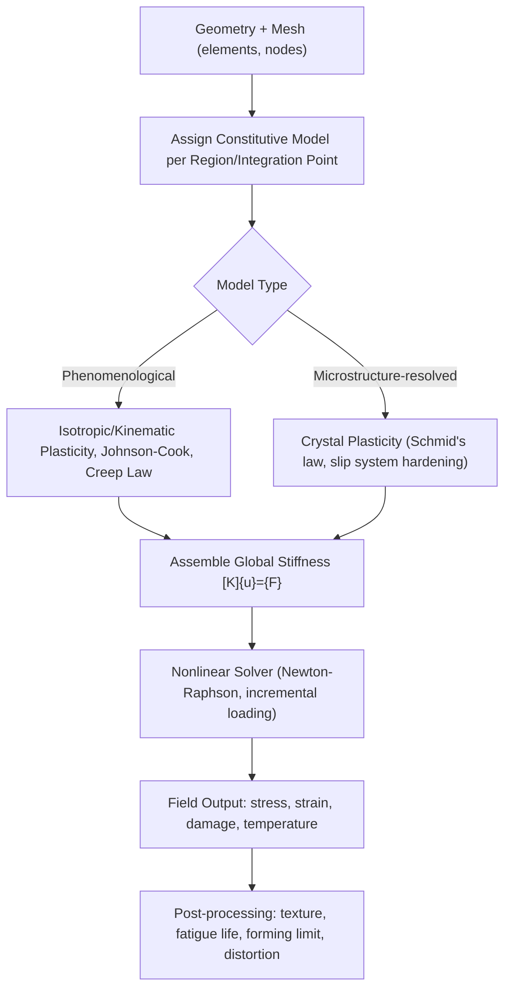

## Finite Element Modeling of Materials Behavior

### Fundamental Concept

The Finite Element Method (FEM) solves boundary value problems — governing partial differential equations subject to prescribed boundary conditions — by discretizing a continuous domain into a mesh of small, simply-shaped elements (triangles, quadrilaterals, tetrahedra, hexahedra), over which the unknown field variables (displacement, temperature, stress) are approximated using interpolation (shape) functions. The governing equations are then converted into a system of algebraic equations solved numerically, most commonly via the principle of virtual work or a weighted-residual (Galerkin) formulation.

For solid mechanics, the core equilibrium statement at each element, assembled into the global system, takes the form:

$$[K]\{u\} = \{F\}$$

where $[K]$ is the global stiffness matrix (built from element material properties and geometry), $\{u\}$ is the nodal displacement vector, and $\{F\}$ is the applied nodal force vector. Nonlinear material behavior (plasticity, large deformation, temperature-dependent properties) requires iterative solution (typically Newton-Raphson) since $[K]$ itself becomes a function of the current solution state.

**Key Points**

- FEM is a general numerical framework applicable across physics (mechanical, thermal, electromagnetic, and fully coupled multiphysics problems); its use in materials engineering centers on constitutive model implementation — how the material's stress-strain-temperature-microstructure response is mathematically represented at each integration point.
- Model fidelity in materials applications is governed as much by the constitutive model and its calibration as by mesh quality and element formulation — a well-meshed model with an inappropriate or poorly calibrated material model will still produce misleading results.
- FEM operates at the continuum scale by default (no explicit atomic/grain-scale resolution), though crystal plasticity and multiscale-coupled formulations extend it toward microstructural scales.

### Constitutive Models for Materials Behavior

| Model Class | Captures | Typical Use |
| --- | --- | --- |
| Linear elastic | Reversible, proportional stress-strain response | Low-stress design verification, elastic stress concentration |
| Elastic-plastic (J2/von Mises, isotropic/kinematic hardening) | Yielding and permanent deformation, Bauschinger effect | Metal forming, structural overload analysis |
| Viscoplastic / creep | Time- and temperature-dependent inelastic strain | High-temperature component life prediction (turbine blades, pressure vessels) |
| Damage/fracture mechanics (cohesive zone, XFEM, phase-field fracture) | Crack initiation and propagation | Fracture and fatigue life assessment |
| Crystal plasticity (CPFEM) | Grain-scale anisotropic slip-system-resolved deformation | Texture evolution, microstructure-sensitive forming behavior |
| Coupled thermo-mechanical | Temperature-dependent properties, thermal strain, latent heat | Welding, casting, additive manufacturing process simulation |

**Isotropic von Mises plasticity** remains the workhorse model for general structural metals analysis, with the yield criterion:

$$f = \sigma_{eq} - \sigma_y(\bar{\varepsilon}^p, T) = 0, \quad \sigma_{eq} = \sqrt{\frac{3}{2} s_{ij} s_{ij}}$$

where $s_{ij}$ is the deviatoric stress tensor and $\sigma_y$ is the flow stress, often expressed via empirical hardening laws (e.g., Johnson-Cook, for combined strain, strain-rate, and temperature dependence):

$$\sigma_y = \left[A + B(\bar{\varepsilon}^p)^n\right]\left[1 + C\ln\dot{\varepsilon}^*\right]\left[1 - (T^*)^m\right]$$

The Johnson-Cook form is particularly common in metal forming, machining, and impact/ballistic simulation due to its explicit rate and temperature sensitivity terms.

### Crystal Plasticity Finite Element Modeling (CPFEM)

CPFEM replaces the phenomenological (isotropic) plasticity model with a physically-based description of crystallographic slip on discrete slip systems, resolved either at individual grains (using an actual or statistically representative polycrystalline mesh, often informed by EBSD orientation maps) or via crystal-plasticity-informed homogenization at each integration point.

The resolved shear stress on slip system $\alpha$ follows Schmid's law:

$$\tau^\alpha = \sigma_{ij} \, s_i^\alpha \, n_j^\alpha$$

where $s^\alpha$ and $n^\alpha$ are the slip direction and slip plane normal. Slip system activation and hardening are governed by a critical resolved shear stress and hardening law (e.g., based on dislocation density evolution), enabling CPFEM to predict crystallographic texture evolution, anisotropic yielding, and grain-scale strain heterogeneity directly from microstructural input.

### Application to Materials Science and Metallurgy

- **Metal forming simulation**: Predicting material flow, thinning, springback, and forming-limit exceedance in stamping, forging, extrusion, and rolling processes, using calibrated flow curves (often from tensile or compression testing at relevant strain rates and temperatures)
- **Welding process simulation**: Fully coupled thermo-mechanical FEM predicts residual stress and distortion from the welding thermal cycle, incorporating temperature-dependent material properties and, in advanced models, microstructure evolution (phase transformation strains) during cooling
- **Additive manufacturing process simulation**: Layer-by-layer thermo-mechanical simulation predicting residual stress, distortion, and (in coupled approaches) resulting microstructure from the rapid, spatially localized thermal history characteristic of powder-bed fusion and directed energy deposition
- **Fracture and fatigue life prediction**: Fracture mechanics-based FEM (stress intensity factor calculation, cohesive zone modeling, XFEM for crack propagation without remeshing) supports damage-tolerant design and life assessment
- **Creep and high-temperature component design**: Viscoplastic constitutive models predict long-term deformation and rupture life in components such as turbine blades and pressure vessel components operating at elevated temperature
- **Texture and anisotropy prediction**: CPFEM predicts crystallographic texture evolution during forming, informing subsequent formability and mechanical anisotropy in sheet metal products
- **Residual stress and distortion prediction**: Heat treatment (quenching), casting solidification, and machining-induced residual stress simulation, informing process parameter optimization to control final part distortion

**Example**

A deep-drawing simulation of an automotive sheet steel panel uses a calibrated Hill'48 or Barlat-type anisotropic yield surface (informed by measured $r$-values from tensile tests at multiple orientations to the rolling direction) combined with an isotropic hardening law fitted to the material's stress-strain curve. The simulation predicts localized thinning near a die radius exceeding the material's forming limit curve at that location, indicating a risk of splitting during the actual stamping operation. Adjusting the blank holder force and draw-bead geometry in subsequent simulation iterations reduces the predicted peak thinning below the forming limit, providing a validated basis for die design changes prior to physical tryout. [Inference] The reliability of this prediction depends heavily on how well the anisotropic yield surface and hardening law were calibrated against the actual material batch's mechanical behavior, since forming-limit predictions are known to be sensitive to constitutive model choice and calibration quality.

### Verification and Validation Considerations

- **Mesh convergence**: Results (particularly stress concentrations, strain localization) must be checked for sensitivity to mesh refinement; unconverged meshes can produce non-physical, mesh-dependent results especially in strain-softening or localization-prone problems
- **Element formulation selection**: Reduced-integration elements (hourglass control needed), fully-integrated elements (shear locking concerns in bending-dominated problems), and element type (tetrahedral vs. hexahedral) all affect accuracy and computational cost
- **Constitutive model calibration**: Material parameters must be calibrated against experimental data spanning the strain, strain-rate, and temperature ranges relevant to the actual simulated process — extrapolation outside the calibration range introduces [Inference] substantial and often unquantified additional uncertainty, since constitutive model forms are typically fitted rather than derived from first principles
- **Boundary condition fidelity**: Contact modeling (friction coefficients, tool-workpiece interaction), thermal boundary conditions (convection/radiation coefficients), and loading history representation all directly affect predictive accuracy
- **Experimental validation**: Comparison against physical trial data (measured forming loads, distortion, residual stress via XRD or hole-drilling, or post-mortem microstructure) remains standard practice before using simulation results for high-consequence process or design decisions

[Unverified] Solver-specific numerical behavior (default element formulations, contact algorithm details, convergence criteria) varies meaningfully between commercial and open-source FEM codes; practitioners should consult the specific solver's documentation and perform mesh/parameter sensitivity studies rather than assuming universal default settings are appropriate for a given materials application.

### SVG: FEM Mesh Discretization Concept (svg_diagram)

<svg xmlns="http://www.w3.org/2000/svg" viewBox="0 0 640 300">
<rect x="0" y="0" width="640" height="300" fill="#ffffff" />
<text x="320" y="24" text-anchor="middle" font-size="16" font-weight="bold" fill="#111">FEM Discretization Concept (svg_diagram)</text>

<path d="M 100 80 Q 180 60 260 90 Q 340 120 420 80 Q 480 60 540 90 L 540 220 Q 480 250 420 220 Q 340 190 260 220 Q 180 250 100 220 Z" fill="`#cfe8ff`" fill-opacity="0.4" stroke="`#2b6cb0`" stroke-width="2" />

<text x="320" y="270" text-anchor="middle" font-size="11" fill="`#1a4971`">Continuous Domain</text>

<g stroke="#c05621" stroke-width="1">
<line x1="140" y1="90" x2="200" y2="190" />
<line x1="200" y1="190" x2="260" y2="90" />
<line x1="260" y1="90" x2="320" y2="190" />
<line x1="320" y1="190" x2="380" y2="90" />
<line x1="380" y1="90" x2="440" y2="190" />
<line x1="140" y1="90" x2="440" y2="90" />
<line x1="200" y1="190" x2="380" y2="190" />
</g>
<text x="320" y="40" text-anchor="middle" font-size="11" fill="#7c2d12">Mesh: Discretized Elements + Nodes</text>
</svg>

**Related Topics**

- Crystal plasticity finite element modeling (CPFEM) in depth
- Johnson-Cook and other rate/temperature-dependent flow stress models
- Welding and additive manufacturing thermo-mechanical simulation
- CALPHAD coupling for temperature-dependent material property input
- Fracture mechanics and fatigue life prediction methods
- Dislocation dynamics and multiscale mechanical modeling