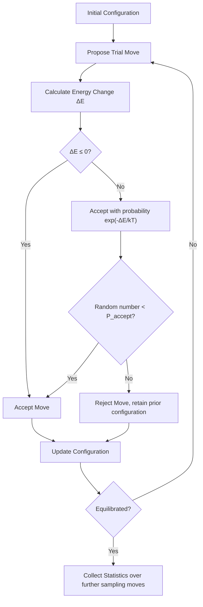

## Monte Carlo Methods in Materials Science

### Fundamental Concept

Monte Carlo (MC) methods solve materials problems by using repeated random sampling to explore configuration space, estimate statistical quantities, or simulate stochastic processes, rather than deterministically integrating equations of motion (as in molecular dynamics) or solving continuum field equations (as in FEM/phase-field). MC methods are particularly well suited to problems dominated by thermodynamic equilibrium sampling, stochastic/probabilistic mechanisms (nucleation, diffusion hopping, radiation damage), or combinatorial configuration spaces too large to enumerate exhaustively.

**Key Points**

- Unlike MD, standard Monte Carlo has no intrinsic time variable — moves are accepted or rejected based on energy/probability criteria, not physical dynamics; this makes MC excellent for reaching equilibrium configurations efficiently but requires care (e.g., kinetic Monte Carlo) when actual timescales matter.
- The Metropolis acceptance criterion is the foundational algorithm underlying most equilibrium MC methods in materials science, guaranteeing that sampled configurations follow the correct Boltzmann-weighted equilibrium distribution.
- MC methods scale differently than MD/DFT — computational cost relates to the number of sampling moves and the complexity of energy evaluation per move, not integration timestep, allowing effectively unlimited "simulated time" for equilibrium properties even though no explicit dynamical time is tracked in standard (non-kinetic) formulations.

### The Metropolis Algorithm

The standard Metropolis Monte Carlo algorithm samples configurations according to the Boltzmann distribution $P(\text{state}) \propto e^{-E/k_BT}$ via the following move-acceptance logic:

1. Propose a trial move (e.g., atom displacement, spin flip, species swap) from the current configuration, with energy change $\Delta E$
2. If $\Delta E \leq 0$, accept the move unconditionally
3. If $\Delta E > 0$, accept with probability:

$$P_{accept} = \exp\left(-\frac{\Delta E}{k_B T}\right)$$

by comparing against a uniformly distributed random number on $[0,1]$

4. Repeat over many moves, discarding an initial equilibration period before collecting statistics from the resulting Markov chain of configurations

This procedure satisfies detailed balance, ensuring the long-run distribution of sampled configurations correctly represents thermodynamic equilibrium at temperature $T$, without requiring explicit calculation of the partition function.

### Major Monte Carlo Variants Used in Materials Science

#### Lattice/Ising-type Monte Carlo

Configurations restricted to a fixed crystal lattice with discrete site occupancy (species type, spin state) variables; energy typically evaluated via a cluster expansion or nearest-neighbor pairwise interaction Hamiltonian. Used extensively for order-disorder transformation studies, magnetic phase transitions, and short-range order prediction in alloys.

#### Monte Carlo Potts Model (Grain Growth Simulation)

Each lattice site is assigned a discrete "grain orientation" index; grain boundary energy is represented by an interaction penalty between neighboring sites of different index. Repeated stochastic reorientation attempts, biased to reduce total boundary energy, simulate curvature-driven grain boundary migration and grain growth statistics (grain size distribution evolution, topological class distribution) at a computational cost far lower than phase-field for equivalent statistical grain growth studies.

#### Kinetic Monte Carlo (kMC)

Unlike standard (equilibrium) MC, kMC assigns physically meaningful rates (often from transition-state theory, $k = \nu_0 \exp(-E_a/k_BT)$, with attempt frequency $\nu_0$ and activation energy $E_a$ often obtained from DFT/MD calculations) to each possible event (atom/vacancy hop, adsorption, reaction), and selects/executes events according to their relative rates, advancing physical time via the **residence-time algorithm** (also called the BKL or n-fold way algorithm):

$$\Delta t = -\frac{\ln(r)}{\sum_i k_i}$$

where $r$ is a uniform random number and the sum runs over all possible events from the current state. kMC directly links to real physical timescales, unlike standard MC, making it the preferred method for simulating diffusion-mediated microstructural evolution, thin-film growth, and radiation damage annealing over experimentally relevant timescales.

#### Monte Carlo Integration and Uncertainty Quantification

Random sampling of input parameter distributions (e.g., material property scatter, processing parameter variability) propagated through a deterministic model (FEM, CALPHAD) to estimate output property distributions — a materials-engineering application of general MC integration/statistical sampling rather than a distinct physical simulation method.

### Application to Materials Science and Metallurgy

- **Order-disorder transformations and short-range order**: Lattice MC with cluster-expansion Hamiltonians (often parameterized from DFT total-energy calculations across a range of configurations) predicts order-disorder transition temperatures and short-range order parameters in solid solutions and intermetallics
- **Grain growth statistics**: Potts-model MC efficiently generates statistically representative grain size distributions and topological evolution for comparison against experimental grain growth kinetics, particularly valuable for large-scale statistical studies where full phase-field simulation would be computationally prohibitive
- **Precipitation and clustering kinetics**: kMC simulates atomic-scale diffusion and clustering (e.g., early-stage GP zone formation in Al alloys, solute clustering preceding precipitation) with activation energies informed by DFT, capturing atomistic detail over experimentally relevant timescales inaccessible to classical MD
- **Radiation damage annealing**: kMC simulates long-timescale (seconds to years) evolution of point defects and defect clusters following displacement cascades, complementing MD (which captures only the initial picosecond-scale cascade event) to bridge the full timescale of radiation damage accumulation
- **Diffusion coefficient calculation**: Lattice-based kMC with DFT-derived hop rates predicts tracer and chemical diffusion coefficients in alloys, including composition and temperature dependence
- **Thin-film and coating growth simulation**: kMC models of adatom deposition, surface diffusion, and nucleation predict thin-film morphology evolution during PVD/CVD coating processes
- **Solid solution strengthening and alloy design screening**: Combined with cluster-expansion energetics, MC sampling estimates configurational thermodynamics (mixing enthalpy, configurational entropy) supporting high-throughput alloy screening, including in compositionally complex/high-entropy alloy design

**Example**

A researcher studies short-range ordering tendency in a binary substitutional alloy using lattice Monte Carlo with a nearest- and next-nearest-neighbor pairwise interaction Hamiltonian, with interaction parameters fitted to reproduce DFT-calculated formation energies of several ordered superlattice structures. Metropolis sampling at a series of decreasing temperatures reveals a transition from a disordered solid solution to a short-range-ordered state below a critical temperature, identified by a peak in the configurational heat capacity (calculated from energy fluctuations, $C_v = (\langle E^2 \rangle - \langle E \rangle^2)/k_BT^2$) as a function of simulated temperature. This predicted ordering temperature can be compared against experimental diffuse-scattering (X-ray or neutron) measurements of short-range order; [Inference] discrepancies between the simplified pairwise Hamiltonian and the true multi-body interaction energetics of the real alloy are a common source of quantitative disagreement, even when the qualitative ordering trend is correctly captured, since simple pairwise cluster expansions often omit important multi-body contributions present in real metallic bonding.

### Comparative Summary: MC vs. MD vs. kMC

| Attribute | Standard (Metropolis) MC | Molecular Dynamics | Kinetic MC |
| --- | --- | --- | --- |
| Physical time tracked | No | Yes (explicit integration) | Yes (via rate-based residence time) |
| Best suited for | Equilibrium thermodynamic sampling | Dynamical/mechanical processes, fast timescales | Diffusion-mediated evolution, long timescales |
| Typical timescale reached | N/A (equilibrium only) | ps–µs | µs–years (event-rate dependent) |
| Requires interatomic potential/force field | Depends (energy model needed) | Yes | Rate constants (often DFT-derived) rather than full potential |

[Unverified] Achievable simulated timescales for kMC vary enormously (many orders of magnitude) depending on the specific rate constants and event frequencies involved in a given materials system; general timescale ranges cited above are illustrative rather than fixed limits.

### SVG: Metropolis Sampling — Energy Landscape Exploration (svg_diagram)

<svg xmlns="http://www.w3.org/2000/svg" viewBox="0 0 640 300">
<rect x="0" y="0" width="640" height="300" fill="#ffffff" />
<text x="320" y="24" text-anchor="middle" font-size="16" font-weight="bold" fill="#111">Metropolis Sampling Concept (svg_diagram)</text>
<line x1="60" y1="250" x2="580" y2="250" stroke="#333" stroke-width="1.5" />
<line x1="60" y1="250" x2="60" y2="50" stroke="#333" stroke-width="1.5" />
<text x="320" y="280" text-anchor="middle" font-size="12" fill="#333">Configuration Space →</text>
<text x="30" y="150" text-anchor="middle" font-size="12" fill="#333" transform="rotate(-90,30,150)">Energy</text>
<path d="M 80 100 Q 160 220 240 130 Q 320 60 400 190 Q 480 240 560 110" fill="none" stroke="#2b6cb0" stroke-width="2" />
<circle cx="240" cy="130" r="5" fill="#c05621" />
<circle cx="180" cy="180" r="4" fill="#7c2d12" />
<circle cx="210" cy="150" r="4" fill="#7c2d12" />
<circle cx="260" cy="120" r="4" fill="#7c2d12" />
<path d="M 240 130 L 180 180 L 210 150 L 260 120" fill="none" stroke="#c05621" stroke-width="1" stroke-dasharray="3,2" />
<text x="330" y="100" font-size="10" fill="#7c2d12">Random walk toward</text>
<text x="330" y="112" font-size="10" fill="#7c2d12">low-energy region</text>
</svg>

**Related Topics**

- Atomistic Simulation (DFT/MD) as source of energetics for cluster expansions and kMC rates
- Cluster expansion methods for alloy configurational energetics
- Phase Field Modeling (comparative continuum approach to microstructure evolution)
- Radiation damage simulation across coupled MD-kMC timescales
- Short-range order and diffuse scattering characterization
- High-entropy alloy configurational thermodynamics