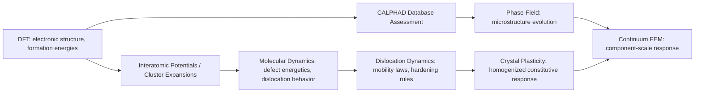

## Multiscale Modeling Approaches

### Fundamental Concept

Multiscale modeling addresses the reality that no single simulation method spans the full range of length scales (Ångstroms to meters) and time scales (femtoseconds to years) relevant to real materials behavior. A given engineering property or failure mechanism typically has its origin at one scale (e.g., dislocation-obstacle interaction at the nanoscale) but manifests as a measurable, design-relevant response at another (e.g., macroscopic yield strength). Multiscale modeling systematically links methods across scales — passing information (parameters, constitutive relations, boundary conditions) from finer to coarser scales, or coupling scales simultaneously — to connect fundamental mechanisms to engineering-relevant predictions.

$$\text{Electronic (DFT)} \rightarrow \text{Atomistic (MD)} \rightarrow \text{Mesoscale (Phase-field, DD, kMC)} \rightarrow \text{Continuum (FEM, CALPHAD)}$$

**Key Points**

- No individual method in the hierarchy is self-sufficient for most engineering problems; multiscale strategies exist specifically because accuracy (finer scales) and computational tractability/domain size (coarser scales) trade off directly against each other.
- Two broad coupling philosophies exist: **hierarchical (sequential) coupling**, where finer-scale results are used to parameterize or inform a coarser-scale model run independently, and **concurrent coupling**, where two or more scales are solved simultaneously within a single simulation domain, exchanging information at each step.
- The choice of coupling strategy depends on whether the phenomenon of interest requires fine-scale resolution only in a localized region (favoring concurrent coupling) or can be adequately captured by scale-bridging parameters alone (favoring hierarchical coupling, generally simpler and more widely used in practice).

### Hierarchical (Sequential) Multiscale Coupling

Information flows one-way (or with limited iterative feedback) from finer to coarser scales: a finer-scale simulation computes a parameter, property, or constitutive relation, which is then used as an input to a coarser-scale model run independently.

| Link | Example |
| --- | --- |
| DFT → CALPHAD | Formation energies of intermetallic/metastable phases feed database assessment |
| DFT → Interatomic potential fitting | Reference energies/forces used to parameterize classical or machine-learning potentials for MD |
| DFT/MD → Phase-field | Interfacial energies, elastic constants, diffusion mobilities parameterize the phase-field free energy functional |
| MD → Dislocation dynamics (DD) | Dislocation mobility laws, junction/cross-slip rules derived from atomistic dislocation simulations |
| DD/Crystal plasticity → Continuum FEM | Homogenized constitutive laws (yield surface, hardening behavior) derived from lower-scale simulation feed macroscale structural FEM |
| CALPHAD → Phase-field / FEM | Thermodynamic driving forces and temperature-dependent material properties |

This approach is computationally efficient (each scale is solved independently, without the overhead of simultaneous coupling) and is by far the most widely used multiscale strategy in practical materials engineering, underlying most of the individual methods already covered in this chapter (DFT-informed CALPHAD, DFT/MD-informed phase-field, and so on).

### Concurrent Multiscale Coupling

Two or more scales are solved simultaneously within a single computational domain, typically because the phenomenon of interest requires fine-scale accuracy only in a small, often evolving, region (e.g., a crack tip, a dislocation core) while the surrounding domain can be adequately represented at a coarser scale.

- **Quasicontinuum (QC) method**: Couples atomistic resolution in regions of high deformation gradient (e.g., near a crack tip or dislocation core) to a coarse-grained continuum finite-element representation elsewhere, using the same underlying atomistic energetics throughout but representing the coarse region with far fewer degrees of freedom via interpolation between representative atoms
- **Concurrent atomistic-continuum (CAC) and handshake/bridging-domain methods**: Explicitly couple an MD region to an FEM region through a transition ("handshake") zone, requiring careful treatment to avoid spurious wave reflection at the atomistic-continuum interface
- **Adaptive/embedded methods**: Dynamically identify regions requiring finer-scale treatment during the simulation (e.g., where local stress or strain exceeds a threshold) and refine resolution there while coarsening elsewhere as the region of interest evolves

Concurrent coupling is computationally demanding and numerically delicate (particularly interface artifacts and the difficulty of consistently representing temperature/entropy across scales with very different degrees of freedom), and is generally reserved for problems where the localized fine-scale physics cannot be adequately captured by a pre-fitted coarse-scale constitutive law — most notably crack-tip fracture processes and dislocation nucleation events.

### Representative Multiscale Workflows in Metallurgy

#### Alloy Design Pipeline

$$\text{DFT formation energies} \rightarrow \text{CALPHAD database} \rightarrow \text{Phase diagram/Scheil prediction} \rightarrow \text{Candidate composition screening} \rightarrow \text{Experimental validation}$$

Used extensively in accelerated/computational alloy design (including Integrated Computational Materials Engineering, ICME, frameworks) to narrow a large compositional design space before committing to experimental trials.

#### Process-Structure-Property Chain

$$\text{Process simulation (FEM: thermal/mechanical history)} \rightarrow \text{Microstructure prediction (CALPHAD/phase-field/kMC)} \rightarrow \text{Property prediction (crystal plasticity, homogenized constitutive law)} \rightarrow \text{Component performance (structural FEM)}$$

This **process-structure-property-performance (PSPP)** linkage is the conceptual backbone of ICME, aiming to predict final component performance directly from processing parameters by chaining models across scales, rather than relying solely on empirical process-property correlations developed through trial-and-error.

#### Mechanical Property Multiscale Chain

$$\text{DFT: dislocation core energetics, SFE} \rightarrow \text{MD: dislocation mobility, obstacle interaction} \rightarrow \text{Dislocation dynamics: strengthening mechanisms, flow stress} \rightarrow \text{Crystal plasticity FEM: polycrystal response, texture} \rightarrow \text{Structural FEM: component-scale mechanical performance}$$

### Application to Materials Science and Metallurgy

- **Integrated Computational Materials Engineering (ICME)**: The overarching framework explicitly built on hierarchical multiscale linkage of process, structure, and property models to accelerate materials and process development timelines relative to traditional empirical iteration
- **Precipitation-strengthened alloy design**: Linking DFT (precipitate/matrix interfacial energy, elastic misfit) → phase-field or kMC (precipitate size/morphology evolution during aging) → strengthening models (Orowan bypass, shearing mechanisms) → predicted yield strength as a function of heat treatment schedule
- **Weld and additive manufacturing qualification**: Linking process-scale thermal-mechanical FEM → CALPHAD-informed phase transformation/microstructure prediction → localized mechanical property prediction, supporting qualification of new processes or materials without exhaustive physical testing matrices
- **Radiation damage and nuclear materials**: DFT (defect formation/migration energies) → MD (cascade damage) → kMC (long-timescale defect evolution) → continuum radiation damage/swelling models for reactor component life prediction
- **Fatigue and fracture life prediction**: Microstructure-sensitive fatigue models linking crystal plasticity (grain-scale stress/strain heterogeneity, particularly near inclusions or grain boundaries) to continuum fracture mechanics for probabilistic life prediction accounting for microstructural variability
- **High-throughput computational alloy screening**: DFT and CALPHAD-based rapid screening across large compositional spaces, increasingly combined with machine-learning surrogate models trained on multiscale simulation outputs to further accelerate the search

**Example**

An ICME-based development program for a new precipitation-strengthened aluminum alloy begins with DFT calculations of precipitate-matrix interfacial energy and elastic misfit for several candidate strengthening-phase chemistries. These values, along with CALPHAD-derived phase equilibria and diffusion mobilities, parameterize a quantitative phase-field model predicting precipitate size distribution and volume fraction evolution during a proposed aging schedule. The predicted precipitate characteristics feed an Orowan-based strengthening model estimating yield strength contribution, which is combined with solid-solution and grain-size strengthening terms to predict overall alloy strength as a function of aging time and temperature. This predicted strength-vs-aging curve guides selection of a small number of promising compositions and heat treatments for experimental validation, substantially narrowing the experimental matrix relative to a purely empirical approach. [Inference] The overall prediction's reliability is bounded by the weakest link in the chain — commonly the phase-field interfacial energy/mobility parameterization or the strengthening model's applicability to the specific precipitate morphology observed — making targeted experimental validation at key intermediate stages (not only the final strength prediction) important practice.

### Challenges in Multiscale Coupling

- **Error propagation and uncertainty accumulation**: Uncertainties introduced at each hierarchical link (DFT approximation error, potential-fitting error, homogenization assumptions) can compound through the chain; formal uncertainty quantification (UQ) across scale-bridging steps is an active area of methodology development rather than a fully mature, routine practice
- **Scale-bridging information loss**: Coarse-graining inherently discards information (e.g., a homogenized constitutive law cannot capture every microstructural configuration that gave rise to it), requiring judgment about which details are essential to retain
- **Consistency of representation across scales**: Temperature, entropy, and time are represented very differently (or not at all, in the case of static DFT/equilibrium MC) at different scales, complicating rigorous concurrent coupling in particular
- **Validation data scarcity**: Experimental validation at intermediate scales (e.g., single dislocation mobility, nanoscale precipitate morphology) is often more difficult and costly to obtain than bulk property validation, leaving some links in a multiscale chain less rigorously validated than the overall final prediction

[Unverified] The degree of maturity and industrial adoption of specific multiscale workflows varies considerably by material class and application — precipitation-strengthened aluminum and nickel-superalloy design pipelines are relatively mature examples, while fully coupled multiscale fatigue/fracture prediction remains comparatively more research-stage in general industrial practice.

### SVG: Multiscale Modeling Hierarchy (svg_diagram)

<svg xmlns="http://www.w3.org/2000/svg" viewBox="0 0 640 340">
<rect x="0" y="0" width="640" height="340" fill="#ffffff" />
<text x="320" y="24" text-anchor="middle" font-size="16" font-weight="bold" fill="#111">Multiscale Modeling Hierarchy (svg_diagram)</text>
<rect x="60" y="50" width="500" height="50" fill="#cfe8ff" fill-opacity="0.6" stroke="#2b6cb0" />
<text x="320" y="80" text-anchor="middle" font-size="12" fill="#1a4971">Electronic: DFT (Å, fs-ps)</text>
<rect x="60" y="110" width="500" height="50" fill="#d6f5d6" fill-opacity="0.6" stroke="#2f855a" />
<text x="320" y="140" text-anchor="middle" font-size="12" fill="#22543d">Atomistic: Molecular Dynamics (nm, ps-ns)</text>
<rect x="60" y="170" width="500" height="50" fill="#ffe0cc" fill-opacity="0.6" stroke="#c05621" />
<text x="320" y="200" text-anchor="middle" font-size="12" fill="#7c2d12">Mesoscale: Phase-Field, Dislocation Dynamics, kMC (µm, ns-s)</text>
<rect x="60" y="230" width="500" height="50" fill="#f5d6f0" fill-opacity="0.6" stroke="#b83280" />
<text x="320" y="260" text-anchor="middle" font-size="12" fill="#702459">Continuum: FEM, CALPHAD (mm-m, s-years)</text>
<line x1="320" y1="100" x2="320" y2="110" stroke="#333" stroke-width="2" marker-end="url(#arrow)" />
<line x1="320" y1="160" x2="320" y2="170" stroke="#333" stroke-width="2" marker-end="url(#arrow)" />
<line x1="320" y1="220" x2="320" y2="230" stroke="#333" stroke-width="2" marker-end="url(#arrow)" />
</svg>

**Related Topics**

- Integrated Computational Materials Engineering (ICME) frameworks
- Atomistic Simulation: DFT and Molecular Dynamics
- Phase Field Modeling and CALPHAD coupling
- Dislocation dynamics simulation
- Crystal plasticity finite element modeling (CPFEM)
- Uncertainty quantification in computational materials science