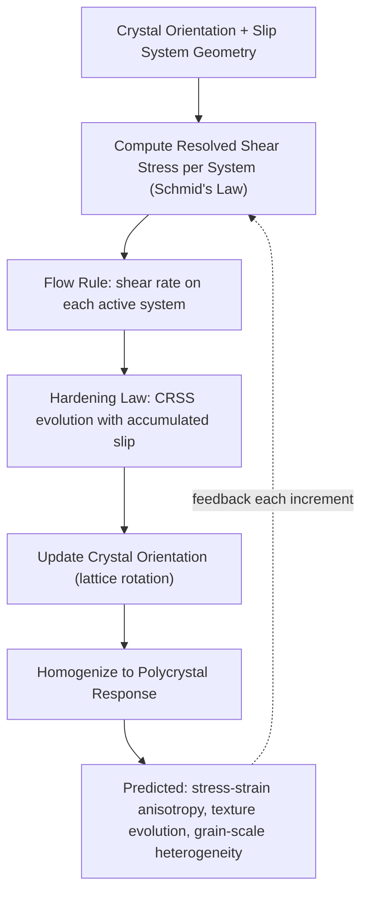

## Crystal Plasticity Modeling

### Fundamental Concept

Crystal plasticity (CP) modeling describes plastic deformation of crystalline materials as the physically observed mechanism it actually is: discrete crystallographic slip (and, where relevant, deformation twinning) occurring on specific slip systems, each defined by a slip plane and slip direction dictated by the crystal structure. This stands in contrast to phenomenological (isotropic von Mises) plasticity, which treats yielding and flow as direction-independent — an approximation adequate for many engineering polycrystal calculations but incapable of capturing texture evolution, deformation anisotropy, and grain-scale strain heterogeneity that originate directly from crystallography.

**Key Points**

- CP models are built around Schmid's law and the kinematics of crystallographic slip, making crystal structure (FCC, BCC, HCP) and its associated slip system geometry a first-order input to the model, not an empirical fitting parameter.
- CP can be implemented at multiple levels of geometric fidelity: mean-field homogenization (representing polycrystal response statistically without explicit grain geometry), full-field crystal plasticity finite element (CPFEM, explicit grain morphology and neighbor interactions), and fast-Fourier-transform-based (CP-FFT) spectral methods offering a computationally efficient full-field alternative to CPFEM for periodic microstructures.
- Because CP resolves individual grain orientations, it naturally predicts and tracks crystallographic texture evolution during deformation — a capability essentially unavailable to isotropic phenomenological plasticity models.

### Kinematics and Slip System Framework

#### Schmid's Law and Resolved Shear Stress

The stress driving slip on a given system is the resolved shear stress, projecting the applied stress tensor onto the slip plane normal $\mathbf{n}^\alpha$ and slip direction $\mathbf{s}^\alpha$:

$$\tau^\alpha = \sigma_{ij}\, s_i^\alpha\, n_j^\alpha = \sigma \cos\phi \cos\lambda$$

where $\phi$ and $\lambda$ are the angles between the loading axis and the slip plane normal / slip direction respectively (the Schmid factor $\cos\phi\cos\lambda$ ranges from 0 to a maximum of 0.5). Slip is activated on system $\alpha$ once $\tau^\alpha$ reaches the current critical resolved shear stress (CRSS), $\tau_c^\alpha$.

#### Slip Systems by Crystal Structure

| Crystal Structure | Primary Slip System | Number of Systems | Typical Behavior |
| --- | --- | --- | --- |
| FCC | $\{111\}\langle 110\rangle$ | 12 | High slip system multiplicity → generally good ductility, moderate anisotropy |
| BCC | $\{110\}\langle 111\rangle$ (also $\{112\}$, $\{123\}$) | Up to 48 (non-planar, temperature/rate-sensitive selection) | Non-planar slip, pronounced temperature and strain-rate sensitivity of CRSS |
| HCP | Basal $\{0001\}\langle 11\bar{2}0\rangle$, prismatic, pyramidal; twinning often required for c-axis strain | Limited (basal/prismatic alone insufficient for general strain via von Mises criterion) | Strong plastic anisotropy; deformation twinning frequently essential to accommodate general strain states |

The limited independent slip systems available in HCP metals (relative to the five independent systems required by the von Mises criterion for arbitrary shape change) is the crystallographic root cause of the pronounced anisotropy and twinning-dependence characteristic of HCP alloys such as titanium, magnesium, and zirconium.

#### Kinematic Framework: Multiplicative Decomposition

Total deformation gradient is decomposed into elastic (lattice stretch/rotation) and plastic (crystallographic slip) contributions:

$$\mathbf{F} = \mathbf{F}^e \mathbf{F}^p$$

with the plastic velocity gradient expressed as a sum over active slip system shearing rates:

$$\mathbf{L}^p = \dot{\mathbf{F}}^p (\mathbf{F}^p)^{-1} = \sum_\alpha \dot{\gamma}^\alpha \, \mathbf{s}^\alpha \otimes \mathbf{n}^\alpha$$

The shearing rate on each system is typically governed by a rate-dependent power-law flow rule:

$$\dot{\gamma}^\alpha = \dot{\gamma}_0 \left|\frac{\tau^\alpha}{\tau_c^\alpha}\right|^{1/m} \text{sign}(\tau^\alpha)$$

where $m$ is the rate sensitivity exponent and $\dot{\gamma}_0$ a reference shear rate.

### Hardening Laws

Critical resolved shear stress evolves with accumulated slip, representing dislocation storage and interaction (self-hardening and latent/cross hardening between systems):

$$\dot{\tau}_c^\alpha = \sum_\beta h_{\alpha\beta} \, |\dot{\gamma}^\beta|$$

where $h_{\alpha\beta}$ is the hardening matrix (self-hardening $h_{\alpha\alpha}$ and latent hardening $h_{\alpha\beta}, \alpha \neq \beta$, the latter often exceeding self-hardening due to forest-dislocation interactions between non-coplanar systems). Physically-based dislocation-density hardening formulations extend this further, explicitly tracking statistically stored and geometrically necessary dislocation densities and relating CRSS to dislocation density via a Taylor-hardening relationship:

$$\tau_c = \tau_0 + \alpha_T \, G b \sqrt{\rho}$$

where $G$ is shear modulus, $b$ the Burgers vector magnitude, $\rho$ dislocation density, and $\alpha_T$ a geometric constant — this form directly links CP hardening behavior to the dislocation-density evolution concepts covered in atomistic and dislocation-dynamics simulation.

### Homogenization Approaches for Polycrystal Response

| Approach | Assumption | Fidelity/Cost |
| --- | --- | --- |
| Taylor (full constraint) | All grains experience identical strain | Simplest, overestimates hardening, computationally cheap |
| Self-consistent (e.g., viscoplastic self-consistent, VPSC) | Each grain treated as an inclusion in an effective homogeneous matrix | Mean-field, good texture prediction at moderate cost, no explicit grain morphology |
| Full-field CPFEM | Explicit grain geometry, neighbor interactions, compatibility, and equilibrium satisfied pointwise | Highest fidelity, captures grain-scale strain heterogeneity, highest computational cost |
| CP-FFT (spectral) | Full-field solution via Fourier-space formulation on a periodic voxelized microstructure | Full-field fidelity with lower computational cost than FEM for suitable (periodic, voxel-based) microstructures |

### Application to Materials Science and Metallurgy

- **Texture evolution prediction**: Simulating crystallographic texture development during rolling, forging, drawing, and other forming operations, directly informing subsequent formability, mechanical anisotropy, and deep-drawing (earing) behavior in sheet products
- **Anisotropic yield surface and forming limit prediction**: CP-derived anisotropic yield behavior can directly parameterize or validate phenomenological anisotropic yield functions (Hill, Barlat) used in structural/forming FEM, linking microstructural mechanism to macroscale constitutive input
- **Twinning-mediated deformation in HCP and low-SFE FCC alloys**: Extended CP formulations incorporating deformation twinning as an additional pseudo-slip mechanism capture TWIP steel and Mg/Ti alloy behavior where twinning contributes substantially to overall strain accommodation and work hardening
- **Micromechanical fatigue and fracture initiation**: Full-field CPFEM resolves grain-scale stress/strain heterogeneity (particularly at grain boundaries, triple junctions, and near inclusions), informing microstructure-sensitive fatigue crack initiation models that cannot be captured by homogeneous continuum stress fields alone
- **Additively manufactured and highly textured materials**: CP modeling of strongly textured columnar-grain microstructures characteristic of directional solidification in AM processes predicts pronounced mechanical anisotropy directly linked to the solidification-driven texture
- **Superplastic and high-temperature deformation**: CP formulations incorporating grain boundary sliding contributions alongside crystallographic slip model superplastic forming behavior in fine-grained alloys

**Example**

A CPFEM model of a rolled and annealed FCC aluminum sheet, with grain orientations assigned from an experimental EBSD orientation map to a representative volume element mesh, is subjected to simulated uniaxial tension at multiple angles to the rolling direction. The model predicts measurable variation in yield stress and $r$-value (plastic strain ratio, governing deep-drawing formability) with test angle, consistent with the crystallographic texture inherited from rolling. Comparing predicted vs. experimentally measured $r$-value anisotropy provides a validation check on the CP model's slip system hardening parameterization; [Inference] good agreement in yield stress anisotropy alone does not guarantee correct capture of the underlying hardening mechanism, since multiple slip-system hardening parameter combinations can sometimes reproduce similar macroscopic anisotropy while differing in predicted texture evolution at larger strains, making texture validation at multiple strain levels a more stringent test than single-point yield anisotropy alone.

### Common Complications and Calibration Challenges

- **Parameter identifiability**: CP hardening parameters (self/latent hardening coefficients, initial CRSS values per slip family) are often not uniquely determined by fitting to a single macroscopic stress-strain curve; multiple orientation-dependent tests (or texture evolution data) are generally needed to constrain parameters adequately
- **Grain boundary treatment**: Standard local CP formulations do not explicitly resolve grain boundary sliding or dislocation transmission physics; strain-gradient crystal plasticity extensions incorporate geometrically necessary dislocation density to capture grain-size-dependent (Hall-Petch-type) strengthening and grain-boundary-region strain gradients
- **Computational cost of full-field methods**: CPFEM with statistically representative grain counts (hundreds to thousands of grains) and adequate mesh resolution per grain remains computationally demanding, motivating continued use of mean-field (Taylor, VPSC) approaches for texture-only prediction where full-field heterogeneity is not required
- **Twinning system interaction complexity**: Coupling slip and twinning within a single consistent CP framework (twin volume fraction evolution, reorientation upon twinning, and slip-twin interaction hardening) remains an area of active methodological refinement, particularly for Mg alloys and TWIP steels

[Unverified] Specific hardening law forms and their default parameter sets differ substantially across CP implementations and software (e.g., DAMASK, VPSC, various commercial FE UMAT/UEL implementations); parameter values from one implementation/material system should not be assumed directly transferable to another without independent calibration.

### SVG: Slip System Geometry — Resolved Shear Stress (svg_diagram)

<svg xmlns="http://www.w3.org/2000/svg" viewBox="0 0 640 320">
<rect x="0" y="0" width="640" height="320" fill="#ffffff" />
<text x="320" y="24" text-anchor="middle" font-size="16" font-weight="bold" fill="#111">Schmid Factor Geometry (svg_diagram)</text>
<line x1="320" y1="280" x2="320" y2="50" stroke="#333" stroke-width="2" />
<text x="335" y="60" font-size="11" fill="#333">Loading axis</text>
<line x1="320" y1="180" x2="480" y2="120" stroke="#2b6cb0" stroke-width="2" />
<text x="490" y="115" font-size="11" fill="#1a4971">Slip plane normal, n</text>
<line x1="320" y1="180" x2="220" y2="240" stroke="#c05621" stroke-width="2" />
<text x="140" y="255" font-size="11" fill="#7c2d12">Slip direction, s</text>
<path d="M 320 150 A 30 30 0 0 1 350 165" fill="none" stroke="#333" stroke-width="1" />
<text x="355" y="150" font-size="10" fill="#333">φ</text>
<path d="M 320 210 A 30 30 0 0 0 290 225" fill="none" stroke="#333" stroke-width="1" />
<text x="270" y="245" font-size="10" fill="#333">λ</text>
<circle cx="320" cy="180" r="4" fill="#333" />
<text x="330" y="200" font-size="9" fill="#555">τ = σ cos φ cos λ</text>
</svg>

**Related Topics**

- Finite Element Modeling of Materials Behavior (constitutive model integration)
- Atomistic Simulation for dislocation core energetics and mobility
- Deformation twinning mechanisms in HCP and low-SFE alloys
- Electron Backscatter Diffraction (EBSD) for texture and orientation input data
- Dislocation dynamics simulation
- Hall-Petch strengthening and grain size effects