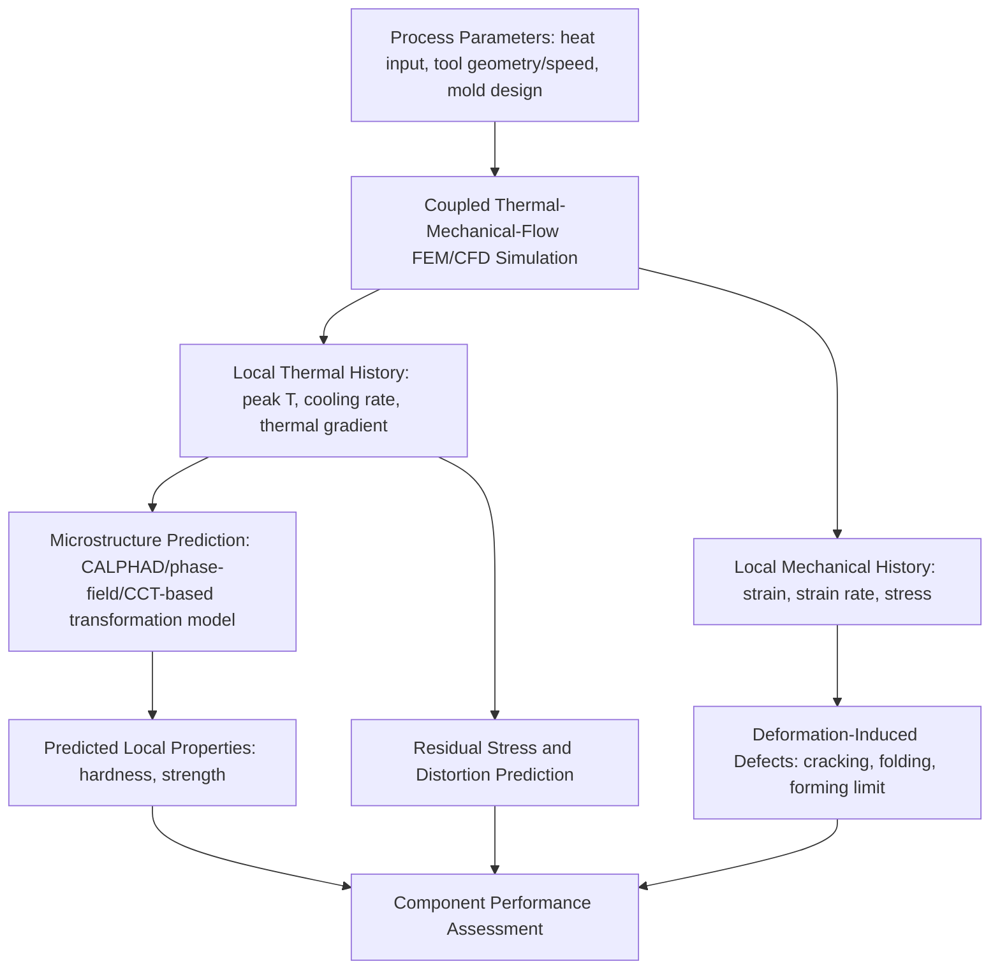

## Simulation of Manufacturing Processes

### Overview and Scope

Manufacturing process simulation applies the computational methods covered elsewhere in this chapter — primarily finite element modeling, coupled with thermodynamic (CALPHAD) and microstructural (phase-field, kinetic) models — to the specific goal of predicting how a material responds during an actual production process: casting, forming, welding, heat treatment, machining, and additive manufacturing. The defining characteristic of this domain is **coupled, history-dependent, multiphysics simulation**: process outcomes depend on the full thermal, mechanical, and metallurgical history experienced by each material point, not merely its final state.

$$\text{Process Parameters} \rightarrow \text{Thermal/Mechanical/Flow Field Simulation} \rightarrow \text{Microstructure Prediction} \rightarrow \text{Resulting Properties and Defects}$$

**Key Points**

- Process simulation is inherently multiphysics: most processes involve simultaneous heat transfer, fluid flow (in casting/welding melt pools) or large-strain plastic deformation (in forming), phase transformation, and often residual stress generation — genuinely decoupling these physics typically sacrifices predictive accuracy.
- Because process history determines final microstructure and properties, process models are frequently coupled to the CALPHAD, phase-field, and kinetic modeling techniques covered earlier in this chapter, rather than treated as a purely mechanical/thermal problem.
- Validation against process-representative experimental data (not only idealized test conditions) is particularly critical in this domain because process boundary conditions (heat transfer coefficients, friction, latent heat release, tool-workpiece contact) are difficult to characterize precisely and strongly influence predicted outcomes.

### Casting Process Simulation

- **Mold filling simulation**: Computational fluid dynamics (CFD, often coupled within the same FEM/FVM framework) predicts melt flow pattern, filling time, and defects arising from filling (air entrapment, cold shuts, oxide film folding)
- **Solidification simulation**: Heat transfer simulation coupled with a solidification model (simple latent-heat release, or full CALPHAD-based Scheil/lever-rule microsegregation prediction) predicts local solidification time, cooling rate, and resulting as-cast microstructure (dendrite arm spacing correlates with local cooling rate via established empirical relationships)
- **Shrinkage and porosity prediction**: Feeding/shrinkage models (Niyama criterion and related feeding-distance criteria) predict locations prone to shrinkage porosity based on local thermal gradient and solidification rate, directly informing riser design
- **Macrosegregation prediction**: Coupled flow-solidification models capture buoyancy-driven and shrinkage-driven interdendritic liquid flow responsible for macroscale compositional inhomogeneity in large castings

### Metal Forming Process Simulation

- **Bulk forming (forging, extrusion, rolling)**: Large-strain, often rigid-viscoplastic or elastic-viscoplastic FEM predicts material flow, die-fill, forming loads, and defect risk (underfill, folding, internal cracking via ductile damage criteria such as Cockcroft-Latham or Oyane)
- **Sheet forming (stamping, deep drawing)**: Anisotropic yield/hardening models (as discussed under Finite Element Modeling and Crystal Plasticity) predict thinning, springback, and forming-limit exceedance, informing die design and blank optimization
- **Friction and lubrication modeling**: Coulomb or more advanced friction models at the tool-workpiece interface substantially affect predicted material flow and forming loads, representing one of the larger sources of calibration uncertainty in forming simulation

### Welding Process Simulation

- **Coupled thermal-mechanical-metallurgical simulation**: Moving heat source models (e.g., double-ellipsoidal Goldak heat source, widely used to represent arc/laser weld heat input) drive a transient thermal analysis, coupled to mechanical analysis for residual stress/distortion prediction and, in advanced models, to CALPHAD-informed phase transformation prediction in the heat-affected zone (HAZ)
- **HAZ microstructure prediction**: Peak temperature and cooling rate fields from the thermal simulation, combined with CCT-diagram-informed (often dilatometry-derived) transformation models, predict resulting HAZ phase constitution and hardness distribution
- **Residual stress and distortion**: Sequential or fully coupled thermo-mechanical-metallurgical FEM predicts final residual stress state and part distortion, informing weld sequence and fixturing design to minimize distortion in production

### Additive Manufacturing Process Simulation

- **Melt pool scale simulation**: High-fidelity CFD/thermal models resolve individual melt pool geometry, keyhole formation (in laser powder-bed fusion), and associated defect mechanisms (porosity, lack-of-fusion) at the scale of individual laser passes
- **Part scale simulation**: Computationally efficient layer-lumped or scan-pattern-averaged thermal-mechanical models predict overall part-scale distortion and residual stress across the full build, since full melt-pool-resolution simulation of an entire part remains computationally prohibitive
- **Microstructure prediction**: The characteristically rapid, spatially localized, and repeatedly re-heated thermal history of AM processes drives distinctive microstructures (fine columnar grains, unique texture, non-equilibrium phases); CALPHAD and phase-field methods adapted for AM-representative cooling rates support microstructure prediction specific to this process class

### Application to Materials Science and Metallurgy

- **Riser and gating system design in casting**: Niyama-criterion-based shrinkage porosity prediction directly informs riser sizing and placement, reducing reliance on costly trial-and-error casting trials
- **Forming die design and defect avoidance**: Forming-limit and ductile-damage-criterion-based simulation identifies split/crack risk locations prior to physical tooling commitment, a major driver of simulation adoption in automotive and aerospace sheet/bulk forming
- **Weld procedure qualification and distortion control**: Predicted HAZ hardness and residual stress distribution supports weld procedure development, particularly for hardenability-sensitive steels where excessive HAZ hardness raises hydrogen cracking risk
- **Heat treatment process optimization**: Coupled thermal-metallurgical-mechanical simulation of quenching predicts resulting hardness distribution, distortion, and residual stress, supporting quench media and fixturing selection to meet distortion tolerances
- **Additive manufacturing qualification**: Part-scale distortion and residual stress prediction supports build orientation and support structure optimization prior to costly physical builds, while melt-pool-scale simulation supports process parameter (laser power, scan speed) selection to avoid lack-of-fusion or keyhole porosity
- **Machining-induced surface integrity prediction**: Coupled thermal-mechanical simulation of the cutting process predicts machining-induced residual stress and (via appropriate constitutive/damage models) white-layer or microstructural alteration risk in the machined surface

**Example**

A process engineer simulates gas metal arc welding of a medium-carbon steel component using a Goldak double-ellipsoidal heat source calibrated to match experimentally measured weld pool dimensions from a trial weld. The resulting thermal field, combined with a CCT-diagram-informed transformation model for the specific steel composition, predicts a narrow HAZ region cooling fast enough to form untempered martensite, with predicted hardness exceeding a specification limit associated with elevated hydrogen cracking risk. This result supports a recommendation to apply preheat, reducing the predicted HAZ cooling rate below the critical value associated with martensite formation in the CCT diagram. [Inference] The reliability of the specific predicted hardness value depends significantly on how well the heat source calibration and the underlying CCT/dilatometric transformation data represent the actual welding thermal cycle (which differs in detail from the constant-rate cooling conditions typically used to construct CCT diagrams), making the preheat recommendation's qualitative direction more robust than its precise quantitative hardness prediction.

### Common Complications and Practical Considerations

- **Boundary condition characterization**: Heat transfer coefficients (mold-metal, quenchant-part, tool-workpiece), friction coefficients, and heat source calibration are frequently the dominant sources of prediction uncertainty, often exceeding uncertainty from the underlying material constitutive model itself
- **Latent heat and phase-change coupling**: Accurate solidification and phase transformation simulation requires proper accounting for latent heat release, which can significantly affect local cooling rate and must be consistently coupled between the thermal and microstructural sub-models
- **Computational cost vs. resolution trade-offs**: Full melt-pool-resolved AM simulation, full 3D forging simulation with fine mesh, and similar high-fidelity approaches remain computationally demanding for production-scale geometries, motivating continued use of reduced-order or part-scale-averaged models for routine engineering use
- **Validation practice**: Because of the boundary-condition and multiphysics coupling uncertainties above, process simulation results are generally treated as strong guides for process design and defect-risk screening rather than substitutes for physical trial validation, particularly for new material/process combinations lacking established calibration history

[Unverified] The specific accuracy achievable for any given process simulation (e.g., predicted distortion magnitude, predicted HAZ hardness) is strongly case- and calibration-dependent; general accuracy claims found in vendor or marketing literature should be evaluated against independent, application-specific validation rather than taken as universally applicable figures.

### SVG: Coupled Process Simulation Information Flow (svg_diagram)

<svg xmlns="http://www.w3.org/2000/svg" viewBox="0 0 640 300">
<rect x="0" y="0" width="640" height="300" fill="#ffffff" />
<text x="320" y="24" text-anchor="middle" font-size="16" font-weight="bold" fill="#111">Coupled Process Simulation (svg_diagram)</text>
<rect x="60" y="60" width="150" height="60" fill="#cfe8ff" fill-opacity="0.6" stroke="#2b6cb0" />
<text x="135" y="95" text-anchor="middle" font-size="11" fill="#1a4971">Thermal Field</text>
<rect x="245" y="60" width="150" height="60" fill="#ffe0cc" fill-opacity="0.6" stroke="#c05621" />
<text x="320" y="95" text-anchor="middle" font-size="11" fill="#7c2d12">Mechanical Field</text>
<rect x="430" y="60" width="150" height="60" fill="#d6f5d6" fill-opacity="0.6" stroke="#2f855a" />
<text x="505" y="88" text-anchor="middle" font-size="11" fill="#22543d">Microstructure</text>
<text x="505" y="102" text-anchor="middle" font-size="11" fill="#22543d">Prediction</text>
<rect x="245" y="200" width="150" height="60" fill="#f5d6f0" fill-opacity="0.6" stroke="#b83280" />
<text x="320" y="235" text-anchor="middle" font-size="11" fill="#702459">Residual Stress /</text>
<text x="320" y="249" text-anchor="middle" font-size="11" fill="#702459">Distortion / Properties</text>
<line x1="210" y1="90" x2="245" y2="90" stroke="#333" stroke-width="1.5" />
<line x1="210" y1="100" x2="430" y2="100" stroke="#333" stroke-width="1.5" stroke-dasharray="3,2" />
<line x1="320" y1="120" x2="320" y2="200" stroke="#333" stroke-width="1.5" />
<line x1="505" y1="120" x2="380" y2="200" stroke="#333" stroke-width="1.5" />
</svg>

**Related Topics**

- Finite Element Modeling of Materials Behavior (constitutive foundation)
- CALPHAD Based Thermodynamic Simulation (Scheil solidification, phase prediction)
- Dilatometry and CCT/TTT diagram construction
- Phase Field Modeling for solidification and transformation microstructure
- Multiscale Modeling Approaches (process-structure-property linkage)
- Residual stress measurement techniques (XRD, hole-drilling)