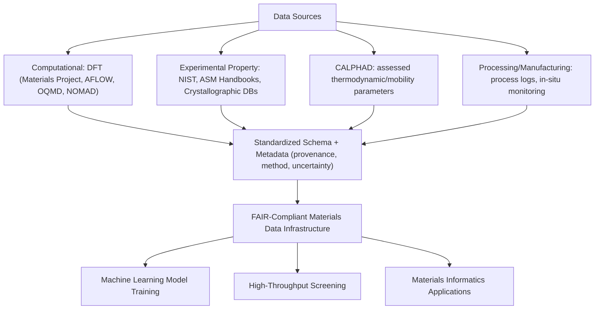

## Materials Data Infrastructure and Databases

### Overview and Scope

Materials data infrastructure encompasses the databases, schemas, and data management practices that make materials property, composition, processing, and characterization data findable, accessible, interoperable, and reusable (the FAIR principles). This infrastructure underlies materials informatics and machine learning applications: model quality is fundamentally bounded by the quantity, quality, and structure of available training data, making data infrastructure a foundational rather than peripheral concern in computational materials design.

**Key Points**

- Materials data is heterogeneous by nature — spanning computational (DFT, CALPHAD), experimental (mechanical testing, microscopy, spectroscopy), and processing (manufacturing parameters) origins — and effective infrastructure must accommodate this heterogeneity rather than forcing a single rigid schema.
- The FAIR principles (Findable, Accessible, Interoperable, Reusable) are the widely referenced standard guiding modern materials database design, emphasizing standardized metadata, persistent identifiers, and machine-readable formats over human-readable-only data storage.
- Data provenance (the full record of how a data point was generated — computational method and parameters, or experimental technique and conditions) is essential materials-specific metadata; without it, data cannot be reliably combined across sources or properly weighted in downstream modeling.

### Major Categories of Materials Databases

#### Computational (First-Principles) Databases

Large repositories of DFT-calculated properties (formation energy, band structure, elastic constants, and more) computed via standardized high-throughput workflows across tens to hundreds of thousands of compounds.

- **Materials Project**: DFT-calculated properties for a large number of known and hypothetical inorganic compounds, widely used for phase stability screening, battery materials, and general inorganic materials discovery
- **AFLOW (Automatic FLOW)**: High-throughput DFT database with a particular emphasis on structural prototypes and high-throughput workflow automation
- **OQMD (Open Quantum Materials Database)**: DFT-calculated thermodynamic and structural properties, with strong emphasis on formation energy and phase stability data supporting CALPHAD-adjacent applications
- **NOMAD**: A broader materials-science data repository accepting raw computational output from many different simulation codes/methods, emphasizing data preservation and reproducibility beyond curated property extraction alone

These databases share a common practical value for metallurgy: providing DFT-calculated formation energies and structural data for intermetallic and metastable phases that feed CALPHAD database assessment (as discussed in the CALPHAD chapter content), often filling gaps where experimental thermodynamic data is sparse or unavailable.

#### Experimental Materials Property Databases

- **NIST materials data resources** (including specialized databases for specific property classes such as thermodynamic, diffusion, and structural ceramics data): Curated experimental reference data with an emphasis on measurement provenance and uncertainty reporting
- **ASM Handbooks and alloy property databases**: Long-standing, widely used engineering reference sources for metallurgical composition, processing, and mechanical property data, historically distributed in reference-book form and increasingly available in structured digital formats
- **Crystallographic databases** (Inorganic Crystal Structure Database (ICSD), Cambridge Structural Database for organics): Experimentally determined crystal structures, foundational input for both database-driven property lookup and as starting structures for DFT calculations

#### CALPHAD Thermodynamic and Kinetic Databases

Commercial and, increasingly, open-source assessed thermodynamic (Gibbs energy parameter) and atomic mobility databases for specific alloy systems, as discussed in the CALPHAD chapter content — these represent a highly curated, physically-model-based database category distinct from raw property tabulation, since the "data" is encoded as fitted model parameters rather than direct property values.

#### Processing and Manufacturing Data

A less standardized but increasingly important category: process parameter records (welding, forming, heat treatment, additive manufacturing build logs), in-situ process monitoring data (thermal history, melt pool sensor data), and associated resulting properties/defects — the raw material for process-structure-property machine learning and digital-twin-style applications. Standardization in this category is generally less mature than in computational or classical experimental-property databases, [Inference] reflecting both the proprietary/competitive sensitivity of much industrial process data and the comparative recency of systematic digital process data capture relative to established computational and experimental materials science databases.

### Data Schema and Interoperability Standards

- **Materials data schemas**: Structured formats (often JSON- or XML-based) defining how composition, processing history, structure, and property data are represented and linked, enabling programmatic data exchange between databases and modeling tools rather than reliance on manual, format-specific parsing
- **Persistent identifiers**: DOIs and similar persistent identifiers applied to datasets (not only to publications) support proper data citation, version tracking, and long-term findability
- **Ontologies and controlled vocabularies**: Standardized terminology for materials classes, processing methods, and characterization techniques reduces ambiguity when combining data from multiple sources (e.g., ensuring "annealing" and "heat treatment" nomenclature is consistently mapped where they refer to comparable processes)
- **API-based access**: Programmatic query interfaces (REST APIs, common in most major computational materials databases) enable automated, reproducible data retrieval for high-throughput screening and ML pipeline construction, in contrast to manual database browsing

### Application to Materials Science and Metallurgy

- **CALPHAD database development**: Computational databases (DFT formation energies for metastable/intermetallic phases) and experimental thermodynamic databases together supply the raw data underlying CALPHAD assessment workflows
- **Machine learning model training**: Curated, well-labeled datasets (composition-processing-property-microstructure records) are the essential input for supervised ML models predicting alloy properties, as covered further in this chapter's machine learning content
- **High-throughput alloy screening**: Computational databases enable rapid virtual screening across large compositional/structural spaces prior to more expensive targeted DFT or experimental follow-up, accelerating early-stage alloy design
- **Digital twin and process monitoring integration**: Structured processing data infrastructure supports linking in-situ process sensor data to resulting part properties, an increasingly important capability for additive manufacturing qualification and in-process quality control
- **Meta-analysis and data-driven literature synthesis**: Structured, machine-readable experimental databases enable systematic aggregation of property data across many independent studies, supporting statistically grounded property range assessment beyond what any single study can provide
- **Reproducibility and provenance tracking**: Well-documented computational database entries (calculation method, functional, convergence parameters) allow downstream users to assess whether a given DFT value is appropriate for their specific application, rather than treating database values as unconditionally authoritative

**Example**

A materials informatics team building a machine learning model to predict yield strength of a class of precipitation-strengthened aluminum alloys assembles a training dataset by combining composition and processing (aging time/temperature) records from an internal experimental database with mechanical property test results, supplementing sparse compositional coverage with DFT-calculated formation energies for candidate strengthening-phase chemistries drawn from a public computational database. Careful attention to provenance metadata — distinguishing measurements from different testing standards, sample geometries, and laboratories — is necessary before combining this heterogeneous data into a single training set, since [Inference] inconsistent metadata handling (for example, silently merging data from different tensile specimen geometries or strain rates) is a common and often underappreciated source of systematic error in materials ML datasets, distinct from and potentially larger than the measurement uncertainty of any individual data point.

### Common Data Infrastructure Challenges in Metallurgy

- **Sparse and unevenly distributed data**: Well-studied alloy systems (structural steels, common aluminum alloys) have far denser data coverage than novel or compositionally complex systems (high-entropy alloys, emergent additively manufactured alloys), creating uneven reliability for data-driven predictions across different materials classes
- **Inconsistent metadata and units**: Legacy experimental data (particularly from older literature or internal industrial records) frequently lacks standardized metadata, complicating reliable aggregation and increasing the risk of silent errors when combining datasets
- **Proprietary and export-controlled data**: Significant fractions of industrially relevant processing and property data remain proprietary or subject to export control, limiting the scope of fully open materials databases relative to the total body of generated materials data
- **Negative and null result underrepresentation**: Published and curated databases disproportionately capture "successful" or notable results; systematic underrepresentation of unsuccessful compositions or failed processing trials can bias data-driven models trained predominantly on positive-outcome data

[Unverified] The relative maturity and coverage of specific databases (Materials Project, AFLOW, OQMD, NOMAD, and others) changes over time as these projects are actively developed; current scope, coverage statistics, and access terms should be verified directly against each database's own documentation rather than assumed static.

### SVG: Materials Data Infrastructure Layers (svg_diagram)

<svg xmlns="http://www.w3.org/2000/svg" viewBox="0 0 640 300">
<rect x="0" y="0" width="640" height="300" fill="#ffffff" />
<text x="320" y="24" text-anchor="middle" font-size="16" font-weight="bold" fill="#111">Materials Data Infrastructure Layers (svg_diagram)</text>
<rect x="80" y="50" width="480" height="45" fill="#cfe8ff" fill-opacity="0.6" stroke="#2b6cb0" />
<text x="320" y="78" text-anchor="middle" font-size="12" fill="#1a4971">Raw Data: computational output, experimental measurements, process logs</text>
<rect x="80" y="105" width="480" height="45" fill="#ffe0cc" fill-opacity="0.6" stroke="#c05621" />
<text x="320" y="133" text-anchor="middle" font-size="12" fill="#7c2d12">Metadata + Provenance: method, conditions, uncertainty</text>
<rect x="80" y="160" width="480" height="45" fill="#d6f5d6" fill-opacity="0.6" stroke="#2f855a" />
<text x="320" y="188" text-anchor="middle" font-size="12" fill="#22543d">Standardized Schema + Ontology</text>
<rect x="80" y="215" width="480" height="45" fill="#f5d6f0" fill-opacity="0.6" stroke="#b83280" />
<text x="320" y="243" text-anchor="middle" font-size="12" fill="#702459">API Access + Downstream Applications (ML, screening, CALPHAD)</text>
</svg>

**Related Topics**

- Machine Learning for Materials Property Prediction
- CALPHAD Based Thermodynamic Simulation (database consumer and contributor)
- High-throughput computational alloy screening
- Digital twin and in-process monitoring for manufacturing
- Data provenance and uncertainty quantification in materials science
- FAIR data principles and open materials science initiatives