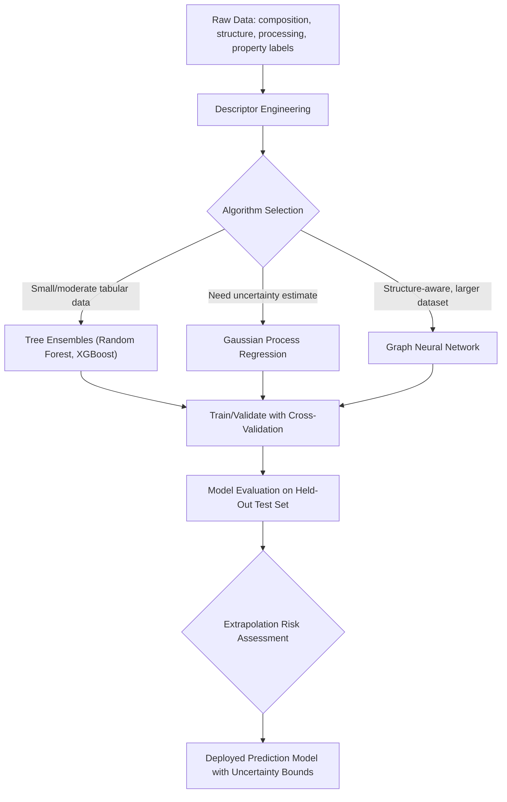

## Machine Learning for Property Prediction

### Overview and Scope

Machine learning (ML) for materials property prediction builds statistical models that map material descriptors — composition, processing parameters, structural features — to target properties (mechanical, thermal, electrical, corrosion, etc.), learned from existing data rather than derived from first-principles physics. ML complements rather than replaces the physics-based methods covered elsewhere in this chapter (DFT, CALPHAD, phase-field, FEM): it is typically fastest and most reliable when used to interpolate within well-populated regions of a data-rich design space, or to serve as a computationally cheap surrogate for an expensive physics-based simulation.

**Key Points**

- ML model quality is fundamentally bounded by training data quality, coverage, and representativeness — a model can only be as good as the materials data infrastructure feeding it (as covered in this chapter's data infrastructure content).
- Feature (descriptor) engineering — choosing how composition, structure, and processing are numerically represented — is often as consequential to model performance as the choice of learning algorithm itself, particularly for smaller materials datasets.
- Extrapolation beyond the training data's compositional, processing, or property range is a well-recognized failure mode for most ML methods; predictions in genuinely novel regions of design space should be treated with substantially more caution than interpolative predictions.

### Descriptor (Feature) Engineering

Raw composition or structure must be converted into a numerical representation (feature vector) the ML algorithm can use. Common descriptor classes:

| Descriptor Type | Example | Captures |
| --- | --- | --- |
| Compositional | Element fractions, weighted elemental properties (electronegativity, atomic radius, valence electron count) | Basic alloy chemistry, no structural information |
| Structural | Radial distribution functions, Voronoi tessellation features, symmetry functions | Local atomic environment, relevant for crystal-structure-dependent properties |
| Processing | Heat treatment schedule parameters, cooling rate, deformation history | Process-dependent microstructure/property effects |
| Physics-informed | CALPHAD-calculated phase fractions, DFT-calculated formation energies as input features | Embeds prior physical knowledge directly into the feature space, often improving data efficiency |
| Learned/automatic | Graph neural network embeddings of crystal/molecular structure | Learns representation directly from structure without hand-engineered features |

Physics-informed descriptors — incorporating CALPHAD-calculated equilibrium phase fractions or DFT-derived quantities as input features rather than relying purely on composition — are a particularly effective strategy in metallurgical ML applications, since they inject established physical/thermodynamic knowledge that a purely data-driven model would otherwise need to infer implicitly from limited data.

### Common Algorithm Classes

- **Linear and regularized regression (Ridge, LASSO)**: Simple, interpretable baseline models; LASSO's sparsity-inducing regularization is useful for identifying a small set of most-relevant descriptors from a larger candidate feature set
- **Tree-based ensemble methods (Random Forest, Gradient Boosting/XGBoost)**: Widely used for tabular materials data due to strong performance with moderate dataset sizes, natural handling of nonlinear feature interactions, and relatively interpretable feature-importance output; among the most commonly reported top-performing methods on small-to-moderate tabular materials datasets
- **Gaussian Process Regression (GPR)**: Provides a built-in uncertainty estimate alongside each prediction (predictive variance), making it particularly valuable for active learning and Bayesian optimization workflows where knowing prediction confidence guides next-experiment selection
- **Neural networks (including graph neural networks, GNNs)**: Deep learning approaches, with GNNs specifically well suited to representing crystal or molecular structure directly as a graph (atoms as nodes, bonds/neighbors as edges) rather than requiring hand-engineered structural descriptors; generally require larger training datasets than tree-based methods to realize their full potential
- **Machine-learning interatomic potentials (MLIPs)**: A specialized application (already introduced in the atomistic simulation content of this chapter) where ML directly learns the potential energy surface from DFT reference data, serving as a bridge between ML-for-property-prediction and physics-based atomistic simulation

### Model Validation and Uncertainty Quantification

Rigorous validation is essential given the consequences of a poorly validated model being used for design decisions:

- **Train/validation/test splitting**: Held-out test data (never used during model training or hyperparameter tuning) provides an unbiased estimate of generalization performance
- **Cross-validation**: K-fold cross-validation provides a more robust performance estimate than a single train/test split, particularly important for smaller materials datasets where a single split may not be representative
- **Domain-of-applicability assessment**: Explicitly characterizing the region of feature space (compositional range, processing conditions) where the training data provides adequate coverage, and flagging predictions that fall outside this domain as extrapolative and less reliable
- **Uncertainty quantification (UQ)**: Beyond point predictions, quantifying prediction uncertainty (via GPR's native variance, ensemble disagreement across multiple trained models, or dedicated UQ methods) supports risk-aware decision-making and is particularly valuable for guiding active learning/experimental design

### Application to Materials Science and Metallurgy

- **Alloy property prediction from composition and processing**: Predicting mechanical properties (yield strength, hardness, ductility), corrosion resistance, or thermal properties directly from composition and processing parameters, enabling rapid virtual screening across large compositional design spaces before committing to experimental or expensive physics-based simulation
- **Surrogate modeling for expensive simulations**: Training ML models on a limited set of DFT or CALPHAD calculations to create a fast surrogate that approximates the physics-based model's output across a broader design space, dramatically accelerating high-throughput screening
- **Accelerated CALPHAD-adjacent property estimation**: ML models trained on CALPHAD-calculated phase equilibria can provide near-instantaneous property estimates for use within iterative design loops where repeated full CALPHAD calculation would be computationally limiting
- **Active learning-guided alloy design**: Combining an uncertainty-aware model (typically GPR) with Bayesian optimization to iteratively select the next most informative composition/processing condition to test experimentally or computationally, efficiently navigating large design spaces toward a target property with fewer total evaluations than exhaustive or random search
- **Machine-learning interatomic potentials**: As covered in the atomistic simulation content, MLIPs extend classical MD to near-DFT accuracy at substantially reduced computational cost, enabling larger and longer atomistic simulations
- **Process parameter optimization**: ML models linking manufacturing process parameters (e.g., additive manufacturing laser power/scan speed, heat treatment schedule) directly to resulting properties or defect rates, supporting data-driven process optimization particularly where full physics-based process simulation remains computationally prohibitive for iterative optimization loops
- **Anomaly and defect detection**: ML classification models applied to process monitoring data (in-situ AM sensor data, NDT signals) for automated defect detection and quality classification

**Example**

An alloy design team trains a Gaussian Process Regression model to predict yield strength of a precipitation-strengthened alloy family as a function of composition and aging time/temperature, using a training dataset assembled from internal experimental records (with the data infrastructure and provenance considerations discussed in this chapter's data infrastructure content). The GPR model's native uncertainty estimate identifies a region of the aging-temperature/composition space with high predicted strength but also high prediction uncertainty due to sparse nearby training data. Rather than trusting this high-strength prediction directly, the team uses a Bayesian optimization loop to prioritize this high-uncertainty, high-potential region for the next round of experimental aging trials, efficiently directing limited experimental resources toward the most informative next test. [Inference] This active-learning approach is generally more data-efficient than either purely random experimental sampling or relying solely on the point prediction without its associated uncertainty, since it explicitly balances exploiting promising predicted regions against exploring regions where the model's confidence is low.

### Common Pitfalls in Materials ML

- **Extrapolation beyond training domain**: Applying a model to compositions, processing conditions, or property ranges far outside its training data, where predictions can degrade substantially without any change in reported point-prediction confidence unless explicit UQ is used
- **Data leakage**: Inadvertent inclusion of information correlated with the target property in the training features (e.g., features derived using the target property itself, or improper train/test splitting that allows related samples — such as replicate measurements or samples from the same processing batch — to appear in both sets) leading to artificially inflated validation performance
- **Small-dataset overfitting**: Materials datasets are frequently far smaller than typical machine-learning benchmark datasets; overly flexible models (deep neural networks in particular) risk overfitting without careful regularization, cross-validation, and, where feasible, physics-informed constraints or descriptors to compensate for limited data
- **Confusing correlation in training data with causal mechanism**: A model that accurately predicts a property from composition does not thereby establish which compositional features are causally responsible for the property; feature-importance output should be interpreted as a guide for further physical investigation rather than definitive mechanistic explanation
- **Inconsistent or poorly documented training data**: As discussed in the data infrastructure content, heterogeneous data provenance (differing test standards, specimen geometries, measurement conditions) silently merged into a single training set is a common and significant source of degraded model reliability

[Unverified] Reported model accuracy metrics (R², RMSE, and similar) in published materials ML studies can vary substantially depending on dataset size, feature engineering choices, and validation methodology; comparing accuracy claims across studies without examining these methodological details can be misleading.

### SVG: Active Learning Loop for Alloy Design (svg_diagram)

<svg xmlns="http://www.w3.org/2000/svg" viewBox="0 0 640 300">
<rect x="0" y="0" width="640" height="300" fill="#ffffff" />
<text x="320" y="24" text-anchor="middle" font-size="16" font-weight="bold" fill="#111">Active Learning Loop (svg_diagram)</text>
<circle cx="150" cy="150" r="55" fill="#cfe8ff" fill-opacity="0.6" stroke="#2b6cb0" stroke-width="2" />
<text x="150" y="145" text-anchor="middle" font-size="11" fill="#1a4971">Train ML Model</text>
<text x="150" y="160" text-anchor="middle" font-size="11" fill="#1a4971">(GPR + uncertainty)</text>
<circle cx="320" cy="80" r="55" fill="#ffe0cc" fill-opacity="0.6" stroke="#c05621" stroke-width="2" />
<text x="320" y="75" text-anchor="middle" font-size="11" fill="#7c2d12">Select Next</text>
<text x="320" y="90" text-anchor="middle" font-size="11" fill="#7c2d12">Test Point</text>
<circle cx="490" cy="150" r="55" fill="#d6f5d6" fill-opacity="0.6" stroke="#2f855a" stroke-width="2" />
<text x="490" y="145" text-anchor="middle" font-size="11" fill="#22543d">Run Experiment</text>
<text x="490" y="160" text-anchor="middle" font-size="11" fill="#22543d">or Simulation</text>
<circle cx="320" cy="220" r="55" fill="#f5d6f0" fill-opacity="0.6" stroke="#b83280" stroke-width="2" />
<text x="320" y="225" text-anchor="middle" font-size="11" fill="#702459">Add Result to</text>
<text x="320" y="215" text-anchor="middle" font-size="11" fill="#702459">Training Set</text>
<path d="M 195 120 Q 260 90 275 90" fill="none" stroke="#333" stroke-width="1.5" marker-end="url(#arrow2)" />
<path d="M 365 100 Q 440 115 455 115" fill="none" stroke="#333" stroke-width="1.5" marker-end="url(#arrow2)" />
<path d="M 465 195 Q 400 220 375 220" fill="none" stroke="#333" stroke-width="1.5" marker-end="url(#arrow2)" />
<path d="M 280 200 Q 210 180 195 175" fill="none" stroke="#333" stroke-width="1.5" marker-end="url(#arrow2)" />
</svg>

**Related Topics**

- Materials Data Infrastructure and Databases
- Machine-learning interatomic potentials (link to Atomistic Simulation)
- Bayesian optimization and active learning for experimental design
- High-throughput computational and experimental alloy screening
- CALPHAD Based Thermodynamic Simulation as a physics-informed feature source
- Uncertainty quantification in computational materials science