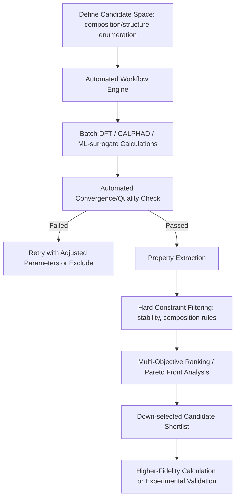

## High Throughput Computational Screening

### Fundamental Concept

High-throughput computational screening (HTCS) systematically evaluates large numbers of candidate materials — compositions, structures, or processing conditions — using automated computational workflows, to identify promising candidates for a target property before committing to expensive experimental synthesis and characterization. HTCS is the computational analog of high-throughput experimentation, and its effectiveness depends on combining a reasonably fast, reasonably accurate computational method with substantial automation to make evaluating thousands to millions of candidates tractable within practical time and computational budgets.

$$\text{Candidate Generation} \rightarrow \text{Automated Calculation} \rightarrow \text{Property Filtering/Ranking} \rightarrow \text{Down-selected Candidates}$$

**Key Points**

- HTCS is fundamentally an automation and workflow-engineering problem layered on top of an underlying computational method (most commonly DFT, but also CALPHAD, ML surrogate models, or combinations thereof); the scientific validity of screening results is bounded by the accuracy of whichever underlying method is used at scale.
- Throughput and accuracy trade off directly: DFT-based screening (higher accuracy, higher cost) can typically evaluate thousands to tens of thousands of candidates, while ML-surrogate-based screening (lower cost per evaluation) can extend to millions of candidates but inherits the surrogate model's accuracy limitations, particularly for extrapolative predictions.
- A well-designed HTCS workflow typically uses a funnel approach: a fast, less accurate method screens a very large candidate pool down to a manageable shortlist, which is then evaluated with a more accurate (and more expensive) method before final experimental validation.

### Workflow Components

#### Candidate Space Generation

- **Compositional enumeration**: Systematic generation of candidate compositions across a defined alloy system (e.g., all combinations of a set of elements at defined compositional increments)
- **Structural prototype substitution**: Taking known crystal structure prototypes and substituting different elements to generate candidate compounds, a common strategy in databases like AFLOW
- **Combinatorial and compositionally complex alloy space**: For high-entropy and compositionally complex alloys, the combinatorial explosion of possible compositions particularly motivates HTCS approaches, since exhaustive experimental exploration of such spaces is impractical

#### Automated Calculation Pipelines

- **Workflow management software**: Automated pipelines (e.g., AiiDA, FireWorks, Atomate, and similar workflow engines) handle job submission, dependency management, error handling/recovery, and result parsing across large numbers of individual DFT or other calculations without requiring manual intervention for each candidate
- **Standardized calculation protocols**: Consistent convergence parameters, functional choice, and structural relaxation procedures applied uniformly across the candidate set, essential for meaningful comparison between candidates and for populating shared computational databases (as discussed in the materials data infrastructure content)
- **Error handling and quality control**: Automated detection of failed or unconverged calculations, with retry logic (adjusted parameters) or exclusion from the final dataset — a practical necessity given that some fraction of automated calculations in any large batch will fail or produce unreliable results

#### Property Filtering and Ranking

- **Hard constraint filtering**: Eliminating candidates that fail to meet essential requirements (e.g., thermodynamic stability/low formation energy above the convex hull, absence of toxic/restricted elements, compatibility with existing processing routes)
- **Multi-objective ranking**: Since real materials design typically optimizes multiple, often competing properties simultaneously (e.g., strength vs. ductility, or property vs. cost), Pareto-front analysis identifies the set of non-dominated candidates — those for which no other candidate is simultaneously better on all objectives — rather than collapsing to a single weighted score that may obscure genuine trade-offs
- **ML-surrogate pre-filtering**: Using a fast ML model (as covered in the machine learning content of this chapter) trained on a subset of full-accuracy calculations to pre-screen a much larger candidate pool, reserving expensive DFT/CALPHAD calculation for the ML-identified promising subset

### Application to Materials Science and Metallurgy

- **Novel alloy discovery**: Systematic screening across compositional space for target property combinations (e.g., high strength-to-weight ratio, specific thermal expansion behavior, corrosion resistance), particularly valuable for identifying promising regions within the vast compositional space of high-entropy and compositionally complex alloys
- **Precipitate/strengthening phase identification**: Screening candidate intermetallic compound chemistries for favorable precipitate characteristics (appropriate lattice misfit with the matrix for coherency strengthening, thermodynamic stability in the relevant temperature range), informing precipitation-strengthened alloy design
- **Battery, catalyst, and functional materials screening**: While outside core structural metallurgy, HTCS methodology (particularly via Materials Project-style databases) has been extensively applied to electrode materials, catalysts, and other functional materials properties, and the underlying screening methodology transfers directly to structural alloy applications
- **CALPHAD database gap-filling**: Automated DFT screening of formation energies across a compositional grid identifies which regions of a phase diagram lack adequate thermodynamic assessment, prioritizing further targeted calculation or experimental effort
- **Corrosion-resistant alloy screening**: Computational screening of surface oxide formation energetics and passivation tendency across candidate alloy compositions, informing corrosion-resistant alloy development
- **Machine-learning interatomic potential training set design**: HTCS-generated DFT datasets across a broad compositional and structural space provide the reference data needed to train robust, broadly applicable MLIPs (as covered in the atomistic simulation content)

**Example**

A research team screens a ternary compositional space for a new corrosion-resistant structural alloy by generating several hundred candidate compositions at regular compositional intervals, then running automated DFT calculations of formation energy and surface oxide stability for each via a workflow management pipeline. Hard constraint filtering removes compositions predicted to be thermodynamically unstable (lying above the convex hull) or containing restricted elements, reducing the candidate pool substantially. Multi-objective Pareto ranking across predicted mechanical stability indicators and oxide passivation tendency identifies a shortlist of roughly a dozen compositions for more detailed follow-up calculation and eventual experimental synthesis. [Inference] The value of this HTCS-derived shortlist depends heavily on how well the screening-level DFT properties (often calculated with less rigorous convergence settings than would be used for a single detailed calculation, in order to maintain throughput) actually correlate with the final properties of interest, making a validation step comparing screening-level and high-fidelity calculations on a subset of candidates an important, if sometimes overlooked, part of a rigorous HTCS workflow.

### Common Challenges and Practical Considerations

- **Screening-level accuracy trade-offs**: Calculation settings (k-point density, energy cutoffs, functional choice) are often relaxed relative to publication-quality single calculations to maintain throughput across large candidate sets, introducing a systematic accuracy-vs-throughput trade-off that should be explicitly acknowledged and, where feasible, validated against higher-fidelity spot-checks
- **False positive and false negative rates**: Any screening filter (hard constraints, ML pre-filtering) risks both false positives (promising-looking candidates that fail at higher fidelity or experimentally) and false negatives (genuinely promising candidates incorrectly filtered out); [Unverified] the relative severity of these error types and appropriate filter conservativeness depends on the specific application and cost asymmetry between missing a good candidate versus wasting resources on a bad one, and should be considered explicitly in workflow design rather than left implicit
- **Computational resource management**: Large-scale HTCS campaigns require substantial and reliable access to high-performance computing resources, with workflow management software specifically designed to handle the practical realities of shared HPC queue systems, job failures, and resource allocation limits
- **Reproducibility and version control**: Given the automated, large-scale nature of HTCS, careful version control of calculation parameters, workflow software, and underlying codes is essential for reproducibility — a screening campaign run with slightly different default settings months apart may not be directly comparable without this discipline

[Unverified] The practical scale (number of candidates) achievable in a given HTCS campaign depends strongly on available computational resources and the specific calculation method's cost per candidate; general throughput figures cited in the literature should be interpreted as illustrative of the approach's scalability rather than universally applicable benchmarks.

### SVG: HTCS Funnel Approach (svg_diagram)

<svg xmlns="http://www.w3.org/2000/svg" viewBox="0 0 640 320">
<rect x="0" y="0" width="640" height="320" fill="#ffffff" />
<text x="320" y="24" text-anchor="middle" font-size="16" font-weight="bold" fill="#111">HTCS Funnel Approach (svg_diagram)</text>
<path d="M 100 60 L 540 60 L 400 150 L 240 150 Z" fill="#cfe8ff" fill-opacity="0.6" stroke="#2b6cb0" />
<text x="320" y="105" text-anchor="middle" font-size="11" fill="#1a4971">Candidate Pool (10^4-10^6)</text>
<text x="320" y="120" text-anchor="middle" font-size="9" fill="#1a4971">ML surrogate / rapid rules</text>
<path d="M 240 150 L 400 150 L 350 220 L 290 220 Z" fill="#ffe0cc" fill-opacity="0.6" stroke="#c05621" />
<text x="320" y="188" text-anchor="middle" font-size="10" fill="#7c2d12">Shortlist (10^2-10^3)</text>
<text x="320" y="200" text-anchor="middle" font-size="9" fill="#7c2d12">DFT / CALPHAD</text>
<path d="M 290 220 L 350 220 L 330 280 L 310 280 Z" fill="#d6f5d6" fill-opacity="0.6" stroke="#2f855a" />
<text x="320" y="300" text-anchor="middle" font-size="10" fill="#22543d">Experimental (10-10^1)</text>
</svg>

**Related Topics**

- Machine Learning for Property Prediction
- Materials Data Infrastructure and Databases
- Atomistic Simulation: Density Functional Theory and Molecular Dynamics
- CALPHAD Based Thermodynamic Simulation
- High-entropy and compositionally complex alloy design
- Multiscale Modeling Approaches (ICME integration)