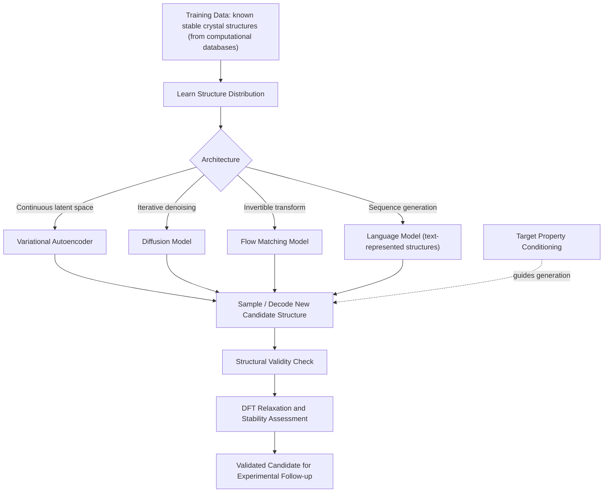

## Generative Models for Materials Discovery

### Fundamental Concept

Generative models for materials discovery invert the conventional screening paradigm covered elsewhere in this chapter. Rather than evaluating a pre-defined or enumerated candidate pool one composition/structure at a time (the high-throughput screening approach), generative models learn the underlying distribution of known stable materials and then directly sample new, previously unseen candidate structures from that learned distribution — often conditioned to target specific desired properties. This **inverse design** paradigm — specifying a target property and generating structures likely to exhibit it, rather than screening forward from structure to property — is the central motivation distinguishing generative approaches from the discriminative (property-prediction) ML methods covered earlier in this chapter.

$$\text{Discriminative ML: Structure} \rightarrow \text{Property (forward)}$$

$$\text{Generative ML: Target Property} \rightarrow \text{Candidate Structure (inverse)}$$

**Key Points**

- Various generative model architectures — including variational autoencoders, diffusion models, and flow models — have emerged as approaches for crystal structure generation, alongside autoregressive language-model-based approaches that represent crystal structures as text. [arxiv](https://arxiv.org/pdf/2502.20933)
- The field synthesizes architectures, structural representations, property-conditioning mechanisms, and evaluation metrics into a relatively young but rapidly maturing methodology, distinct from the longer-established high-throughput screening approach. [Nature](https://www.nature.com/articles/s41524-025-01881-2)
- Generated structures require downstream validation (typically DFT relaxation and stability assessment) before being treated as genuine candidates — a generative model's output is a hypothesis, not a validated material, mirroring the role of the shortlist stage in conventional HTCS workflows.

### Major Architectural Approaches

#### Variational Autoencoders (VAEs)

Early generative crystal structure work represented structures as 3D voxel grids within a VAE framework, learning a continuous latent space in which structurally or chemically similar materials cluster together. Novel candidates are generated by sampling and decoding points in this latent space, and property optimization can be performed via gradient-based search directly within the latent representation. [arxiv](https://arxiv.org/pdf/2502.20933)

#### Diffusion Models

CDVAE introduced generating crystal structures via a score-based (diffusion) generative model, optimizing structural properties through gradient-based latent-space optimization. Diffusion models generate structures through an iterative denoising process, starting from random noise and progressively refining atomic positions, lattice parameters, and species toward a physically plausible crystal structure. This approach has been extended through Riemannian diffusion formulations to better handle the periodic boundary conditions inherent to crystal coordinates, scaled to cover elements across the periodic table, and applied to structural inpainting tasks (completing partially specified structures). [arxiv](https://arxiv.org/pdf/2502.20933)[arxiv](https://arxiv.org/pdf/2502.20933)

#### Flow-Based Models

Flow matching and normalizing-flow approaches learn an invertible, continuous transformation between a simple base distribution and the target distribution of stable crystal structures, offering an alternative to diffusion with different training dynamics and sampling efficiency trade-offs. Recent work has extended flow-based approaches to use large language models as base distributions and to unify molecular and crystalline material generation within shared flow frameworks.

#### Language-Model-Based (Autoregressive) Approaches

Crystal structures can be represented as structured text strings (composition, space group, atomic coordinates in a defined format) and generated using fine-tuned large language models, treating structure generation as a sequence-generation problem analogous to natural language generation. This approach benefits from the broader ecosystem of LLM training and fine-tuning techniques, including text-guided conditioning (describing a target structure or property in natural language as part of the generation prompt) and preference-alignment fine-tuning.

#### Symmetry-Constrained Generation

A significant thread of recent methodological work explicitly incorporates crystallographic space-group symmetry constraints directly into the generative process (rather than leaving the model to learn symmetry implicitly from data), improving the physical validity and stability of generated structures — reflecting a recognition that generic (symmetry-agnostic) generative architectures frequently produce structures inconsistent with the highly symmetric, low-entropy configurations characteristic of real stable crystals.

### Property-Conditioned and Guided Generation

Beyond unconditional generation (sampling broadly from the learned distribution of stable materials), several mechanisms enable steering generation toward materials with targeted properties:

- **Property-conditioned transformers and diffusion models**: Property values are supplied as additional conditioning input during training and generation, biasing the model toward structures associated with the desired property range in the training data
- **Text-guided generation**: Natural-language property or application descriptions condition an LLM-based or hybrid text-structure generative model, allowing more flexible and human-interpretable specification of design targets than a fixed numerical property vector
- **Reinforcement learning fine-tuning**: Generative models are further fine-tuned using a reward signal derived from a downstream property predictor or stability metric, explicitly optimizing the generation policy toward property targets and structural diversity rather than relying solely on the properties of the original training distribution
- **Preference-alignment fine-tuning**: Adapting techniques from LLM alignment (analogous to RLHF-style approaches) to align generated inorganic material candidates with multiple, potentially competing design objectives simultaneously

### Evaluation of Generated Structures

Assessing generative model output requires materials-specific metrics distinct from those used in general machine learning generative modeling:

| Metric Category | What It Assesses |
| --- | --- |
| Validity | Whether generated structures are physically/chemically sensible (reasonable bond lengths, charge neutrality where applicable) |
| Stability | Formation energy relative to the convex hull (thermodynamic stability), typically assessed via post-hoc DFT relaxation of generated structures |
| Novelty | Whether generated structures differ meaningfully from the training dataset, rather than simply reproducing known materials |
| Diversity | Whether the generative model explores a broad region of structural/compositional space rather than collapsing to a narrow subset |
| Property accuracy | For conditioned generation, whether generated structures actually exhibit the targeted property range upon validation |

A dedicated evaluation-framework literature has emerged specifically to standardize comparison of generative models against these criteria, reflecting recognition that early generative materials work often lacked consistent, comparable evaluation practice across studies.

### Application to Materials Science and Metallurgy

- **Novel intermetallic and compound discovery**: Generating candidate structures for target compositions or property combinations beyond what exists in current computational databases, complementing the enumerate-and-screen approach of conventional HTCS
- **Inverse design for targeted properties**: Directly generating candidates conditioned on target mechanical, thermal, or electronic properties, potentially reducing the number of full HTCS evaluation cycles needed relative to forward screening of an enumerated candidate space
- **Compositionally complex and high-entropy alloy exploration**: Generative approaches are increasingly applied to multi-component alloy composition and structure search, where the combinatorial candidate space is too large for exhaustive enumeration-based HTCS
- **Training data augmentation for downstream ML**: Generated and DFT-validated structures can expand training datasets for property-prediction models and machine-learning interatomic potentials, particularly in sparsely populated regions of composition/structure space
- **Crystal structure prediction (CSP)**: Given a fixed composition, generating and ranking plausible crystal structures — a long-standing materials science problem now substantially addressed through diffusion and flow-based generative approaches as an alternative to traditional evolutionary/random structure search algorithms

**Example**

A materials discovery team seeks new candidate compositions for a corrosion-resistant intermetallic coating phase with a specified target formation energy range and desired elastic modulus. Using a property-conditioned diffusion model trained on a large computational crystal structure database, they generate several hundred candidate structures conditioned on the target property window, filter these for basic structural validity, and pass the surviving candidates through DFT relaxation to assess true formation energy and stability against the convex hull. [Inference] Of the originally generated candidates, only a fraction typically survive DFT-based stability validation, since generative models trained primarily to match a target property distribution do not guarantee thermodynamic stability of every output; this validation-attrition step is therefore an essential part of the workflow rather than an optional final check, mirroring the funnel structure used in conventional high-throughput screening.

### Comparison with High-Throughput Screening

| Attribute | High-Throughput Screening | Generative Models |
| --- | --- | --- |
| Candidate origin | Enumerated from defined composition/structure rules | Sampled directly from learned distribution |
| Scalability to large combinatorial spaces | Limited by enumeration/evaluation cost | Potentially more efficient for very large spaces |
| Requires known structural prototypes | Often yes (substitution-based enumeration) | Not necessarily — can propose novel structural motifs |
| Validation requirement | Still needed at shortlist stage | Still needed, generally at higher post-hoc attrition rate |
| Maturity in metallurgical practice | Well-established | [Unverified] Comparatively newer, with metallurgy-specific (as opposed to broader inorganic materials) adoption still developing |

### Common Limitations and Practical Considerations

- **Post-generation validation is mandatory**: Generated structures are hypotheses requiring DFT relaxation/stability assessment (and ultimately experimental validation) before being treated as genuine discoveries — the generative step accelerates candidate proposal, not the validation burden itself
- **Training data bias**: Generative models trained on existing computational databases inherit whatever compositional and structural biases exist in that training data, potentially limiting genuine novelty in underrepresented materials classes
- **Symmetry and physical plausibility**: Generic architectures without explicit symmetry constraints have historically shown a tendency to produce structurally implausible outputs, motivating the symmetry-constrained generation methods noted above
- **Evaluation standardization still developing**: As a comparatively young subfield, consistent benchmarking practice across different generative architectures and materials classes remains an active area of methodological development rather than a fully settled standard

[Unverified] This is a fast-moving research area with new architectures and benchmarking practices published frequently; the specific methods and comparative performance claims summarized here reflect the field's state as of recent literature and should be checked against current publications for the most up-to-date picture.

### SVG: Forward Screening vs. Inverse Generative Design (svg_diagram)

<svg xmlns="http://www.w3.org/2000/svg" viewBox="0 0 640 300">
<rect x="0" y="0" width="640" height="300" fill="#ffffff" />
<text x="320" y="24" text-anchor="middle" font-size="16" font-weight="bold" fill="#111">Forward Screening vs Inverse Design (svg_diagram)</text>
<rect x="60" y="60" width="220" height="50" fill="#cfe8ff" fill-opacity="0.6" stroke="#2b6cb0" />
<text x="170" y="90" text-anchor="middle" font-size="11" fill="#1a4971">Enumerated Structures</text>
<line x1="280" y1="85" x2="340" y2="85" stroke="#333" stroke-width="2" marker-end="url(#arrow3)" />
<rect x="340" y="60" width="220" height="50" fill="#ffe0cc" fill-opacity="0.6" stroke="#c05621" />
<text x="450" y="90" text-anchor="middle" font-size="11" fill="#7c2d12">Predicted Properties</text>
<text x="320" y="45" text-anchor="middle" font-size="11" fill="#555">Forward: HTCS</text>
<rect x="60" y="200" width="220" height="50" fill="#d6f5d6" fill-opacity="0.6" stroke="#2f855a" />
<text x="170" y="230" text-anchor="middle" font-size="11" fill="#22543d">Target Property</text>
<line x1="280" y1="225" x2="340" y2="225" stroke="#333" stroke-width="2" marker-end="url(#arrow3)" />
<rect x="340" y="200" width="220" height="50" fill="#f5d6f0" fill-opacity="0.6" stroke="#b83280" />
<text x="450" y="230" text-anchor="middle" font-size="11" fill="#702459">Generated Structures</text>
<text x="320" y="185" text-anchor="middle" font-size="11" fill="#555">Inverse: Generative</text>
</svg>

**Related Topics**

- High Throughput Computational Screening
- Machine Learning for Property Prediction
- Materials Data Infrastructure and Databases
- Atomistic Simulation: DFT for post-generation structure validation
- Crystal structure prediction methodology
- Reinforcement learning and preference alignment for materials design