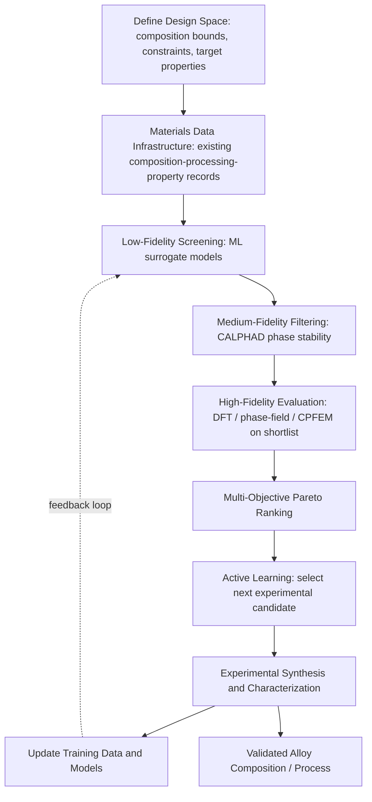

## Data Driven Alloy Design

### Fundamental Concept

Data-driven alloy design integrates the methods developed throughout this chapter — materials data infrastructure, machine learning property prediction, high-throughput screening, generative models, and their physics-based counterparts (CALPHAD, DFT, phase-field) covered in the preceding computational materials science chapter — into an end-to-end workflow for discovering and optimizing alloy compositions and processing routes. Rather than treating these as isolated methods, data-driven alloy design is fundamentally an **integration problem**: combining sparse, heterogeneous, multi-fidelity data sources with iterative computational and experimental feedback loops to navigate compositional and processing design space more efficiently than traditional empirical (Edisonian trial-and-error) alloy development.

$$\text{Design Space} \xrightarrow{\text{ML/HTCS/Generative screening}} \text{Candidate Shortlist} \xrightarrow{\text{Physics-based validation}} \text{Experimental Confirmation} \xrightarrow{\text{Feedback}} \text{Refined Model}$$

**Key Points**

- Data-driven alloy design is not a single method but an orchestration layer combining CALPHAD (thermodynamic feasibility), ML property prediction (rapid property estimation), HTCS/generative approaches (candidate generation), and targeted experimentation (ground-truth validation and model refinement) into a closed iterative loop.
- The approach's core value proposition is reducing the number of experimental iterations needed to reach a target alloy composition/processing combination, relative to traditional sequential trial-and-error development — directly addressing the historically long alloy-to-market development timelines that motivated the broader ICME movement.
- Success depends critically on the materials data infrastructure quality discussed earlier in this chapter; a data-driven design campaign built on sparse, poorly curated, or inconsistently documented data will propagate that weakness through every downstream modeling step.

### Design Workflow Components

#### Design Space Definition and Constraint Specification

- **Compositional bounds**: Defining the alloying element set and allowable concentration ranges, often informed by cost, availability, processability, and known solubility limits from existing phase diagrams/CALPHAD assessments
- **Hard constraints**: Thermodynamic phase stability requirements (avoiding embrittling intermetallic phases in unwanted amounts), processing compatibility (castability, weldability, hot workability), regulatory/toxicity restrictions on certain elements, and cost ceilings
- **Target property specification**: Single or multiple target properties (strength, ductility, corrosion resistance, density, cost) with explicit acknowledgment of trade-offs where objectives compete, motivating multi-objective rather than single-objective optimization framing

#### Multi-Fidelity Model Integration

Data-driven alloy design characteristically combines information sources of very different cost and accuracy:

| Fidelity Level | Method | Relative Cost | Relative Accuracy |
| --- | --- | --- | --- |
| Low | ML surrogate model prediction | Very low | Variable, data-dependent |
| Medium | CALPHAD equilibrium calculation | Low-moderate | High for well-assessed systems |
| Medium-high | DFT calculation | Moderate-high | High for ground-state properties |
| High | Physics-based process/microstructure simulation (phase-field, CPFEM) | High | High, mechanism-resolved |
| Highest | Physical experiment | Highest | Ground truth (subject to measurement uncertainty) |

Effective workflows use low-fidelity methods to screen broadly and reserve higher-fidelity (and higher-cost) methods for a progressively narrowing shortlist — the same funnel logic introduced in the high-throughput screening content, now explicitly incorporating experimental fidelity as the final and most trusted (but most expensive) tier.

#### Multi-Objective Optimization and Trade-off Navigation

Real alloy design problems rarely optimize a single property in isolation — strength often trades off against ductility, corrosion resistance may trade off against cost or weldability. Pareto-front-based multi-objective optimization (introduced in the high-throughput screening content) identifies the set of non-dominated compositions, presenting the alloy designer with genuine trade-off information rather than a single collapsed score that obscures competing objectives.

#### Active Learning and Bayesian Optimization Loops

As introduced in the machine learning property prediction content, uncertainty-aware models (commonly Gaussian Process Regression) guide iterative selection of the next composition or processing condition to evaluate — whether via simulation or physical experiment — prioritizing candidates that best balance predicted performance against model uncertainty, thereby directing limited experimental resources toward the most informative next steps rather than exhaustive or purely intuition-driven testing.

### Application to Materials Science and Metallurgy

- **Accelerated alloy development timelines**: The core motivating application — reducing the historically long (often decade-plus) cycle from initial alloy concept to qualified commercial composition by front-loading computational screening and reserving costly experimental iterations for well-justified, high-information candidates
- **High-entropy and compositionally complex alloy design**: The combinatorial explosion of possible compositions in multi-principal-element alloy systems is a natural fit for data-driven design, where exhaustive experimental or even exhaustive CALPHAD-based exploration is impractical, motivating combined ML/generative/CALPHAD screening funnels
- **Precipitation-strengthened alloy optimization**: Simultaneously optimizing composition and aging heat treatment schedule to maximize strength while maintaining adequate ductility and corrosion resistance, using CALPHAD-informed phase-field or kinetic models coupled with ML-based property surrogates within an active-learning loop, as illustrated in the machine learning property prediction content's aging-optimization example
- **Recycled and secondary-source alloy design**: Data-driven approaches that explicitly account for tramp/residual element variability characteristic of recycled feedstock, designing compositions and processing routes robust to the compositional uncertainty inherent in scrap-based material streams
- **Sustainable and lower-carbon alloy substitution**: Screening for compositions that reduce reliance on critical, expensive, or high-carbon-footprint alloying elements while maintaining target property performance, an increasingly prominent design objective alongside traditional mechanical/corrosion performance targets
- **Cross-property optimization for multi-functional alloys**: Simultaneous optimization across mechanical, thermal, and electromagnetic property targets (e.g., for structural alloys with additional functional requirements), leveraging the multi-objective Pareto framework to present genuinely informed trade-off decisions to alloy designers

**Example**

An alloy development program targets a new aerospace structural alloy with a specified minimum strength-to-weight ratio, adequate fracture toughness, and cost below a defined ceiling, drawing on an internal materials data infrastructure combining legacy experimental records with CALPHAD-calculated phase equilibria for the relevant compositional family. An initial ML surrogate model, trained on this combined dataset, screens several thousand candidate compositions and processing combinations, from which CALPHAD-based phase stability filtering removes candidates predicted to form excessive amounts of an embrittling intermetallic phase. The surviving shortlist undergoes phase-field-based precipitate evolution simulation to refine strength predictions for a proposed aging schedule, and Pareto ranking across strength, toughness, and cost identifies a small set of non-dominated candidates for physical trial. Bayesian optimization guides selection of the first three experimental trials from this set, prioritizing compositions where model uncertainty is highest relative to predicted performance. [Inference] The overall reduction in experimental iterations achieved by this workflow, relative to a traditional sequential development approach, depends substantially on how well each fidelity tier's predictions correlate with actual experimental outcomes for this specific alloy family — a correlation that is itself only established with confidence after the program has accumulated sufficient validated data, making early-stage trust in the computational funnel appropriately provisional rather than assumed.

### Organizational and Practical Considerations

- **Cross-disciplinary integration**: Effective data-driven alloy design requires close coordination between computational materials scientists, experimentalists, and data engineers — a workflow-and-organizational challenge at least as significant as any individual technical method, since model outputs are only as valuable as the experimental feedback loop that validates and refines them
- **Legacy data integration**: Many organizations possess substantial historical experimental data in formats (paper records, inconsistent spreadsheets, unstandardized reports) poorly suited to direct ML/data-driven use, making data curation and infrastructure investment (as discussed in the data infrastructure content) frequently the rate-limiting practical step rather than any modeling method itself
- **Trust and adoption**: Alloy designers and engineers with deep domain expertise may reasonably be skeptical of purely data-driven recommendations, particularly for compositions outside well-established experience; presenting model uncertainty transparently and validating against known physical/metallurgical principles (rather than treating models as black-box oracles) supports appropriate trust calibration
- **Intellectual property and competitive data considerations**: Alloy composition and processing data are frequently commercially sensitive, constraining how freely data-driven design workflows can draw on external/public data sources relative to internal proprietary records, as noted in the data infrastructure content's discussion of proprietary data limitations

[Unverified] The magnitude of development-time and cost reduction achievable through data-driven alloy design approaches varies substantially by alloy system, existing data maturity, and organizational implementation quality; specific acceleration figures reported in individual case studies should not be assumed to generalize directly to other alloy development programs without accounting for these context-specific factors.

### SVG: Data-Driven Alloy Design Iterative Loop (svg_diagram)

<svg xmlns="http://www.w3.org/2000/svg" viewBox="0 0 640 320">
<rect x="0" y="0" width="640" height="320" fill="#ffffff" />
<text x="320" y="24" text-anchor="middle" font-size="16" font-weight="bold" fill="#111">Data-Driven Alloy Design Loop (svg_diagram)</text>
<circle cx="150" cy="120" r="60" fill="#cfe8ff" fill-opacity="0.6" stroke="#2b6cb0" stroke-width="2" />
<text x="150" y="115" text-anchor="middle" font-size="11" fill="#1a4971">Computational</text>
<text x="150" y="130" text-anchor="middle" font-size="11" fill="#1a4971">Screening Funnel</text>
<circle cx="490" cy="120" r="60" fill="#ffe0cc" fill-opacity="0.6" stroke="#c05621" stroke-width="2" />
<text x="490" y="115" text-anchor="middle" font-size="11" fill="#7c2d12">Experimental</text>
<text x="490" y="130" text-anchor="middle" font-size="11" fill="#7c2d12">Validation</text>
<rect x="240" y="230" width="160" height="50" fill="#d6f5d6" fill-opacity="0.6" stroke="#2f855a" />
<text x="320" y="260" text-anchor="middle" font-size="11" fill="#22543d">Data Infrastructure</text>
<path d="M 210 120 L 430 120" fill="none" stroke="#333" stroke-width="2" marker-end="url(#arrow4)" />
<text x="320" y="105" text-anchor="middle" font-size="9" fill="#555">Candidate shortlist</text>
<path d="M 460 175 Q 400 230 400 230" fill="none" stroke="#333" stroke-width="2" marker-end="url(#arrow4)" />
<path d="M 240 255 Q 180 200 180 180" fill="none" stroke="#333" stroke-width="2" marker-end="url(#arrow4)" />
<text x="230" y="200" font-size="9" fill="#555">Update models</text>
</svg>

**Related Topics**

- Materials Data Infrastructure and Databases
- Machine Learning for Property Prediction
- High Throughput Computational Screening
- Generative Models for Materials Discovery
- CALPHAD Based Thermodynamic Simulation
- Integrated Computational Materials Engineering (ICME) and process-structure-property linkage