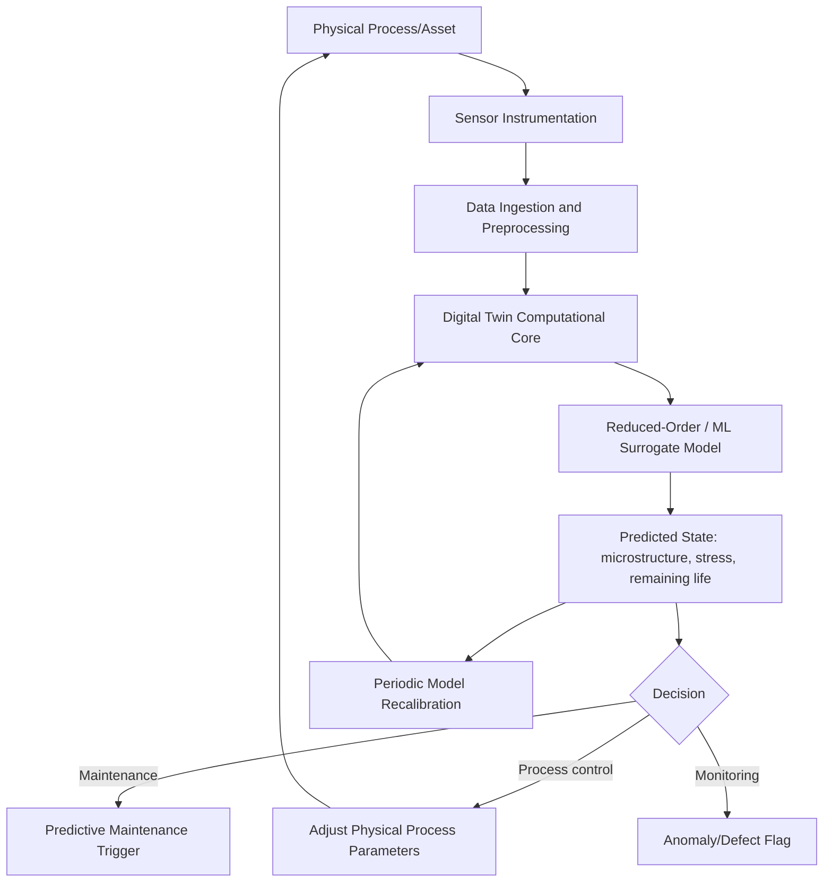

## Digital Twins in Materials and Manufacturing

### Fundamental Concept

A digital twin is a live, continuously updated virtual representation of a physical asset, process, or system, maintained in synchronization with its physical counterpart through a persistent flow of sensor and operational data. In materials and manufacturing contexts, a digital twin extends beyond a static simulation model (such as the process simulations covered in the preceding computational materials science chapter) by maintaining an ongoing, bidirectional data linkage: the physical process feeds real-time or near-real-time data into the model, and the model's predictions in turn inform real-time or near-real-time decisions about the physical process.

$$\text{Physical Asset/Process} \xrightleftharpoons[\text{control/prediction feedback}]{\text{sensor data stream}} \text{Digital Twin Model}$$

**Key Points**

- The defining feature distinguishing a digital twin from a conventional simulation model is this persistent, bidirectional synchronization with a specific physical instance — a digital twin of a specific production furnace or a specific manufactured part is fundamentally different from a generic process simulation model applied once at the design stage.
- Digital twins in materials/manufacturing contexts typically integrate several of the modeling methods already covered in this chapter (FEM-based process simulation, CALPHAD/phase-field microstructure prediction, ML surrogate models) as the underlying computational engine, combined with a data infrastructure layer connecting to live sensor streams.
- Fidelity and update frequency trade off against computational cost, exactly as in the multiscale and multi-fidelity modeling contexts already discussed: a digital twin intended for real-time process control typically relies on fast reduced-order or ML-surrogate models rather than full high-fidelity physics simulation, reserving the latter for periodic recalibration or offline analysis.

### Architecture and Components

#### Physical-to-Virtual Data Flow

- **Sensor instrumentation**: Temperature, strain, acoustic emission, vibration, in-situ process monitoring (e.g., melt pool thermal imaging in additive manufacturing, load cell data in forming), and other process/condition sensors provide the real-time data stream
- **Data ingestion and preprocessing**: Signal conditioning, noise filtering, and alignment of heterogeneous sensor data streams (differing sampling rates, formats) into a form usable by the twin's computational models
- **Edge vs. cloud processing**: Time-critical process control decisions may require edge (local, low-latency) computation, while more computationally intensive model updates or historical analysis are typically performed in cloud or centralized computing environments

#### The Computational Model Core

- **Reduced-order models (ROMs)**: Computationally efficient approximations of full physics-based models (FEM, CALPHAD, phase-field), often derived via ML surrogate modeling (as covered in the machine learning content of this chapter) or formal model-order-reduction techniques, enabling near-real-time execution
- **Physics-informed model structure**: Embedding known physical constraints (thermodynamic consistency from CALPHAD, established process physics) into the reduced-order model improves reliability and data efficiency relative to a purely data-driven black-box surrogate, echoing the physics-informed descriptor approach discussed under machine learning property prediction
- **Model calibration and updating**: Periodic recalibration of the twin's model parameters against accumulating sensor data and, where available, ground-truth measurements (post-process inspection, destructive testing on sacrificial samples) keeps the twin representative of the actual, potentially drifting, physical asset condition over its service life

#### Virtual-to-Physical Feedback

- **Process control**: Real-time or near-real-time adjustment of process parameters (e.g., additive manufacturing laser power, furnace temperature setpoints) based on the twin's predictions, closing the loop between virtual prediction and physical action
- **Predictive maintenance**: Using the twin's simulated component state (accumulated damage, fatigue life consumption) to predict remaining useful life and trigger maintenance actions before failure, rather than relying solely on fixed maintenance schedules or reactive failure response
- **Anomaly detection**: Comparing real-time sensor data against the twin's predicted "expected" behavior flags deviations indicative of process drift, incipient defects, or sensor malfunction

### Digital Twin Fidelity Levels

| Level | Description | Typical Use |
| --- | --- | --- |
| Process twin | Represents the manufacturing process/equipment itself, not a specific part | Furnace, forming press, or AM machine condition monitoring and control |
| Part twin | Tracks an individual manufactured component's specific processing and inspection history | Traceability, part-specific property prediction for high-consequence components |
| Fleet/population twin | Aggregates data across many instances of a process or part to identify population-level trends | Statistical process control, cross-unit anomaly detection |
| Full lifecycle twin | Extends tracking from manufacturing through service life to end-of-life | Structural health monitoring, predictive maintenance for critical components |

### Application to Materials Science and Metallurgy

- **Additive manufacturing process control**: In-situ melt pool monitoring data feeds a digital twin that predicts resulting local microstructure and defect risk (porosity, lack-of-fusion) in near-real-time, enabling closed-loop laser power/scan speed adjustment during the build itself, directly extending the AM process simulation concepts covered in the manufacturing simulation content toward live, per-build application
- **Casting and solidification process monitoring**: Thermal sensor data from mold/casting instrumentation feeds a digital twin coupling real-time thermal measurement with solidification and CALPHAD-based microstructure prediction, supporting in-process adjustment of cooling rate or riser feeding conditions
- **Heat treatment furnace digital twins**: Combining furnace sensor data with coupled thermal-metallurgical models (as discussed under manufacturing process simulation) to predict actual part temperature history and resulting microstructure/hardness more accurately than furnace setpoint alone, particularly valuable where load configuration and part geometry create non-uniform heating
- **Structural health monitoring and remaining life prediction**: A part-level digital twin combining as-built processing history (potentially including recorded defects or microstructural variability) with in-service load/strain monitoring supports part-specific fatigue and damage accumulation prediction, going beyond generic design-basis life estimates by accounting for the actual individual component's history
- **Weld quality monitoring**: Real-time weld process sensor data (arc voltage/current, thermal imaging) feeds a digital twin predicting resulting HAZ microstructure and defect risk, supporting in-process weld parameter adjustment or immediate post-weld quality flagging
- **Traceability and digital thread integration**: Part-specific digital twins, when linked across the full manufacturing chain (raw material certification, processing records, inspection results), support full material traceability from source to final component — increasingly important for regulated industries (aerospace, nuclear, medical devices) requiring documented material pedigree

**Example**

An additive manufacturing operation implements a digital twin for a laser powder-bed fusion process, combining real-time melt pool thermal camera data with a reduced-order thermal model (itself trained as an ML surrogate against a smaller set of full melt-pool-resolution simulations, following the surrogate modeling approach discussed under machine learning property prediction). The twin flags a localized region of the current build where predicted cooling rate falls outside the process window associated with acceptable porosity levels, based on prior process-structure correlation established from earlier builds. This triggers a real-time laser power adjustment for subsequent layers in that region, and the outcome (whether the adjustment successfully avoided the predicted defect, assessed via post-build CT scanning) is fed back to recalibrate the twin's predictive model for future builds. [Inference] The reliability of such real-time intervention depends on the reduced-order model's fidelity being adequate for the specific defect mechanism of concern despite its necessarily simplified representation relative to full physics-based melt-pool simulation, making periodic validation of the reduced-order model against higher-fidelity simulation or physical inspection an ongoing rather than one-time requirement for maintaining trust in the twin's real-time recommendations.

### Common Challenges and Practical Considerations

- **Sensor data quality and coverage**: Digital twin reliability is fundamentally bounded by the quality, coverage, and reliability of the underlying sensor instrumentation — sparse, noisy, or improperly calibrated sensor data limits the twin's predictive value regardless of model sophistication
- **Model-reality drift**: Physical processes and equipment can drift over time (tool wear, furnace element degradation, sensor calibration drift) in ways the twin's model may not automatically capture without explicit, disciplined recalibration procedures
- **Computational latency vs. fidelity trade-off**: Real-time control applications impose hard latency constraints that often preclude full high-fidelity physics simulation, necessitating the reduced-order/surrogate modeling approaches discussed above, with associated accuracy trade-offs that must be explicitly characterized and monitored
- **Integration across heterogeneous systems**: Materials and manufacturing digital twins often need to integrate data and models across multiple vendors' equipment, sensor systems, and software platforms, an interoperability challenge connecting directly to the data schema and standardization considerations discussed in the materials data infrastructure content
- **Validation and trust establishment**: As with data-driven alloy design, establishing appropriate trust in a digital twin's real-time recommendations — particularly for high-consequence process control decisions — requires transparent uncertainty communication and a track record of validated performance rather than treating the twin as an infallible oracle from initial deployment

[Unverified] The maturity and industrial adoption of digital twin implementations vary considerably across manufacturing sectors and specific processes — additive manufacturing and certain high-value aerospace/turbine component applications are frequently cited as relatively advanced adoption areas, while broader adoption across general metalworking remains comparatively less established; specific claims about adoption levels or achieved benefits should be verified against current industry sources rather than assumed uniform across the manufacturing sector.

### SVG: Digital Twin Bidirectional Synchronization (svg_diagram)

<svg xmlns="http://www.w3.org/2000/svg" viewBox="0 0 640 300">
<rect x="0" y="0" width="640" height="300" fill="#ffffff" />
<text x="320" y="24" text-anchor="middle" font-size="16" font-weight="bold" fill="#111">Digital Twin Synchronization (svg_diagram)</text>
<rect x="60" y="100" width="200" height="100" fill="#cfe8ff" fill-opacity="0.6" stroke="#2b6cb0" stroke-width="2" />
<text x="160" y="145" text-anchor="middle" font-size="12" fill="#1a4971">Physical Process</text>
<text x="160" y="160" text-anchor="middle" font-size="12" fill="#1a4971">or Asset</text>
<rect x="380" y="100" width="200" height="100" fill="#ffe0cc" fill-opacity="0.6" stroke="#c05621" stroke-width="2" />
<text x="480" y="145" text-anchor="middle" font-size="12" fill="#7c2d12">Digital Twin</text>
<text x="480" y="160" text-anchor="middle" font-size="12" fill="#7c2d12">Model</text>
<path d="M 260 130 L 380 130" fill="none" stroke="#333" stroke-width="2" marker-end="url(#arrow5)" />
<text x="320" y="120" text-anchor="middle" font-size="9" fill="#555">Sensor data</text>
<path d="M 380 175 L 260 175" fill="none" stroke="#333" stroke-width="2" marker-end="url(#arrow5)" />
<text x="320" y="195" text-anchor="middle" font-size="9" fill="#555">Control / prediction feedback</text>
</svg>

**Related Topics**

- Simulation of Manufacturing Processes (link to Computational Materials Science chapter)
- Machine Learning for Property Prediction (reduced-order/surrogate model foundation)
- Materials Data Infrastructure and Databases
- CALPHAD Based Thermodynamic Simulation (microstructure prediction core)
- Predictive maintenance and structural health monitoring
- Data Driven Alloy Design