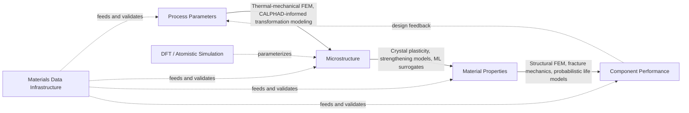

## Integrated Computational Materials Engineering

### Fundamental Concept

Integrated Computational Materials Engineering (ICME) is the overarching framework and philosophy that unifies the computational methods, data infrastructure, and machine learning approaches covered throughout this chapter and the preceding computational materials science chapter into a coordinated process-structure-property-performance (PSPP) pipeline. Rather than a single method, ICME is best understood as a systems-engineering discipline: it formalizes how models operating at different length/time scales and addressing different aspects of the materials-manufacturing-performance chain are linked together, validated, and applied to accelerate materials and process development relative to traditional sequential, empirically-driven development.

$$\text{Process} \rightarrow \text{Structure (microstructure)} \rightarrow \text{Property} \rightarrow \text{Performance}$$

**Key Points**

- ICME is explicitly the integration layer sitting above the individual methods already covered in this chapter and the preceding one — DFT, CALPHAD, phase-field, FEM, crystal plasticity, ML property prediction, HTCS, generative models, and digital twins are all potential components within an ICME framework, not competitors to it.
- The PSPP linkage is the conceptual backbone: ICME formalizes the chain connecting processing parameters (which determine microstructure), microstructure (which determines properties), and properties (which determine component performance), enabling prediction to flow in either direction along this chain.
- ICME emerged specifically to address the historically long (often decade-plus) and costly cycle from initial materials/alloy concept to qualified engineering application, driven by reliance on sequential, largely empirical trial-and-error development — a motivation shared directly with the data-driven alloy design content earlier in this chapter, of which ICME is the broader organizing framework.

### The Process-Structure-Property-Performance Framework

#### Process → Structure Linkage

Connects processing parameters (casting conditions, forming parameters, heat treatment schedules, welding/AM thermal cycles) to resulting microstructure, drawing on the manufacturing process simulation methods (coupled thermal-mechanical FEM, CALPHAD-informed transformation modeling) and microstructure evolution methods (phase-field, kinetic Monte Carlo) covered in the computational materials science chapter.

#### Structure → Property Linkage

Connects predicted microstructure (grain size and morphology, phase fractions, precipitate distribution, texture, defect population) to resulting mechanical, thermal, or corrosion properties, drawing on crystal plasticity, strengthening-mechanism models, and increasingly ML-based structure-property surrogate models trained on microstructural descriptors.

#### Property → Performance Linkage

Connects material properties (yield strength, fatigue resistance, creep behavior) to component or system-level performance under actual service conditions, drawing on structural finite element analysis, fracture mechanics, and probabilistic life-prediction methods that account for both material property variability and service load uncertainty.

### ICME as Integration Architecture

ICME's distinguishing contribution is not any individual model but the disciplined linkage between models operating at different scales and addressing different links in the PSPP chain — directly the same hierarchical multiscale coupling concept introduced in the multiscale modeling content of the computational materials science chapter, now applied specifically to the engineering development and qualification context:

- **Model chaining and information handoff**: Formalized protocols for passing outputs from one model (e.g., a phase-field-predicted precipitate size distribution) as inputs to the next (e.g., a strengthening model or crystal plasticity simulation), including explicit treatment of associated uncertainty propagation through the chain
- **Multi-fidelity and multi-scale model selection**: Systematic choice of which model to use at each PSPP link based on the required accuracy, available computational budget, and the specific decision the prediction will inform — mirroring the multi-fidelity model integration concept from the data-driven alloy design content
- **Validation and verification (V&V) discipline**: ICME practice places particular emphasis on establishing documented confidence in each model and each model-to-model linkage, since an unvalidated link anywhere in the PSPP chain can undermine confidence in the full chain's final prediction, regardless of how well-validated the other links are
- **Data and digital thread integration**: Connecting the materials data infrastructure, digital twin, and traceability concepts covered earlier in this chapter into a continuous "digital thread" spanning from initial material/process design through manufacturing to in-service performance monitoring

### Application to Materials Science and Metallurgy

- **New alloy qualification acceleration**: Reducing the number of physical processing and testing iterations required to qualify a new alloy composition or processing route for a specific engineering application, by front-loading PSPP-chain computational prediction and reserving physical trials for validation of the most promising, well-justified candidates — directly the workflow illustrated in the data-driven alloy design content's aerospace alloy example
- **Additive manufacturing qualification**: A particularly active ICME application area, linking AM process simulation (melt pool and part-scale thermal-mechanical modeling) through CALPHAD/phase-field-predicted microstructure to crystal-plasticity-based property prediction and finally structural performance assessment, supporting qualification of new AM materials and processes with reduced physical build-and-test iteration
- **Process optimization for existing alloys in new applications**: Applying the PSPP chain to determine whether and how an established alloy's processing route can be modified to meet a new application's performance requirements, without requiring a full new-alloy development cycle
- **Root-cause failure analysis**: Running the PSPP chain in reverse — starting from observed component failure or underperformance, working backward through property and structure prediction to identify which process deviation likely caused the observed outcome, complementing traditional forensic failure analysis techniques
- **Design allowables and probabilistic performance prediction**: Combining PSPP-chain predictions with microstructural and property variability data to generate statistically grounded design allowables, potentially reducing the large physical testing programs traditionally required to establish these values for new materials, particularly relevant in aerospace and other safety-critical industries
- **Sustainable materials substitution**: Applying the PSPP framework to rapidly assess whether an alternative, lower-cost or lower-environmental-impact composition/process combination can meet an existing application's performance requirements, connecting to the sustainable alloy substitution application noted in the data-driven alloy design content

**Example**

An aerospace component manufacturer applies an ICME workflow to qualify a new powder-bed-fusion additive manufacturing process for a nickel-superalloy turbine component. Process-scale thermal-mechanical simulation of the build predicts local thermal history across the part; this feeds a CALPHAD-informed rapid-solidification microstructure model predicting resulting grain morphology, texture, and precipitate state, which in turn feeds a crystal-plasticity-based model predicting local anisotropic mechanical properties, and finally a structural FEM analysis of the completed component under simulated service loading predicts stress distribution and fatigue life. At each PSPP-chain link, model predictions are checked against a limited set of physical measurements (post-build metallography, mechanical testing of witness coupons, and NDT inspection) to establish documented confidence before the chain's final performance prediction is used to support qualification decisions. [Inference] The overall qualification-timeline benefit of this ICME approach relative to a traditional build-test-iterate qualification program depends substantially on how well-validated each individual PSPP link is for this specific material-process combination — a chain with even one weakly validated link (most often the structure-to-property link, where microstructure-property relationships for novel AM microstructures are frequently less mature than for conventionally processed alloys) will generally warrant more conservative treatment of the final performance prediction and correspondingly more extensive physical validation than a chain built entirely on well-established, previously validated links.

### Historical Context and Origins

ICME as a formally named discipline gained significant momentum following a US National Research Council report and associated National Academies study in the late 2000s, which articulated the vision of accelerating materials development by systematically linking computational models across scales — building directly on decades of prior work in individual computational materials methods (CALPHAD's development from the mid-20th century onward, finite element methods, and growing atomistic/DFT capability) but formalizing their integration as a distinct engineering discipline and development philosophy rather than a collection of independently useful tools.

### Common Challenges and Practical Considerations

- **Uncertainty propagation across the PSPP chain**: As noted under multiscale modeling in the preceding chapter, uncertainty introduced at each link can compound through the full chain; rigorous ICME practice requires explicit uncertainty quantification and propagation rather than treating each link's output as a certain input to the next
- **Validation cost and data requirements**: Establishing documented confidence at each PSPP link requires targeted validation data, which can itself represent a substantial fraction of the total program cost/time — ICME reduces but does not eliminate the need for physical experimentation, particularly for validation purposes
- **Organizational and workforce integration**: Effective ICME practice requires the same cross-disciplinary coordination challenge noted in the data-driven alloy design content — computational materials scientists, process engineers, and structural analysts must work within a shared, coordinated framework rather than in disciplinary silos, a organizational challenge frequently as significant as any technical modeling gap
- **Model and data reusability**: A key long-term ICME goal is building reusable, validated model and data linkages that can be applied across multiple future programs rather than rebuilt from scratch for each new alloy/application, though achieving this reusability in practice requires sustained investment in the underlying data infrastructure and standardized interfaces discussed earlier in this chapter

[Unverified] The degree of ICME adoption maturity varies substantially by industry sector and specific application — aerospace and defense applications, along with certain automotive and additive manufacturing contexts, are frequently cited as comparatively advanced adoption areas; the specific state of practice at any given organization should be assessed directly rather than assumed based on general industry trends.

### SVG: ICME Process-Structure-Property-Performance Chain (svg_diagram)

<svg xmlns="http://www.w3.org/2000/svg" viewBox="0 0 640 260">
<rect x="0" y="0" width="640" height="260" fill="#ffffff" />
<text x="320" y="24" text-anchor="middle" font-size="16" font-weight="bold" fill="#111">ICME PSPP Chain (svg_diagram)</text>
<rect x="30" y="90" width="130" height="60" fill="#cfe8ff" fill-opacity="0.6" stroke="#2b6cb0" />
<text x="95" y="125" text-anchor="middle" font-size="11" fill="#1a4971">Process</text>
<rect x="190" y="90" width="130" height="60" fill="#ffe0cc" fill-opacity="0.6" stroke="#c05621" />
<text x="255" y="125" text-anchor="middle" font-size="11" fill="#7c2d12">Structure</text>
<rect x="350" y="90" width="130" height="60" fill="#d6f5d6" fill-opacity="0.6" stroke="#2f855a" />
<text x="415" y="125" text-anchor="middle" font-size="11" fill="#22543d">Property</text>
<rect x="510" y="90" width="130" height="60" fill="#f5d6f0" fill-opacity="0.6" stroke="#b83280" />
<text x="575" y="125" text-anchor="middle" font-size="11" fill="#702459">Performance</text>
<line x1="160" y1="120" x2="190" y2="120" stroke="#333" stroke-width="2" marker-end="url(#arrow6)" />
<line x1="320" y1="120" x2="350" y2="120" stroke="#333" stroke-width="2" marker-end="url(#arrow6)" />
<line x1="480" y1="120" x2="510" y2="120" stroke="#333" stroke-width="2" marker-end="url(#arrow6)" />
<path d="M 575 150 Q 300 230 95 150" fill="none" stroke="#888" stroke-width="1.5" stroke-dasharray="4,3" marker-end="url(#arrow6)" />
<text x="320" y="245" text-anchor="middle" font-size="9" fill="#555">Design feedback</text>
</svg>

**Related Topics**

- Multiscale Modeling Approaches (technical foundation for PSPP linkage)
- Data Driven Alloy Design
- Simulation of Manufacturing Processes
- Digital Twins in Materials and Manufacturing
- CALPHAD Based Thermodynamic Simulation and Crystal Plasticity Modeling (structure-property core methods)
- Uncertainty quantification and validation methodology across model chains