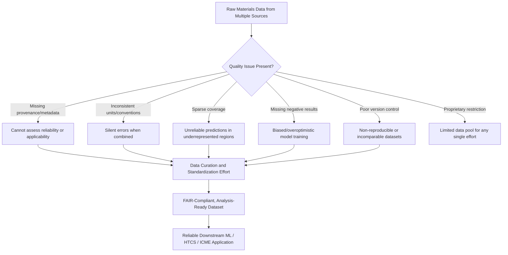

## Challenges in Materials Data Quality and Standardization

### Fundamental Concept

This topic examines, in focused depth, the data quality and standardization limitations that have been noted as recurring constraints throughout this chapter's coverage of materials data infrastructure, machine learning, high-throughput screening, generative models, data-driven alloy design, digital twins, and ICME. Every computational and data-driven method discussed depends on underlying data of adequate quality, coverage, and consistency; this section consolidates and examines those constraints directly as a subject in its own right, since data quality is frequently the binding constraint on materials informatics outcomes rather than any modeling algorithm's sophistication.

$$\text{Model Output Quality} \leq f(\text{Data Quality, Coverage, Consistency})$$

**Key Points**

- No modeling method — ML, generative, CALPHAD-adjacent, or physics-based — can produce reliable output from unreliable, sparse, or inconsistently documented input data; this is a hard ceiling rather than a limitation that better algorithms can fully overcome.
- Materials data quality challenges are structurally different from data quality challenges in many other machine learning domains (e.g., image or text data) because materials data provenance — the specific measurement or computational method, conditions, and uncertainty — is often as scientifically important as the data value itself, and is frequently the piece most likely to be missing or poorly documented.
- These challenges are not uniformly distributed: well-studied conventional alloy systems have far denser, more standardized data than novel, compositionally complex, or proprietary-process materials, creating systematically uneven reliability across different materials classes and applications.

### Categories of Data Quality Challenge

#### Provenance and Metadata Incompleteness

As introduced in the materials data infrastructure content, a data point's value is often scientifically meaningless without accompanying metadata: computational method and convergence parameters (for DFT/computational data), or measurement technique, specimen geometry, testing standard, and conditions (for experimental data). Legacy data — particularly from older literature, internal industrial records, or informally documented internal databases — frequently lacks this metadata, either because it was never recorded or because it was recorded in unstructured, non-machine-readable form (free-text lab notebooks, inconsistent spreadsheet conventions).

#### Inconsistent Units, Conventions, and Terminology

Different sources may report the same underlying quantity using different units, reference states, or terminology (e.g., differing conventions for reporting yield strength offset criteria, differing thermodynamic reference states for formation energies, inconsistent naming of nominally equivalent processing steps such as "annealing" versus "heat treatment" versus specific proprietary process names for comparable operations). Combining such data without careful harmonization introduces silent, often hard-to-detect errors — directly the mechanism flagged as a common pitfall in the machine learning property prediction content's example of merging data across different tensile specimen geometries.

#### Sparse and Uneven Coverage

Data density varies enormously across composition, processing, and property space. Well-established structural alloys (common steels, aluminum alloys) benefit from decades of accumulated, relatively standardized testing data, while novel materials classes (high-entropy alloys, new additive manufacturing feedstocks, emerging compositionally complex systems) have comparatively sparse coverage — directly limiting the reliability of ML models, HTCS campaigns, and generative model training in exactly the design spaces where data-driven exploration would otherwise be most valuable for accelerating discovery.

#### Underrepresentation of Negative and Null Results

Published literature, curated databases, and even internal industrial records disproportionately capture "successful" or notable outcomes; unsuccessful compositions, failed processing trials, and negative experimental results are systematically underrepresented. This survivorship-bias-like effect can bias data-driven models trained predominantly on positive-outcome data, potentially causing them to underestimate failure risk in regions of design space that superficially resemble successful prior examples but share underlying characteristics with the (unrecorded) failures.

#### Reproducibility and Version Control Gaps

As noted under high-throughput computational screening, automated large-scale calculation campaigns require careful version control of calculation parameters, workflow software, and underlying computational codes; without this discipline, a dataset generated at one point in time may not be directly comparable to a superficially similar dataset generated later with subtly different default settings — a challenge that compounds when multiple contributors or institutions contribute to a shared database over time.

#### Proprietary and Access-Restricted Data

Significant fractions of industrially generated materials and process data remain proprietary, export-controlled, or otherwise access-restricted, limiting both the scope of fully open materials databases and the ability of any single organization's data-driven design effort to draw on the broader field's accumulated knowledge — a structural limitation distinct from, and generally more persistent than, the purely technical data quality issues above.

### Standardization Efforts and Mitigation Approaches

- **FAIR data principles adoption**: As introduced in the materials data infrastructure content, systematic application of Findable, Accessible, Interoperable, Reusable principles — standardized metadata schemas, persistent identifiers, machine-readable formats — directly addresses the provenance and interoperability challenges above, though adoption remains uneven across the broader materials data landscape
- **Community-developed schemas and ontologies**: Standardized terminology and data structure conventions, developed and maintained by community consensus (professional societies, standards organizations, major database consortia), reduce ambiguity in combining data across independently generated sources
- **Automated metadata extraction and curation tools**: Text-mining and, increasingly, large-language-model-based tools applied to legacy literature and internal records to extract structured metadata from previously unstructured text, partially addressing the substantial backlog of historically undocumented or poorly documented materials data
- **Uncertainty quantification as a data quality signal**: Explicitly reporting or estimating uncertainty alongside data values (measurement uncertainty for experimental data, convergence/method uncertainty for computational data) allows downstream users and models to appropriately weight data reliability rather than treating all data points as equally trustworthy
- **Deliberate negative-result capture**: Some emerging data infrastructure efforts explicitly solicit and structure negative/null result reporting, directly countering the survivorship-bias pattern noted above, though this remains a comparatively less mature practice than standard positive-result data capture

### Application to Materials Science and Metallurgy

- **CALPHAD database assessment reliability**: Assessment quality is directly bounded by the consistency and documented provenance of the experimental and computational data feeding the assessment process, as discussed in the CALPHAD chapter content — inconsistent underlying data propagates directly into phase diagram and property prediction uncertainty
- **Machine learning model trustworthiness**: As emphasized throughout the machine learning property prediction content, model reliability is fundamentally bounded by training data quality; data quality challenges are the most direct explanation for why interpolative predictions within well-covered design space are generally more trustworthy than extrapolative predictions in sparse regions
- **High-throughput screening false positive/negative rates**: Screening-level calculation settings and any underlying training data used for ML pre-filtering inherit whatever quality limitations exist in the reference data, directly affecting the false positive/negative trade-offs discussed in the high-throughput screening content
- **Generative model training data bias**: As noted in the generative models content, generative models inherit whatever compositional and structural biases exist in their training database, making training data coverage and representativeness directly consequential for genuine novelty in generated candidates
- **Digital twin recalibration reliability**: A digital twin's periodic recalibration against accumulating sensor and inspection data (as discussed in the digital twins content) is only as reliable as that data's own quality and consistency, particularly across sensor replacement or process equipment changes over an asset's service life
- **ICME PSPP chain validation**: As emphasized in the ICME content, uncertainty and error propagate through the full process-structure-property-performance chain; data quality issues at any single link (inconsistent processing records, poorly documented microstructural characterization) can undermine confidence in the full chain's final performance prediction

**Example**

A team assembling a training dataset for a machine learning model predicting fatigue life across several decades of internal experimental records discovers that specimen geometry, surface finish specification, and test frequency were inconsistently documented across different eras of the internal database, with some older records lacking this metadata entirely. Rather than treating all records as directly comparable, the team develops a data quality flagging scheme, separating well-documented recent records (with full metadata) from older, incompletely documented records, and trains an initial model exclusively on the well-documented subset while treating the larger but less-documented historical dataset as a secondary validation and coverage-extension resource rather than a fully trusted training input. [Inference] This more conservative approach to heterogeneous legacy data, while reducing the initial training dataset's effective size, likely produces a more reliable model than uncritically combining all available records, since the alternative risks embedding undetected systematic errors (from inconsistent specimen geometry or test conditions) directly into the model's learned relationships in ways that would be difficult to diagnose after the fact.

### Common Pitfalls Specific to This Challenge Area

- **Treating data volume as a proxy for data quality**: A large dataset assembled without attention to provenance, consistency, and metadata completeness can be less useful — and more dangerous, due to false confidence — than a smaller, well-curated dataset with documented reliability
- **Silent unit or convention mismatches**: As noted above, combining data using different conventions (reference states, offset criteria, testing standards) without explicit harmonization is a particularly insidious failure mode because it may not produce obviously anomalous results, only systematically biased ones
- **Assuming public database completeness**: Public computational and experimental databases, however extensive, represent only a subset of all generated materials data (given proprietary and access-restricted data noted above), and treating them as fully representative of a materials class's true behavior risks missing important edge cases or failure modes documented only in inaccessible proprietary records
- **Underestimating the cost and time of data curation**: Data curation and standardization work is frequently underestimated in project planning relative to modeling and algorithm development effort, despite data quality typically being the more binding constraint on ultimate project success, as noted across multiple applications above

[Unverified] The relative magnitude of data-quality-driven versus algorithm-driven limitations varies by specific application and materials class; while data quality is broadly recognized across the materials informatics field as a significant and often underappreciated constraint, precise quantification of its relative contribution to any given project's outcome is generally difficult to establish rigorously and should not be assumed to follow a fixed ratio across different contexts.

### SVG: Data Quality as the Binding Constraint (svg_diagram)

<svg xmlns="http://www.w3.org/2000/svg" viewBox="0 0 640 300">
<rect x="0" y="0" width="640" height="300" fill="#ffffff" />
<text x="320" y="24" text-anchor="middle" font-size="16" font-weight="bold" fill="#111">Data Quality as Binding Constraint (svg_diagram)</text>
<line x1="60" y1="250" x2="580" y2="250" stroke="#333" stroke-width="1.5" />
<line x1="60" y1="250" x2="60" y2="50" stroke="#333" stroke-width="1.5" />
<text x="320" y="280" text-anchor="middle" font-size="12" fill="#333">Algorithm Sophistication →</text>
<text x="30" y="150" text-anchor="middle" font-size="12" fill="#333" transform="rotate(-90,30,150)">Achievable Model Quality</text>
<path d="M 80 230 Q 300 100 560 90" fill="none" stroke="#2b6cb0" stroke-width="2.5" />
<text x="450" y="75" font-size="10" fill="#1a4971">High data quality</text>
<path d="M 80 240 Q 300 220 560 210" fill="none" stroke="#c05621" stroke-width="2.5" />
<text x="450" y="225" font-size="10" fill="#7c2d12">Low data quality (ceiling)</text>
</svg>

**Related Topics**

- Materials Data Infrastructure and Databases (foundational concepts referenced throughout)
- Machine Learning for Property Prediction
- High Throughput Computational Screening
- Generative Models for Materials Discovery
- Data Driven Alloy Design
- Integrated Computational Materials Engineering (PSPP chain validation)