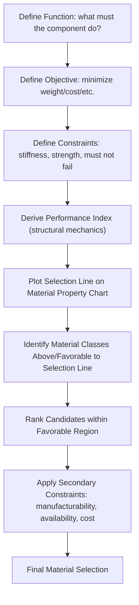

## Materials Selection Methodologies

### Fundamental Concept

Materials selection methodology provides systematic frameworks for choosing the most appropriate material for a given engineering application from among the vast space of available materials, balancing performance requirements, cost, manufacturability, and other constraints. Unlike the computational and data-driven design methods covered in the preceding chapter — which primarily address discovering or optimizing new materials — materials selection methodology addresses the complementary and equally consequential problem of choosing among existing, already-characterized materials for a specific design application, a task every design engineer faces regardless of whether novel materials development is involved.

$$\text{Design Requirements} \rightarrow \text{Material Screening} \rightarrow \text{Ranking} \rightarrow \text{Selection}$$

**Key Points**

- Materials selection is fundamentally a multi-criteria decision problem: real engineering applications virtually always involve multiple, often competing requirements (strength, weight, cost, corrosion resistance, manufacturability), making single-property optimization insufficient for most real selection problems.
- The most widely taught systematic approach — material property charts and performance indices, developed primarily by Michael Ashby — translates the abstract multi-criteria selection problem into a visually and mathematically tractable framework, though it is one of several complementary methodologies rather than the only valid approach.
- Materials selection methodology and the computational/data-driven design methods of the preceding chapter are complementary rather than competing: selection methodology is typically applied to an already-populated materials universe (existing standard materials, or including newly discovered/designed candidates from data-driven design efforts), while data-driven design methods populate or expand that universe.

### Ashby Materials Selection Charts and Performance Indices

#### Material Property Charts

Material property charts plot one material property against another (e.g., Young's modulus vs. density, strength vs. density) on logarithmic axes for a broad population of material classes (metals, polymers, ceramics, composites, foams), with each material class occupying a characteristic region (a "bubble") on the chart. This visual representation immediately reveals which material classes offer favorable combinations of the two plotted properties, and reveals the fundamental property trade-offs inherent to different material classes (e.g., the general trend that higher-stiffness materials tend to be denser, visible directly as the trajectory of material class bubbles across a modulus-density chart).

#### Performance Indices

For a given engineering component function (a beam resisting bending, a tie resisting tension, a panel resisting buckling) combined with a specific objective (minimize weight, minimize cost) and constraint (must not fail under a specified load), structural mechanics analysis yields a **performance index** — a specific combination of material properties that should be maximized (or minimized) to achieve the objective, independent of the specific geometric dimensions chosen.

For example, a light, stiff beam in bending (minimizing mass for a given bending stiffness) yields the performance index:

$$M = \frac{E^{1/2}}{\rho}$$

where $E$ is Young's modulus and $\rho$ is density — a material with a higher value of this index will always allow a lighter beam design for the same bending stiffness, regardless of the beam's specific length or cross-section. Different structural functions (tension members, columns in buckling, plates in bending) and different objectives (minimize weight vs. minimize cost vs. minimize energy content) yield different performance index expressions, derived systematically from the underlying structural mechanics.

#### Selection Lines on Property Charts

A performance index of the form $E^a/\rho^b$ can be represented as a straight line of defined slope on a logarithmic property chart (e.g., a modulus-density chart); materials lying on or above a selection line (further in the favorable direction) outperform materials below it for that specific performance index, allowing rapid visual identification of promising material classes and specific materials for the given structural function and objective, directly analogous to the Pareto-front concept introduced for multi-objective computational screening in the preceding chapter.

### Multi-Criteria Decision Methods

Beyond the Ashby charts/index approach (best suited to structurally-driven, mechanics-based selection problems), several general multi-criteria decision-making (MCDM) methods address materials selection when requirements are more heterogeneous or less reducible to a clean structural performance index:

| Method | Approach | Best Suited For |
| --- | --- | --- |
| Weighted property method | Assign weights to each criterion, sum weighted normalized property values into a single score | Simple problems with clear relative criterion importance |
| Analytic Hierarchy Process (AHP) | Pairwise comparison of criteria and alternatives, deriving weights via eigenvalue analysis | Problems requiring more rigorous, defensible weight derivation, including with subjective/qualitative criteria |
| TOPSIS (Technique for Order Preference by Similarity to Ideal Solution) | Ranks alternatives by geometric distance to an ideal (best-case) and negative-ideal (worst-case) solution | Problems with well-quantified criteria across multiple candidates |
| Digital logic method | Pairwise binary comparison of criteria importance, tallying relative weight from comparison outcomes | Simpler, less computationally demanding alternative to full AHP |

These general MCDM methods are frequently combined with material property databases (of the type discussed in the materials informatics chapter) to systematically rank a candidate material list once selection criteria and their relative importance have been established.

### Application to Materials Science and Metallurgy

- **Lightweighting design in automotive and aerospace**: Applying mass-minimization performance indices (as in the beam-bending example above) to compare candidate metallic (aluminum, titanium, magnesium, advanced high-strength steels), polymer composite, and hybrid material options for structural components, directly informing the strength-to-weight material class trade-offs central to transportation lightweighting programs
- **Cost-constrained material substitution**: Combining performance indices with explicit cost terms (e.g., replacing density with cost per unit performance in the index derivation) to identify lower-cost material alternatives meeting the same structural performance requirement, connecting directly to the sustainable/cost-driven alloy substitution applications noted in the data-driven alloy design content
- **Corrosion and environmental resistance screening**: Layering environmental/corrosion resistance requirements as hard constraints atop mechanical performance indices, systematically narrowing candidate material classes for applications with combined structural and environmental demands (marine, chemical processing, biomedical)
- **Failure-driven material re-selection**: Applying selection methodology retrospectively following an in-service material failure, to systematically identify alternative materials or material classes that would avoid the specific failure mechanism identified, complementing root-cause failure analysis
- **Sustainability-driven selection**: Increasingly, embodied energy, recyclability, and carbon footprint are incorporated as additional selection criteria or performance index terms alongside traditional mechanical and cost criteria, reflecting growing emphasis on environmental impact in materials selection practice
- **Early-stage concept screening**: Property-chart-based selection is particularly valuable at early, exploratory design stages, rapidly narrowing an enormous universe of candidate material classes to a manageable shortlist before more detailed, application-specific analysis (including, where appropriate, the computational alloy design methods of the preceding chapter) is applied to the shortlisted candidates

**Example**

A design engineer selecting material for a lightweight structural panel subject to a bending stiffness constraint applies the appropriate mass-minimization performance index for a panel in bending, plotting a corresponding selection line on a Young's modulus vs. density material property chart. This identifies certain composite and specific lightweight metal classes as offering superior mass efficiency relative to conventional steel for this specific structural function, but a subsequent overlay of manufacturing cost and required production volume as secondary constraints eliminates several of the composite options as impractical for the application's cost and volume requirements, narrowing the final selection to a specific aluminum alloy class. [Inference] This staged approach — broad property-chart screening followed by progressively narrower constraint application — generally produces more defensible selection outcomes than attempting to incorporate every criterion simultaneously into a single weighted score from the outset, since the visual property-chart stage makes the fundamental structural trade-offs transparent before secondary, often more subjective or context-dependent, constraints are layered on.

### Common Pitfalls in Materials Selection

- **Over-reliance on a single performance index**: Real components frequently experience multiple loading modes or failure criteria simultaneously (e.g., both stiffness and strength constraints); selecting based on a single performance index while ignoring other relevant constraints risks a design that satisfies one criterion while failing another
- **Neglecting manufacturability and joining considerations**: A material that scores favorably on structural performance indices may be difficult or costly to manufacture into the required geometry, or difficult to join to adjacent components — practical constraints that must be applied alongside, not after, the primary performance-based screening in genuinely rigorous selection practice
- **Static property values ignoring service environment**: Standard material property chart values typically represent room-temperature, as-received material properties; applications involving elevated temperature, cyclic loading, or aggressive environments require property data specific to those service conditions rather than generic handbook values, connecting directly to the data quality and applicability considerations discussed in the preceding chapter's data quality content
- **Treating weighted-score methods as objective when weights are subjective**: Multi-criteria weighted scoring methods can create a false sense of quantitative rigor when the underlying criterion weights are themselves subjective judgments; transparent documentation of how weights were derived (and, where used, a method like AHP that provides some internal consistency checking) improves the defensibility of the final selection

[Unverified] The relative popularity and formal adoption of specific selection methodologies (Ashby charts vs. AHP vs. other MCDM methods) varies by industry, educational background, and specific application context; this content presents commonly taught and applied frameworks rather than asserting a single universally dominant methodology.

### SVG: Material Property Chart with Performance Index Selection Line (svg_diagram)

<svg xmlns="http://www.w3.org/2000/svg" viewBox="0 0 640 320">
<rect x="0" y="0" width="640" height="320" fill="#ffffff" />
<text x="320" y="24" text-anchor="middle" font-size="16" font-weight="bold" fill="#111">Property Chart Selection Line (svg_diagram)</text>
<line x1="70" y1="270" x2="580" y2="270" stroke="#333" stroke-width="1.5" />
<line x1="70" y1="270" x2="70" y2="50" stroke="#333" stroke-width="1.5" />
<text x="320" y="300" text-anchor="middle" font-size="12" fill="#333">Density, ρ (log scale) →</text>
<text x="35" y="160" text-anchor="middle" font-size="12" fill="#333" transform="rotate(-90,35,160)">Young's Modulus, E (log)</text>
<ellipse cx="140" cy="220" rx="45" ry="30" fill="#cfe8ff" fill-opacity="0.6" stroke="#2b6cb0" />
<text x="140" y="225" text-anchor="middle" font-size="10" fill="#1a4971">Polymers</text>
<ellipse cx="300" cy="150" rx="55" ry="35" fill="#ffe0cc" fill-opacity="0.6" stroke="#c05621" />
<text x="300" y="155" text-anchor="middle" font-size="10" fill="#7c2d12">Metals</text>
<ellipse cx="220" cy="110" rx="50" ry="30" fill="#d6f5d6" fill-opacity="0.6" stroke="#2f855a" />
<text x="220" y="115" text-anchor="middle" font-size="10" fill="#22543d">Composites</text>
<ellipse cx="420" cy="90" rx="45" ry="30" fill="#f5d6f0" fill-opacity="0.6" stroke="#b83280" />
<text x="420" y="95" text-anchor="middle" font-size="10" fill="#702459">Ceramics</text>
<line x1="90" y1="260" x2="500" y2="70" stroke="#333" stroke-width="1.5" stroke-dasharray="5,3" />
<text x="480" y="65" font-size="10" fill="#333">Selection line: E^(1/2)/ρ = const</text>
</svg>

**Related Topics**

- Data Driven Alloy Design (complementary approach for expanding the candidate material universe)
- Materials Data Infrastructure and Databases (source of property values for selection)
- Failure Analysis and Root Cause Investigation
- Sustainable Materials and Life Cycle Assessment
- Cost Engineering and Manufacturing Process Selection
- Structural Mechanics Fundamentals for Performance Index Derivation