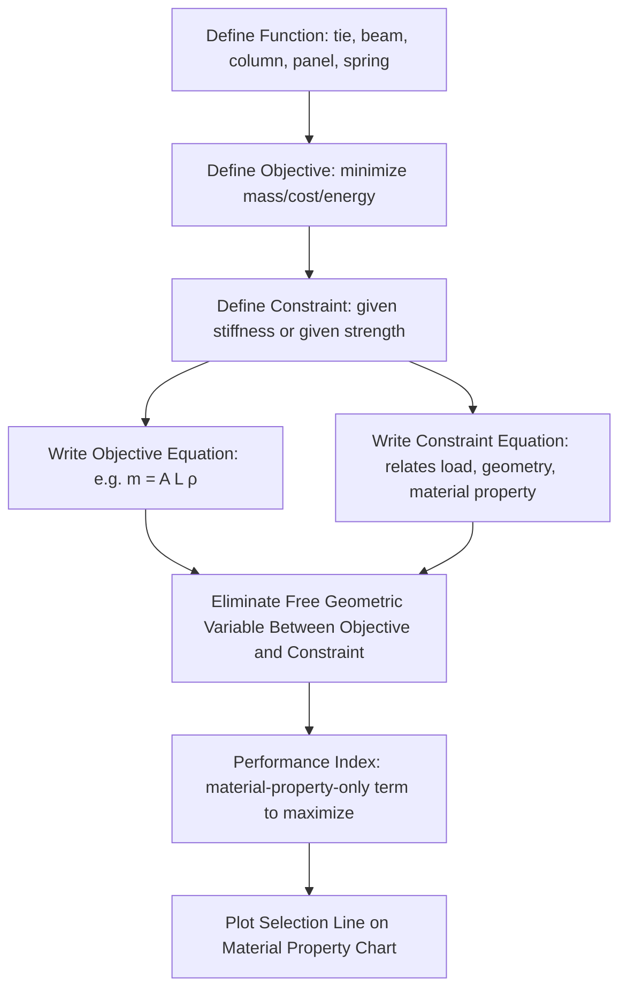

## Ashby Charts and Performance Indices

### Fundamental Concept

Ashby charts and performance indices, developed primarily by Michael Ashby, form a systematic quantitative framework for translating structural engineering requirements directly into material selection decisions. The method's core insight is separating a design problem into three independent elements — **function** (what the component must do structurally), **objective** (what should be minimized or maximized, typically mass, cost, or energy content), and **constraints** (limits that must not be violated, such as stiffness or strength requirements) — and showing that for a wide class of structural problems, the optimal material choice is governed by a single combination of material properties, the **performance index**, that is entirely independent of the component's specific geometric dimensions.

$$\text{Performance} = f(\text{Functional requirement}) \times g(\text{Geometry}) \times h(\text{Material properties})$$

Because geometry and material properties enter this expression as separable, multiplicative factors, the material-dependent term $h$ (the performance index) can be optimized independently of the specific geometric design — meaning the same performance index applies whether the component being designed is large or small, thick or thin, provided the functional form (beam, tie, panel, etc.) and objective remain the same.

**Key Points**

- The separability of geometry and material terms is the mathematical foundation that makes performance indices broadly reusable across different specific component designs sharing the same structural function and objective, rather than requiring a fresh derivation for every new component geometry.
- Performance indices are derived from basic structural mechanics (beam theory, column buckling theory, thin-plate theory) applied to a defined loading mode and failure/deflection constraint, not from empirical correlation — the method has a rigorous engineering-mechanics foundation.
- Material property charts render performance indices visually actionable: plotting relevant properties on logarithmic axes for a broad material population allows a performance index (expressed as a power-law combination of the plotted properties) to be drawn as a straight selection line, immediately separating favorable from unfavorable material choices.

### Deriving a Performance Index: Worked Framework

The general derivation procedure:

1. **Identify the functional form**: e.g., a beam loaded in bending, a tie loaded in tension, a column loaded in compression (buckling), a panel loaded in bending
2. **Identify the objective**: e.g., minimize mass $m = A L \rho$ (cross-sectional area × length × density)
3. **Identify the constraint**: e.g., the beam must not deflect more than a specified amount under a specified load, which for a given beam geometry relates applied load, deflection, elastic modulus, and a shape-dependent second moment of area $I$
4. **Eliminate the free geometric variable** (typically cross-sectional dimension) between the objective and constraint equations, isolating a term containing only material properties

#### Example: Light, Stiff Beam in Bending

For a beam of fixed length $L$ and fixed stiffness (deflection) requirement, with free cross-sectional area $A$, standard beam deflection theory gives the required second moment of area $I \propto \delta^{-1} \cdot (\text{load, length terms})/E$. For a simple square cross-section, $I \propto A^2$, so $A \propto (1/E)^{1/2} \times (\text{geometry/load terms})$. Substituting into the mass objective $m = A L \rho$:

$$m \propto L \rho \times \left(\frac{1}{E}\right)^{1/2} \times (\text{fixed geometry/load terms}) = (\text{fixed terms}) \times \frac{\rho}{E^{1/2}}$$

Minimizing mass therefore means minimizing $\rho/E^{1/2}$, equivalently **maximizing** the performance index:

$$M_1 = \frac{E^{1/2}}{\rho}$$

#### Common Performance Indices by Structural Function

| Function/Objective | Constraint | Performance Index (maximize) |
| --- | --- | --- |
| Tie, minimize mass | Given stiffness | $E/\rho$ |
| Tie, minimize mass | Given strength | $\sigma_y/\rho$ |
| Beam, minimize mass | Given stiffness | $E^{1/2}/\rho$ |
| Beam, minimize mass | Given strength | $\sigma_y^{2/3}/\rho$ |
| Panel, minimize mass | Given stiffness | $E^{1/3}/\rho$ |
| Column, minimize mass | Given buckling load | $E^{1/2}/\rho$ |
| Spring, minimize volume | Given energy storage | $\sigma_y^2/E$ |
| Thermal insulation, minimize mass | Given heat flux | $1/(\lambda \rho C_p)$-related index (thermal diffusivity/conductivity combinations) |

Each index derivation follows the same systematic elimination procedure, with the specific exponents on $E$, $\sigma_y$, and $\rho$ determined by the structural function's geometry (a tie in simple tension has different exponents than a beam in bending because the underlying mechanics — uniform stress vs. bending stress distribution — differ).

### Constructing and Reading Material Property Charts

Standard Ashby charts plot two material properties against each other on log-log axes, with material classes (metals, polymers, ceramics, composites, natural materials, foams) each occupying a characteristic bubble/envelope region. The most fundamental and widely used chart is **Young's modulus vs. density**, on which:

- Metals occupy a region of relatively high modulus and moderate-to-high density
- Polymers occupy a region of low modulus and low density
- Ceramics occupy high modulus, moderate density
- Composites and engineered cellular materials (foams) can occupy intermediate or favorable regions depending on specific architecture, often lying above the trend line of their constituent bulk materials

A performance index of the general form $E^a \rho^{-1}$ (or any power-law combination of the two charted axes) corresponds to a family of parallel straight lines on the log-log chart, since taking logarithms converts the power-law relationship into a linear one:

$$\log E = a^{-1}\log(M \cdot \rho) \Rightarrow \log E = a \cdot (\text{const}) + a\log\rho$$

Sliding this line across the chart (maintaining its slope, which is fixed by the index's exponents) toward more favorable property combinations identifies which material classes and which specific materials within a class lie in the favorable region for that specific structural function and objective — materials on or near the line at any given position have equal performance-index value, while moving the line in the favorable direction (typically up and to the left, toward high property/low density) progressively narrows the surviving candidate set.

### Other Standard Ashby Chart Pairs

| Chart Axes | Reveals |
| --- | --- |
| Strength vs. Density | Strength-limited (rather than stiffness-limited) lightweight design selection |
| Fracture Toughness vs. Strength | Damage-tolerant design trade-offs; identifies brittle vs. tough material behavior |
| Young's Modulus vs. Strength | Elastic vs. plastic deformation limit relationships, relevant to resilience/spring applications |
| Thermal Conductivity vs. Electrical Resistivity | Thermal/electrical management material selection |
| Cost per Unit Property vs. Property | Explicit cost-performance trade-off visualization |
| Young's Modulus vs. Relative Cost | Cost-constrained stiffness-driven selection |

### Application to Materials Science and Metallurgy

- **Structural lightweighting in transportation**: The beam and panel mass-minimization indices ($E^{1/2}/\rho$ and $E^{1/3}/\rho$ respectively) are the standard quantitative basis for comparing aluminum, magnesium, titanium, and advanced high-strength steel alloys for automotive and aerospace structural components, directly explaining why certain aluminum and magnesium alloys frequently outperform conventional steel on a mass-minimization basis despite steel's higher absolute stiffness, since the relevant index normalizes by density
- **Alloy family comparison within a materials class**: Within the metals bubble on an $E$-$\rho$ chart, different alloy families (aluminum alloys, titanium alloys, magnesium alloys, steels) occupy sub-regions, allowing the performance index framework to guide not only cross-class but also within-class (alloy family) selection decisions
- **Strength-limited vs. stiffness-limited design distinction**: Comparing indices derived from strength constraints (e.g., $\sigma_y^{2/3}/\rho$ for a beam) against stiffness-derived indices (e.g., $E^{1/2}/\rho$) for the same structural function reveals cases where the governing design constraint differs between material classes — a material favorable under a stiffness-limited index may rank differently under a strength-limited index, informing which failure mode actually governs a specific application
- **Damage tolerance and fracture-critical component selection**: Fracture toughness vs. strength charts directly support material selection for fracture-critical applications (pressure vessels, aerospace primary structure), where the toughness-strength trade-off characteristic of many high-strength alloy systems must be explicitly balanced against damage tolerance requirements
- **Materials substitution studies**: The selection-line approach provides a rigorous, visually transparent basis for evaluating whether a proposed alternative material (including newly designed alloys from the data-driven alloy design methods of the preceding chapter) genuinely outperforms an incumbent material for a specific structural function, rather than relying on a single property comparison that may not reflect the actual governing structural constraint

**Example**

A design team comparing an incumbent steel bracket design against a proposed aluminum alloy substitute, where the bracket functions primarily as a beam under a bending stiffness constraint, applies the $E^{1/2}/\rho$ performance index to both materials. Despite aluminum's Young's modulus being roughly one-third that of steel, aluminum's substantially lower density means its $E^{1/2}/\rho$ index value exceeds steel's, indicating that a redesigned aluminum beam of appropriately increased cross-sectional dimensions (to compensate for aluminum's lower modulus while satisfying the same stiffness constraint) achieves the same bending stiffness at lower overall mass than the steel design. [Inference] This mass-efficiency conclusion holds specifically for the stated stiffness-limited bending function; if the actual governing design constraint for this particular bracket were instead a fatigue or strength limit rather than stiffness, the appropriate performance index would differ and could yield a different relative ranking between the two materials, underscoring why correctly identifying the actual governing constraint is as important as the property comparison itself.

### Common Pitfalls in Applying Performance Indices

- **Misidentifying the governing constraint**: Applying a stiffness-derived index when the actual design is strength-limited (or vice versa) produces a materially different and potentially misleading ranking, since the two index forms generally have different exponents and can favor different materials
- **Ignoring shape factors in non-solid or engineered cross-sections**: Standard performance index derivations typically assume solid, simple cross-sections; thin-walled, tubular, or otherwise shape-optimized sections introduce an additional "shape factor" term that can significantly alter effective material performance and must be incorporated for accurate comparison of such designs
- **Treating a single index as sufficient for multi-constraint components**: As noted in the broader materials selection methodology content, real components frequently face multiple simultaneous constraints (stiffness and strength and fatigue), and a selection based on a single performance index without checking other relevant constraints risks an incomplete or invalid selection
- **Applying generic handbook property values without service-condition adjustment**: Standard Ashby chart property values typically represent room-temperature, quasi-static conditions; applications involving elevated temperature, fatigue loading, or environmental degradation require property values appropriate to those specific service conditions rather than generic chart defaults

[Unverified] Specific numerical exponents and index forms for less common structural functions (e.g., specialized shell or plate geometries, combined loading cases) vary with the specific mechanics assumptions used in their derivation; readers applying performance indices to non-standard structural functions should verify the specific derivation against the governing structural mechanics for that exact geometry and loading case rather than assuming a standard tabulated index applies without modification.

### SVG: Beam Performance Index Derivation Concept (svg_diagram)

<svg xmlns="http://www.w3.org/2000/svg" viewBox="0 0 640 260">
<rect x="0" y="0" width="640" height="260" fill="#ffffff" />
<text x="320" y="24" text-anchor="middle" font-size="16" font-weight="bold" fill="#111">Beam Index Derivation (svg_diagram)</text>
<rect x="80" y="60" width="480" height="30" fill="#cfe8ff" fill-opacity="0.6" stroke="#2b6cb0" />
<text x="320" y="80" text-anchor="middle" font-size="11" fill="#1a4971">Objective: m = A L ρ (minimize mass)</text>
<rect x="80" y="110" width="480" height="30" fill="#ffe0cc" fill-opacity="0.6" stroke="#c05621" />
<text x="320" y="130" text-anchor="middle" font-size="11" fill="#7c2d12">Constraint: δ fixed → I ∝ 1/E → A ∝ (1/E)^(1/2)</text>
<line x1="320" y1="140" x2="320" y2="170" stroke="#333" stroke-width="2" marker-end="url(#arrow7)" />
<text x="330" y="160" font-size="10" fill="#333">substitute, eliminate A</text>
<rect x="80" y="175" width="480" height="40" fill="#d6f5d6" fill-opacity="0.6" stroke="#2f855a" />
<text x="320" y="200" text-anchor="middle" font-size="12" fill="#22543d">Performance Index: maximize E^(1/2)/ρ</text>
</svg>

**Related Topics**

- Materials Selection Methodologies (broader framework this content sits within)
- Structural mechanics fundamentals (beam theory, buckling theory)
- Materials Data Infrastructure and Databases (property value source for chart construction)
- Fracture toughness and damage tolerance design
- Lightweight design in automotive and aerospace applications
- Cost-performance trade-off analysis in material substitution