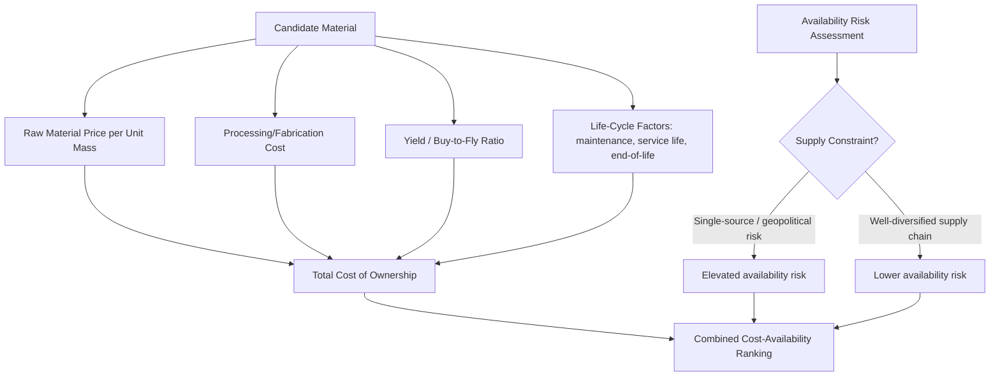

## Cost and Availability Considerations

### Fundamental Concept

Cost and availability considerations extend the materials selection methodology and performance-index framework covered earlier in this chapter beyond pure structural/technical performance, recognizing that a technically optimal material choice is only viable if it is affordable and reliably obtainable at the required volume, geometry, and schedule. In practice, cost and availability frequently function as hard constraints that eliminate technically superior candidates identified through property-chart-based screening, making this content a necessary companion to — not a replacement for — the performance-index selection approach already introduced.

$$\text{Total Material Cost} = \text{Material Cost} + \text{Processing Cost} + \text{Yield Losses} + \text{Life-Cycle Cost}$$

**Key Points**

- Raw material price alone is frequently a poor proxy for total cost of ownership; processing cost, achievable yield (fraction of purchased material actually incorporated into the final part), and life-cycle costs (maintenance, replacement, end-of-life) often dominate the total cost comparison between candidate materials.
- Availability risk is distinct from cost and must be assessed separately: a material may be affordable in small quantities but subject to severe supply constraints, price volatility, or single-source dependency at the production volumes required for a specific application.
- Cost-performance indices extend the Ashby performance-index framework directly, substituting material cost per unit mass (or per unit volume) for density in the standard index derivations, enabling systematic cost-driven material ranking using the same selection-line methodology already established.

### Cost-Modified Performance Indices

The performance index derivations introduced in the preceding chart-based selection content can be directly adapted for cost-minimization objectives by substituting cost per unit mass $C_m$ (or a combined cost-density term $C_m \rho$, representing cost per unit volume) for density in the index expression. For example, the mass-minimizing beam-in-bending index $E^{1/2}/\rho$ becomes, for cost minimization:

$$M_{cost} = \frac{E^{1/2}}{C_m \, \rho}$$

This substitution preserves the same systematic, mechanics-derived selection framework while shifting the objective from minimizing mass to minimizing material cost for the same structural function and constraint, and can be plotted analogously on a modulus vs. cost-per-unit-volume chart using the same selection-line technique.

### Components of Total Material Cost

#### Raw Material Price

The base purchase price per unit mass or volume, which for metals is influenced by alloying element content (particularly for elements subject to significant market price volatility, such as nickel, cobalt, and certain rare earth or specialty elements), processing route (primary vs. recycled/secondary metal), and market supply-demand conditions at time of purchase.

#### Processing and Fabrication Cost

The cost of converting raw material into the finished component form, which varies substantially by material class and processing route (casting vs. forging vs. machining vs. additive manufacturing) and can, for complex geometries or difficult-to-process materials (e.g., titanium's poor machinability), represent a larger fraction of total component cost than the raw material itself.

#### Yield and Material Utilization

The fraction of purchased raw material that ends up in the finished part, as opposed to scrap, machining chips, or trim waste. Materials with poor formability or requiring extensive machining from bar/billet stock (a low buy-to-fly ratio, particularly relevant in aerospace titanium and superalloy components) can have effective material costs substantially higher than the nominal raw material price suggests, since the purchaser pays for the full starting stock regardless of how much is ultimately retained in the finished part.

#### Life-Cycle and Total Cost of Ownership

Beyond initial material and processing cost, life-cycle considerations include maintenance requirements, expected service life and replacement frequency, and end-of-life/recycling value or cost — factors that can favor a higher initial-cost material offering substantially longer service life or lower maintenance burden, particularly relevant for corrosion-resistant alloy selection where a higher-cost, more corrosion-resistant material may reduce total lifetime cost despite higher upfront expense.

### Availability and Supply Risk Assessment

- **Criticality and geopolitical concentration**: Certain alloying elements (rare earth elements, cobalt, certain platinum-group metals) are geographically concentrated in production, creating supply risk distinct from pure price volatility — a material dependent on such elements may carry availability risk even when currently affordably priced
- **Single-source vs. diversified supply**: Reliance on a single supplier or a narrow supplier base for a specialty alloy or specific product form (certain specialty steel grades, particular superalloy compositions) creates schedule and continuity risk beyond simple cost considerations, particularly relevant for long-production-run applications requiring assured multi-year supply continuity
- **Lead time and production volume compatibility**: A material may be technically and economically suitable but have production lead times or minimum order quantities incompatible with a specific program's schedule or volume requirements, particularly relevant for lower-volume applications seeking access to specialty or recently developed alloy compositions
- **Price volatility and hedging considerations**: Materials with historically volatile pricing (driven by speculative commodity markets, geopolitical events, or concentrated production) introduce budget and program-cost uncertainty that may favor a more price-stable, even if nominally more expensive at any single point in time, alternative material
- **Recyclability and secondary material availability**: Availability of a material through recycled/secondary sources (scrap-based supply) can substantially affect both cost and primary-supply-risk exposure, particularly relevant for materials (aluminum, steel, copper) with well-established recycling infrastructure versus those without

### Application to Materials Science and Metallurgy

- **Alloying element cost sensitivity in alloy design**: Cost-modified performance indices directly inform alloy design trade-offs discussed in the data-driven alloy design content of the preceding chapter, where minimizing reliance on expensive or supply-constrained alloying elements (nickel, cobalt, certain rare earths) while maintaining target performance is an increasingly prominent design objective
- **Titanium and superalloy component cost management**: The buy-to-fly ratio consideration is particularly consequential for titanium aerospace structural components and nickel-superalloy turbine components, where poor machinability and complex geometry can make processing cost and material utilization the dominant total-cost factors, motivating near-net-shape processing routes (including additive manufacturing) specifically to improve material utilization
- **Recycled and secondary-source alloy substitution**: Evaluating whether recycled-content or secondary-source material can substitute for primary material in a given application, balancing potential cost savings against the compositional variability considerations noted in the data-driven alloy design content's discussion of tramp-element-robust alloy design
- **Corrosion-resistant alloy total-cost justification**: Applying life-cycle cost analysis to justify higher initial-cost, more corrosion-resistant alloy selection (e.g., stainless steel or nickel alloy vs. carbon steel with coating) based on reduced maintenance and extended service life, rather than initial material cost comparison alone
- **Critical materials and supply chain risk management**: Systematic availability risk assessment increasingly informs alloy and material selection for defense, aerospace, and other strategically important applications, where supply continuity assurance may outweigh marginal cost or even performance advantages of a supply-constrained alternative
- **Design for material efficiency**: Combining cost-performance indices with material utilization/yield considerations to favor structural designs and processing routes (including topology-optimized or additively manufactured geometries) that reduce total material consumption for a given structural performance requirement

**Example**

A design team comparing a nickel-based superalloy against an alternative, lower-nickel-content alloy for a turbine component applies a cost-modified performance index reflecting the structural function's governing constraint, finding that the lower-nickel alternative offers a favorable cost-performance index value despite somewhat lower absolute high-temperature strength. However, incorporating a buy-to-fly ratio analysis reveals that the lower-nickel alloy's poorer high-temperature formability results in a lower material utilization for the specific complex component geometry required, substantially narrowing the apparent cost advantage once processing and material waste are accounted for. A subsequent availability risk assessment further notes that the incumbent higher-nickel alloy draws on a more diversified, established supply chain, while the alternative alloy's specific composition currently depends on a more limited supplier base. [Inference] This combined analysis illustrates why raw-material cost comparison alone, even when correctly incorporated into a cost-modified performance index, is generally insufficient for a fully informed material substitution decision — processing cost, yield, and supply risk factors can individually be significant enough to reverse an apparent cost advantage identified from raw material pricing alone.

### Common Pitfalls in Cost and Availability Assessment

- **Comparing raw material price without processing and yield adjustment**: As emphasized above, nominal price-per-unit-mass comparisons can be substantially misleading for materials with significantly different processability, machinability, or achievable yield for a specific component geometry
- **Treating current market price as a stable long-term input**: Materials subject to significant price volatility require sensitivity analysis or scenario-based cost assessment rather than treating a single current price snapshot as representative of total program cost over a multi-year production run
- **Underestimating supply concentration risk for critical alloying elements**: Selection decisions based purely on current price and performance can overlook longer-term supply security concerns for elements with geographically concentrated production, a risk category that has received increasing attention in strategic materials selection practice
- **Neglecting life-cycle cost in favor of initial cost minimization**: Particularly for corrosion-prone or high-maintenance-burden applications, initial-cost-minimizing selection can produce a higher total-cost-of-ownership outcome than a more expensive, longer-lived or lower-maintenance alternative

[Unverified] Specific commodity price levels, supply concentration statistics, and criticality assessments for particular alloying elements change over time with market and geopolitical conditions; any cost or availability assessment intended to inform an actual selection decision should be based on current market data and supply chain analysis rather than static reference figures, since this domain is inherently time-sensitive in a way that structural mechanics-based performance indices are not.

### SVG: Total Cost of Ownership Components (svg_diagram)

<svg xmlns="http://www.w3.org/2000/svg" viewBox="0 0 640 300">
<rect x="0" y="0" width="640" height="300" fill="#ffffff" />
<text x="320" y="24" text-anchor="middle" font-size="16" font-weight="bold" fill="#111">Total Cost of Ownership (svg_diagram)</text>
<rect x="60" y="60" width="130" height="180" fill="#cfe8ff" fill-opacity="0.6" stroke="#2b6cb0" />
<text x="125" y="145" text-anchor="middle" font-size="11" fill="#1a4971">Raw</text>
<text x="125" y="160" text-anchor="middle" font-size="11" fill="#1a4971">Material</text>
<rect x="200" y="90" width="130" height="150" fill="#ffe0cc" fill-opacity="0.6" stroke="#c05621" />
<text x="265" y="160" text-anchor="middle" font-size="11" fill="#7c2d12">Processing</text>
<rect x="340" y="120" width="130" height="120" fill="#d6f5d6" fill-opacity="0.6" stroke="#2f855a" />
<text x="405" y="175" text-anchor="middle" font-size="11" fill="#22543d">Yield Loss</text>
<rect x="480" y="60" width="130" height="180" fill="#f5d6f0" fill-opacity="0.6" stroke="#b83280" />
<text x="545" y="140" text-anchor="middle" font-size="11" fill="#702459">Life-Cycle</text>
<text x="545" y="155" text-anchor="middle" font-size="11" fill="#702459">(maintenance,</text>
<text x="545" y="170" text-anchor="middle" font-size="11" fill="#702459">service life)</text>

<text x="320" y="270" text-anchor="middle" font-size="11" fill="#333">Total Cost of Ownership = sum of all components</text>

</svg>

**Related Topics**

- Materials Selection Methodologies and Ashby Charts and Performance Indices (technical foundation extended here)
- Data Driven Alloy Design (cost-aware composition optimization)
- Sustainable Materials and Life Cycle Assessment
- Additive manufacturing and near-net-shape processing for material utilization
- Critical materials and supply chain risk management
- Corrosion-resistant alloy selection and life-cycle cost justification