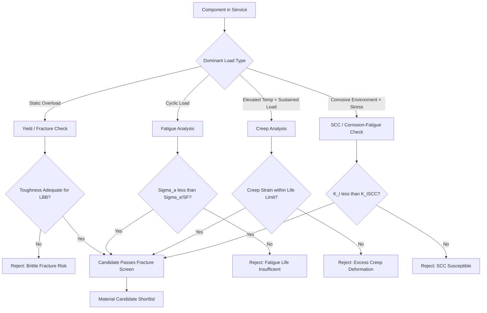

## Failure Driven Materials Selection

### Overview and Design Philosophy

Failure driven materials selection is a design methodology in which the anticipated failure mode of a component — rather than a generic strength or stiffness target — governs the choice of material, its processing route, and its geometry. Instead of asking "what material has the highest strength," the engineer asks "how will this component fail, and which material-process combination pushes that failure mode furthest away under the expected service conditions." This reframing is central to modern mechanical design because most engineering components do not fail by simple overload; they fail by fatigue, fracture, corrosion, wear, creep, or some interaction among these mechanisms.

The approach originated from post-failure forensic practice (failure analysis feeding back into design) and was formalized in materials selection frameworks such as Ashby's performance-index methodology, where material indices are derived directly from the governing failure equation rather than from generic property rankings.

### Core Principle: Failure Mode as the Selection Driver

**Key Points**

- Every component has a dominant failure mode (or a small set of competing modes) dictated by loading, environment, and geometry.
- Material selection criteria (the "merit index") must be derived from the physics of that specific failure mode, not from a generic ranking of strength, stiffness, or hardness.
- A material that is optimal for one failure mode may be poor for another; selection is therefore always conditional on the identified mode.
- Competing failure modes require selection on the mode with the lowest predicted margin of safety, or a compromise index balancing multiple modes.

### Step-by-Step Selection Methodology

The following sequence formalizes the failure-driven approach:

1. **Define function and constraints** — establish what the component must do (carry load, seal a fluid, transmit torque) and fixed constraints (geometry envelope, cost ceiling, regulatory requirements).
2. **Identify candidate failure modes** — enumerate plausible mechanisms: yield, fracture (brittle or ductile), fatigue (high-cycle or low-cycle), buckling, creep, wear, corrosion, stress corrosion cracking, or combined modes.
3. **Rank failure modes by likelihood and consequence** — use a risk matrix (probability × severity) to determine which mode is design-limiting.
4. **Derive the governing failure equation** for the dominant mode (e.g., fracture mechanics, S-N fatigue relation, Larson-Miller creep parameter).
5. **Extract the material performance index** from that equation by separating material properties from geometry/loading terms.
6. **Screen candidate materials** using the index via material selection charts (property vs. property, log-log axes).
7. **Apply secondary constraints** — cost, availability, manufacturability, environmental compatibility.
8. **Validate against secondary failure modes** to ensure the primary-mode-optimized material does not introduce a worse vulnerability elsewhere.
9. **Prototype and test** under conditions replicating the dominant failure mechanism (fatigue rigs, fracture toughness testing, accelerated corrosion testing).

### Deriving Material Indices from Failure Equations

This is the mathematical core of the methodology. The general procedure: write the failure criterion, isolate the free (design) variable, and substitute back into an objective function (commonly mass or cost) to expose the material grouping that should be maximized or minimized.

**Example — Stiffness-Limited Beam in Bending (Failure by Excessive Deflection)**

For a beam of given length $L$ and width $b$, with free variable depth $h$, deflection-limited design under fixed stiffness yields the mass-minimizing index:

$$M_1 = \frac{E^{1/2}}{\rho}$$

where $E$ is Young's modulus and $\rho$ is density. Materials are ranked by maximizing $M_1$.

**Example — Fracture-Limited Design (Failure by Fast Fracture)**

For a component containing a crack of length $a$ under stress $\sigma$, the Griffith/Irwin fracture criterion gives:

$$\sigma_f = \frac{K_{IC}}{Y\sqrt{\pi a}}$$

where $K_{IC}$ is fracture toughness and $Y$ is a geometric factor. For a mass-minimized, damage-tolerant design, the derived index becomes:

$$M_2 = \frac{K_{IC}}{\rho}$$

**Example — Fatigue-Limited Design (High-Cycle Fatigue)**

Using the Basquin relation for stress-life behavior:

$$\sigma_a = \sigma_f'(2N_f)^b$$

the endurance-limit-normalized index for a mass-constrained fatigue-critical part is:

$$M_3 = \frac{\sigma_e^{1/2}}{\rho}$$

where $\sigma_e$ is the endurance limit and $b$ is the fatigue strength exponent (typically $-0.05$ to $-0.12$ for structural metals). [Inference: the exact exponent used in $M_3$ depends on whether the design is stress-limited or stiffness-limited under cyclic load, and varies with the specific fatigue model adopted.]

**Example — Creep-Limited Design**

Using the Norton power-law creep relation:

$$\dot{\varepsilon} = A\sigma^n e^{-Q/RT}$$

the material index for minimum mass under a fixed creep-strain-rate constraint is derived by isolating $A$, $n$, and $Q$ (activation energy) as the material-dependent terms, favoring materials with high activation energy and low $A$ at the service temperature.

### Failure Mode Reference Table

| Failure Mode | Governing Parameter | Representative Equation | Material Index (mass-minimized) | Typical Material Response |
| --- | --- | --- | --- | --- |
| Yielding (overload) | Yield strength $\sigma_y$ | $\sigma = \sigma_y$ | $\sigma_y/\rho$ | Increase strength or cross-section |
| Fast fracture | Fracture toughness $K_{IC}$ | $\sigma_f = K_{IC}/(Y\sqrt{\pi a})$ | $K_{IC}/\rho$ | Ductile phases, controlled microstructure |
| Fatigue (HCF) | Endurance limit $\sigma_e$ | $\sigma_a = \sigma_f'(2N_f)^b$ | $\sigma_e^{1/2}/\rho$ | Surface treatment, inclusion control |
| Fatigue (LCF) | Fatigue ductility $\varepsilon_f'$ | Coffin-Manson relation | Ductility-weighted index | Ductile, low-defect materials |
| Buckling | Elastic modulus $E$ | $P_{cr} = \pi^2 EI/L^2$ | $E^{1/2}/\rho$ | Stiffness over strength |
| Creep | Activation energy $Q$, exponent $n$ | Norton power law | High $Q$, low $A$ | Solid-solution or precipitate strengthening |
| Wear | Hardness $H$ | Archard's equation | $H$ (often direct) | Surface hardening, coatings |
| Corrosion / SCC | Corrosion rate, $K_{ISCC}$ | Electrochemical/fracture-mechanics hybrid | Passivation resistance | Alloying for passive film stability |

### Case Study 1: Pressure Vessel — Leak-Before-Break vs. Fast Fracture

A classic failure-driven decision arises in pressure vessel design: should the material be selected to promote **leak-before-break (LBB)** behavior rather than simply maximizing strength?

**Analysis:**

For a through-wall crack of length $2a$ equal to wall thickness $t$, LBB is favored when:

$$a_{crit} = \frac{1}{\pi}\left(\frac{K_{IC}}{Y\sigma}\right)^2 > t$$

If the critical crack size exceeds wall thickness, the vessel leaks (detectable, safe) before it fractures catastrophically. This drives selection toward materials with high $K_{IC}/\sigma_y$ ratio (toughness-to-strength ratio) rather than materials with the highest absolute strength. High-strength, low-toughness steels (e.g., some quenched-and-tempered grades at high hardness) can violate LBB and are therefore rejected despite superior static strength — a direct illustration of failure mode overriding a generic property ranking.

### Case Study 2: Rotating Shaft — Fatigue-Dominated Selection

A power-transmission shaft subjected to combined bending and torsion typically fails by high-cycle fatigue initiating at stress concentrations (keyways, fillets, shoulders) rather than by static overload.

**Key Points**

- Static yield strength is a poor selection criterion; the governing parameter is the fatigue notch factor $K_f$ combined with endurance limit $\sigma_e$.
- Material selection favors alloys with high $\sigma_e/\sigma_y$ ratio, fine and homogeneous microstructure (fewer fatigue-initiating inclusions), and compatibility with surface treatments (nitriding, shot peening, carburizing) that induce compressive residual stress.
- Forged microstructures are frequently preferred over cast equivalents for fatigue-critical shafts because porosity and dendritic segregation in castings act as fatigue crack initiation sites.

### Case Study 3: Marine Fastener — Stress Corrosion Cracking

Fasteners in chloride-rich marine environments under sustained tensile stress are vulnerable to stress corrosion cracking (SCC), a synergistic mode combining static stress and environmental attack.

**Analysis:**

Selection must satisfy:

$$K_I < K_{ISCC}$$

where $K_{ISCC}$ is the threshold stress intensity for SCC, which for susceptible alloys (certain high-strength austenitic and precipitation-hardened stainless steels in chloride environments) can be an order of magnitude lower than $K_{IC}$ in air. [Unverified: exact $K_{ISCC}$ values are alloy-, temper-, and environment-specific and must be obtained from qualification testing rather than handbook generalization.] Duplex stainless steels or nickel-based alloys are often substituted specifically because SCC — not yield strength or general corrosion rate — is the design-limiting failure mode.

### Failure-Driven Selection Process Flow (svg_diagram)

<svg xmlns="http://www.w3.org/2000/svg" viewBox="0 0 900 620" font-family="Arial, sans-serif">
<text x="450" y="30" font-size="20" font-weight="bold" text-anchor="middle">Failure Driven Materials Selection Process (svg_diagram)</text>
<rect x="330" y="55" width="240" height="50" rx="8" fill="#dbe9f7" stroke="#2c5f8a" stroke-width="2" />
<text x="450" y="85" font-size="14" text-anchor="middle">Define Function &amp; Constraints</text>
<line x1="450" y1="105" x2="450" y2="130" stroke="#333" stroke-width="2" marker-end="url(#arrow)" />
<rect x="300" y="130" width="300" height="50" rx="8" fill="#dbe9f7" stroke="#2c5f8a" stroke-width="2" />
<text x="450" y="160" font-size="14" text-anchor="middle">Identify Candidate Failure Modes</text>
<line x1="450" y1="180" x2="450" y2="205" stroke="#333" stroke-width="2" marker-end="url(#arrow)" />
<rect x="280" y="205" width="340" height="50" rx="8" fill="#dbe9f7" stroke="#2c5f8a" stroke-width="2" />
<text x="450" y="235" font-size="14" text-anchor="middle">Rank by Probability × Consequence</text>
<line x1="450" y1="255" x2="450" y2="280" stroke="#333" stroke-width="2" marker-end="url(#arrow)" />
<rect x="250" y="280" width="400" height="50" rx="8" fill="#f7e7c1" stroke="#8a6d2c" stroke-width="2" />
<text x="450" y="310" font-size="14" text-anchor="middle">Derive Governing Failure Equation</text>
<line x1="450" y1="330" x2="450" y2="355" stroke="#333" stroke-width="2" marker-end="url(#arrow)" />
<rect x="250" y="355" width="400" height="50" rx="8" fill="#f7e7c1" stroke="#8a6d2c" stroke-width="2" />
<text x="450" y="385" font-size="14" text-anchor="middle">Extract Material Performance Index</text>
<line x1="450" y1="405" x2="450" y2="430" stroke="#333" stroke-width="2" marker-end="url(#arrow)" />
<rect x="270" y="430" width="360" height="50" rx="8" fill="#d7f0d3" stroke="#2c7a3d" stroke-width="2" />
<text x="450" y="460" font-size="14" text-anchor="middle">Screen Materials via Selection Charts</text>
<line x1="450" y1="480" x2="450" y2="505" stroke="#333" stroke-width="2" marker-end="url(#arrow)" />
<rect x="220" y="505" width="460" height="50" rx="8" fill="#d7f0d3" stroke="#2c7a3d" stroke-width="2" />
<text x="450" y="535" font-size="14" text-anchor="middle">Apply Secondary Constraints (cost, mfg, availability)</text>
<line x1="450" y1="555" x2="450" y2="580" stroke="#333" stroke-width="2" marker-end="url(#arrow)" />
<rect x="300" y="580" width="300" height="40" rx="8" fill="#f0d3d3" stroke="#8a2c2c" stroke-width="2" />
<text x="450" y="605" font-size="14" text-anchor="middle">Validate: Prototype &amp; Failure Testing</text>
</svg>

### Competing Failure Mode Interaction Diagram

### Common Pitfalls in Failure-Driven Selection

- **Selecting on static properties alone** — choosing by tensile strength or hardness when the dominant mode is fatigue, creep, or SCC leads to systematic under-design.
- **Ignoring mode interaction** — corrosion-fatigue and creep-fatigue interactions can reduce life far below single-mode predictions; treating modes independently is a frequent source of premature failure.
- **Neglecting scale effects** — fracture toughness and fatigue data from small laboratory specimens may not transfer directly to thick-section components (constraint effects, plane-strain vs. plane-stress transitions).
- **Overlooking manufacturing-induced defects** — porosity, inclusions, and residual stresses from processing can shift the effective failure mode away from the one predicted from idealized material properties.
- **Static safety factor substitution** — applying a single blanket safety factor without identifying which failure mode it is meant to cover.

### Relationship to Concurrent Engineering and Standards

Failure-driven selection is embedded in industry frameworks such as ASME Boiler and Pressure Vessel Code (fracture and fatigue provisions), API 579/ASME FFS-1 (fitness-for-service), and aerospace damage-tolerance design (e.g., MIL-STD-1530, FAA damage tolerance requirements), all of which mandate that material and inspection intervals be selected relative to a defined, analyzable failure mode rather than a generic strength margin.

**Related Topics**

- Ashby Material Selection Charts and Performance Indices
- Fracture Mechanics: Linear Elastic vs. Elastic-Plastic (LEFM vs. EPFM)
- S-N and Strain-Life (Coffin-Manson) Fatigue Approaches
- Damage Tolerance and Fail-Safe Design Philosophy
- Creep-Rupture Life Prediction (Larson-Miller Parameter)
- Stress Corrosion Cracking Mechanisms and Threshold Testing
- Root Cause Failure Analysis Methodology
- Fitness-for-Service Assessment (API 579 / ASME FFS-1)