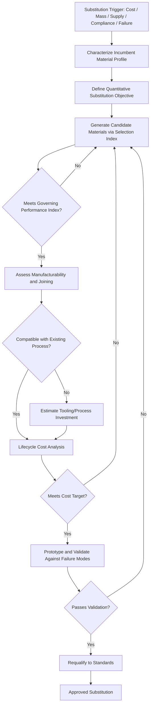

## Materials Substitution Strategies

### Overview and Rationale

Materials substitution is the deliberate replacement of an incumbent material in a component or system with an alternative material to achieve superior performance, lower cost, reduced mass, improved sustainability, supply chain resilience, or regulatory compliance. Substitution is rarely a simple property-for-property swap; it requires re-evaluating the entire design envelope, since a change in material typically necessitates changes in geometry, joining methods, tolerances, and manufacturing process. Substitution decisions sit at the intersection of materials science, mechanical design, economics, and supply chain risk management.

### Drivers of Materials Substitution

**Key Points**

- **Performance improvement** — higher specific strength, specific stiffness, fatigue resistance, temperature capability, or wear resistance than the incumbent.
- **Mass reduction** — particularly in transportation (automotive, aerospace) where mass directly affects fuel/energy consumption and payload.
- **Cost reduction** — raw material cost, processing cost, or total lifecycle cost (including maintenance and replacement).
- **Supply chain risk mitigation** — reducing dependence on materials with geopolitically concentrated supply (e.g., certain rare earth elements, cobalt, specific superalloy constituents).
- **Regulatory and environmental compliance** — elimination of restricted substances (e.g., REACH, RoHS directives), reduction of embodied carbon, improved recyclability.
- **Obsolescence and availability** — original material discontinued, no longer manufactured, or subject to export controls.
- **Failure feedback** — field failures revealing the incumbent material is inadequate for actual service conditions (see failure-driven selection).

### Categories of Substitution

| Category | Description | Representative Example |
| --- | --- | --- |
| Direct (drop-in) substitution | New material occupies identical geometry, no redesign | Replacing one aluminum alloy grade with another of similar temper |
| Geometry-adapted substitution | Material changes; component redesigned to compensate for differing properties | Steel-to-aluminum panel redesign requiring increased thickness |
| Architecture substitution | Fundamental change in load path or structural concept | Monocoque composite replacing steel space-frame |
| Process-driven substitution | Material change enabled by new manufacturing process | Investment-cast superalloy replacing forged/machined part |
| Hybrid/multi-material substitution | Incumbent single material replaced by a multi-material or composite system | Steel replaced by carbon-fiber-reinforced polymer with local metallic inserts |

### Substitution Evaluation Framework

A structured substitution decision generally follows these stages:

1. **Characterize incumbent material performance** — establish the full property and failure-mode profile of the material being replaced, including in-service history and known failure modes.
2. **Define substitution objective** — mass reduction target, cost ceiling, performance floor, or compliance requirement, expressed quantitatively.
3. **Generate candidate material set** — using material selection charts (Ashby-type) or databases, filtered by the same governing failure mode and performance index used in original selection.
4. **Normalize comparison using performance indices** — compare candidates using the same merit index (e.g., $E^{1/2}/\rho$ for stiffness-limited bending) rather than raw property values, since raw properties are only meaningful relative to the governing constraint.
5. **Assess manufacturability and joining compatibility** — a substitute material is only viable if it can be processed and joined within existing or acceptable new capital investment.
6. **Perform lifecycle cost analysis** — include raw material, processing, tooling changes, qualification/certification cost, and projected service life.
7. **Validate via testing** — physical prototyping and testing against the original design's critical failure modes (not just generic property verification).
8. **Requalify to applicable standards** — especially in regulated sectors (aerospace, pressure equipment, medical devices) where substitution can trigger full requalification.

### Quantitative Substitution Metrics

**Mass Reduction Potential (Stiffness-Limited Case)**

For a component redesigned to retain equivalent bending stiffness, the mass ratio between substitute and incumbent material is:

$$\frac{m_{sub}}{m_{inc}} = \frac{\rho_{sub}}{\rho_{inc}} \left(\frac{E_{inc}}{E_{sub}}\right)^{1/2}$$

A substitute is mass-favorable when this ratio is less than 1, meaning the combined effect of density reduction outweighs any stiffness penalty (or is amplified by a stiffness gain).

**Cost-Performance Trade-off**

A common screening metric is cost per unit performance:

$$C_p = \frac{C_m \cdot \rho}{X}$$

where $C_m$ is material cost per unit mass, $\rho$ is density, and $X$ is the governing property (e.g., yield strength, $E^{1/2}$, or $K_{IC}$ depending on the failure mode). Lower $C_p$ indicates more cost-efficient performance delivery.

**Example — Steel-to-Aluminum Substitution in an Automotive Panel**

Given: incumbent mild steel ($\rho = 7850\ \text{kg/m}^3$, $E = 200\ \text{GPa}$), candidate aluminum alloy 5182 ($\rho = 2660\ \text{kg/m}^3$, $E = 70\ \text{GPa}$), stiffness-limited bending panel.

$$\frac{m_{Al}}{m_{steel}} = \frac{2660}{7850}\left(\frac{200}{70}\right)^{1/2} \approx 0.339 \times 1.69 \approx 0.573$$

This indicates approximately 43% mass reduction is achievable for equivalent bending stiffness, before accounting for joining, corrosion protection, and cost adjustments. [Inference: this calculation assumes pure stiffness-limited redesign with unconstrained thickness increase; in practice, packaging constraints, denting resistance, and crash performance requirements often limit the achievable thickness increase.]

### Case Study 1: Automotive Lightweighting — Steel to Advanced High-Strength Steel (AHSS) or Aluminum

Automotive body-in-white design has undergone extensive substitution driven by fuel economy and emissions regulation.

**Key Points**

- Direct steel-to-aluminum substitution often fails economically for high-volume vehicles because of higher raw material cost and different joining requirements (self-piercing rivets, structural adhesives vs. resistance spot welding).
- Advanced/Ultra-High-Strength Steels (AHSS/UHSS, e.g., dual-phase, TRIP, martensitic grades) frequently substitute for mild steel using the same joining infrastructure, achieving mass reduction through gauge-down (thinner sections) enabled by higher yield strength, without a wholesale process change.
- Multi-material substitution (steel space-frame + aluminum closures + composite hood) is increasingly used to place each material where its performance index is locally optimal — a spatially differentiated substitution strategy rather than a single global swap.

### Case Study 2: Aerospace — Titanium and Composite Substitution for Aluminum

In aerospace structures, substitution has progressed from aluminum-dominant to mixed titanium/composite architectures.

**Analysis:**

Carbon-fiber-reinforced polymer (CFRP) substitution for aluminum in fuselage and wing structures is driven by specific stiffness ($E/\rho$) and fatigue resistance, since CFRP does not exhibit a classical fatigue limit degradation mechanism identical to aluminum and offers superior corrosion resistance. However, substitution required parallel development of:

- Lightning-strike protection (CFRP is far less conductive than aluminum)
- Galvanic corrosion mitigation at CFRP-titanium or CFRP-aluminum joints (titanium is preferred over aluminum fasteners/fittings adjacent to CFRP due to reduced galvanic potential difference)
- New non-destructive inspection methods (ultrasonic C-scan replacing simple visual/dye-penetrant crack detection used for metallic structures)

This illustrates that materials substitution frequently cascades into substitution or redesign of adjacent systems (fasteners, protective coatings, inspection protocols), not just the primary structural material.

### Case Study 3: Electronics — Lead-Free Solder Substitution

Regulatory-driven substitution (RoHS directive) forced replacement of tin-lead (Sn-Pb) eutectic solder with lead-free alternatives (commonly SAC alloys: Sn-Ag-Cu).

**Key Points**

- The substitution was compliance-driven rather than performance-driven, requiring the industry to accept a generally inferior processing window (higher melting point, ~217°C vs. ~183°C for eutectic Sn-Pb) as a trade-off for regulatory compliance.
- Higher reflow temperatures required substitution-cascading changes to printed circuit board substrate materials and component packaging to withstand increased thermal exposure.
- Tin whisker growth, largely suppressed by lead in the prior alloy, emerged as a new failure mode requiring mitigation strategies (conformal coating, matte tin finishes, annealing) — a case where substitution introduced a previously negligible failure mode.

### Substitution Risk Assessment Matrix

| Risk Category | Example Risk | Mitigation Approach |
| --- | --- | --- |
| Mechanical performance gap | Lower fatigue limit in substitute | Redesign geometry, local reinforcement |
| Joining incompatibility | Galvanic corrosion at dissimilar-metal joints | Isolation coatings, compatible fastener selection |
| Process incompatibility | Substitute requires different forming temperature/pressure | Tooling and process requalification |
| Supply chain risk transfer | New material has its own concentrated supply base | Diversify supplier base, maintain dual-sourcing |
| Regulatory/certification | Substitution invalidates prior qualification | Full requalification testing plan |
| Unanticipated failure mode | New mode not present in incumbent (e.g., whisker growth) | Extended reliability testing under service-representative conditions |

### Materials Substitution Decision Flow

### Substitution Trade-off Space (svg_diagram)

<svg xmlns="http://www.w3.org/2000/svg" viewBox="0 0 800 500" font-family="Arial, sans-serif">
<text x="400" y="28" font-size="18" font-weight="bold" text-anchor="middle">Cost vs. Specific Performance Substitution Map (svg_diagram)</text>
<line x1="80" y1="440" x2="750" y2="440" stroke="#333" stroke-width="2" />
<line x1="80" y1="440" x2="80" y2="60" stroke="#333" stroke-width="2" />
<text x="415" y="475" font-size="14" text-anchor="middle">Relative Cost per Unit Performance (Cp)</text>
<text x="30" y="250" font-size="14" text-anchor="middle" transform="rotate(-90 30 250)">Specific Performance (X/ρ)</text>
<circle cx="180" cy="380" r="10" fill="#7a7a7a" />
<text x="180" y="400" font-size="12" text-anchor="middle">Mild Steel (incumbent)</text>
<circle cx="300" cy="220" r="10" fill="#2c7a3d" />
<text x="300" y="205" font-size="12" text-anchor="middle">AHSS</text>
<circle cx="500" cy="150" r="10" fill="#2c5f8a" />
<text x="500" y="135" font-size="12" text-anchor="middle">Aluminum Alloy</text>
<circle cx="650" cy="90" r="10" fill="#8a2c2c" />
<text x="650" y="75" font-size="12" text-anchor="middle">CFRP</text>
<circle cx="230" cy="310" r="10" fill="#c98a2c" />
<text x="230" y="330" font-size="12" text-anchor="middle">Titanium Alloy</text>
<path d="M180,380 Q400,300 650,90" stroke="#999" stroke-width="1.5" fill="none" stroke-dasharray="4,3" />
<text x="480" y="230" font-size="11" fill="#666">Increasing substitution attractiveness →</text>
</svg>

### Common Pitfalls in Substitution Programs

- **Comparing raw properties instead of performance indices** — evaluating candidates on strength or stiffness alone rather than the mass/cost-normalized index appropriate to the governing constraint leads to incorrect ranking.
- **Underestimating joining and interface redesign cost** — joining technology change is frequently the largest hidden cost in a substitution program.
- **Ignoring galvanic and thermal expansion mismatch** — dissimilar-material substitution can introduce corrosion or thermal-cycling fatigue not present in the original single-material design.
- **Incomplete requalification scope** — substituting a material in a certified assembly (aerospace, medical, pressure equipment) without triggering the full applicable requalification testing matrix.
- **Static substitution analysis** — treating the substitution decision as fixed at a point in time rather than revisiting it as candidate material costs, supply availability, and processing technology evolve.

### Standards and Frameworks Supporting Substitution Decisions

Materials substitution in regulated industries is guided by frameworks including ASTM material equivalency standards, SAE AMS specifications (aerospace material substitution documentation), IEC 62474 (material declaration for electronics), and REACH/RoHS compliance documentation, all of which require formal traceability between the incumbent and substitute material's qualified property set.

**Related Topics**

- Ashby Material Selection Charts and Performance Indices
- Failure Driven Materials Selection
- Lifecycle Assessment (LCA) and Embodied Carbon in Material Choice
- Dissimilar Material Joining and Galvanic Corrosion Control
- Multi-Material and Hybrid Structural Design
- Supply Chain Risk Assessment for Critical Materials
- Qualification and Certification Requirements in Regulated Industries