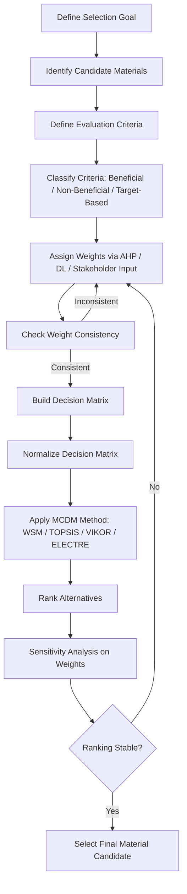

## Multi Criteria Decision Making in Materials Selection

### Overview and Motivation

Multi-criteria decision making (MCDM) is a family of quantitative methodologies used to select the best material candidate when several, often conflicting, criteria must be evaluated simultaneously — such as strength, cost, density, corrosion resistance, environmental impact, and manufacturability. Unlike single-index approaches (as used in failure-driven selection), real engineering decisions rarely reduce to optimizing one performance index alone; MCDM provides a structured, defensible, and traceable process for weighing trade-offs and producing a ranked shortlist of candidates.

MCDM methods are essential where stakeholders have differing priorities (e.g., design engineering prioritizing strength, procurement prioritizing cost, sustainability teams prioritizing embodied carbon), and where no single material dominates all criteria simultaneously (a common situation known as a Pareto-optimal trade-off set).

### Core Concepts

**Key Points**

- **Criteria (attributes)** — the properties or characteristics being evaluated (e.g., yield strength, density, cost, recyclability).
- **Alternatives** — the candidate materials under consideration.
- **Weights** — the relative importance assigned to each criterion, reflecting stakeholder priorities.
- **Decision matrix** — a table of alternatives (rows) versus criteria (columns), populated with raw performance values.
- **Normalization** — converting criteria with different units and scales (GPa, kg/m³, USD/kg) into a common dimensionless scale for comparison.
- **Beneficial vs. non-beneficial criteria** — criteria where higher values are better (e.g., strength) versus criteria where lower values are better (e.g., cost, density for mass-critical design).
- **Pareto optimality** — a candidate is Pareto-optimal if no other candidate is better in every criterion simultaneously; MCDM methods rank within this trade-off frontier.

### Common MCDM Methods in Materials Selection

| Method | Core Mechanism | Typical Use Case |
| --- | --- | --- |
| Weighted Sum Model (WSM) | Linear weighted aggregation of normalized scores | Simple, transparent screening with independent criteria |
| Weighted Product Model (WPM) | Multiplicative aggregation using weighted exponents | Reduces unit sensitivity, penalizes poor performance in any criterion |
| TOPSIS | Ranks by geometric distance from ideal and anti-ideal solutions | Widely used; robust to conflicting criteria |
| AHP (Analytic Hierarchy Process) | Pairwise comparison to derive weights and consistency-checked rankings | Structuring subjective/expert judgment into consistent weights |
| ELECTRE | Outranking relations based on concordance/discordance | Handling non-compensatory criteria (a poor score in one criterion cannot be offset) |
| VIKOR | Compromise ranking balancing group utility and individual regret | Conflicting criteria with a need for compromise solutions |
| Digital Logic (DL) Method | Binary pairwise comparisons converted to weights | Simplified weighting for materials selection specifically (Ashby-Farag approach) |
| Grey Relational Analysis | Measures similarity to an ideal reference sequence | Selection under limited or uncertain data |

### Weighted Sum Model — Formulation and Example

**Formulation:**

$$S_i = \sum_{j=1}^{n} w_j \cdot r_{ij}$$

where $S_i$ is the overall score of alternative $i$, $w_j$ is the weight of criterion $j$ (with $\sum w_j = 1$), and $r_{ij}$ is the normalized value of alternative $i$ on criterion $j$.

**Normalization (beneficial criterion):**

$$r_{ij} = \frac{x_{ij}}{x_j^{max}}$$

**Normalization (non-beneficial criterion, e.g., cost):**

$$r_{ij} = \frac{x_j^{min}}{x_{ij}}$$

**Worked Example — Selecting a Structural Bracket Material**

Candidates: Aluminum 6061-T6, Mild Steel, Titanium Ti-6Al-4V, CFRP. Criteria: specific strength (beneficial), cost per kg (non-beneficial), corrosion resistance rating 1–5 (beneficial). Assume weights: strength $w_1 = 0.5$, cost $w_2 = 0.3$, corrosion $w_3 = 0.2$.

| Material | Specific Strength (norm.) | Cost (norm., inverted) | Corrosion Rating (norm.) | Weighted Score |
| --- | --- | --- | --- | --- |
| Al 6061-T6 | 0.65 | 0.70 | 0.80 | $0.5(0.65)+0.3(0.70)+0.2(0.80) = 0.695$ |
| Mild Steel | 0.40 | 1.00 | 0.40 | $0.5(0.40)+0.3(1.00)+0.2(0.40) = 0.580$ |
| Ti-6Al-4V | 0.85 | 0.25 | 1.00 | $0.5(0.85)+0.3(0.25)+0.2(1.00) = 0.700$ |
| CFRP | 1.00 | 0.20 | 1.00 | $0.5(1.00)+0.3(0.20)+0.2(1.00) = 0.760$ |

Under this weighting, CFRP ranks highest, followed closely by titanium. [Inference: this ranking is entirely sensitive to the assumed weights; a procurement-dominated weighting (e.g., $w_2 = 0.6$) would likely favor aluminum or steel instead, illustrating why sensitivity analysis is a mandatory step, not optional.]

### TOPSIS Method — Procedure

TOPSIS (Technique for Order Preference by Similarity to Ideal Solution) is one of the most widely applied MCDM methods in materials engineering literature due to its robustness and intuitive geometric basis.

1. Construct the normalized decision matrix using vector normalization:

   $$r_{ij} = \frac{x_{ij}}{\sqrt{\sum_{i=1}^{m} x_{ij}^2}}$$
2. Construct the weighted normalized matrix: $v_{ij} = w_j \cdot r_{ij}$
3. Determine the positive ideal solution $A^+$ (best value per criterion) and negative ideal solution $A^-$ (worst value per criterion).
4. Compute Euclidean distance of each alternative from $A^+$ and $A^-$:

   $$D_i^+ = \sqrt{\sum_j (v_{ij} - v_j^+)^2}, \quad D_i^- = \sqrt{\sum_j (v_{ij} - v_j^-)^2}$$
5. Compute the relative closeness coefficient:

   $$C_i = \frac{D_i^-}{D_i^+ + D_i^-}$$
6. Rank alternatives by descending $C_i$ (closer to 1 is better).

TOPSIS is favored over WSM in many published materials selection studies because it simultaneously accounts for distance from the best-case and worst-case outcomes, reducing the risk that a candidate excelling in one dominant criterion masks poor performance elsewhere.

### Analytic Hierarchy Process (AHP) — Weight Derivation

AHP is frequently used not as a standalone ranking method but as a preceding step to derive objective, consistency-checked weights ($w_j$) for use in WSM or TOPSIS.

**Procedure:**

1. Structure the decision as a hierarchy: goal → criteria → alternatives.
2. Perform pairwise comparisons of criteria using Saaty's 1–9 intensity scale (1 = equal importance, 9 = extreme importance).
3. Build the pairwise comparison matrix $A$, where $a_{ij}$ represents the relative importance of criterion $i$ over $j$.
4. Compute the principal eigenvector of $A$ to derive normalized weights.
5. Calculate the Consistency Ratio (CR):

   $$CR = \frac{CI}{RI}, \quad CI = \frac{\lambda_{max} - n}{n - 1}$$

   where $\lambda_{max}$ is the principal eigenvalue, $n$ is the matrix size, and $RI$ is a random consistency index tabulated for matrix size $n$.
6. Accept the weights only if $CR < 0.10$; otherwise, pairwise judgments must be revised.

This consistency check is a distinguishing strength of AHP: it provides a quantitative flag when a decision-maker's judgments are logically contradictory (e.g., rating A over B, B over C, but C over A).

### Digital Logic Method (Materials-Specific Weighting)

The Digital Logic (DL) method, developed specifically within materials selection literature (Ashby-Farag), simplifies weight derivation to binary pairwise decisions.

**Procedure:**

- For $n$ criteria, perform $N = n(n-1)/2$ pairwise comparisons.
- For each pair, assign 1 to the more important criterion and 0 to the less important (no partial scores).
- Weight of criterion $j$: 

  $$w_j = \frac{m_j}{N}$$

  where $m_j$ is the number of times criterion $j$ was selected as more important across all comparisons.

This method is popular in introductory materials selection courses due to its simplicity, though it offers less resolution than AHP's continuous 1–9 scale and lacks a built-in consistency check.

### Sensitivity Analysis in MCDM

**Key Points**

- Because weights often reflect subjective judgment, final rankings must be tested for sensitivity to weight variation.
- A common technique is to systematically perturb one weight while proportionally redistributing the others, then observe whether the top-ranked candidate changes.
- Candidates whose ranking is stable across a wide range of plausible weight sets are considered robust selections; candidates that rank first only under narrow weight assumptions warrant caution.
- Sensitivity analysis is particularly critical when MCDM output feeds into high-consequence decisions (aerospace, medical implants, pressure equipment).

### Case Study: Selecting a Biomedical Implant Material Using TOPSIS

Candidate materials for an orthopedic implant — Ti-6Al-4V, CoCrMo alloy, 316L stainless steel, PEEK (polyetheretherketone) — are evaluated against criteria: fatigue strength, elastic modulus match to bone (lower mismatch preferred, reducing stress shielding), biocompatibility rating, and cost.

**Analysis:**

Elastic modulus match is treated as a non-monotonic criterion (neither maximum nor minimum modulus is ideal; proximity to cortical bone modulus, approximately 15–20 GPa, is optimal), requiring a modified normalization step relative to a target value rather than a simple max/min normalization. This is a common complication in materials MCDM: not all criteria are monotonic, and the normalization scheme must be adapted accordingly (target-based normalization rather than benefit/cost normalization). Applying TOPSIS under this adapted scheme typically favors titanium alloys over CoCrMo or stainless steel specifically due to modulus proximity to bone despite CoCrMo's higher wear resistance, illustrating how MCDM output depends critically on correctly modeling each criterion's directionality. [Inference: exact ranking outcomes are application- and weighting-specific; this example illustrates method mechanics rather than a universal implant material recommendation.]

### MCDM Process Flow

### TOPSIS Geometric Concept (svg_diagram)

<svg xmlns="http://www.w3.org/2000/svg" viewBox="0 0 700 500" font-family="Arial, sans-serif">
<text x="350" y="28" font-size="18" font-weight="bold" text-anchor="middle">TOPSIS Distance-to-Ideal Concept (svg_diagram)</text>
<line x1="80" y1="440" x2="620" y2="440" stroke="#333" stroke-width="2" />
<line x1="80" y1="440" x2="80" y2="60" stroke="#333" stroke-width="2" />
<text x="350" y="475" font-size="13" text-anchor="middle">Criterion 1 (e.g., Strength, weighted)</text>
<text x="30" y="250" font-size="13" text-anchor="middle" transform="rotate(-90 30 250)">Criterion 2 (e.g., Cost-inverted, weighted)</text>
<circle cx="560" cy="100" r="9" fill="#2c7a3d" />
<text x="560" y="85" font-size="12" text-anchor="middle">A+ (Ideal)</text>
<circle cx="140" cy="400" r="9" fill="#8a2c2c" />
<text x="140" y="420" font-size="12" text-anchor="middle">A- (Anti-ideal)</text>
<circle cx="420" cy="200" r="9" fill="#2c5f8a" />
<text x="420" y="185" font-size="12" text-anchor="middle">Candidate X</text>
<line x1="420" y1="200" x2="560" y2="100" stroke="#2c5f8a" stroke-width="1.5" stroke-dasharray="4,3" />
<line x1="420" y1="200" x2="140" y2="400" stroke="#2c5f8a" stroke-width="1.5" stroke-dasharray="4,3" />
<circle cx="300" cy="300" r="9" fill="#c98a2c" />
<text x="300" y="320" font-size="12" text-anchor="middle">Candidate Y</text>
<line x1="300" y1="300" x2="560" y2="100" stroke="#c98a2c" stroke-width="1.5" stroke-dasharray="4,3" />
<line x1="300" y1="300" x2="140" y2="400" stroke="#c98a2c" stroke-width="1.5" stroke-dasharray="4,3" />

<text x="350" y="60" font-size="11" fill="#555">D+ and D- distances determine closeness coefficient Ci</text>

</svg>

### Common Pitfalls in MCDM-Based Materials Selection

- **Improper normalization of non-monotonic criteria** — applying simple max/min normalization to target-based criteria (e.g., thermal expansion match, modulus match) produces misleading rankings.
- **Weight assignment without stakeholder consensus** — weights derived unilaterally by one discipline (e.g., only cost-driven procurement input) can produce selections that fail downstream engineering requirements.
- **Skipping consistency checks in AHP** — accepting pairwise judgment matrices with high inconsistency ratios undermines the validity of derived weights.
- **Treating MCDM output as final rather than advisory** — MCDM ranks candidates for further engineering evaluation and testing; it does not replace physical validation against governing failure modes.
- **Compensatory bias in additive methods (WSM)** — a candidate can score well overall while being critically deficient in one non-negotiable criterion (e.g., corrosion resistance in a marine application), which additive weighting can mask; non-compensatory methods (ELECTRE) or minimum-threshold screening should be applied first for hard constraints.
- **Ignoring correlation between criteria** — some criteria (e.g., strength and cost) are often correlated; naive weighting can implicitly double-count related effects.

### Software and Implementation Notes

MCDM methods are commonly implemented in spreadsheet tools (Excel with matrix formulas), dedicated materials selection software (CES EduPack/Granta Selector, which integrates Ashby charts with limit-stage and ranking-stage MCDM), and general-purpose decision-analysis software (Expert Choice for AHP). [Unverified: specific feature sets and version capabilities of proprietary software change over time and should be confirmed against current vendor documentation rather than assumed from general familiarity.]

**Related Topics**

- Ashby Material Selection Charts and Performance Indices
- Failure Driven Materials Selection
- Materials Substitution Strategies
- Analytic Hierarchy Process: Advanced Pairwise Consistency Methods
- Life Cycle Assessment as an MCDM Criterion
- Pareto Optimization and Trade-off Frontier Analysis
- Uncertainty and Sensitivity Analysis in Engineering Decision-Making