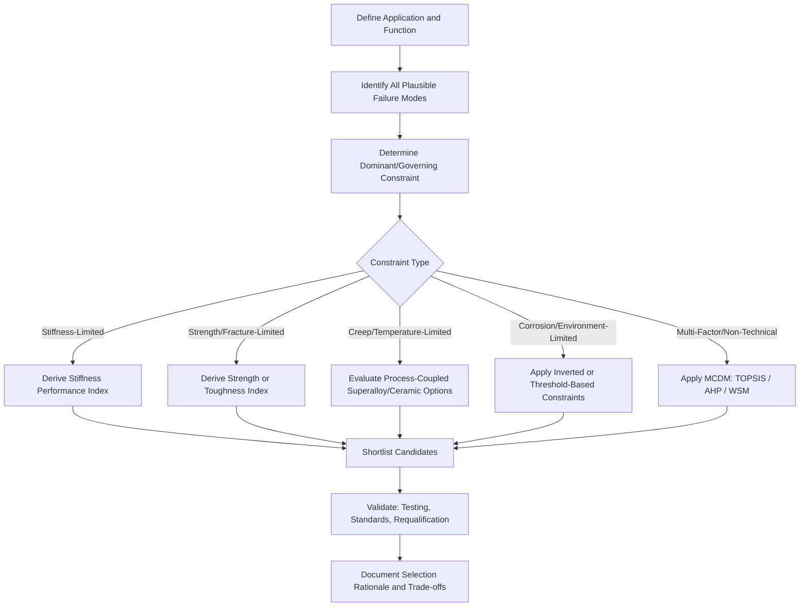

## Case Studies in Materials Selection

### Overview

This reference compiles a set of representative case studies illustrating how materials selection methodology — governing failure mode identification, performance index derivation, substitution evaluation, and multi-criteria decision making — is applied to real engineering problems across sectors. Each case study follows a consistent structure: problem definition, governing constraint, candidate evaluation, selected material, and lessons learned. Together they demonstrate that materials selection is rarely determined by a single property but by the interaction of function, constraint, objective, and free variable specific to each application.

### Case Study 1: Bicycle Frame — Stiffness-Limited, Mass-Minimized Design

**Problem:** Select a material for a bicycle frame tube where the primary requirement is bending stiffness at minimum mass, with a secondary constraint on cost for a consumer product tier.

**Governing Constraint:** Elastic deflection under rider-induced bending load must remain below a threshold; the tube outer diameter is constrained by ergonomics and aerodynamics, with wall thickness as the free variable.

**Performance Index:** For a stiffness-limited tube of fixed outer radius with wall thickness as the free variable:

$$M = \frac{E^{1/3}}{\rho}$$

(derived from the second moment of area of a thin-walled tube, distinct from the solid-beam index because radius, not just thickness, is constrained).

**Candidates Evaluated:** Steel (4130 chromoly), Aluminum 6061-T6/7005, Titanium 3Al-2.5V, CFRP.

**Outcome:** CFRP typically ranks highest on the stiffness-to-mass index due to high specific modulus along the fiber direction, but final selection depends heavily on the secondary cost constraint and manufacturing volume — aluminum alloys frequently dominate the mid-price consumer segment because tube-drawing and welding infrastructure is far cheaper than composite layup and curing, while steel persists in the value and touring segments due to low cost, weldability, and fatigue-tolerant failure behavior (steel frames tend to show visible deformation before fracture, an application-relevant secondary consideration beyond the primary stiffness index).

**Lesson:** The theoretically optimal material by performance index (CFRP) is not universally selected because manufacturing cost and production volume are binding secondary constraints that segment the market into distinct optimal material zones.

### Case Study 2: Gas Turbine Blade — Creep and Temperature-Limited Design

**Problem:** Select a material for a first-stage turbine blade operating at high temperature (approaching 950–1100°C at the blade surface, with internal cooling) under centrifugal and thermal stress.

**Governing Constraint:** Creep-rupture life at service temperature and stress, combined with high-cycle and thermomechanical fatigue resistance, and resistance to hot corrosion/oxidation.

**Candidates Evaluated:** Wrought nickel-based superalloys, directionally solidified (DS) superalloys, single-crystal (SX) superalloys, ceramic matrix composites (CMC, emerging).

**Analysis:** Wrought polycrystalline superalloys are progressively eliminated as service temperature rises because grain boundaries act as preferential creep and crack initiation sites transverse to the primary centrifugal stress axis. Directionally solidified superalloys eliminate transverse grain boundaries, and single-crystal superalloys eliminate grain boundaries entirely, each step raising the usable temperature closer to the alloy's incipient melting point while also enabling reduced-cobalt/chromium compositions optimized purely for creep resistance since grain-boundary-strengthening elements are no longer required. This is a case where the governing failure mode (creep) directly dictated not just alloy selection but the solidification/casting process itself.

**Outcome:** Single-crystal nickel-based superalloys (e.g., CMSX-series compositions) with thermal barrier coatings and internal cooling channels are standard for the highest-temperature first-stage blades; ceramic matrix composites represent an emerging substitution candidate for further temperature capability increase, constrained currently by fracture toughness and cost. [Unverified: current CMC adoption rates and specific engine programs using CMC blades vs. vanes change with ongoing qualification programs and should be checked against current OEM disclosures rather than assumed static.]

**Lesson:** When the governing failure mode is highly temperature-sensitive, materials selection cannot be separated from process selection (casting method) and system design (cooling architecture, coatings) — the "material" delivered to service is effectively a coupled material-process-coating system.

### Case Study 3: Surgical Bone Plate — Corrosion, Fatigue, and Biocompatibility

**Problem:** Select a material for an internal fixation bone plate subjected to cyclic physiological loading in a corrosive (chloride-rich, protein-containing) bodily environment over an extended implantation period.

**Governing Constraints:** Fatigue strength under cyclic loading in a corrosive environment (corrosion-fatigue, generally more severe than either mechanism alone), biocompatibility, and, for temporary fixation devices, a modulus not excessively higher than cortical bone (to limit stress shielding).

**Candidates Evaluated:** 316L stainless steel, Ti-6Al-4V, CoCrMo alloy.

**Analysis:** Applying multi-criteria decision making across corrosion-fatigue strength, modulus mismatch, and biocompatibility typically favors titanium alloys for long-term implants, since Ti-6Al-4V's passive oxide layer provides superior corrosion resistance in chloride environments compared to 316L (which is more susceptible to pitting and crevice corrosion in vivo) and its modulus (~110 GPa) is closer to cortical bone (~15–20 GPa) than CoCrMo (~230 GPa), though still a significant mismatch requiring plate geometry (thickness, cross-section) to be tuned to manage stress shielding.

**Outcome:** Titanium alloys dominate long-term internal fixation applications; 316L stainless steel remains used for temporary fixation devices (removed after healing) where its lower cost is acceptable given the shorter corrosion-fatigue exposure window.

**Lesson:** In biomedical applications, the governing "failure mode" often extends beyond mechanical fracture to include biological response (osseointegration, ion release, allergic/toxic reaction), requiring the selection framework to incorporate criteria not present in purely structural applications.

### Case Study 4: Offshore Pipeline — Sour Service and Hydrogen-Induced Cracking

**Problem:** Select a material for a subsea pipeline transporting hydrocarbons containing hydrogen sulfide (sour service), where the combination of high-strength steel and hydrogen-rich environment creates risk of hydrogen-induced cracking (HIC) and sulfide stress cracking (SSC).

**Governing Constraint:** Threshold stress intensity for SSC/HIC under NACE MR0175/ISO 15156 sour service requirements, which imposes a maximum hardness and microstructural cleanliness requirement rather than simply a minimum strength requirement — directly inverting the typical strength-maximization objective.

**Analysis:** Because hydrogen embrittlement susceptibility generally increases with strength level and hardness, sour-service material selection deliberately restricts maximum yield strength and hardness (e.g., capping hardness at approximately 22 HRC for certain carbon steel product forms under NACE guidance) even though higher-strength grades would otherwise be preferred for wall-thickness (and thus mass/cost) reduction. Clean steelmaking practice (low sulfur content, inclusion shape control via calcium treatment) is required to minimize HIC-susceptible non-metallic inclusion stringers.

**Outcome:** Sour-service-qualified carbon-manganese steels with controlled hardness and inclusion cleanliness, or corrosion-resistant alloy (CRA) clad/lined pipe for the most severe environments, are selected over higher-strength unrestricted-hardness alternatives.

**Lesson:** This case directly illustrates failure-driven selection overriding a naive strength-maximization objective: the governing failure mode (SSC/HIC) imposes an upper bound on strength/hardness, the inverse of the constraint direction assumed in most stiffness- or strength-limited design problems.

### Case Study 5: Consumer Electronics Housing — Substitution Under Cost and Sustainability Pressure

**Problem:** Select a housing material for a consumer electronic device balancing perceived quality (surface finish, weight feel), thermal management (heat dissipation from internal components), cost at high production volume, and increasing regulatory/consumer pressure for recyclability.

**Candidates Evaluated:** ABS plastic, polycarbonate/ABS blend, die-cast aluminum, magnesium alloy.

**Analysis:** Using a multi-criteria framework weighting thermal conductivity, mass, perceived premium quality, and recyclability, aluminum and magnesium alloys score favorably on thermal dissipation (enabling passive cooling of internal electronics, avoiding additional heat-sink components) and recyclability (metals have well-established, high-value recycling streams compared to mixed/flame-retardant-additive plastics), while polymer housings retain an advantage in forming complexity (integrated snap-fits, thin intricate features) and lower tooling cost at moderate volumes.

**Outcome:** Premium device tiers frequently substitute polymer for die-cast aluminum or magnesium housings specifically for thermal and perceived-quality reasons, accepting higher tooling and material cost; cost-sensitive device tiers retain polymer housings with added thermal interface materials or internal heat spreaders to compensate for the polymer's low thermal conductivity.

**Lesson:** Substitution decisions in consumer products are frequently driven by a combination of a primary technical constraint (thermal management) and non-technical criteria (perceived quality, sustainability positioning) that must be incorporated into the MCDM weighting alongside conventional mechanical/thermal properties.

### Cross-Case Comparative Summary

| Case | Governing Failure Mode / Constraint | Selection Method Emphasis | Key Lesson |
| --- | --- | --- | --- |
| Bicycle frame | Stiffness-limited bending | Performance index + cost segmentation | Optimal index winner is not always market winner |
| Turbine blade | Creep-rupture at high temperature | Process-coupled failure-driven selection | Material selection inseparable from process selection |
| Bone plate | Corrosion-fatigue + biocompatibility | MCDM with biological criteria | Failure mode extends beyond mechanical fracture |
| Sour service pipeline | Hydrogen-induced/sulfide stress cracking | Inverted failure-driven constraint (max hardness) | Governing mode can impose upper, not lower, property bound |
| Electronics housing | Thermal management + sustainability | MCDM with non-technical criteria | Substitution driven by combined technical/perceptual criteria |

### Generalized Case Study Analysis Framework

### Case Study Decision Space Map (svg_diagram)

<svg xmlns="http://www.w3.org/2000/svg" viewBox="0 0 820 480" font-family="Arial, sans-serif">
<text x="410" y="28" font-size="18" font-weight="bold" text-anchor="middle">Governing Constraint vs. Selection Complexity (svg_diagram)</text>
<line x1="80" y1="420" x2="760" y2="420" stroke="#333" stroke-width="2" />
<line x1="80" y1="420" x2="80" y2="60" stroke="#333" stroke-width="2" />
<text x="420" y="455" font-size="13" text-anchor="middle">Number of Interacting Failure Modes / Criteria</text>
<text x="30" y="240" font-size="13" text-anchor="middle" transform="rotate(-90 30 240)">Process-Coupling Requirement</text>
<circle cx="160" cy="370" r="10" fill="#2c5f8a" />
<text x="160" y="390" font-size="12" text-anchor="middle">Bicycle Frame</text>
<circle cx="650" cy="100" r="10" fill="#8a2c2c" />
<text x="650" y="85" font-size="12" text-anchor="middle">Turbine Blade</text>
<circle cx="500" cy="220" r="10" fill="#2c7a3d" />
<text x="500" y="205" font-size="12" text-anchor="middle">Bone Plate</text>
<circle cx="420" cy="330" r="10" fill="#c98a2c" />
<text x="420" y="350" font-size="12" text-anchor="middle">Sour Pipeline</text>
<circle cx="300" cy="150" r="10" fill="#7a4a8a" />
<text x="300" y="135" font-size="12" text-anchor="middle">Electronics Housing</text>
</svg>

### Common Pitfalls Observed Across Case Studies

- **Applying a single generic index across dissimilar applications** — the correct performance index (stiffness, toughness, creep resistance) is application-specific and cannot be assumed constant across problems.
- **Neglecting inverted constraints** — assuming higher strength/hardness is always favorable overlooks cases (sour service, some fatigue-critical designs) where excess strength increases embrittlement susceptibility.
- **Separating material selection from process selection** — particularly in high-temperature and additively manufactured components, the achievable property set is inseparable from the manufacturing route.
- **Excluding non-technical criteria from formal MCDM** — perceived quality, sustainability, and regulatory positioning materially affect real-world selection outcomes and should be explicitly weighted rather than treated as an informal override of the technical analysis.
- **Insufficient validation against the specific governing mode** — generic mechanical testing (tensile, hardness) does not substitute for testing against the actual dominant failure mechanism (corrosion-fatigue rigs, sour-service SSC testing, thermal cycling).

**Related Topics**

- Failure Driven Materials Selection
- Materials Substitution Strategies
- Multi Criteria Decision Making in Materials Selection
- Ashby Material Selection Charts and Performance Indices
- Superalloy Metallurgy and Single-Crystal Casting
- Biomaterials and Biocompatibility Assessment
- Sour Service Metallurgy (NACE MR0175 / ISO 15156)
- Sustainable Materials Selection and Circular Design