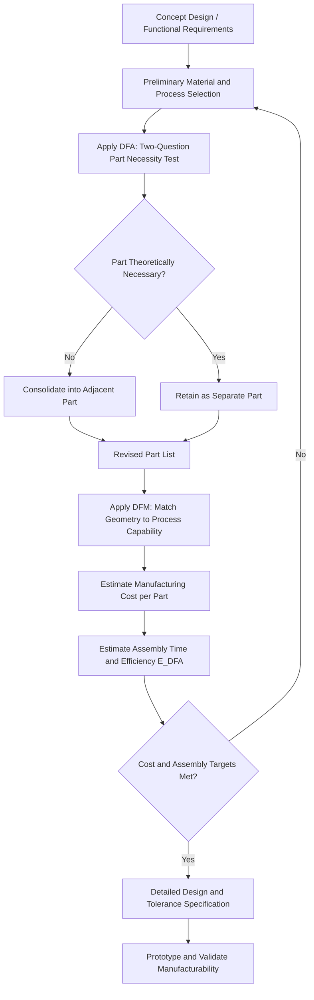

## Design for Manufacturing and Assembly

### Overview and Definition

Design for Manufacturing and Assembly (DFMA) is a structured engineering methodology combining two complementary disciplines: Design for Manufacturing (DFM), which optimizes individual part design for ease, cost-efficiency, and reliability of fabrication, and Design for Assembly (DFA), which optimizes overall product architecture to minimize the number of parts, simplify assembly operations, and reduce assembly time and error. DFMA is applied early in the design cycle, ideally during concept and embodiment design, because the majority of a product's manufacturing cost is committed by decisions made before detailed drawings exist, even though the cost is not incurred until later stages.

Within materials selection and engineering design, DFMA is the discipline that translates a materials/geometry choice into a producible, assemblable, cost-effective component — a material that is theoretically optimal by a performance index (see failure-driven selection, materials substitution) may be rejected or require redesign if it violates DFMA principles.

### Core Objectives

**Key Points**

- Minimize total part count, since every additional part adds acquisition cost, handling cost, assembly time, and a potential failure/quality point.
- Simplify part geometry to match the natural capability of the intended manufacturing process (avoid undercuts in castings, avoid sharp internal corners in machining, avoid excessive draft-angle violations in molding).
- Design parts for self-locating, self-aligning, and unambiguous assembly orientation (minimizing the chance of incorrect assembly).
- Reduce or eliminate fasteners in favor of integrated snap-fits, press-fits, or single-piece consolidated designs where feasible.
- Design for a single, dominant assembly direction (ideally top-down, gravity-assisted) to minimize repositioning and reorientation during assembly.
- Ensure tolerances specified are the loosest acceptable for function, since tight tolerances disproportionately increase manufacturing cost.

### DFM Principles (Part-Level)

| Principle | Rationale | Example Application |
| --- | --- | --- |
| Match geometry to process capability | Avoid features the chosen process cannot produce economically | No sharp internal corners in die-cast parts (radius required for die release) |
| Minimize secondary operations | Each secondary operation (machining after casting, painting after molding) adds cost and cycle time | Near-net-shape casting/forging to reduce downstream machining |
| Standardize features | Common hole sizes, thread pitches, radii reduce tooling variety | Standardizing fastener sizes across a product family |
| Design within process tolerance capability | Specifying tolerances tighter than the process's natural capability inflates cost disproportionately | Avoid ±0.01 mm tolerances on sand-cast features |
| Minimize material waste | Reduce scrap generation inherent to the process | Nesting optimization in sheet-metal blanking |
| Design for process-appropriate wall thickness | Uniform wall thickness avoids warping, sink marks, porosity | Uniform wall sections in injection-molded or die-cast parts |

### DFA Principles (Assembly-Level)

**Key Points**

- **Part count reduction** — the single highest-leverage DFA action; each eliminated part removes its acquisition, inventory, handling, and assembly-station cost simultaneously.
- **Standardization** — using common parts (fasteners, connectors) across multiple assemblies or product variants reduces purchasing complexity and enables volume-driven cost reduction.
- **Ease of handling** — parts should be designed to avoid tangling, nesting/sticking together, or requiring careful orientation before handling (e.g., avoiding symmetric-but-not-identical geometry that causes handling ambiguity).
- **Ease of insertion** — features such as chamfers, lead-ins, and generous clearances facilitate part mating without requiring excessive operator force or precision.
- **Minimizing assembly directions** — every change in assembly direction (e.g., requiring the product to be flipped) adds handling time and complexity; single-direction (typically vertical, top-down) assembly is preferred.
- **Error-proofing (poka-yoke)** — geometric or physical features that make incorrect assembly physically impossible or immediately obvious (asymmetric features, keying, color coding).

### Boothroyd-Dewhurst DFA Method

The most widely referenced quantitative DFA methodology, developed by Boothroyd and Dewhurst, evaluates each part in an assembly against two questions to determine whether the part is theoretically necessary as a separate item:

1. Does the part move relative to all other parts already assembled during normal product operation?
2. Must the part be of a different material, or be isolated, from other parts already assembled (for functional reasons such as insulation, or for service/replacement reasons)?

If neither condition is met, the part is theoretically a candidate for consolidation into an adjacent part, even if practical constraints (manufacturing process limitations, standard component availability) may still justify keeping it separate.

**Design Efficiency Metric:**

$$E_{DFA} = \frac{N_{min} \times t_a}{T_a}$$

where $N_{min}$ is the theoretical minimum number of parts (from the two-question test), $t_a$ is a benchmark minimum handling-and-insertion time per part (commonly 3 seconds as a reference baseline in the classical Boothroyd-Dewhurst framework), and $T_a$ is the actual total estimated assembly time for the design. A higher $E_{DFA}$ indicates a more assembly-efficient design. [Unverified: the specific 3-second baseline and associated time-penalty tables are proprietary to commercial DFA software implementations and specific published editions; values should be confirmed against the current reference source being used rather than assumed universal.]

### Design for Manufacturing Cost Estimation Framework

A common structure for estimating part cost as a function of design decisions:

$$C_{part} = C_{material} + C_{process} + C_{tooling}/n + C_{overhead}$$

where $C_{material}$ is raw material cost (mass × unit cost, including scrap allowance), $C_{process}$ is the variable processing cost per part (cycle time × machine rate), $C_{tooling}$ is fixed tooling/die cost amortized over production quantity $n$, and $C_{overhead}$ covers indirect costs. This structure explains why process selection is production-volume-dependent: high-tooling-cost processes (die casting, injection molding) become economical only at high volume, while low-tooling processes (sand casting, machining from stock) remain competitive at low volume despite higher per-part variable cost.

### Material-Process Compatibility in DFMA

DFMA cannot be separated from materials selection because manufacturability is itself a material property in the practical sense.

**Key Points**

- Formability (sheet metal): governed by material work-hardening exponent $n$ and strain-rate sensitivity $m$; higher $n$ generally permits more aggressive forming operations before localized necking.
- Castability: governed by fluidity (related to melting range — narrow-freezing-range alloys generally cast with better feeding characteristics than wide-freezing-range alloys), shrinkage behavior, and susceptibility to hot tearing.
- Machinability: governed by hardness, microstructure (free-machining additives such as sulfur in steel, or lead/bismuth in some aluminum and copper alloys), and thermal conductivity (affecting tool wear and heat dissipation at the cutting interface).
- Weldability: governed by carbon equivalent (for steels, predicting susceptibility to hydrogen-induced cracking in the heat-affected zone) and the presence of alloying elements that form embrittling phases or oxide films resistant to fusion (e.g., aluminum's tenacious oxide layer requiring specialized welding processes).
- Additive manufacturing compatibility: governed by powder flowability, melt-pool stability, and residual stress accumulation, which vary significantly between alloy families and are not always predictable from conventional processing behavior of the same alloy.

### DFMA and Materials Substitution Interaction

When a material substitution is proposed (see materials substitution strategies), DFMA analysis frequently reveals that the substitute material requires a different optimal part count and assembly strategy than the incumbent, not merely a property-matched geometry change.

**Example:** Substituting a stamped-and-welded steel sheet-metal bracket assembly (multiple parts, spot-welded) with a single die-cast aluminum or injection-molded polymer part can simultaneously achieve mass reduction (materials substitution objective) and dramatic part-count reduction (DFA objective), because casting and molding processes enable geometric consolidation (ribs, bosses, integrated mounting features) that sheet-metal fabrication cannot achieve in a single part. This illustrates why substitution and DFMA are evaluated jointly rather than sequentially in mature design processes.

### DFMA Workflow

### DFMA Part Consolidation Concept (svg_diagram)

<svg xmlns="http://www.w3.org/2000/svg" viewBox="0 0 820 420" font-family="Arial, sans-serif">
<text x="410" y="28" font-size="18" font-weight="bold" text-anchor="middle">Part Consolidation: Before vs. After DFMA (svg_diagram)</text>

<text x="200" y="60" font-size="14" font-weight="bold" text-anchor="middle">Before (Multi-Part Assembly)</text>

<rect x="100" y="80" width="80" height="50" fill="`#dbe9f7`" stroke="`#2c5f8a`" stroke-width="2" />

<rect x="200" y="80" width="60" height="50" fill="`#f7e7c1`" stroke="`#8a6d2c`" stroke-width="2" />

<rect x="150" y="150" width="90" height="40" fill="`#d7f0d3`" stroke="`#2c7a3d`" stroke-width="2" />

<circle cx="120" cy="210" r="10" fill="`#7a7a7a`" />

<circle cx="160" cy="210" r="10" fill="`#7a7a7a`" />

<circle cx="200" cy="210" r="10" fill="`#7a7a7a`" />

<text x="200" y="245" font-size="12" text-anchor="middle">6 parts + 3 fasteners</text>

<text x="200" y="262" font-size="12" text-anchor="middle">Assembly time: high</text>

<line x1="330" y1="180" x2="440" y2="180" stroke="#333" stroke-width="2" marker-end="url(#arrow2)" />
<text x="385" y="165" font-size="12" text-anchor="middle">DFMA</text>

<text x="620" y="60" font-size="14" font-weight="bold" text-anchor="middle">After (Consolidated Part)</text>

<path d="M540,90 Q540,80 560,80 L680,80 Q700,80 700,100 L700,180 Q700,200 680,200 L560,200 Q540,200 540,180 Z" fill="`#d7f0d3`" stroke="`#2c7a3d`" stroke-width="2" />

<text x="620" y="245" font-size="12" text-anchor="middle">1 part, integrated features</text>

<text x="620" y="262" font-size="12" text-anchor="middle">Assembly time: minimal</text>

</svg>

### Case Example: Automotive Instrument Panel Bracket Redesign

A stamped steel bracket assembly originally comprising a bracket, two reinforcement gussets, and four rivets was redesigned as a single glass-fiber-reinforced polypropylene injection-molded part with integrated ribbing replacing the gussets and snap-fit features replacing the rivets. Applying the Boothroyd-Dewhurst two-question test to the original assembly showed that the gussets and rivets failed both necessity criteria (no relative motion, no material isolation requirement), confirming they were theoretical consolidation candidates. The redesign simultaneously reduced part count from seven to one, eliminated four assembly operations (rivet insertion and setting), and reduced mass — demonstrating the typical joint outcome of applying DFMA alongside materials substitution rather than as an isolated exercise.

### Common Pitfalls in DFMA Implementation

- **Applying DFMA only at detailed design stage** — the majority of achievable cost and complexity reduction is only available during early concept/architecture decisions; late-stage DFMA yields only marginal, local improvements.
- **Pursuing part consolidation without regard to serviceability** — a fully consolidated design that cannot be repaired or partially replaced can increase lifecycle cost even if initial manufacturing cost decreases.
- **Ignoring process-specific tolerance capability** — specifying tolerances based on functional requirement alone, without checking against the natural capability of the selected process, leads to unnecessary secondary machining or high scrap rates.
- **Evaluating DFM and DFA independently** — a part optimized in isolation for ease of manufacture (e.g., single-piece complex casting) may complicate assembly if mating features are not co-designed; DFM and DFA decisions are interdependent, not sequential.
- **Over-standardization at the expense of local optimization** — forcing a common fastener or material across a product family can increase individual component cost or mass beyond what a application-specific choice would require; standardization benefit must be weighed against local performance index loss.

### Relationship to Broader Design Methodology

DFMA is typically integrated within Design for Six Sigma (DFSS), concurrent engineering, and Design for X (DFX) frameworks — where X represents various downstream considerations (Design for Reliability, Design for Serviceability, Design for Sustainability) evaluated in parallel with manufacturing and assembly rather than sequentially after a design is otherwise finalized.

**Related Topics**

- Failure Driven Materials Selection
- Materials Substitution Strategies
- Multi Criteria Decision Making in Materials Selection
- Boothroyd-Dewhurst Quantitative DFA Methodology
- Tolerance Analysis and Process Capability (Cp/Cpk)
- Process Selection: Casting, Forming, Machining, and Additive Manufacturing
- Design for Sustainability and End-of-Life Disassembly