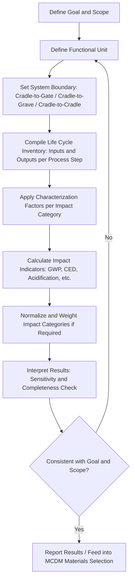

## Life Cycle Assessment of Materials

### Overview and Definition

Life Cycle Assessment (LCA) is a standardized methodology for quantifying the environmental impacts associated with a material or product across its entire life cycle — from raw material extraction, through processing, manufacturing, use, and end-of-life (recycling, incineration, or landfill). In materials engineering, LCA provides the quantitative basis for comparing the environmental performance of candidate materials, informing substitution decisions, and supporting regulatory and sustainability reporting requirements. LCA is standardized internationally under ISO 14040 and ISO 14044, which define the general framework, principles, and requirements for conducting an assessment.

### The Four Phases of LCA (ISO 14040/14044 Framework)

**Key Points**

- **Goal and Scope Definition** — establishes the purpose of the study, the functional unit (the quantified basis of comparison, e.g., "1 kg of material delivered to the factory gate" or "one component providing a defined structural function over its service life"), and system boundaries.
- **Life Cycle Inventory (LCI)** — compiles a comprehensive inventory of all material and energy inputs and outputs (emissions, waste) across every process step within the system boundary.
- **Life Cycle Impact Assessment (LCIA)** — translates the inventory data into a set of environmental impact category indicators (e.g., global warming potential, acidification potential, eutrophication potential, resource depletion).
- **Interpretation** — analyzes the results for consistency, completeness, and sensitivity, and draws conclusions relative to the study's original goal.

### System Boundaries and Scope Definitions

| Boundary Type | Coverage | Common Use |
| --- | --- | --- |
| Cradle-to-gate | Raw material extraction through to factory gate (before use/distribution) | Comparing embodied impact of raw material/semi-finished product options |
| Cradle-to-grave | Full life cycle including use phase and end-of-life disposal | Comprehensive product environmental footprint |
| Cradle-to-cradle | Full life cycle including recycling/reuse back into a new product system | Circular economy and closed-loop material system evaluation |
| Gate-to-gate | A single process step within the larger chain | Process-specific impact analysis (e.g., one manufacturing operation) |
| Well-to-wheel (sector-specific) | Energy/fuel-specific variant common in transportation LCA | Comparing propulsion/fuel pathway environmental impact |

### The Functional Unit — Central Concept

**Key Points**

- The functional unit is the reference basis that makes comparison between materials valid; comparing materials on a simple per-kilogram basis is frequently misleading if the materials deliver different performance per unit mass.
- For structural applications, the functional unit is often expressed as the material quantity required to deliver an equivalent function (e.g., "material required to achieve a given bending stiffness over a given span"), directly linking LCA analysis to the material performance indices used in failure-driven and substitution-based selection.
- Example: comparing steel and aluminum on a per-kg global warming potential (GWP) basis alone favors steel (lower embodied carbon per kg), but comparing on a stiffness-equivalent functional unit basis can favor aluminum, since less aluminum mass is required to achieve the same stiffness (see the mass ratio derivation in materials substitution strategies).

### Key Impact Categories

| Impact Category | Unit (typical) | What It Measures |
| --- | --- | --- |
| Global Warming Potential (GWP) | kg CO2-equivalent | Contribution to climate change over a defined time horizon (commonly 100 years) |
| Acidification Potential | kg SO2-equivalent | Contribution to acid rain / soil and water acidification |
| Eutrophication Potential | kg PO4-equivalent (or N-equivalent) | Nutrient enrichment of water bodies |
| Ozone Depletion Potential | kg CFC-11-equivalent | Contribution to stratospheric ozone layer depletion |
| Abiotic Resource Depletion | kg antimony-equivalent (or similar) | Depletion of non-renewable mineral/fossil resources |
| Human Toxicity Potential | comparative toxic units (CTUh) | Potential harm to human health from emitted substances |
| Cumulative Energy Demand (CED) | MJ | Total primary energy consumed across the life cycle |
| Water Scarcity Footprint | m³ water-equivalent | Water consumption weighted by regional scarcity |

### Embodied Energy and Embodied Carbon of Common Engineering Materials

**Key Points**

- **Embodied energy** is the cumulative primary energy required to extract, process, and deliver a material to a given production stage (commonly cradle-to-gate), typically expressed in MJ/kg.
- **Embodied carbon** is the associated greenhouse gas emissions, typically expressed in kg CO2-eq/kg.
- Primary (virgin) production of metals is generally far more energy-intensive than recycled (secondary) production, because the dominant energy cost lies in ore reduction (breaking strong metal-oxide/sulfide bonds), which is bypassed entirely when remelting existing metal.
- Aluminum exhibits one of the largest primary-versus-secondary energy gaps among structural metals, because primary aluminum production (Hall-Héroult electrolytic reduction) is exceptionally energy-intensive, while remelting scrap aluminum requires only a small fraction of that energy. [Inference: exact published ratios (commonly cited figures suggest recycled aluminum requires roughly 5–10% of primary production energy) vary by source, production route, and electricity grid mix, and should be verified against current process-specific data rather than treated as a fixed universal constant.]
- Steel also benefits substantially from recycling (electric arc furnace route using scrap versus primary basic oxygen furnace route using iron ore and coke), though the relative energy gap is generally narrower than for aluminum.
- Polymers derived from petrochemical feedstock carry embodied energy associated with both the chemical feedstock itself and the polymerization/processing energy, and most common thermoplastics have historically had limited high-value recycling infrastructure compared to metals, though this varies significantly by polymer type and regional recycling capability.

### Worked Example — Functional-Unit-Based Comparison

**Example:** Comparing embodied carbon of steel versus aluminum for a stiffness-limited beam, using the mass ratio derived in materials substitution:

Given a stiffness-limited redesign mass ratio (from the earlier worked example) of approximately 0.57 (aluminum mass relative to equivalent-stiffness steel mass), and representative cradle-to-gate embodied carbon figures (illustrative, not source-verified) of approximately 2 kg CO2-eq/kg for primary steel and approximately 8–12 kg CO2-eq/kg for primary aluminum:

$$\frac{GWP_{Al}}{GWP_{steel}} = 0.57 \times \frac{GWP_{Al,unit}}{GWP_{steel,unit}}$$

Using illustrative unit values, $0.57 \times (10/2) = 2.85$, suggesting the aluminum solution could carry nearly three times the embodied carbon of the steel solution despite requiring less mass, unless a high recycled content is used in the aluminum feedstock. [Unverified: this example uses illustrative embodied-carbon figures to demonstrate the calculation method; actual values are highly dependent on production route (primary vs. recycled content), electricity grid carbon intensity, and specific alloy, and must be sourced from current life cycle inventory databases for any real decision.] This example illustrates why functional-unit-based, recycled-content-aware LCA is essential — a naive per-kg comparison or an uncritical mass-reduction argument can each produce a misleading sustainability conclusion in isolation.

### LCA Data Sources and Databases

Materials LCA studies typically draw inventory data from established databases and tools, including ecoinvent, GaBi, and the U.S. LCI Database, alongside material-specific industry environmental product declarations (EPDs) published under ISO 14025/EN 15804 frameworks. [Unverified: database coverage, licensing terms, and specific dataset currency change over time and should be checked against current provider documentation rather than assumed static.]

### LCA in Materials Selection Decision Frameworks

**Key Points**

- LCA impact indicators (particularly GWP and cumulative energy demand) are increasingly incorporated as explicit criteria within multi-criteria decision making frameworks for materials selection, alongside conventional mechanical performance and cost.
- Ashby-type material selection charts have been extended to include embodied energy/carbon axes, enabling direct performance-index-versus-environmental-impact trade-off visualization analogous to performance-versus-cost charts.
- Materials substitution decisions increasingly require dual optimization: mass/performance index and embodied carbon per functional unit, which can favor different materials depending on relative weighting — a direct extension of the MCDM sensitivity analysis principle.

### Recycled Content and Circular Material Flows

**Key Points**

- **Closed-loop recycling** — material recycled back into an equivalent-grade application (e.g., aluminum beverage cans recycled into new cans), generally preserving material value and properties.
- **Open-loop (downcycling)** — material recycled into a lower-grade application (e.g., mixed-grade scrap steel used in lower-specification castings), common when contamination or alloy mixing prevents equivalent-grade reuse.
- **Recycled content allocation methods** in LCA (cut-off approach versus avoided-burden/substitution approach) significantly affect calculated impact results and are a frequent source of inconsistency between studies; the choice of allocation method should be transparently stated in any comparative LCA.
- Material selection for recyclability (mono-material design, avoiding permanently bonded dissimilar materials, using recyclability-compatible joining methods) directly supports lower end-of-life impact and is an increasingly explicit DFMA and materials selection criterion.

### LCA Process Flow

### Cradle-to-Grave Material Flow Diagram (svg_diagram)

<svg xmlns="http://www.w3.org/2000/svg" viewBox="0 0 900 400" font-family="Arial, sans-serif">
<text x="450" y="28" font-size="18" font-weight="bold" text-anchor="middle">Cradle-to-Grave Material Life Cycle (svg_diagram)</text>
<rect x="30" y="150" width="120" height="60" rx="8" fill="#dbe9f7" stroke="#2c5f8a" stroke-width="2" />
<text x="90" y="185" font-size="12" text-anchor="middle">Raw Material Extraction</text>
<line x1="150" y1="180" x2="200" y2="180" stroke="#333" stroke-width="2" marker-end="url(#arrow3)" />
<rect x="200" y="150" width="120" height="60" rx="8" fill="#dbe9f7" stroke="#2c5f8a" stroke-width="2" />
<text x="260" y="185" font-size="12" text-anchor="middle">Primary Processing / Refining</text>
<line x1="320" y1="180" x2="370" y2="180" stroke="#333" stroke-width="2" marker-end="url(#arrow3)" />
<rect x="370" y="150" width="120" height="60" rx="8" fill="#f7e7c1" stroke="#8a6d2c" stroke-width="2" />
<text x="430" y="185" font-size="12" text-anchor="middle">Manufacturing / Fabrication</text>
<line x1="490" y1="180" x2="540" y2="180" stroke="#333" stroke-width="2" marker-end="url(#arrow3)" />
<rect x="540" y="150" width="120" height="60" rx="8" fill="#f7e7c1" stroke="#8a6d2c" stroke-width="2" />
<text x="600" y="185" font-size="12" text-anchor="middle">Use Phase</text>
<line x1="660" y1="180" x2="710" y2="180" stroke="#333" stroke-width="2" marker-end="url(#arrow3)" />
<rect x="710" y="150" width="150" height="60" rx="8" fill="#d7f0d3" stroke="#2c7a3d" stroke-width="2" />
<text x="785" y="175" font-size="12" text-anchor="middle">End-of-Life:</text>
<text x="785" y="192" font-size="11" text-anchor="middle">Recycle / Landfill / Incinerate</text>
<path d="M785,150 Q785,60 260,60 Q90,60 90,150" stroke="#2c7a3d" stroke-width="2" fill="none" stroke-dasharray="5,4" marker-end="url(#arrow3g)" />
<text x="440" y="50" font-size="12" fill="#2c7a3d" text-anchor="middle">Closed-loop recycling return path</text>
</svg>

### Case Example: Packaging Material Selection Using LCA

A comparative LCA between glass, PET plastic, and aluminum beverage containers, conducted on a functional unit of "delivering 1 liter of beverage to the consumer including transport," commonly shows that light-weighting effects (aluminum and PET requiring substantially less mass and transport energy per unit volume than glass) can outweigh higher per-kg embodied impact of the container material itself, while end-of-life outcomes (aluminum's high-value, high-rate closed-loop recycling versus regionally variable PET and glass recycling rates) further differentiate the results by region and existing collection infrastructure. [Unverified: specific comparative rankings between these packaging materials are highly sensitive to regional electricity grid mix, transport distance, and actual (not theoretical) recycling collection rates, and published studies do not universally agree on a single ranking; results should be treated as case- and region-specific rather than generalized.]

### Common Pitfalls in Materials LCA

- **Comparing materials on a per-kg basis without a functional unit** — ignores the performance-per-mass differences that materials substitution analysis addresses, and can produce misleading conclusions.
- **Omitting the use phase for mass-sensitive applications** — for transportation and mobile equipment, use-phase energy consumption (fuel/electricity) driven by component mass can dominate total life cycle impact, even when production-phase embodied carbon favors a heavier material.
- **Ignoring recycled content and end-of-life allocation method** — presenting only primary (virgin) material impact data overstates impact for materials with high actual recycled content in the market, and the choice of allocation method (cut-off vs. substitution) materially changes results.
- **Single-impact-category conclusions** — focusing exclusively on GWP/carbon while ignoring other impact categories (water use, toxicity, resource depletion) can miss significant trade-offs, particularly for materials with concentrated or hazardous extraction/processing footprints.
- **Inconsistent system boundaries in comparative studies** — comparing a cradle-to-gate figure for one material against a cradle-to-grave figure for another produces an invalid comparison.

### Standards and Reporting Frameworks

Materials LCA work is governed primarily by ISO 14040 (principles and framework) and ISO 14044 (requirements and guidelines), with Environmental Product Declarations (EPDs) standardized under ISO 14025 and, for construction products, EN 15804, providing a mechanism for third-party-verified, comparable material environmental data suitable for use in materials selection and procurement decisions.

**Related Topics**

- Materials Substitution Strategies
- Multi Criteria Decision Making in Materials Selection
- Recycling Processes and Closed-Loop Material Recovery
- Embodied Carbon in Structural Design
- Environmental Product Declarations and ISO 14025/EN 15804
- Circular Economy Principles in Materials Engineering
- Design for Disassembly and End-of-Life Material Recovery