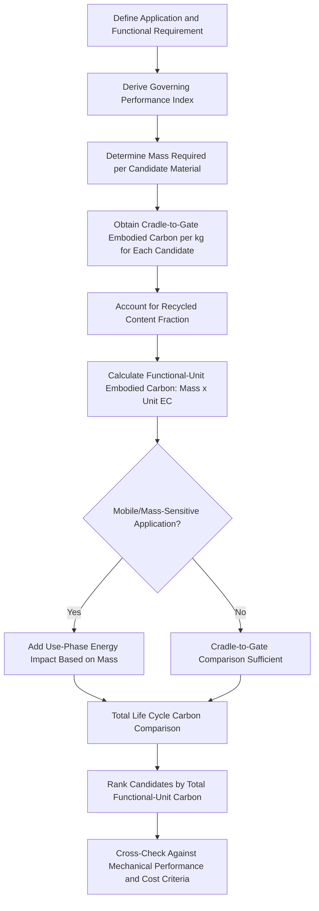

## Embodied Energy and Carbon Footprint of Materials

### Overview and Definitions

Embodied energy is the cumulative primary energy input required to extract, process, and deliver a material to a defined production stage, typically expressed in megajoules per kilogram (MJ/kg). Embodied carbon (also termed embodied greenhouse gas emissions) is the associated quantity of greenhouse gases released across that same boundary, expressed in kilograms of CO2-equivalent per kilogram of material (kg CO2-eq/kg). These two metrics are related but distinct: embodied energy reflects total energy consumption regardless of source, while embodied carbon depends additionally on the carbon intensity of the energy sources used (e.g., grid electricity mix, fuel type), meaning two production routes with identical embodied energy can have substantially different embodied carbon if one relies on a cleaner electricity grid.

Both metrics are foundational inputs to Life Cycle Assessment and to environmentally-informed materials selection, and are increasingly treated as first-class selection criteria alongside mechanical performance indices.

### System Boundary Definitions for Embodied Energy/Carbon

| Boundary | Scope |
| --- | --- |
| Cradle-to-gate | Raw material extraction through processing to the factory gate (most commonly reported boundary for material property databases) |
| Gate-to-gate | A single processing step (e.g., only the rolling operation for a steel coil) |
| Cradle-to-site | Cradle-to-gate plus transport to the point of use (construction industry standard) |
| Cradle-to-grave | Full life cycle including use phase and end-of-life |
| Cradle-to-cradle | Full life cycle including recycling back into a new product system |

Cradle-to-gate is the most commonly published boundary for generic material property data because it is production-route-specific but use-case-independent, allowing the figure to be reused across many downstream applications; the remaining life cycle stages (transport, use, end-of-life) are typically added separately depending on the specific product being assessed.

### Primary Contributors to Embodied Energy

**Key Points**

- **Ore/feedstock extraction and beneficiation** — mining, crushing, and concentration of raw ore or extraction of petrochemical feedstock.
- **Reduction/refining** — the thermodynamically dominant energy step for metals, breaking strong chemical bonds (metal oxides, sulfides) to yield elemental or near-pure metal; this step generally dominates total embodied energy for primary (virgin) metal production.
- **Alloying and secondary metallurgy** — melting, alloy addition, and refining to achieve target composition and cleanliness.
- **Primary forming** — casting, rolling, extrusion, or forging into semi-finished product form.
- **Transport** — energy associated with moving raw materials and semi-finished products between production stages, often small relative to extraction/reduction energy for metals but more significant for bulky, low-value materials (aggregate, cement).

### Comparative Embodied Energy and Carbon by Material Class

**Key Points**

- **Primary (virgin) metals** generally carry the highest embodied energy per kilogram among common structural materials, driven by the ore reduction step; the specific ranking depends heavily on the thermodynamic stability of the metal oxide/ore being reduced (more stable oxides require more energy to reduce, per the Ellingham diagram relationship).
- **Aluminum** exhibits a particularly large gap between primary and secondary (recycled) production energy, because primary production relies on electrolytic reduction (Hall-Héroult process), an inherently electricity-intensive route, while secondary production is simple remelting.
- **Steel** produced via the primary route (blast furnace/basic oxygen furnace, using iron ore and coked coal) carries substantially higher embodied carbon than steel produced via the secondary route (electric arc furnace using scrap), though the relative gap and absolute magnitude depend strongly on the specific process configuration and the carbon intensity of the electricity supply for the EAF route.
- **Polymers** derived from petrochemical feedstock carry embodied energy associated with both the feedstock's inherent chemical energy content and the polymerization/processing energy; commodity thermoplastics (polyethylene, polypropylene) generally have lower embodied energy per kilogram than engineering metals, though this comparison is highly sensitive to the functional-unit basis used (see below).
- **Ceramics and cement-based materials** typically show lower embodied energy per kilogram than metals but are produced and consumed in vastly larger total volumes globally, making their aggregate contribution to global industrial carbon emissions substantial despite a lower per-kilogram figure.
- **Timber and bio-based materials** generally exhibit the lowest embodied energy and, in cradle-to-gate terms, can show negative net embodied carbon when biogenic carbon sequestration during growth is credited against processing emissions, though this accounting convention is a frequent point of methodological debate in LCA practice. [Unverified: the treatment of biogenic carbon accounting varies between LCA standards and is an active area of methodological discussion; specific figures should be checked against the accounting convention used in the source study.]

[Unverified: specific numerical embodied energy and carbon values (MJ/kg, kg CO2-eq/kg) for individual materials vary significantly by production route, region, electricity grid carbon intensity, and data source vintage; this reference intentionally presents qualitative and relative comparisons rather than fixed numerical tables, since quoting specific figures without stating the source database and production route would misrepresent the precision actually available. For a specific project, current figures should be obtained from a recognized database (ecoinvent, GaBi, ICE database) or a material-specific Environmental Product Declaration.]

### The Recycling Energy Advantage

**Key Points**

- Recycled (secondary) production of most metals bypasses the ore reduction step entirely, since the metal is already in elemental/alloyed form; the energy required is primarily for remelting, refining out contaminants, and re-casting.
- This creates a substantial embodied-energy differential between primary and secondary production for most structural metals, with the magnitude of the differential varying by metal — generally largest for metals with the most thermodynamically stable ores (aluminum, magnesium, titanium) and smaller for metals with less stable ores (iron/steel).
- The embodied energy of a material with mixed primary/recycled content scales approximately linearly with recycled content fraction, assuming closed-loop (non-downcycled) recycling:

  $$EE_{mixed} = f_{recycled} \times EE_{secondary} + (1 - f_{recycled}) \times EE_{primary}$$

  where $f_{recycled}$ is the recycled content fraction.
- This relationship directly informs materials selection and procurement: specifying minimum recycled content (where alloy/application requirements permit) is one of the most effective single levers for reducing a material's embodied carbon without changing the base material choice.

### Functional-Unit-Based Comparison (Critical Methodological Point)

**Key Points**

- Comparing materials on a simple per-kilogram embodied energy/carbon basis is frequently misleading for engineering applications, because different materials deliver different performance per unit mass.
- The appropriate comparison basis is the embodied energy or carbon per unit of function delivered — directly connecting to the material performance indices used in failure-driven selection (e.g., $E^{1/2}/\rho$ for stiffness-limited design).
- General relationship for a mass-scaled functional comparison:

  $$\frac{EC_{sub}}{EC_{inc}} = \frac{m_{sub}}{m_{inc}} \times \frac{EC_{sub,unit}}{EC_{inc,unit}}$$

  where $m_{sub}/m_{inc}$ is the mass ratio required to deliver equivalent function (derived from the relevant performance index, as shown in the materials substitution worked example) and $EC_{unit}$ terms are the per-kilogram embodied carbon values.
- A material with substantially higher per-kilogram embodied carbon can still be the lower-total-impact choice if it enables a sufficiently large mass reduction for the governing performance requirement — but the reverse is equally possible, and the outcome cannot be determined without performing the calculation explicitly for the specific application and functional unit.

### Use-Phase Interaction (Mobile vs. Static Applications)

**Key Points**

- For static, non-moving applications (buildings, fixed infrastructure), the use-phase energy consumption is generally independent of the structural material's mass, so minimizing embodied carbon at the production stage is typically the dominant lever.
- For mobile/transportation applications (vehicles, aircraft), component mass directly influences use-phase energy consumption (fuel or electricity to move the mass over the vehicle's operational life), meaning a higher-embodied-carbon material that enables significant mass reduction can produce a net life cycle carbon benefit despite higher production-stage impact.
- This use-phase amplification effect is why lightweighting-driven materials substitution (aluminum, titanium, composites replacing steel) is evaluated over the full cradle-to-grave boundary in transportation applications, whereas cradle-to-gate embodied carbon alone is often sufficient for static structural comparisons.

### Embodied Carbon Reduction Levers

| Lever | Mechanism | Applicability |
| --- | --- | --- |
| Increase recycled content | Bypasses ore reduction energy | Metals broadly, particularly aluminum and steel |
| Decarbonize process energy | Substitute grid/fuel source with lower-carbon-intensity supply | Any energy-intensive processing step (e.g., renewable-powered electrolysis) |
| Process efficiency improvement | Reduce energy per unit output through equipment/process optimization | Applicable across all material classes |
| Alternative reduction chemistry | Replace carbon-based reduction with lower-carbon alternative (e.g., hydrogen-based direct reduced iron in steelmaking) | Emerging/developing routes, primarily in ferrous metallurgy |
| Mass-optimized design | Reduce total material quantity required via performance-index-driven design | Any application, particularly effective combined with DFMA part consolidation |
| Functional-unit substitution | Select alternative material with favorable embodied-carbon-per-function ratio | Cross-material substitution decisions |

### Embodied Carbon Comparison Flow

### Primary vs. Secondary Production Energy Pathway (svg_diagram)

<svg xmlns="http://www.w3.org/2000/svg" viewBox="0 0 850 420" font-family="Arial, sans-serif">
<text x="425" y="28" font-size="18" font-weight="bold" text-anchor="middle">Primary vs. Secondary Metal Production Energy Pathways (svg_diagram)</text>

<text x="210" y="60" font-size="14" font-weight="bold" text-anchor="middle">Primary (Virgin) Route</text>

<rect x="90" y="80" width="120" height="45" rx="6" fill="`#dbe9f7`" stroke="`#2c5f8a`" stroke-width="2" />

<text x="150" y="107" font-size="11" text-anchor="middle">Ore Extraction</text>

<line x1="150" y1="125" x2="150" y2="150" stroke="#333" stroke-width="2" marker-end="url(#arrow4)" />

<rect x="90" y="150" width="120" height="45" rx="6" fill="`#f7e7c1`" stroke="`#8a6d2c`" stroke-width="2" />

<text x="150" y="177" font-size="11" text-anchor="middle">Reduction / Smelting</text>

<text x="150" y="215" font-size="11" fill="`#8a2c2c`" text-anchor="middle">(High energy input)</text>

<line x1="150" y1="195" x2="150" y2="240" stroke="#333" stroke-width="2" marker-end="url(#arrow4)" />

<rect x="90" y="240" width="120" height="45" rx="6" fill="`#d7f0d3`" stroke="`#2c7a3d`" stroke-width="2" />

<text x="150" y="267" font-size="11" text-anchor="middle">Refining / Alloying</text>

<line x1="150" y1="285" x2="150" y2="310" stroke="#333" stroke-width="2" marker-end="url(#arrow4)" />

<rect x="90" y="310" width="120" height="45" rx="6" fill="`#dbe9f7`" stroke="`#2c5f8a`" stroke-width="2" />

<text x="150" y="337" font-size="11" text-anchor="middle">Primary Metal Product</text>

<line x1="270" y1="330" x2="580" y2="330" stroke="#333" stroke-width="1.5" stroke-dasharray="4,3" />

<text x="680" y="60" font-size="14" font-weight="bold" text-anchor="middle">Secondary (Recycled) Route</text>

<rect x="620" y="240" width="120" height="45" rx="6" fill="`#dbe9f7`" stroke="`#2c5f8a`" stroke-width="2" />

<text x="680" y="267" font-size="11" text-anchor="middle">Scrap Collection</text>

<line x1="680" y1="285" x2="680" y2="310" stroke="#333" stroke-width="2" marker-end="url(#arrow4)" />

<rect x="620" y="310" width="120" height="45" rx="6" fill="`#d7f0d3`" stroke="`#2c7a3d`" stroke-width="2" />

<text x="680" y="333" font-size="11" text-anchor="middle">Remelt / Refine</text>

<text x="680" y="290" font-size="11" fill="`#2c7a3d`" text-anchor="middle">(Low energy input)</text>

</svg>

### Case Example: Building Structural Frame Material Selection

For a static building structural frame, comparing reinforced concrete, structural steel, and mass timber on a cradle-to-gate, functional-unit basis (material required to span a given structural bay under code-required load) typically shows mass timber with the lowest embodied carbon per functional unit, driven by both lower processing energy intensity and biogenic carbon accounting conventions, while structural steel's embodied carbon is highly sensitive to recycled content (a high-recycled-content EAF steel frame can substantially close the gap with primary-route alternatives). Because the application is static (no use-phase mass-energy coupling), the comparison can be reasonably concluded at the cradle-to-gate or cradle-to-site boundary without requiring use-phase energy modeling, unlike the transportation sector examples discussed above. [Unverified: specific ranking outcomes depend on regional timber sourcing/forestry practice, regional electricity grid carbon intensity for steel production, and the specific biogenic carbon accounting method applied; this should be treated as an illustrative pattern rather than a universal ranking.]

### Common Pitfalls in Embodied Energy/Carbon Analysis

- **Per-kilogram comparison without functional-unit normalization** — produces materially incorrect conclusions for engineering applications where materials deliver different performance per unit mass.
- **Ignoring recycled content variation** — using a generic "material X" embodied carbon figure without specifying primary/secondary production split or actual market-average recycled content can misstate real-world impact by a large margin, particularly for aluminum.
- **Omitting use-phase mass-energy coupling in mobile applications** — cradle-to-gate-only comparisons can produce misleading substitution conclusions for vehicles, aircraft, and other mass-sensitive moving systems.
- **Mixing embodied energy and embodied carbon as interchangeable metrics** — a low-embodied-energy process using a high-carbon-intensity energy source can still produce high embodied carbon; the two metrics must be tracked and reported separately.
- **Citing unsourced or outdated numerical values** — embodied energy/carbon figures are production-route-, region-, and time-specific; quoting a single fixed value without source and boundary conditions is a common source of error in comparative studies.

### Standards and Data Sources

Embodied energy and carbon reporting is supported by ISO 14040/14044 (general LCA framework), ISO 14067 (carbon footprint of products, specifically), and Environmental Product Declarations under ISO 14025/EN 15804, with widely referenced reference databases including ecoinvent, GaBi, the Inventory of Carbon and Energy (ICE) database, and material-specific industry EPDs providing production-route-specific figures suitable for engineering-level comparison.

**Related Topics**

- Life Cycle Assessment of Materials
- Materials Substitution Strategies
- Recycling Processes and Closed-Loop Material Recovery
- Multi Criteria Decision Making in Materials Selection
- Circular Economy Principles in Materials Engineering
- Environmental Product Declarations and ISO 14025/EN 15804
- Design for Disassembly and End-of-Life Material Recovery