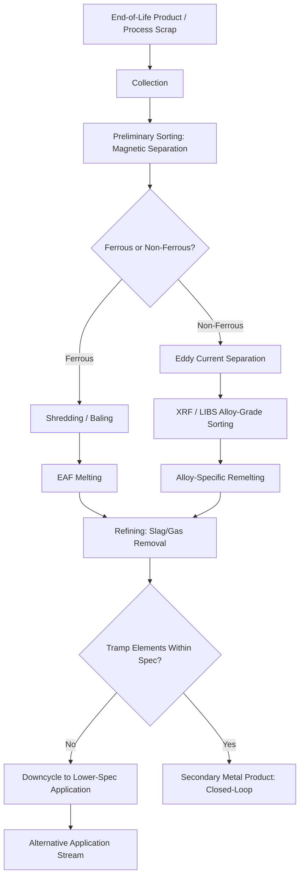

## Recycling Technologies for Metals

### Overview

Metal recycling technologies encompass the processes by which end-of-life or process scrap metal is collected, sorted, processed, and remelted or reprocessed into secondary metal suitable for reuse in manufacturing. Because metal reduction from ore is the dominant energy and carbon cost in primary production (see embodied energy and carbon footprint of materials), recycling technology capability and scrap quality directly determine how much of that primary impact can be avoided. Metals are, in principle, infinitely recyclable without fundamental loss of intrinsic atomic properties, but achieving actual closed-loop, equivalent-grade recycling in practice depends heavily on collection, sorting, and contamination-control technology — the central engineering challenge of this field.

### Metal Recycling Process Chain

**Key Points**

- **Collection** — gathering end-of-life products (post-consumer scrap) and manufacturing process scrap (pre-consumer/new scrap, generally cleaner and more valuable).
- **Sorting/separation** — physically separating mixed scrap streams into distinct metal types and alloy families, the single most technologically challenging and value-determining step.
- **Size reduction and preparation** — shredding, baling, or shearing to a form suitable for melting furnace charging.
- **Melting and refining** — remelting sorted scrap, removing dissolved gases and non-metallic inclusions, and adjusting composition to meet target alloy specification.
- **Casting and forming** — solidifying refined secondary metal into ingot, billet, or other semi-finished form for reintroduction into the manufacturing supply chain.

### Sorting and Separation Technologies

| Technology | Principle | Applicable Materials |
| --- | --- | --- |
| Magnetic separation | Ferromagnetic attraction | Separates ferrous (iron/steel) from non-ferrous scrap |
| Eddy current separation | Induced current in conductive non-ferrous metal creates repulsive force in an alternating magnetic field | Separates non-ferrous metals (aluminum, copper, brass) from non-metallic waste |
| Density-based separation (sink-float, jigging) | Differences in specific gravity | Separating metals of different density in mixed shredded scrap |
| X-ray fluorescence (XRF) sorting | Elemental composition detection via characteristic X-ray emission | Alloy-grade sorting of non-ferrous scrap (e.g., separating aluminum alloy series) |
| Laser-induced breakdown spectroscopy (LIBS) | Elemental composition from plasma emission spectrum of a laser-ablated sample spot | High-speed, high-resolution alloy sorting, including light-element detection XRF struggles with |
| Color sorting (optical) | Visible spectrum reflectance differences | Distinguishing copper, brass, and other visually distinct non-ferrous metals |
| Near-infrared (NIR) sorting | Spectral reflectance in NIR range | Primarily polymer sorting, but used in mixed metal-polymer waste streams (e-waste) |

### Ferrous Metal Recycling

**Key Points**

- Steel scrap is processed primarily via the **Electric Arc Furnace (EAF)** route, which uses scrap steel as the primary charge material, melted using electric arc energy rather than the coke-based chemical reduction required for primary ironmaking.
- Scrap steel is broadly categorized into three grades: **home scrap** (generated and recycled within the same steel mill, highest purity), **prompt/industrial scrap** (generated during manufacturing of steel products, e.g., stamping offcuts), and **obsolete/post-consumer scrap** (end-of-life products such as automobiles and appliances, generally requiring the most extensive sorting and cleaning).
- Residual/tramp elements — particularly copper, tin, and nickel introduced from contamination (e.g., copper wiring not fully removed from automotive scrap) — cannot be economically removed by conventional EAF refining once dissolved in the melt, and accumulate with repeated recycling cycles, progressively constraining the mechanical properties (particularly hot-workability and surface quality) achievable in recycled steel grades over successive recycling loops.
- This tramp-element accumulation is a primary technical driver for scrap sorting investment and for grade-appropriate downcycling (routing copper-contaminated scrap toward applications less sensitive to tramp copper, such as rebar, rather than high-surface-quality sheet steel).

### Aluminum Recycling

**Key Points**

- Aluminum recycling offers one of the largest primary-to-secondary energy savings among structural metals, since remelting bypasses the highly energy-intensive Hall-Héroult electrolytic reduction step entirely.
- Aluminum scrap sorting is particularly critical because different aluminum alloy series (1xxx through 8xxx) have distinct alloying element specifications, and mixing series during remelting can produce an off-specification alloy unsuitable for demanding structural applications without dilution with primary metal.
- **Dross** (the oxide-rich skim formed on the melt surface during remelting) represents a metal loss mechanism specific to aluminum recycling, driven by aluminum's high affinity for oxygen; furnace technology and fluxing practice are optimized specifically to minimize dross formation and recover entrained metal from dross.
- Used Beverage Can (UBC) recycling is one of the most mature closed-loop aluminum recycling streams globally, benefiting from a relatively homogeneous, well-characterized alloy specification and established high-volume collection infrastructure.
- Automotive and aerospace aluminum scrap increasingly requires alloy-series-specific sorting (using XRF/LIBS technology) to support closed-loop, high-specification recycling as vehicle light-weighting increases the volume and alloy diversity of aluminum in end-of-life vehicles.

### Copper and Precious Metal Recycling

**Key Points**

- Copper recycling follows both a direct remelting route (for clean, well-sorted scrap) and a smelting/refining route (for complex, mixed, or contaminated scrap, particularly electronic waste), where copper acts as a collector metal for associated precious metals (gold, silver, palladium) during pyrometallurgical processing.
- Electronic waste (e-waste) recycling is a technologically distinct and increasingly significant recycling category, requiring specialized processes (mechanical shredding, pyrometallurgical smelting, hydrometallurgical leaching, and electrorefining) to recover copper, precious metals, and increasingly critical/rare elements (e.g., tantalum, indium, rare earth elements in permanent magnets) from complex multi-material printed circuit board and component assemblies.
- Hydrometallurgical processes (acid or cyanide leaching followed by solvent extraction and electrowinning) are increasingly applied where pyrometallurgical smelting is uneconomical or where selective recovery of specific elements from complex e-waste matrices is required.

### Titanium and High-Value Alloy Recycling

**Key Points**

- Titanium recycling is economically significant in aerospace manufacturing because primary titanium production (Kroll process) is exceptionally energy- and cost-intensive, making machining swarf and off-cut scrap recovery a substantial economic driver.
- Titanium scrap recycling requires stringent control of interstitial contamination (oxygen, nitrogen, carbon), since these elements strongly affect mechanical properties (embrittlement) even at low concentrations, requiring melting under vacuum or inert atmosphere (vacuum arc remelting, electron beam melting) rather than open-air remelting.
- Nickel-based superalloy recycling similarly requires careful scrap sorting and melting practice to control trace elements affecting high-temperature creep and fatigue performance, given the demanding service conditions (see the turbine blade case study in case studies in materials selection).

### Metallurgical Challenges in Recycling: Tramp Elements and Downcycling

**Key Points**

- **Tramp elements** are alloying or contaminant elements present in scrap that cannot be economically removed by standard remelting/refining processes and that were not present (or not desired) in the original alloy specification.
- Unlike primary refining (which can remove many impurities through oxidation, slag formation, or vacuum degassing), several tramp elements common in recycled metal streams (notably copper in steel, and certain alloying elements across various metal systems) are chemically similar enough to the base metal, or thermodynamically stable enough in the melt, that conventional pyrometallurgical refining cannot selectively remove them.
- This constraint means recycled metal quality is fundamentally a function of scrap sorting quality at the input stage, not solely melting/refining technology capability — reinforcing why sorting technology (XRF, LIBS, eddy current) represents the primary technological lever for improving closed-loop recycling rates and reducing forced downcycling.
- **Downcycling** — routing contaminated or unsortable scrap to lower-specification applications — remains a practical and economically necessary strategy for managing tramp-element-affected scrap streams, even as sorting technology improves.

### Metal Recycling Process Flow

### Sorting Technology Comparison (svg_diagram)

<svg xmlns="http://www.w3.org/2000/svg" viewBox="0 0 820 440" font-family="Arial, sans-serif">
<text x="410" y="28" font-size="18" font-weight="bold" text-anchor="middle">Metal Sorting: Resolution vs. Throughput (svg_diagram)</text>
<line x1="80" y1="400" x2="740" y2="400" stroke="#333" stroke-width="2" />
<line x1="80" y1="400" x2="80" y2="60" stroke="#333" stroke-width="2" />
<text x="410" y="430" font-size="13" text-anchor="middle">Sorting Throughput (tons/hour)</text>
<text x="30" y="230" font-size="13" text-anchor="middle" transform="rotate(-90 30 230)">Alloy Resolution / Specificity</text>
<circle cx="620" cy="360" r="10" fill="#7a7a7a" />
<text x="620" y="380" font-size="12" text-anchor="middle">Magnetic Separation</text>
<circle cx="520" cy="300" r="10" fill="#2c5f8a" />
<text x="520" y="320" font-size="12" text-anchor="middle">Eddy Current</text>
<circle cx="320" cy="180" r="10" fill="#2c7a3d" />
<text x="320" y="165" font-size="12" text-anchor="middle">XRF Sorting</text>
<circle cx="220" cy="100" r="10" fill="#8a2c2c" />
<text x="220" y="85" font-size="12" text-anchor="middle">LIBS Sorting</text>
<path d="M620,360 Q470,330 320,180 Q270,140 220,100" stroke="#999" stroke-width="1.5" fill="none" stroke-dasharray="4,3" />
</svg>

### Case Example: End-of-Life Vehicle (ELV) Recycling

End-of-life vehicle recycling illustrates the layered sorting challenge characteristic of complex multi-material products: vehicles are first depolluted (fluids, batteries, airbags removed), dismantled for high-value component reuse, then shredded, with the resulting mixed metal fraction (ferrous body structure, non-ferrous aluminum/magnesium components, copper wiring) separated using sequential magnetic and eddy-current separation, followed by XRF or LIBS sorting to segregate aluminum alloy series for closed-loop reuse in new vehicle production. Increasing use of multi-material vehicle architectures (steel-aluminum-composite hybrid structures, discussed in materials substitution strategies) increases the sorting complexity of this stream, directly linking design-stage material selection decisions to downstream recyclability and achievable closed-loop recovery rate — reinforcing why recyclability is increasingly treated as an explicit design-stage criterion (see design for manufacturing and assembly and life cycle assessment of materials).

### Common Pitfalls in Metal Recycling System Design

- **Underinvesting in sorting relative to melting capacity** — melting/refining technology cannot compensate for inadequately sorted input; tramp element contamination from poor sorting is generally locked into the melt.
- **Ignoring alloy-series mixing in non-ferrous scrap** — treating "aluminum scrap" or "copper scrap" as a single undifferentiated commodity, rather than sorting by alloy series/grade, forces unnecessary downcycling of scrap that could otherwise support closed-loop, high-specification reuse.
- **Neglecting design-for-recyclability feedback** — products designed with permanently bonded dissimilar materials, embedded electronics, or hard-to-separate composite/metal hybrids increase downstream sorting cost and reduce achievable recycling rate, regardless of recycling technology capability.
- **Treating recyclability as a binary property** — recyclability is a spectrum determined by achievable sorting purity and resulting grade, not a simple yes/no material attribute; the relevant metric is the achievable closed-loop recovery rate at defined purity, not theoretical recyclability.
- **Assuming infinite recyclability without tramp-element consideration** — while metal atoms themselves are not consumed by recycling, cumulative tramp-element buildup over multiple recycling loops can progressively degrade achievable alloy specification without corresponding dilution or refining investment.

### Standards and Industry Frameworks

Metal recycling practice intersects with scrap specification standards (e.g., ISRI specifications for scrap grades in North America), End-of-Life Vehicle Directive requirements (particularly in the EU, mandating minimum recovery/recycling rates), and broader circular economy and extended producer responsibility (EPR) regulatory frameworks that increasingly hold manufacturers accountable for end-of-life material recovery outcomes. [Unverified: specific regulatory recovery rate targets and scrap grade specifications are jurisdiction- and standard-body-specific and subject to periodic revision; current figures should be verified against the applicable current regulatory text or standard.]

**Related Topics**

- Life Cycle Assessment of Materials
- Embodied Energy and Carbon Footprint of Materials
- Materials Substitution Strategies
- Circular Economy Principles in Materials Engineering
- Design for Disassembly and End-of-Life Material Recovery
- Alloy Identification and Sorting Technology (XRF/LIBS)
- Tramp Element Metallurgy and Scrap Quality Control