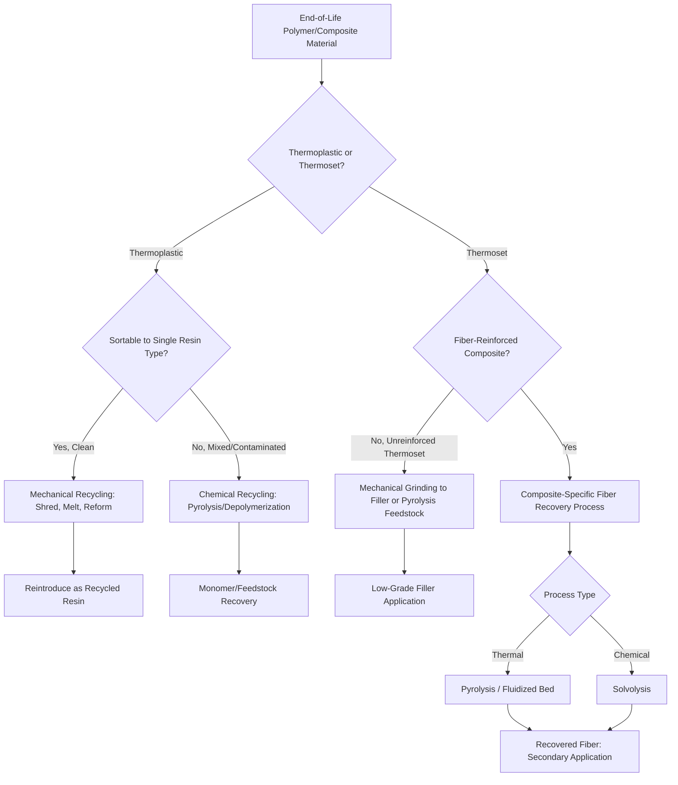

## Recycling of Polymers and Composites

### Overview

Recycling of polymers and composites addresses a fundamentally different technical challenge than metal recycling. Unlike metals, which can generally be remelted and reused with intrinsic properties largely preserved (subject to tramp-element accumulation, as discussed in recycling technologies for metals), polymers are macromolecular materials whose properties depend on chain length, chain architecture, and, for thermosets, irreversible cross-link networks. This means polymer recyclability is governed as much by polymer chemistry and network structure as by collection and sorting infrastructure, and composites add a further layer of difficulty because the reinforcement phase (typically glass or carbon fiber) and the matrix must be separated to recover either constituent at meaningful value.

### Polymer Classification and Recyclability Implications

**Key Points**

- **Thermoplastics** consist of linear or branched polymer chains held together by secondary (van der Waals, hydrogen) bonding, which allows repeated melting and reforming without breaking primary covalent bonds — making them mechanically recyclable in principle.
- **Thermosets** consist of polymer chains permanently cross-linked by covalent bonds formed during an irreversible curing reaction; once cured, thermosets cannot be melted and reformed, fundamentally precluding conventional mechanical recycling and requiring chemical or thermal decomposition methods instead.
- **Elastomers** are typically lightly cross-linked (vulcanized) networks, sharing the thermoset recycling challenge in principle, though devulcanization technologies exist to partially reverse sulfur cross-linking for certain rubber recycling applications.
- This thermoplastic/thermoset distinction is the single most important classification for predicting a polymer's practical recyclability route and is a primary consideration in materials selection when recyclability is an explicit design criterion (see life cycle assessment of materials).

### Mechanical Recycling of Thermoplastics

**Key Points**

- **Process sequence**: collection → sorting (by resin type) → washing/decontamination → size reduction (shredding, granulation) → melt extrusion/pelletizing → reforming into new products.
- Each mechanical recycling cycle typically causes some degree of chain scission (polymer chain breakage due to thermal and shear stress during reprocessing), progressively reducing molecular weight and, consequently, mechanical properties (particularly toughness and melt strength) — meaning mechanically recycled thermoplastic generally cannot be considered property-equivalent to virgin material without blending, stabilization additives, or property-appropriate downcycled application targeting.
- Resin identification codes (the numbered triangular symbols, e.g., PET as 1, HDPE as 2) support consumer-level sorting but do not guarantee sufficient purity for high-value closed-loop recycling; commingled or contaminated streams generally require downcycled applications (lower-specification products) rather than closed-loop reuse into equivalent original applications.
- PET (polyethylene terephthalate) and HDPE (high-density polyethylene) have the most mature mechanical recycling infrastructure among common thermoplastics, reflecting both established collection streams (bottles, containers) and relatively favorable reprocessing behavior.

### Sorting Technologies for Polymer Recycling

| Technology | Principle | Application |
| --- | --- | --- |
| Near-infrared (NIR) spectroscopy | Resin-specific spectral absorption signature | High-speed automated resin-type sorting on conveyor lines |
| Density-based separation (sink-float) | Density differences between resin types | Coarse separation (e.g., PET sink vs. polyolefin float in water) |
| Manual/visual sorting | Human or machine-vision identification of color, form, labeling | Supplementary sorting, particularly for contamination removal |
| Triboelectric separation | Differential static charge acquisition between polymer types upon frictional contact | Separating similar-density polymer mixtures not resolvable by density alone |
| Fourier-transform infrared (FTIR) | Detailed chemical fingerprinting | Laboratory-grade verification and quality control, higher resolution than NIR |

### Chemical Recycling Routes

Chemical recycling breaks polymer chains down to monomers or other chemical feedstocks, offering a pathway to recover polymer value even from contaminated, mixed, or degraded streams unsuitable for mechanical recycling, and, for some routes, to produce feedstock indistinguishable in quality from virgin-derived material.

**Key Points**

- **Depolymerization (chemolysis)** — chemically reverses the polymerization reaction (e.g., via glycolysis, methanolysis, or hydrolysis for condensation polymers like PET) to recover monomers or oligomers suitable for repolymerization into virgin-equivalent-quality resin.
- **Pyrolysis** — thermal decomposition in the absence of oxygen, breaking polymer chains into a mixture of hydrocarbon products (pyrolysis oil, gas, char) usable as chemical feedstock or fuel; applicable to a broader range of mixed/contaminated plastic waste than depolymerization but generally yields a less chemically pure output.
- **Gasification** — thermal conversion (typically higher temperature than pyrolysis, often with a controlled oxidant) into syngas (CO and H2), which can be used as chemical feedstock (e.g., for methanol or ammonia synthesis) rather than directly reformed into new polymer.
- **Solvolysis** — using solvents (with or without catalysts) to selectively dissolve or chemically break down target polymers, useful for both depolymerization and for selective matrix removal in composite recycling (see below).
- Chemical recycling routes are generally more energy- and capital-intensive per unit output than mechanical recycling, but can process feedstocks (mixed, contaminated, degraded) that mechanical recycling cannot economically handle, and can, for depolymerization specifically, close the loop to virgin-equivalent quality in a way mechanical recycling generally cannot achieve after repeated cycles.

### Thermoset Polymer and Composite Recycling Challenges

**Key Points**

- Because thermosets cannot be melted, recovery requires either mechanical size reduction (producing filler-grade regrind with degraded properties, unable to be reformed into a load-bearing matrix), or decomposition of the cross-linked network via thermal or chemical means to recover value from the reinforcement fiber and/or matrix-derived chemical feedstock.
- Fiber-reinforced polymer composites (particularly carbon-fiber-reinforced and glass-fiber-reinforced thermoset composites, widely used in aerospace, automotive, and wind energy applications) present a compounded recycling challenge: the reinforcement fiber (often the higher-value constituent, particularly for carbon fiber) must be separated from the cured thermoset matrix without excessive fiber length reduction or surface damage that would degrade its value for reuse.
- Wind turbine blades represent a particularly significant emerging composite waste stream due to large individual component size, glass/carbon-fiber-reinforced thermoset construction, and a wave of blade retirements as early-generation wind installations reach end of life, driving substantial recent process development specifically targeting this waste stream.

### Composite Recycling Process Technologies

| Technology | Principle | Fiber Quality Outcome |
| --- | --- | --- |
| Mechanical grinding/shredding | Size reduction to filler/regrind particles | Low value; fibers heavily shortened, used as low-grade filler |
| Pyrolysis | Thermal decomposition of matrix in inert atmosphere, leaving fiber residue | Moderate; fiber generally usable but with some surface char/degradation requiring post-treatment |
| Fluidized bed processing | Hot fluidized sand bed combusts/decomposes matrix, releasing fibers | Moderate to good; effective for mixed/contaminated composite waste |
| Solvolysis (chemical matrix dissolution) | Solvent (often with catalyst, elevated temperature/pressure) dissolves cross-linked matrix | Good; can preserve longer fiber length and cleaner surface than thermal methods, but higher process cost and solvent handling requirements |
| Microwave-assisted pyrolysis | Microwave energy selectively heats matrix for more controlled decomposition | Emerging; targeted at improving fiber surface quality versus conventional pyrolysis |

[Unverified: composite recycling technology, particularly for carbon fiber recovery, is an active area of ongoing industrial development; specific process maturity, commercial scale, and achievable recovered-fiber mechanical property retention vary by technology provider and continue to evolve, and current data should be verified against recent industry sources rather than assumed static.]

### Recovered Carbon Fiber Property Considerations

**Key Points**

- Recovered carbon fiber from pyrolysis or solvolysis processes generally retains a substantial fraction of the tensile strength of virgin fiber under well-controlled process conditions, but typically loses the sized surface coating (applied during virgin fiber manufacture to promote matrix adhesion) and some length distribution, requiring re-sizing and reprocessing (commonly into non-woven mat, chopped fiber compound, or re-aligned tow) rather than direct substitution for virgin continuous fiber in the highest-performance structural applications.
- This property degradation, combined with the current cost structure of recovery processes relative to virgin carbon fiber production cost, generally routes recovered carbon fiber toward secondary, lower-certification-burden applications (non-structural automotive components, consumer goods, non-aerospace-grade parts) rather than direct reuse in the original high-performance aerospace or motorsport application.

### Design for Recyclability in Polymer and Composite Systems

**Key Points**

- Mono-material design (avoiding permanently bonded dissimilar polymers or polymer-metal hybrids) significantly simplifies downstream sorting and mechanical recycling, directly connecting to design for manufacturing and assembly principles.
- Reversible or recyclable-by-design thermoset chemistries (e.g., vitrimers, which incorporate dynamic covalent bonds allowing network rearrangement and reprocessing under specific thermal/catalytic conditions while retaining thermoset-like service properties) represent an emerging materials-chemistry approach to closing the thermoset recyclability gap, though industrial-scale adoption remains limited relative to conventional thermoset systems. [Unverified: vitrimer and related dynamic-covalent-network chemistries are an active research area with evolving commercial readiness; specific performance and adoption status should be checked against current literature.]
- Avoiding permanently embedded metal inserts, adhesive-bonded dissimilar-material joints, and mixed-fiber-type composite layups (where practical) reduces the sorting and separation burden at end of life, an increasingly explicit criterion in materials selection frameworks incorporating circularity alongside mechanical performance.

### Polymer and Composite Recycling Route Decision Flow

### Thermoplastic vs. Thermoset Recycling Pathway (svg_diagram)

<svg xmlns="http://www.w3.org/2000/svg" viewBox="0 0 850 400" font-family="Arial, sans-serif">
<text x="425" y="28" font-size="18" font-weight="bold" text-anchor="middle">Thermoplastic vs. Thermoset Recycling Pathways (svg_diagram)</text>

<text x="200" y="60" font-size="14" font-weight="bold" text-anchor="middle">Thermoplastic</text>

<rect x="100" y="80" width="200" height="45" rx="6" fill="`#dbe9f7`" stroke="`#2c5f8a`" stroke-width="2" />

<text x="200" y="107" font-size="12" text-anchor="middle">Linear Chains, Secondary Bonds</text>

<line x1="200" y1="125" x2="200" y2="155" stroke="#333" stroke-width="2" marker-end="url(#arrow5)" />

<rect x="100" y="155" width="200" height="45" rx="6" fill="`#d7f0d3`" stroke="`#2c7a3d`" stroke-width="2" />

<text x="200" y="182" font-size="12" text-anchor="middle">Melt and Reform (Repeatable)</text>

<line x1="200" y1="200" x2="200" y2="230" stroke="#333" stroke-width="2" marker-end="url(#arrow5)" />

<text x="200" y="250" font-size="12" text-anchor="middle" fill="`#2c7a3d`">Mechanical Recycling Feasible</text>

<text x="650" y="60" font-size="14" font-weight="bold" text-anchor="middle">Thermoset</text>

<rect x="550" y="80" width="200" height="45" rx="6" fill="`#f7e7c1`" stroke="`#8a6d2c`" stroke-width="2" />

<text x="650" y="107" font-size="12" text-anchor="middle">Cross-Linked Network, Covalent Bonds</text>

<line x1="650" y1="125" x2="650" y2="155" stroke="#333" stroke-width="2" marker-end="url(#arrow5)" />

<rect x="550" y="155" width="200" height="45" rx="6" fill="`#f0d3d3`" stroke="`#8a2c2c`" stroke-width="2" />

<text x="650" y="182" font-size="12" text-anchor="middle">Cannot Melt: Requires Decomposition</text>

<line x1="650" y1="200" x2="650" y2="230" stroke="#333" stroke-width="2" marker-end="url(#arrow5)" />

<text x="650" y="250" font-size="12" text-anchor="middle" fill="`#8a2c2c`">Pyrolysis / Solvolysis Required</text>

</svg>

### Case Example: Automotive Bumper Fascia Closed-Loop Recycling

Automotive bumper fascias, commonly manufactured from polypropylene-based thermoplastic olefin (TPO) blends, represent a relatively mature closed-loop mechanical recycling example within the automotive sector: end-of-life and manufacturing-scrap bumpers are collected, shredded, and reprocessed into recycled-content compound suitable for reuse in new bumper production or related non-visible interior/underbody components, with property loss from chain scission managed through blending recycled content with virgin resin and stabilizer additives rather than pursuing 100% recycled content, which would generally fail to meet impact and surface-finish specifications for a new bumper application. This contrasts with the composite wind turbine blade case, where the thermoset matrix precludes any equivalent direct mechanical closed-loop route, illustrating how the thermoplastic/thermoset distinction fundamentally shapes achievable end-of-life strategy independent of collection infrastructure maturity.

### Common Pitfalls in Polymer and Composite Recycling

- **Assuming resin-code labeling guarantees recyclability** — the presence of a resin identification code indicates polymer type for sorting purposes only; it does not guarantee local collection infrastructure exists or that the material will achieve closed-loop reuse.
- **Ignoring progressive property degradation across recycling cycles** — treating mechanically recycled thermoplastic as property-equivalent to virgin resin without accounting for chain-scission-driven molecular weight reduction.
- **Underestimating composite separation difficulty** — assuming fiber-reinforced thermoset composites can be recycled by simple mechanical means equivalent to unreinforced thermoplastics; fiber-matrix separation requires fundamentally different (thermal or chemical) process technology.
- **Neglecting design-stage recyclability consideration** — specifying mixed-material, adhesively bonded, or multi-resin-type assemblies without considering downstream separation difficulty, directly increasing end-of-life processing cost and reducing achievable recovery value.
- **Overstating recovered carbon fiber equivalence to virgin fiber** — assuming recovered fiber can directly substitute into the original high-performance application without accounting for surface treatment loss, length distribution change, and associated property/certification implications.

### Standards and Regulatory Context

Polymer and composite recycling intersects with resin identification coding standards (ASTM D7611), extended producer responsibility (EPR) regulations increasingly applied to packaging and, in some jurisdictions, to composite products such as wind turbine blades, and end-of-life vehicle and waste electrical/electronic equipment (WEEE) directives that establish minimum recovery and recycling rate targets for products containing significant polymer and composite content. [Unverified: specific regulatory targets, coding standards, and their jurisdictional applicability are subject to periodic revision and should be verified against current regulatory text.]

**Related Topics**

- Recycling Technologies for Metals
- Life Cycle Assessment of Materials
- Embodied Energy and Carbon Footprint of Materials
- Circular Economy Principles in Materials Engineering
- Design for Disassembly and End-of-Life Material Recovery
- Thermoset Chemistry and Vitrimer Materials
- Carbon Fiber Composite Manufacturing and Recovery