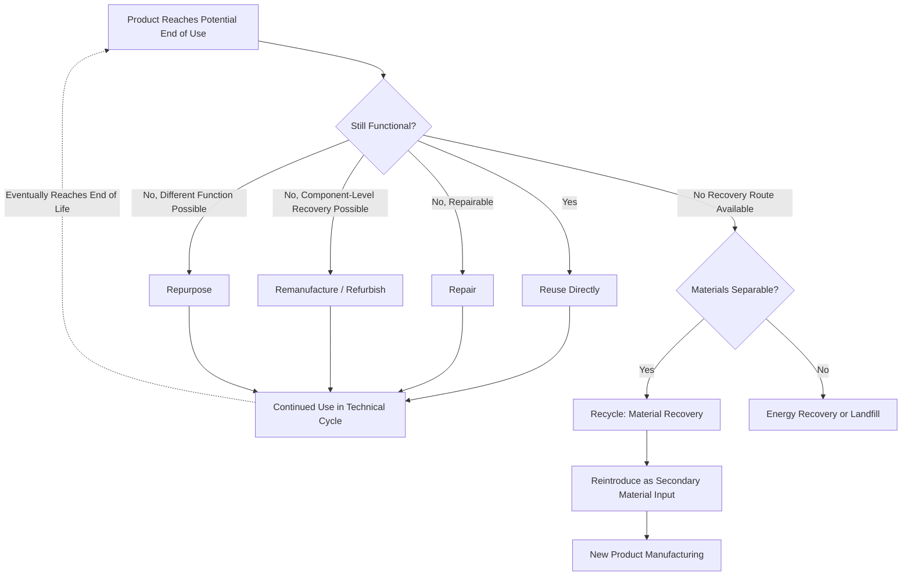

## Circular Economy Principles in Materials Engineering

### Overview and Definition

The circular economy is an economic and industrial model that seeks to decouple economic activity from the consumption of finite virgin resources by keeping materials, components, and products in productive use for as long as possible, then recovering and regenerating them at the end of each use cycle. In materials engineering specifically, circular economy principles reframe the traditional linear "take-make-dispose" model into a system where material flows are designed, from the outset, to support multiple use cycles — connecting directly to life cycle assessment, embodied energy and carbon footprint, and the metal and polymer/composite recycling technologies covered elsewhere in this chapter, while extending the scope upstream into product design and downstream into reuse and remanufacturing strategies not solely dependent on recycling.

### The Linear vs. Circular Model

**Key Points**

- The linear model follows a one-way flow: raw material extraction → processing → manufacturing → use → disposal, with material value lost at end of life.
- The circular model introduces feedback loops at multiple points in the value chain, allowing material, component, or product value to be recovered and reintroduced rather than lost.
- Circularity is not synonymous with recycling alone; recycling is the innermost-value-recovery-intensive loop among several circular strategies, most of which preserve more of the original embodied value (energy, carbon, manufacturing effort) than recycling does.

### The R-Framework Hierarchy of Circular Strategies

Circular economy strategies are commonly organized in a hierarchy, ordered by the degree of product/material value retained — strategies higher in the hierarchy generally require less energy and material reprocessing and retain more of the original embodied value than strategies lower in the hierarchy.

| Strategy | Description | Value Retention (Relative) |
| --- | --- | --- |
| Refuse / Rethink | Avoid the material/product need entirely, or fundamentally rethink function delivery | Highest |
| Reduce | Use less material per unit of function (lightweighting, dematerialization) | Very High |
| Reuse | Use a product again for the same function with little to no modification | High |
| Repair | Restore a broken product to working condition | High |
| Refurbish | Restore an older product to good working condition, often with some upgrading | Moderate-High |
| Remanufacture | Disassemble a product and rebuild it to original (or better) specification using a mix of reused and new components | Moderate |
| Repurpose | Use a discarded product or component for a different function | Moderate |
| Recycle | Process material to recover raw material for reuse, generally losing product/component-level value | Lower |
| Recover (energy) | Incinerate material for energy recovery when material recycling is not feasible | Lowest (material value fully lost) |

**Key Points**

- Materials engineering decisions directly influence which strategies are technically achievable for a given product: a material or joining method selected for a component determines whether disassembly for repair/remanufacture is feasible, or whether recycling (with its associated value loss, see recycling of polymers and composites) is the only available end-of-life route.
- Strategies higher in the hierarchy (reduce, reuse, repair) generally correspond to lower embodied-energy consequences than recycling, because they avoid the reprocessing energy step entirely — directly reinforcing the embodied energy and carbon footprint principle that avoided processing is generally more impactful than efficient reprocessing.

### Material Flow Concepts: Biological and Technical Cycles

**Key Points**

- **Technical cycle** — applies to non-biodegradable, engineered materials (metals, most polymers, ceramics, composites) that are intended to circulate through reuse, repair, remanufacture, and recycling loops without returning to the biosphere.
- **Biological cycle** — applies to biodegradable, bio-based materials that can safely return to the biosphere as nutrients (e.g., compostable packaging, certain bio-based polymers), effectively "recycling" through natural decomposition processes rather than industrial reprocessing.
- Materials selection increasingly requires an explicit choice of which cycle a given material is intended to participate in, since materials that blend characteristics of both (e.g., biodegradable coatings on technical-cycle metal or polymer substrates) can complicate both cycles if not designed with clear separation in mind.

### Material Flow Circularity Metrics

**Key Points**

- **Material Circularity Indicator (MCI)** and related metrics quantify the degree to which a product's material flow is circular, incorporating factors such as recycled/reused input content, the fraction of material collected for recycling/reuse at end of life, and the utility of the product during use (e.g., product lifetime relative to industry average, intensity of use).
- A general simplified circularity expression incorporates both input-side and output-side circularity:

  $$LFI = \frac{V}{2} \left(\frac{M}{X_{total}}\right) + \frac{W_0}{2}\left(\frac{M}{X_{total}}\right)$$

  representing (in one common formulation) a linear flow index combining virgin material input fraction and unrecovered waste output fraction, from which a circularity indicator is derived as its complement; specific formulations vary by methodology and organization. [Unverified: multiple circularity indicator methodologies exist with differing exact formulations (e.g., Ellen MacArthur Foundation's Material Circularity Indicator, various national/industry-specific circularity metrics); the specific equation and weighting factors should be sourced from the specific methodology being applied for any formal reporting use.]
- These metrics are increasingly used alongside embodied carbon metrics as dual criteria in multi-criteria decision making for materials selection, since a material choice that improves circularity (e.g., higher recycled content) does not automatically guarantee the lowest embodied carbon outcome, and vice versa, requiring explicit joint evaluation.

### Design Principles Supporting Circularity

**Key Points**

- **Design for disassembly** — using reversible joining methods (mechanical fasteners, snap-fits designed for release rather than permanent lock, low-temperature-reversible adhesives) in place of permanent bonding (welding, structural adhesive, overmolding) where circularity is a priority, directly extending design for manufacturing and assembly principles to include end-of-life disassembly as an explicit design objective alongside initial assembly efficiency.
- **Mono-material design** — minimizing the number of distinct material types in a product or sub-assembly to simplify sorting and avoid the need for separation prior to recycling, as discussed in recycling of polymers and composites.
- **Material passports / digital product passports** — documentation (increasingly digital, machine-readable) accompanying a product or component recording its material composition, joining methods, and disassembly instructions, enabling more efficient and higher-value end-of-life processing by removing the need for reverse-engineering material content at end of life.
- **Modular design** — structuring products so individual components or subsystems can be replaced, upgraded, or removed independently, extending product life through targeted repair/upgrade rather than requiring full product replacement.
- **Durability-appropriate material selection** — matching component material lifetime/durability to the intended product service life; over-specifying durability in a component within a short-life product wastes embodied resource, while under-specifying durability in a long-life product forces premature material consumption through repeated replacement.

### Business Models Enabling Circularity

**Key Points**

- **Product-as-a-service (PaaS)** — the manufacturer retains ownership of the product/material and sells access/function rather than the product itself, creating a direct economic incentive for the manufacturer to design for durability, repairability, and eventual material recovery, since the manufacturer bears the end-of-life cost/benefit directly rather than externalizing it to the consumer.
- **Take-back and extended producer responsibility (EPR) programs** — manufacturer-operated or regulation-mandated programs requiring or incentivizing the original producer to accept end-of-life products for recycling or remanufacturing, creating both a circularity mechanism and a materials engineering feedback loop (field failure and wear data from returned products can inform future materials selection).
- **Industrial symbiosis** — byproduct or waste material from one industrial process serving as feedstock for another (e.g., fly ash from coal combustion used as a cement replacement in concrete), extending circularity principles beyond single-product loops to cross-industry material flow networks.

### Circular Economy Value Retention Hierarchy Flow

### Linear vs. Circular Material Flow (svg_diagram)

<svg xmlns="http://www.w3.org/2000/svg" viewBox="0 0 900 420" font-family="Arial, sans-serif">
<text x="450" y="28" font-size="18" font-weight="bold" text-anchor="middle">Linear vs. Circular Material Flow Model (svg_diagram)</text>

<text x="200" y="60" font-size="14" font-weight="bold" text-anchor="middle">Linear Model</text>

<rect x="60" y="80" width="100" height="45" rx="6" fill="`#dbe9f7`" stroke="`#2c5f8a`" stroke-width="2" />

<text x="110" y="107" font-size="11" text-anchor="middle">Extract</text>

<line x1="160" y1="102" x2="200" y2="102" stroke="#333" stroke-width="2" marker-end="url(#arrow6)" />

<rect x="200" y="80" width="100" height="45" rx="6" fill="`#f7e7c1`" stroke="`#8a6d2c`" stroke-width="2" />

<text x="250" y="107" font-size="11" text-anchor="middle">Make</text>

<line x1="300" y1="102" x2="340" y2="102" stroke="#333" stroke-width="2" marker-end="url(#arrow6)" />

<rect x="340" y="80" width="100" height="45" rx="6" fill="`#d7f0d3`" stroke="`#2c7a3d`" stroke-width="2" />

<text x="390" y="107" font-size="11" text-anchor="middle">Use</text>

<line x1="440" y1="102" x2="480" y2="102" stroke="#333" stroke-width="2" marker-end="url(#arrow6)" />

<rect x="480" y="80" width="100" height="45" rx="6" fill="`#f0d3d3`" stroke="`#8a2c2c`" stroke-width="2" />

<text x="530" y="107" font-size="11" text-anchor="middle">Dispose</text>

<text x="300" y="160" font-size="12" fill="`#8a2c2c`" text-anchor="middle">Value lost at end of life</text>

<text x="450" y="220" font-size="14" font-weight="bold" text-anchor="middle">Circular Model</text>

<rect x="180" y="250" width="100" height="45" rx="6" fill="`#dbe9f7`" stroke="`#2c5f8a`" stroke-width="2" />

<text x="230" y="277" font-size="11" text-anchor="middle">Extract (min.)</text>

<line x1="280" y1="272" x2="330" y2="272" stroke="#333" stroke-width="2" marker-end="url(#arrow6)" />

<rect x="330" y="250" width="100" height="45" rx="6" fill="`#f7e7c1`" stroke="`#8a6d2c`" stroke-width="2" />

<text x="380" y="277" font-size="11" text-anchor="middle">Make</text>

<line x1="430" y1="272" x2="480" y2="272" stroke="#333" stroke-width="2" marker-end="url(#arrow6)" />

<rect x="480" y="250" width="100" height="45" rx="6" fill="`#d7f0d3`" stroke="`#2c7a3d`" stroke-width="2" />

<text x="530" y="277" font-size="11" text-anchor="middle">Use / Reuse</text>

<line x1="580" y1="272" x2="630" y2="272" stroke="#333" stroke-width="2" marker-end="url(#arrow6)" />

<rect x="630" y="250" width="120" height="45" rx="6" fill="`#d3d9f0`" stroke="`#2c3a8a`" stroke-width="2" />

<text x="690" y="277" font-size="11" text-anchor="middle">Recover/Recycle</text>

<path d="M690,250 Q690,190 380,190 Q230,190 230,250" stroke="`#2c7a3d`" stroke-width="2" fill="none" stroke-dasharray="5,4" marker-end="url(#arrow6g)" />

<text x="460" y="180" font-size="12" fill="`#2c7a3d`" text-anchor="middle">Material returned to Make/Extract stage</text>

</svg>

### Case Example: Remanufacturing in Heavy Equipment and Automotive Components

Remanufacturing of components such as automotive alternators, starters, and heavy equipment engines and transmissions illustrates a mid-hierarchy circular strategy operating above recycling: a used core component is disassembled, worn or damaged parts are replaced or restored (e.g., machining and re-plating a worn bearing surface, replacing wear-prone seals and bushings), and the unit is rebuilt to original or improved specification. This retains the majority of the embodied energy and material invested in the original manufacturing of structural components (housings, shafts, castings) that do not need replacement, achieving substantially lower total resource consumption per unit of restored function than producing an equivalent new component from virgin or even recycled raw material — directly demonstrating the value-retention hierarchy principle that reuse/remanufacture strategies generally outperform recycling in resource efficiency terms. Materials selection for such components (wear-resistant coatings on shafts specifically to enable re-machining, corrosion-resistant housings to survive multiple remanufacture cycles) is directly informed by anticipated remanufacturing cycles rather than single-use service life alone.

### Common Pitfalls in Applying Circular Economy Principles

- **Equating circularity with recycling alone** — recycling is the lowest-value-retention strategy in the hierarchy; over-indexing materials selection and design decisions on recyclability while neglecting reuse, repair, and remanufacture potential misses higher-value circular opportunities.
- **Designing for recyclability without considering actual end-of-life infrastructure** — a material or joining method that is theoretically recyclable but lacks accessible regional collection/processing infrastructure will not achieve circularity in practice.
- **Ignoring the durability-circularity trade-off** — assuming lighter, lower-embodied-material designs are always more circular, without accounting for whether reduced durability shortens product life and increases replacement frequency, potentially offsetting the embodied-material saving.
- **Treating circularity metrics as a substitute for full life cycle assessment** — circularity indicators (e.g., recycled content fraction) do not capture full environmental impact (energy source carbon intensity, toxicity, water use); circularity and LCA should be applied as complementary, not interchangeable, evaluation frameworks.
- **Neglecting joining method implications at the design stage** — permanent bonding methods selected purely for assembly efficiency (see design for manufacturing and assembly) can foreclose higher-value circular strategies (repair, remanufacture, mono-material recycling) that reversible joining would have preserved.

### Standards and Frameworks

Circular economy practice in materials engineering is supported by frameworks including the Ellen MacArthur Foundation's circular economy and Material Circularity Indicator methodology, ISO 59004/59010/59020 (circular economy vocabulary, business model guidance, and circularity performance measurement, respectively), and sector-specific extended producer responsibility regulations governing take-back and recovery obligations. [Unverified: specific standard numbering, scope, and regulatory requirements are subject to ongoing development and periodic revision; current applicable text should be verified against the relevant standards body or regulatory authority.]

**Related Topics**

- Life Cycle Assessment of Materials
- Embodied Energy and Carbon Footprint of Materials
- Recycling Technologies for Metals
- Recycling of Polymers and Composites
- Design for Manufacturing and Assembly
- Design for Disassembly and End-of-Life Material Recovery
- Material Passports and Digital Product Traceability