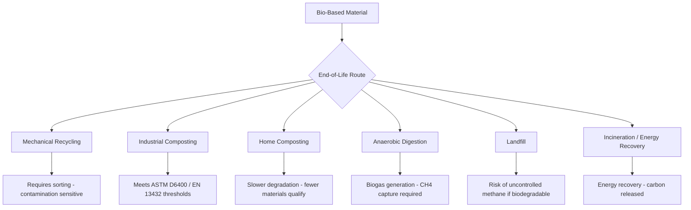

## Green and Bio Based Materials

### Overview and Definitions

Bio-based materials are derived wholly or partly from biomass (plant, animal, or microbial origin) rather than fossil feedstocks. "Green materials" is a broader sustainability framing that may include bio-based content, reduced embodied energy, recyclability, or lower toxicity, and does not automatically imply biodegradability. These terms are distinct from biodegradability and compostability, which describe end-of-life behavior, not feedstock origin — a material can be bio-based and non-biodegradable (e.g., bio-polyethylene), or fossil-based and biodegradable (e.g., certain polycaprolactone formulations).

**Key Points**

- Bio-based ≠ biodegradable ≠ compostable; these are three independent axes of classification
- ASTM D6866 quantifies bio-based carbon content via radiocarbon (¹⁴C) analysis, distinguishing modern biogenic carbon from fossil carbon
- Compostability standards (ASTM D6400, EN 13432) specify disintegration and mineralization thresholds under defined industrial composting conditions, not home composting or marine environments

### Classification of Bio-Based Materials

**Biopolymers Produced by Organisms**

- Polyhydroxyalkanoates (PHA), including polyhydroxybutyrate (PHB): synthesized intracellularly by bacteria as carbon/energy storage granules; inherently biodegradable in soil, marine, and industrial composting environments
- Bacterial cellulose: produced by *Komagataeibacter* species, yielding high-purity nanofibrillar cellulose networks

**Biopolymers Extracted from Biomass**

- Cellulose and cellulose derivatives (cellulose acetate, nanocellulose/CNF/CNC)
- Starch and thermoplastic starch (TPS)
- Chitin/chitosan (from crustacean shells or fungal cell walls)
- Proteins: casein, soy protein, zein, collagen/gelatin

**Bio-Based Monomers Polymerized Synthetically**

- Polylactic acid (PLA): lactic acid from fermented starch/sugar, polymerized via ring-opening polymerization of lactide
- Bio-polyethylene (bio-PE), bio-polyethylene terephthalate (bio-PET): identical polymer structure to fossil counterparts but sourced from bioethanol (e.g., sugarcane); not biodegradable, but reduces fossil carbon input
- Polyamide 11 (PA11): derived from castor oil, used in high-performance engineering applications

**Composites**

- Natural fiber-reinforced composites: flax, hemp, jute, kenaf, or sisal fibers in polymer (often bio-based) matrices
- Biochar-filled composites: pyrolyzed biomass used as a carbon-negative filler
- Mycelium composites: fungal mycelium grown through agricultural waste substrate, producing lightweight, biodegradable structural/packaging materials

### Material Properties and Performance Comparison

| Material | Tensile Strength (MPa) | Biodegradable | Typical Use |
| --- | --- | --- | --- |
| PLA | 50–70 | Yes (industrial compost) | Packaging, 3D printing, disposable ware |
| PHA/PHB | 20–40 | Yes (soil, marine, compost) | Packaging, medical devices |
| Bio-PE | 20–30 | No | Bottles, films (drop-in replacement) |
| TPS blends | 5–20 | Yes | Loose-fill packaging, agricultural films |
| Flax-fiber/epoxy composite | 100–300 (fiber-dependent) | Partial (matrix-dependent) | Automotive interior panels, sporting goods |

[Inference: exact mechanical values vary substantially with molecular weight, crystallinity, plasticizer content, and processing conditions; the ranges above reflect commonly reported literature values rather than a single standardized dataset.]

### Processing Considerations

**PLA** processes on conventional thermoplastic equipment (injection molding, extrusion, FDM 3D printing) but has a relatively low glass transition temperature ($T_g \approx 55$–$60\,^\circ\text{C}$), limiting hot-fill and hot-environment applications unless stereocomplexed or annealed to increase crystallinity.

**Natural fiber composites** require careful moisture control during processing (fibers are hygroscopic) and fiber-matrix interfacial treatment (e.g., alkalization, silane coupling) to improve adhesion, since untreated cellulosic fibers are hydrophilic while most polymer matrices are hydrophobic.

**PHA** has a narrow processing window between melting temperature and thermal degradation onset, historically limiting melt-processability; formulation and nucleating-agent strategies are used to widen this window.

### Life Cycle Assessment (LCA) Framework

Evaluating "green" credentials requires cradle-to-grave (or cradle-to-cradle) LCA rather than single-metric claims:

$$\text{GWP}_{total} = \sum_i (m_i \times \text{EF}_i)$$

where $m_i$ is the mass of input/output flow $i$ and $\text{EF}_i$ is its characterized emission factor (e.g., kg CO$_2$-eq per kg).

Key LCA considerations specific to bio-based materials:

- **Land-use change (LUC) and indirect land-use change (iLUC)**: converting land to feedstock cultivation can offset carbon benefits
- **Feedstock competition**: first-generation feedstocks (corn, sugarcane) compete with food production; second-generation (lignocellulosic waste, agricultural residues) and third-generation (algae) feedstocks mitigate this
- **End-of-life pathway sensitivity**: biodegradable materials landfilled anaerobically can generate methane (a more potent GHG than CO₂), so composting infrastructure availability significantly affects net environmental benefit
- **Biogenic carbon accounting**: carbon absorbed during biomass growth is often treated as a credit, but methodology (e.g., IPCC guidance vs. PAS 2050) affects how this is quantified

**Key Points**

- A bio-based material is not automatically lower-impact than its fossil counterpart once cultivation, fertilizer use, land use, and end-of-life pathway are included
- [Unverified: specific numerical LCA comparisons are highly study- and boundary-condition-dependent; general conclusions should not be extrapolated from a single LCA study without checking its system boundaries]

### End-of-Life Pathways

### Circular Economy Integration

Bio-based materials intersect with circular economy principles through several strategies:

- **Design for disassembly**: enabling material separation at end-of-life for mechanical recycling
- **Chemical/feedstock recycling**: depolymerization of PLA back to lactide/lactic acid monomer for closed-loop repolymerization
- **Cascading use**: sequential downgrading of material value across use cycles (e.g., textile fiber → insulation → composite filler) before final biodegradation or energy recovery
- **Bio-based drop-in replacements**: bio-PE/bio-PET integrate into existing fossil-based recycling streams (mechanical PET recycling infrastructure), avoiding the need for separate collection

### Standards and Certification Landscape

| Standard | Scope |
| --- | --- |
| ASTM D6866 | Bio-based carbon content (radiocarbon method) |
| ASTM D6400 | Compostability in industrial facilities (US) |
| EN 13432 | Compostability/biodegradability of packaging (EU) |
| ISO 14855 | Aerobic biodegradability under controlled composting |
| ISO 14040/14044 | LCA methodology framework |
| EN 17033 / OK Biodegradable Soil | Soil biodegradability certification |

### Common Misconceptions

**Key Points**

- "Biodegradable" without a specified environment/timeframe is not a meaningful technical claim — degradation rate is highly dependent on temperature, microbial population, moisture, and oxygen availability
- "Compostable" does not mean "home compostable" unless explicitly certified to a home-composting standard, since industrial composting operates at higher, more controlled temperatures (typically 55–60 °C)
- Bio-based plastics are not inherently free of microplastic concerns; PLA and other bio-based polymers can still fragment into microplastics if not fully mineralized under appropriate conditions

### Emerging Directions

- **Algae-based feedstocks**: avoid food-crop competition and arable land use; under active development for both bulk polymer precursors and specialty biomaterials
- **Protein-based bioplastics** (mycoprotein, whey protein isolate films): explored for packaging with tunable barrier properties
- **Lignin valorization**: lignin, a major byproduct of pulp/paper and biorefinery processing, is being developed as a filler, carbon-fiber precursor, and phenolic-resin substitute
- **Bio-based carbon fiber precursors**: lignin- and cellulose-derived precursors as alternatives to petroleum-derived polyacrylonitrile (PAN)

**Related Topics**

- Life Cycle Assessment (LCA) Methodology
- Polymer Recycling and Circular Plastics
- Natural Fiber Reinforced Composites
- Biodegradation Mechanisms and Standards
- Carbon Footprint and Embodied Energy Analysis
- Additive Manufacturing with Sustainable Feedstocks